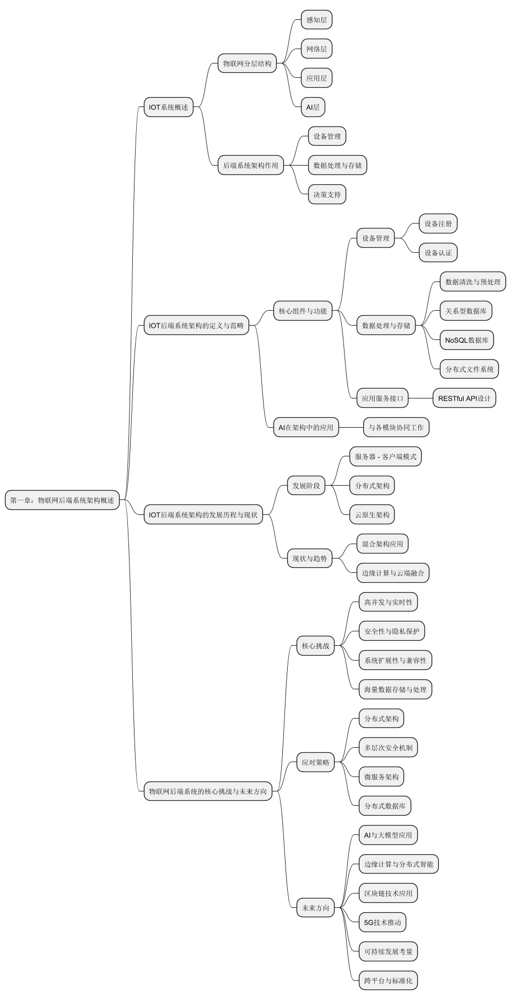
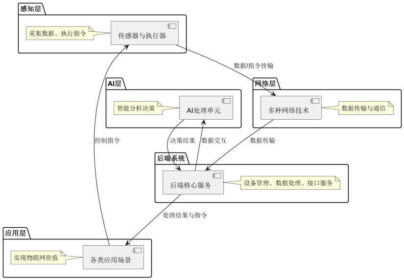
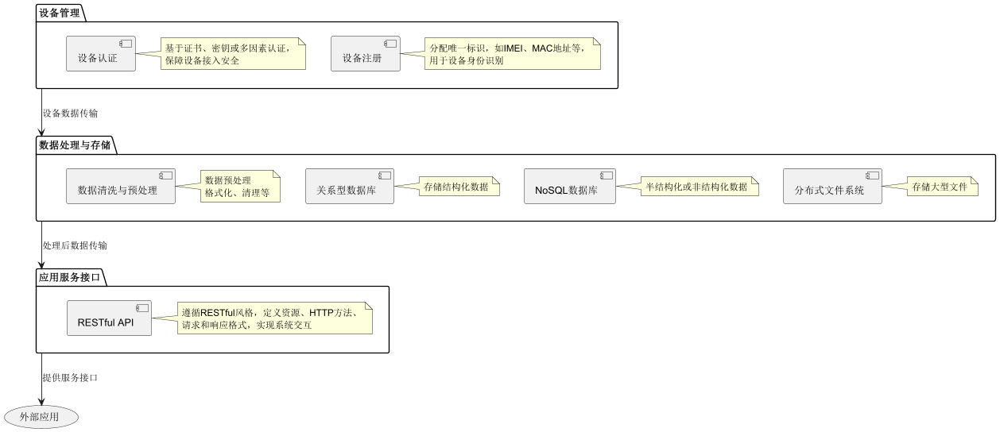

# 第一章：IOT 后端系统架构导论

## 1\.1 IOT 系统概述

物联网（Internet of Things，简称 IoT）作为当今科技领域极具影响力的概念，已然渗透到人们生活与生产的方方面面，其系统构成复杂且精妙，各层级相互协作，共同支撑起智能化的万物互联世界。

**感知层**作为物联网的“触角”，处于系统最前端，肩负着采集各类物理信息的重任。传感器类型繁多，从常见的温度传感器、湿度传感器，到工业领域的压力传感器、流量传感器，再到环境监测中的气体传感器、光照传感器等，它们如同敏锐的侦察兵，能够精准感知周围环境的细微变化，并将这些物理量转换为电信号或数字信号。执行器则与之相对应，接收来自上层的指令，执行诸如开关阀门、调节电机转速、控制灯光亮度等动作，从而实现对物理世界的直接干预。以智能家居场景为例，家中的温湿度传感器实时监测室内环境状况，一旦温度超出设定舒适范围，智能空调（作为执行器）便会依据后端系统传来的指令启动制冷或制热功能，调节室内温度，为居住者营造宜人环境。

**网络层**是连接感知层与应用层的信息“高速公路”，其通信协议和网络技术的多样性为物联网适应不同场景提供了坚实保障。无线保真（Wi\-Fi）技术以其高带宽、便捷性，广泛应用于智能家居、办公场所等对数据传输速率要求较高且有稳定电源供应的场景，使得智能家电、手机、电脑等设备能够快速、稳定地连接网络，实现数据交互。蓝牙技术，尤其是低功耗蓝牙（BLE），凭借其低功耗特性，在可穿戴设备、医疗健康监测设备领域大放异彩，如智能手环通过蓝牙与手机相连，实时同步运动数据、心率信息等，既满足了设备长时间运行的需求，又确保了数据传输的及时性。Zigbee 协议专为低速率、低功耗、自组网需求的场景设计，在工业自动化生产线、智能照明系统中表现出色，众多传感器和执行器能够通过 Zigbee 组建稳定的局域网，实现高效协同工作，即便个别节点出现故障，网络也能自动重构，维持整体运行。蜂窝网络（4G/5G）则凭借其广覆盖、高移动性优势，为远程设备监控、智能交通、车联网等提供了可靠支持，如智能汽车在行驶过程中通过 5G 网络实时上传车况信息、接收导航与路况预警，确保驾驶安全与高效出行。

**应用层**是物联网价值的直接体现，面向不同行业与用户需求，衍生出形形色色的应用服务。在智慧农业领域，通过部署在田间的各类传感器采集土壤湿度、养分含量、气象数据等，后端系统对这些海量数据进行分析处理，为农户提供精准的灌溉、施肥决策建议，实现农作物的精细化管理，提高农业生产效率与农产品质量。在智能物流方面，物联网技术实现了货物运输全程可视化监控，从仓储环节的货物入库、存储位置管理，到运输途中的车辆定位、温湿度监控（对于生鲜冷链物流至关重要），再到配送末端的智能分拣与配送通知，每一个环节都借助物联网提升了运营效率与服务质量，降低物流成本。智慧城市更是物联网应用的集大成者，涵盖智慧交通管理（实时路况监测、智能信号灯调控）、智能能源管理（电网负荷监测、分布式能源协同）、城市环境监测（空气质量、噪音污染监测与治理）等多个子系统，全方位提升城市的运行效率、居民生活品质与可持续发展能力。

随着 AI 技术的逐渐深入应用，在传统的物联网三层架构基础上，一个全新的 AI 层正崭露头角，它的出现极大地改变了物联网系统的运作模式，为其赋予了更强大的智能和更高效的决策能力。AI 层在整个物联网生态中扮演着 “智慧中枢” 的角色。它主要负责运用先进的人工智能算法对这些数据进行深度挖掘、分析与学习，进而为应用层提供智能化的决策支持和优化建议。

而后端系统架构在整个物联网生态中宛如“大脑”，起着统筹协调、数据处理与决策支撑的关键作用。它负责管理海量的物联网设备，确保设备稳定连接、正常运行，及时处理设备上传的海量数据，挖掘其中有价值的信息，并通过精心设计的应用服务接口，将这些信息精准推送给上层应用，实现感知层、应用层、AI层的高效联动，驱动物联网系统的顺畅运转。无论是应对智能家居场景下用户对设备即时控制的需求，还是支撑工业物联网中复杂生产流程的精准管控，后端系统架构的稳健性与高效性都直接关乎物联网系统的成败。

## 1\.2 IOT 后端系统架构的定义与范畴

IoT 后端系统架构，简单而言，是构建物联网系统后端支撑体系的蓝图与框架，它整合了一系列复杂的技术组件与功能模块，旨在实现对物联网设备的有效管理、数据的深度处理以及为上层应用提供坚实的服务接口。

**设备管理**是后端系统架构的基石之一。首先是设备的注册环节，当一台全新的物联网设备接入系统时，需要为其分配唯一且可识别的标识，常见的如国际移动设备识别码（IMEI）、媒体访问控制地址（MAC 地址）等，这些标识如同设备的“身份证”，贯穿其整个生命周期，确保在茫茫“设备海”中能够被精准定位与管理。同时，设备认证机制至关重要，基于证书的认证方式，通过为设备颁发数字证书，建立起信任链，后端系统依据证书中的公钥信息验证设备身份合法性，有效防范非法设备接入；基于密钥的认证则依赖预先共享的密钥，设备与后端系统在通信时通过加密算法验证密钥匹配度，保障通信安全；多因素认证进一步强化安全性，结合设备硬件特征（如设备指纹）、用户身份信息、动态验证码等多个要素，全方位核实设备接入权限，适用于对安全性要求极高的金融、医疗物联网场景。

**数据处理与存储**是后端架构的核心“算力引擎”与“数据仓库”。数据采集自感知层设备后，面临着清洗与预处理的关键步骤。原始数据往往夹杂着噪声、错误值，如环境监测传感器可能因短暂电磁干扰产生异常读数，此时通过设定合理的数据过滤规则、异常值检测算法，去除这些无效数据，再利用数据归一化技术将不同量程、单位的数据转换为统一标准格式，为后续精准分析奠定基础。在存储层面，关系型数据库凭借其严谨的结构化表设计、强大的事务处理能力，擅长存储设备的静态配置信息、用户账户数据等结构化程度高、需要频繁关联查询的数据，像物联网设备的型号、生产厂家、用户权限设置等信息，通过 SQL 查询语言能够快速、准确地检索所需数据。NoSQL 数据库则在应对海量、半结构化或非结构化的物联网数据时独具优势，例如时间序列数据库专为存储设备产生的连续时序数据而设计，如工业传感器每秒采集的温度、压力数据，能够高效地按时间维度进行插入、查询与聚合分析；文档型数据库可灵活存储设备日志、配置文件等复杂格式的数据，以 JSON 或 XML 文档形式保存，方便快速读写与更新。分布式文件系统则用于承载大型文件，如智能摄像头录制的高清视频片段、设备固件升级包等，通过分布式存储策略实现高可靠性与高扩展性存储，确保数据不丢失且易于访问。

**应用服务接口**恰似后端系统与外部世界沟通的“桥梁”。设计符合 RESTful 风格的 API 已成为行业主流实践，资源的定义与命名遵循统一、简洁且具有语义明确性的原则，例如将智能照明系统中的灯具设备抽象为“/lights”资源，每个具体灯具可通过“/lights/\{id\}”标识，方便开发人员理解与调用。HTTP 方法的合理运用使得操作逻辑清晰，GET 方法用于获取灯具状态信息，POST 方法用于创建新灯具设备配置，PUT 方法更新灯具参数，DELETE 方法删除不再使用的灯具资源，这种映射关系贴合人们对网络资源操作的常规认知。请求和响应格式精心设计，采用 JSON 作为通用数据交换格式，既兼顾人类可读性，又便于程序解析处理，确保前端应用、第三方合作伙伴与后端系统之间能够顺畅交互，实现物联网系统功能的无缝对接与扩展。

AI 技术的融入，为 IoT 后端系统架构带来了更为精细和智能的优化，它并非取代原有的架构模块，而是与设备管理、数据处理存储及应用服务接口紧密协同，成为整个架构的有力补充。

## 1\.3 IOT 后端系统架构的发展历程与现状

回顾物联网后端架构的发展之路，从早期简易的服务器 - 客户端模式逐步蜕变，在技术浪潮的推动下，走向如今分布式、云原生的前沿架构。

在萌芽阶段，物联网后端架构很大程度上借鉴了传统互联网的服务器 \- 客户端模式。彼时，物联网设备数量有限，功能相对单一，后端系统多由一台或几台集中式服务器构成，设备与服务器之间建立简单的连接，采用基本的 HTTP 协议进行数据传输。例如早期的智能家居系统，可能仅有少数几款智能家电，通过家庭路由器连接至家中的 PC 服务器，设备定时向服务器推送简单的状态信息（如电器开关状态、当前运行模式），用户通过在 PC 上运行的软件客户端查看与控制设备。这种模式在小规模应用场景下尚可维持，但随着物联网设备的爆发式增长，其弊端逐渐显现：集中式服务器面临巨大的并发连接压力，处理能力有限，容易成为系统瓶颈；单点故障风险极高，一旦服务器死机或遭受网络攻击，整个物联网系统将陷入瘫痪；数据存储与处理方式单一，难以应对海量、多样的数据需求。

随着技术的演进，分布式架构应运而生，成为物联网后端发展的重要里程碑。为应对大规模设备接入与高并发数据处理的挑战，后端系统开始采用分布式服务器集群，将设备连接管理、数据处理、存储等功能分散到多个节点协同完成。在设备连接方面，引入负载均衡技术，如基于硬件的 F5 负载均衡器或基于软件的 Nginx 反向代理，智能地将海量设备连接请求均匀分配到多个后端服务器实例上，避免单点过载。数据处理环节，分布式消息队列（如 Apache Kafka）崭露头角，设备数据不再直接写入数据库，而是先发送至消息队列，多个消费者实例从队列中并行拉取数据进行处理，极大提升了数据处理的吞吐量与实时性，适用于工业物联网中对生产数据实时监控与分析的场景。存储层面，分布式数据库（如 Cassandra）通过数据分区、副本冗余技术，实现数据的高可用性与横向扩展性，确保在部分节点故障时数据不丢失，且能够轻松添加新节点应对数据量增长，有力支撑了诸如智慧城市中大规模传感器数据的存储需求。

当下，云原生架构正引领物联网后端走向新的高峰。云平台的崛起为物联网提供了无与伦比的弹性计算、存储与网络资源，物联网后端系统借此东风，深度融合容器化技术（以 Docker 为代表）与微服务架构理念。容器化技术将后端应用及其依赖项打包成轻量级、可移植的容器镜像，使得应用在不同云环境下能够快速部署、启动，如在亚马逊 AWS、微软 Azure 等云平台上，只需简单几条命令即可将后端服务部署上线，大大缩短开发迭代周期。微服务架构则将后端系统拆分为众多细粒度的微服务，每个微服务专注于特定业务功能（如设备认证微服务、数据清洗微服务、API 网关微服务等），它们相互独立开发、部署、升级，通过轻量级的 RESTful API 或消息队列进行通信协作，不仅提高了系统的可维护性与可扩展性，还便于根据不同物联网应用场景灵活组合与定制服务。例如在车联网领域，面对车辆远程诊断、智能导航、车载娱乐等多样化需求，云原生架构下的后端系统能够迅速调配资源，为各个功能模块提供专属的微服务支撑，保障系统高效稳定运行。

剖析当下行业主流架构风格与技术选型趋向，不难发现，混合架构模式愈发受到青睐。一方面，企业依据自身物联网应用的特点，有机结合公有云与私有云资源，将非敏感、通用性强的业务部署在公有云（如利用公有云的大数据分析服务处理海量物联网数据），涉及核心数据、隐私要求高的业务保留在私有云（如企业内部工业生产设备的关键控制逻辑），实现成本效益与安全保障的平衡。另一方面，边缘计算技术与云端架构紧密融合，在靠近物联网设备的边缘侧（如工厂车间网关、智能小区边缘服务器）部署轻量级的边缘计算节点，对实时性要求极高的数据（如工业控制中的实时反馈信号、智能安防中的实时视频分析）进行就地处理，减少数据传输延迟，仅将处理结果或关键数据上传至云端后端系统，既缓解了云端压力，又满足了物联网应用对实时性、低延迟的严苛要求，为物联网后端架构的持续创新描绘出绚丽多彩的未来蓝图。

## 1\.4 物联网后端系统的核心挑战与未来方向

物联网（IoT）后端系统作为整个生态的 “大脑”，在支撑设备连接、数据处理和应用服务的过程中，面临着诸多核心挑战。与此同时，随着技术的不断进步，IoT 后端系统也迎来了前所未有的机遇。本节将深入探讨当前面临的主要挑战，并结合行业趋势展望未来的发展方向。

### （一）核心挑战

1\. 高并发与实时性

挑战描述：随着 IoT 设备数量的激增，后端系统需要同时处理来自数百万甚至数十亿设备的并发请求。例如，在智慧城市中，交通信号灯、环境监测传感器和安防摄像头可能同时上传大量数据。如果后端无法及时响应，可能导致数据丢失或延迟。在智能电网场景下，大量智能电表需要实时上传用电数据，若后端系统处理能力不足，不仅会影响电费结算的准确性，还可能对电力调度造成干扰，引发供电不稳定等问题。

解决方案：

引入分布式架构：通过负载均衡技术（如 Nginx、F5）分散流量压力。分布式架构将系统功能分散到多个节点上，负载均衡器根据预设算法，如轮询、加权轮询、IP 哈希等，将客户端请求均匀分配到各个节点，避免单个节点因负载过高而崩溃。

使用高性能消息队列：借助 Apache Kafka、RabbitMQ 等消息队列缓冲数据流，确保高吞吐量和低延迟。消息队列作为异步通信的中间件，能在高并发场景下暂存大量数据，使数据的生产和消费解耦。以 Kafka 为例，其分区和副本机制可实现数据的并行处理和高可用性，即使在大量数据涌入时，也能保证数据不丢失且处理高效。

边缘计算与协同处理：在边缘侧部署轻量级计算节点，对实时性要求高的任务进行本地处理。边缘计算将部分数据处理和决策功能下沉到靠近数据源或用户的边缘设备上，减少数据传输延迟。比如在工业生产线上，边缘计算设备可实时分析传感器数据，一旦检测到设备异常，立即发出警报并进行本地处理，无需等待云端响应，大大提高了系统的实时性和可靠性。

2\. 安全性与隐私保护

挑战描述：IoT 设备种类繁多，安全防护能力参差不齐，容易成为黑客攻击的目标。例如，DDoS 攻击可能通过控制大量 IoT 设备瘫痪后端系统；用户隐私数据（如位置信息、健康数据）也可能因传输或存储不当而泄露。在智能家居环境中，智能摄像头、智能音箱等设备可能会收集用户的生活习惯、语音指令等敏感信息，若这些设备被黑客入侵，用户的隐私将毫无保障。

解决方案：

实施多层次安全机制：包括设备认证（基于证书或密钥）、数据加密（TLS/SSL）、访问控制（OAuth2\.0）。设备认证可确保只有合法设备能接入后端系统，数据加密保证数据在传输和存储过程中的保密性，访问控制则限制不同用户和设备对数据的访问权限，从多个层面保障系统安全。

引入区块链技术：利用其不可篡改的特性保障数据可信性和完整性。区块链的分布式账本和加密算法，使得数据一旦记录就难以被篡改，可有效防止数据被恶意修改或伪造，为物联网数据的安全存储和共享提供有力支持。

安全漏洞管理与监控：定期进行安全漏洞扫描和渗透测试，确保系统的健壮性。通过专业的安全工具和技术手段，及时发现系统中存在的安全隐患，并采取相应的修复措施，同时实时监控系统的安全状态，及时发现并应对潜在的安全威胁。

3\. 系统扩展性与兼容性

挑战描述：IoT 系统涉及多种异构设备和协议，如何实现无缝集成并支持动态扩展是一个难题。例如，智能家居中的不同品牌设备可能使用不同的通信协议（如 Zigbee、Z\-Wave），导致互操作性问题。在智能建筑领域，不同厂商的设备和系统之间往往缺乏统一的标准，使得集成和管理变得复杂，增加了建设和运维成本。

解决方案：

采用微服务架构：将功能模块化，便于灵活扩展和维护。微服务架构将复杂的系统拆分为多个小型、独立的服务，每个服务专注于单一功能，可独立开发、部署和扩展。当需要增加新功能或扩展现有功能时，只需对相关微服务进行调整，而不会影响整个系统的运行。

使用标准化协议和数据格式：采用标准化协议（如 MQTT、CoAP）和统一的数据格式（如 JSON、Protobuf）提升兼容性。标准化的协议和数据格式能够减少不同设备和系统之间的对接难度，使它们能够更方便地进行数据交互和协同工作。

容器化与编排技术助力：借助容器化技术（如 Docker）和编排工具（如 Kubernetes），实现快速部署和弹性伸缩。容器化技术将应用及其依赖打包成独立的容器，使其能够在不同环境中快速部署和运行。Kubernetes 则可对容器进行自动化管理和编排，根据系统负载动态调整容器数量，实现资源的高效利用和系统的弹性扩展。

4\. 海量数据存储与处理

挑战描述：IoT 设备产生的数据量呈指数级增长，传统的存储和处理方式难以应对。例如，工业传感器每秒采集数千条时序数据，如何高效存储、查询和分析这些数据成为一大挑战。在智能交通领域，大量的车辆轨迹数据、交通流量数据不断产生，不仅需要海量的存储空间，还对数据的查询和分析速度提出了很高的要求，以实现实时的交通调度和路况预测。

解决方案：

分布式与时序数据库应用：采用分布式数据库（如 Cassandra、MongoDB）和时序数据库（如 InfluxDB）优化数据存储。分布式数据库通过将数据分散存储在多个节点上，实现高扩展性和高可用性；时序数据库则针对时间序列数据进行优化，能够高效地存储和查询按时间顺序排列的数据。

大数据处理框架运用：利用大数据处理框架（如 Apache Spark、Flink）进行实时分析和批处理。这些框架提供了强大的数据处理能力，能够对海量数据进行快速的计算和分析。Spark 可进行大规模数据的批处理和交互式查询，Flink 则更擅长实时流数据的处理，能满足不同场景下的数据处理需求。

数据湖架构构建：引入数据湖架构，支持结构化、半结构化和非结构化数据的统一管理。数据湖可存储各种类型的原始数据，为后续的数据处理和分析提供丰富的数据源，同时通过数据治理和元数据管理，提高数据的质量和可利用性。

### （二）未来发展方向

1\. AI 与大模型赋能 IoT 后端

趋势描述：人工智能（AI）和大模型正在深刻改变 IoT 后端系统的设计、开发和运行方式。它们不仅帮助架构师和开发者提高信息获取效率和系统开发速度，还能够从海量的IoT数据中提取有价值的信息，提供智能化决策支持。大模型凭借其强大的语言理解、知识推理和泛化能力，可对物联网中的复杂数据进行更深入的分析和处理，为系统提供更智能的决策依据。

应用场景：

异常检测与预测维护：通过机器学习算法分析设备运行数据，提前发现潜在故障点，降低维修成本。例如，在风力发电场，利用深度学习算法对风机的振动数据、温度数据等进行实时监测和分析，提前预测风机部件的故障，安排预防性维护，减少停机时间，提高发电效率。

个性化推荐：在智能家居场景中，基于用户行为数据生成个性化建议（如温度调节、灯光设置）。通过对用户日常行为习惯的学习，智能系统能够根据不同用户的偏好和需求，自动调整家居设备的设置，提供更加舒适和便捷的生活体验。

自动化决策：利用强化学习实现闭环控制，例如根据实时路况自动调整交通信号灯配时。强化学习算法可根据交通流量的实时变化，不断优化信号灯的配时策略，提高道路的通行效率，减少交通拥堵。

2\. 边缘计算与分布式智能

趋势描述：边缘计算将部分数据处理任务从云端迁移到靠近设备的边缘节点，显著降低延迟并减少带宽消耗。随着物联网应用对实时性和本地处理能力的要求不断提高，边缘计算与分布式智能的结合将更加紧密，实现更高效的数据处理和决策。

应用场景：

工业控制：在工厂车间中，边缘节点实时处理传感器数据，快速响应生产线上的突发事件。如在汽车制造生产线上，边缘计算设备可实时监测设备的运行状态，一旦发现异常，立即发出警报并进行本地处理，确保生产线的稳定运行。

智能安防：通过边缘计算节点对视频流进行本地分析，仅上传异常事件至云端。在智能监控系统中，边缘计算设备可实时分析摄像头采集的视频画面，识别出异常行为（如入侵、斗殴等），并将相关信息上传至云端，减少不必要的数据传输，提高安防系统的响应速度。

车联网：车辆在行驶过程中通过边缘服务器进行路径规划和导航，提升驾驶体验。车联网中的边缘服务器可根据车辆的实时位置、路况信息等，为车辆提供更精准的路径规划和导航建议，同时还能实现车辆之间的信息交互，提高交通安全性。

3\. 区块链与数据可信性

趋势描述：区块链技术以其去中心化、不可篡改的特点，为 IoT 数据的安全和可信性提供了新的解决方案。随着区块链技术的不断发展和成熟，其在物联网中的应用将更加广泛和深入，进一步保障数据的安全和可信。

应用场景：

供应链溯源：在智能物流中，通过区块链记录货物运输过程中的每个环节，确保数据透明且不可篡改。消费者可以通过区块链查询产品的来源、运输轨迹、存储条件等信息，保障产品质量和安全。

能源交易：在分布式能源管理系统中，利用区块链实现点对点的电力交易，提高效率并降低成本。区块链技术可确保能源交易的公平、透明和安全，实现能源的高效分配和利用。

设备身份管理：通过区块链为 IoT 设备分配唯一的数字身份，增强设备认证的安全性。每个设备在区块链上都有唯一的身份标识，设备之间的通信和交互通过区块链进行认证和授权，防止设备被恶意篡改或冒用。

4\. 5G 技术的影响

趋势描述：5G 技术以其超高速率、超低延迟和超高连接密度，为 IoT 后端系统带来了革命性的变化。随着 5G 网络的不断普及和优化，其对物联网后端系统的影响将更加深远，推动物联网应用向更高层次发展。

应用场景：

远程医疗：支持高清视频传输和实时远程手术指导。5G 网络的高带宽和低延迟特性，使得远程医疗能够实现更清晰的视频传输和更精准的手术操作控制，为偏远地区的患者提供更好的医疗服务。

智能交通：实现车辆与基础设施之间的高效通信，提升道路安全和通行效率。车辆可以通过 5G 网络与交通信号灯、道路传感器等基础设施进行实时通信，获取更准确的路况信息，实现智能驾驶和交通优化。

智能制造：通过实时数据采集和分析，优化生产流程和资源调度。5G 网络能够满足智能制造中对大量设备实时数据传输的需求，实现生产过程的实时监控和优化，提高生产效率和产品质量。

5\. 可持续发展与绿色计算

趋势描述：随着全球对碳排放的关注，IoT 后端系统需要更加注重能源效率和环保设计。在未来，可持续发展和绿色计算将成为物联网后端系统设计和运营的重要考量因素，推动行业向更加环保和节能的方向发展。

应用场景：

能耗优化：通过智能算法优化数据中心的冷却系统和电源管理，降低能耗。利用人工智能算法对数据中心的能耗数据进行分析，智能调整冷却系统的运行参数和电源分配，提高能源利用效率。

资源复用：利用虚拟化技术和容器化技术最大化硬件资源利用率。通过虚拟化技术将一台物理服务器虚拟化为多个虚拟机，每个虚拟机可独立运行不同的应用程序，提高硬件资源的利用率；容器化技术则可进一步实现应用的轻量化部署和高效运行，减少资源浪费。

碳足迹追踪：开发工具量化 IoT 系统的碳排放，并制定减排策略。通过专门的工具对物联网系统在设备制造、数据传输、数据处理等各个环节的碳排放进行量化分析，制定相应的减排策略，降低物联网系统的碳排放量。

6\. 跨平台与标准化

趋势描述：为了促进 IoT 系统的互联互通，行业需要建立统一的标准和规范。跨平台和标准化的发展将打破不同厂商和系统之间的壁垒，实现物联网设备和系统的无缝集成和协同工作。

发展方向：

推动开放标准普及：推动开放标准（如 OneM2M、LwM2M）的普及，减少厂商锁定。开放标准能够为不同厂商提供统一的技术规范，使他们的产品能够更好地兼容和互操作，促进物联网市场的竞争和创新。

跨平台中间件开发：开发跨平台中间件，支持不同操作系统和硬件架构的无缝集成。跨平台中间件可屏蔽不同操作系统和硬件架构之间的差异，为应用程序提供统一的接口，降低开发成本，提高开发效率。

加强国际合作：加强国际合作，共同制定全球范围内的 IoT 技术标准。通过国际间的合作与交流，汇聚各方智慧和资源，制定出更加科学、合理、通用的物联网技术标准，推动全球物联网产业的健康发展。

### 总结

物联网后端系统正站在技术变革的十字路口，既面临高并发、安全性、兼容性等严峻挑战，也迎来了 AI、边缘计算、区块链等新兴技术带来的巨大机遇。未来的 IoT 后端系统将更加智能化、高效化和安全化，同时也需要在可持续发展和标准化方面持续努力。只有不断拥抱新技术、解决新问题，才能真正释放 IoT 的潜力，为人类社会创造更大的价值。在面对挑战时，开发者和架构师需要综合运用各种技术手段，制定全面的解决方案；在把握机遇时，要积极探索新兴技术在物联网后端系统中的应用场景，不断创新和优化系统架构。通过各方的共同努力，推动物联网后端系统不断发展和完善，为物联网产业的繁荣奠定坚实基础。
