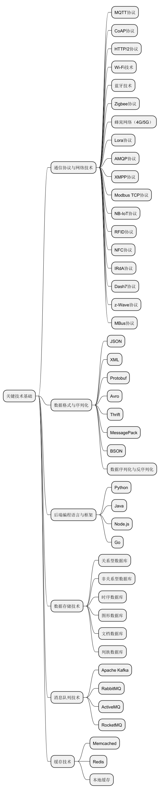

# 第二章：关键技术基础



## 2\.1 通信协议与网络技术

### （1）MQTT 协议

MQTT（Message Queuing Telemetry Transport），即消息队列遥测传输协议，其核心原理是基于发布 \- 订阅模式。设备可以作为发布者将数据发布到特定主题（Topic），也能作为订阅者接收感兴趣主题的消息。这种模式使得消息的发送者和接收者无需直接建立连接，而是通过中间的消息代理（Broker）进行通信，极大地提升了系统的灵活性与可扩展性。例如在智能农业大棚监控系统中，众多的温湿度传感器作为发布者，将采集到的数据发布到 “/greenhouse/temperature”“/greenhouse/humidity” 等主题，而负责调控环境的智能设备（如通风机、加湿器）则订阅这些主题，一旦接收到异常数据，便能即时做出响应，无需复杂的点对点连接配置。

MQTT 协议的消息头简洁，最小化了网络开销，其固定头部仅 2 字节，对于资源受限、按流量计费的物联网设备来说，能有效降低传输成本。它的消息格式由固定头部、可变头部和有效载荷三部分组成。固定头部包含消息类型、QoS（Quality of Service，服务质量）级别等关键控制信息，QoS 级别分为 0、1、2，分别对应至多一次、至少一次、恰好一次的消息传递保证，开发人员可根据应用对数据可靠性的需求灵活选择。可变头部包含主题名称长度、主题名称等信息，用于标识消息的目的地。有效载荷则承载具体的业务数据，如传感器采集的数值、设备状态报告等，其格式取决于具体应用场景，可采用 JSON、二进制等多种形式。

适用场景广泛分布于对实时性要求较高、网络条件相对较差且设备资源有限的领域。以车联网为例，车辆在行驶过程中，通过车载传感器实时采集车速、发动机状态、轮胎气压等数据，利用 MQTT 协议快速上传至云端后端系统，即便车辆处于信号微弱的偏远山区，其简洁高效的传输特性也能保障关键数据的及时送达，为远程诊断、车辆追踪提供有力支持。再如，在一些大型工业厂房内，分布着成千上万的传感器用于监测设备运行状况，MQTT 协议能轻松应对海量设备连接，确保生产数据实时反馈，助力生产流程优化与故障预警。

### （2）CoAP 协议

CoAP（Constrained Application Protocol），受限应用协议，专为资源极度受限的物联网设备设计，如小型传感器节点、低功耗微控制器等。它基于 UDP（User Datagram Protocol）协议，继承了 UDP 的低开销、快速传输优势，减少了 TCP（Transmission Control Protocol）协议中的三次握手、四次挥手等复杂连接建立与拆除过程，降低了设备的计算与能量消耗。同时，CoAP 支持异步通信，设备在发送请求后无需等待响应即可执行其他任务，提高了系统的并发处理能力。

CoAP 消息格式类似 HTTP 协议，包含请求方法（如 GET、POST、PUT、DELETE）、URI（Uniform Resource Identifier）、选项（Options）和负载（Payload）。请求方法用于指示操作类型，URI 标识资源位置，选项用于携带额外元数据，如请求的响应格式期望、内容编码等，负载则存放具体数据。其采用紧凑的二进制格式编码，相比文本格式的协议，进一步减少了数据传输量，提升传输效率。

适用场景集中于低功耗、低速率、对实时性要求不特别严苛且设备计算能力有限的物联网应用。在智能家居的一些小型传感器配件上，如门窗传感器、人体红外传感器，它们只需在状态发生变化时（如门窗开启、有人经过）向网关发送简短通知，CoAP 协议的简洁高效就能完美适配，既保证了基本功能实现，又延长了设备电池寿命。在智能楼宇的照明控制系统中，分布于各个房间的光照传感器、人体传感器利用 CoAP 协议与本地控制器通信，根据环境光线和人员活动情况智能调节灯光亮度，实现节能降耗。在野外环境监测中，大量布设在偏远地区的土壤湿度传感器，采用 CoAP 协议向附近的汇聚节点快速上报数据，由于无需维持复杂连接，能够以极低功耗长时间运行，即便电池供电也能持续工作数月甚至数年。

### （3）HTTP/2 协议

HTTP/2 作为 HTTP 协议的新一代版本，在物联网领域也有着独特的用武之地，尤其是在一些对数据传输速率、安全性和兼容性要求较高的应用场景。它支持多路复用，允许在同一 TCP 连接上同时发送多个请求和响应，摒弃了 HTTP/1\.x 时代的队首阻塞问题，大大提高了传输效率。例如在一个智能城市的交通监控系统中，众多摄像头需要同时向后端服务器上传高清视频流、路况图片以及设备状态信息，HTTP/2 的多路复用特性能够确保这些数据快速、有序地传输，避免因某个大数据流阻塞而影响其他小数据的及时送达。

HTTP/2 还对头部信息进行了压缩，采用 HPACK 算法，去除冗余头部字段，降低网络开销，对于物联网设备频繁的小数据交互场景，能有效节省带宽资源。其消息格式在兼容 HTTP/1\.x 的基础上进行了优化，依然基于文本格式，但引入了二进制分帧层，将 HTTP 消息分割为多个帧（Frame），每个帧包含帧头部和帧载荷，通过帧头部的标识信息来区分不同的请求、响应以及优先级等，帧在传输过程中可以乱序发送，到达接收端后再依据标识重新组装，这种创新机制极大提升了传输性能。

适用场景涵盖智能医疗、智能家居中控等对交互体验要求较高的领域。在智能医疗中，远程医疗设备（如可穿戴式心电监测仪、智能血压计）与医院后端系统之间需要实时传输大量医疗数据，同时患者或医护人员还可能随时发起设备控制指令、查询历史数据等操作，HTTP/2 的高效与灵活能够保障数据的顺畅交互，提升医疗服务质量。智能家居中控系统作为家庭物联网的枢纽，需要与各种智能家电、安防设备快速通信，整合各方功能，HTTP/2 的高性能使其能够胜任复杂的交互任务，为用户提供便捷的智能生活体验。

### （4）Wi\-Fi 技术

Wi\-Fi 技术基于 IEEE 802\.11 标准，通过无线接入点（AP）创建无线网络。它使用 2\.4GHz 或 5GHz 频段进行数据传输，能够提供较高的数据传输速率，满足如高清视频播放、语音交互等大数据量业务需求。在智能家居场景中，智能电视、智能音箱、智能空调等设备通常都支持 Wi\-Fi 接入，用户只需在家中配置好无线路由器，设备就能轻松连接网络。其原理是设备与无线路由器之间通过无线信号进行数据交换，路由器再将数据转发到互联网或本地网络。然而，Wi\-Fi 也存在一定局限性，其功耗相对较高，对于一些依靠电池供电的小型设备不太友好，且信号穿墙能力有限，在大面积、多房间的复杂环境下，可能出现信号覆盖死角。

### （5）蓝牙技术

蓝牙技术，尤其是低功耗蓝牙（BLE），工作在 2\.4GHz 频段，采用跳频扩频技术来减少干扰并提高传输的稳定性。它的低功耗特性是通过优化的连接和数据传输机制实现的，例如在设备不进行数据传输时，会进入低功耗待机模式。智能手环通过 BLE 与手机相连，实时同步运动数据、心率信息等，由于 BLE 的低功耗特性，手环仅需一颗小型纽扣电池就能长时间运行，满足用户长时间佩戴监测需求。在医疗领域，蓝牙体温计、血压计等设备可以方便地与患者手机或医护人员的手持终端连接，即时传输健康数据，助力远程医疗诊断。不过，蓝牙的传输距离较短，一般在 10 米左右，且连接设备数量相对有限，通常为 7 个左右，不适用于大规模设备组网场景。

### （6）Zigbee 协议

Zigbee 协议基于 IEEE 802\.15\.4 标准，采用了低功耗设计和自组网技术。它在物理层和 MAC 层采用了一些特殊的技术来降低功耗，如在数据传输时采用低功率的发射功率，设备在空闲时可以进入休眠状态以节省电量。在网络层，Zigbee 支持星型、树型和网状等多种网络拓扑结构，使得网络具有较高的可靠性和灵活性。在工业自动化生产线、智能照明系统中表现出色，大量的传感器、执行器通过 Zigbee 组建稳定的局域网，它们相互协作，实现生产流程的精准控制。一旦某个节点设备出现故障，网络能够自动重构，确保整体生产线不受影响。但 Zigbee 网络的数据传输速率较低，一般在 250kbps 以下，对于大数据量传输场景略显吃力。

### （7）蜂窝网络（4G/5G）

蜂窝网络利用基站进行信号覆盖，将地理区域划分为多个蜂窝状的小区。4G 网络采用了 OFDM（正交频分复用）和 MIMO（多输入多输出）等技术，提供了较高的数据传输速率和较好的移动性支持。5G 网络则进一步提升了性能，其毫米波频段能够实现更高的传输速率和更低的延迟。智能汽车在行驶过程中通过 5G 网络实时上传车况信息、接收导航与路况预警，无论汽车行驶到城市还是偏远山区，都能保持稳定连接。在远程设备监控领域，如分布于野外的石油管道监测设备、山区的气象监测站，利用 4G/5G 网络将采集的数据及时回传至后端系统，保障设备的远程管控。不过，蜂窝网络的使用成本相对较高，且在一些区域可能出现信号中断问题（如隧道、地下停车场、电梯）。

### （8）Lora 协议

Lora 是一种基于扩频技术的低功耗、远距离无线通信技术。它通过在较宽的频段上扩展信号，提高了信号的抗干扰能力，从而实现了较远的传输距离。其工作原理是采用啁啾扩频（CSS）技术，将低速率的数据信号扩展到很宽的频谱上进行传输。在农业物联网中，可用于远程监测农田的土壤湿度、气象条件等信息，传感器节点可以部署在广阔的农田区域，通过 Lora 网络将数据传输到远处的网关。在物流监控方面，能够对运输车辆和货物的位置、状态进行长距离跟踪。但由于其传输速率相对较低，对于一些对实时性和数据量要求较高的应用场景可能不太适用。

### （9）AMQP 协议说明

AMQP（Advanced Message Queuing Protocol）是一个提供统一消息服务的应用层标准高级消息队列协议。它采用了生产者 \- 消费者模型，消息生产者将消息发送到消息队列中，消费者从队列中获取消息进行处理。其设计目标是确保消息在不同的客户端和中间件之间可靠传递，具有丰富的消息属性和路由功能。在企业级物联网应用中，例如大型工厂的设备管理系统，不同车间的设备可以将生产数据和状态信息作为消息发送到 AMQP 消息队列，后端系统的各个处理模块作为消费者从队列中获取消息并进行分析、存储或控制操作。然而，AMQP 协议的实现相对复杂，需要一定的技术能力和资源来部署和维护。

### （10）XMPP 协议

XMPP（Extensible Messaging and Presence Protocol）是基于可扩展标记语言（XML）的协议，用于即时消息（IM）以及在线现场探测。它采用客户端 \- 服务器架构，客户端通过 TCP 连接到服务器，并使用 XML 格式的消息进行通信。在社交物联网应用中，用户可以通过支持 XMPP 的设备或应用程序与朋友或其他用户进行实时消息交流，同时还可以实现用户在线状态的探测和更新。例如在基于地理位置的智能社交活动推荐应用中，用户可以通过 XMPP 协议接收和发送位置信息、兴趣爱好等数据，实现社交互动和活动推荐。但由于 XML 格式的数据相对冗长，可能会影响传输效率和性能。

### （11）Modbus TCP 协议

Modbus TCP 是在 Modbus 协议基础上发展而来的，将 Modbus 协议应用于 TCP/IP 网络。它采用主从结构，主设备（如工业控制计算机）向从设备（如传感器、执行器等）发送请求，从设备响应请求并返回数据。在工业自动化领域广泛应用，例如在工厂的生产线中，主控制器通过 Modbus TCP 协议与各个设备进行通信，获取设备的运行状态、控制设备的操作。其优点是简单、可靠，在工业环境中经过了长期的验证，但它主要适用于工业自动化特定的场景，对于其他非工业领域的应用可能不太适用。

### （12）NB\-IoT 协议

NB\-IoT（Narrow Band Internet of Things）构建于蜂窝网络，主要聚焦于低功耗、广覆盖的物联网市场。它通过简化网络协议和降低设备功耗，使得物联网设备能够在低功耗状态下长时间运行，并能够在覆盖较差的区域实现稳定连接。例如在智能水表、智能电表等应用中，设备可以在电池供电的情况下，长时间稳定地将数据传输到后端系统。然而，由于其带宽较窄，数据传输速率相对较低，对于一些需要高速数据传输的应用场景可能无法满足需求。

### （13）RFID 协议

RFID（Radio Frequency Identification）是一种利用射频信号进行非接触式自动识别的技术。其原理是通过读卡器发射射频信号，当标签进入读卡器的工作区域时，标签会被激活并发送存储的数据给读卡器。在物流领域，货物上的 RFID 标签可以存储货物的详细信息，如名称、规格、生产日期等，在货物运输和仓储过程中，读卡器可以快速读取标签信息，实现货物的快速识别和管理。在门禁系统中，员工的 RFID 卡片可以用于身份识别，方便快捷地控制人员进出。但 RFID 的通信距离通常较短，一般在几米到几十米之间，且数据传输速率相对较低。

### （14）NFC 协议

NFC（Near Field Communication）是在非接触式射频识别（RFID）技术基础上，结合无线互连技术研发而成。它工作在 13\.56MHz 频段，采用磁场感应原理进行数据传输。在移动支付领域，用户可以将支持 NFC 的手机靠近支付终端，实现快速支付。在门禁考勤方面，员工可以使用 NFC 卡片或手机在门禁设备上轻轻一刷，即可完成身份验证和考勤记录。其优点是操作简单、便捷，但应用场景相对较窄，主要集中在近距离的交互场景。

### （15）IRdA 协议

IRdA（Infrared Data Association）即红外线数据协会标准，利用红外线进行数据传输。其原理是通过红外发光二极管发射红外线信号，接收端通过红外接收器接收信号并转换为数据。在一些近距离无线控制场景，如电视遥控器、空调遥控器等，IRdA 技术广泛应用。但由于红外线的传输特性，其传输距离较短，一般在几米以内，且容易受到障碍物的遮挡和干扰，传输的方向性也较强。

### （16）Dash7 协议

Dash7 采用 BLAST（Bidirectional Link \- Aware Spreading Technology）网络技术，支持突发性的数据流传输，比如视频或者音频。它在一些对数据突发传输有需求的场景中具有优势，例如在智能监控系统中，当需要传输一段高清视频或大量的图像数据时，Dash7 能够较好地满足这种需求。但相比其他一些主流协议，Dash7 的应用范围相对较小，在市场上的普及程度较低。

### （17）z\-Wave 协议

z\-Wave 是一种基于射频的、低成本、低功耗、高可靠、适于网络的短距离无线通信技术。它在智能家居领域有一定的应用，如智能照明、智能门锁、智能窗帘等设备之间的通信。其采用了独特的工作原理和通信协议，能够实现设备之间的稳定连接和高效通信。但由于其是一种相对封闭的技术标准，与其他一些协议的兼容性可能存在一定问题，且其市场份额相对较小。

### （18）MBus 协议

MBus（Meter Bus）即仪表总线，开发目的是用于满足网络系统和远程抄表的需要。它采用主从结构，主站可以连接多个从站（如电表、水表等仪表），实现数据的集中采集和管理。在能源计量领域，如小区的水电表远程抄表系统中，MBus 协议能够高效地实现数据的传输和管理，确保能源数据的准确采集和统计。但它的功能相对单一，主要适用于仪表数据采集和传输的特定场景。

### （19）网络接入方式对比

| 协议名称 | 优点 | 缺点 | 使用场景 |
| --- | --- | --- | --- |
| MQTT | 轻量级、发布 - 订阅模式灵活、消息头简洁、支持多种 QoS 级别、适合低带宽高延迟环境 | 对实时性要求极高场景可能有不足 | 车联网、工业厂房、智能农业大棚等 |
| CoAP | 低开销、快速传输、支持异步通信、适合资源受限设备、二进制格式编码高效 | 基于 UDP 可能存在数据不可靠、不适合对可靠性要求高的大型复杂应用 | 智能家居小型配件、智能楼宇照明系统、野外环境监测等 |
| HTTP/2 | 多路复用、头部压缩、兼容性好、传输性能高 | 相对复杂、对服务器和客户端要求较高 | 智能医疗、智能家居中控、智能城市交通监控等 |
| Wi-Fi | 高带宽、便捷、应用广泛 | 功耗高、信号穿墙能力有限、在复杂环境下可能有信号死角 | 智能家居、办公场所等 |
| 蓝牙（BLE） | 低功耗、适合短距离连接、设备兼容性好 | 传输距离短、连接设备数量有限 | 可穿戴设备、医疗健康监测、智能家居小配件等 |
| Zigbee | 低功耗、低速率、自组网、可靠性高、支持多种拓扑结构 | 数据传输速率低、不适用于大数据量传输 | 工业自动化生产线、智能照明系统等 |
| 蜂窝网络（4G/5G） | 广覆盖、高移动性、传输速率高（5G）、稳定性好 | 使用成本高、在信号屏蔽区域可能中断 | 远程设备监控、智能交通、车联网等 |
| Lora | 低功耗、远距离、抗干扰能力强 | 传输速率相对较低 | 农业物联网、物流监控、城市环境监测等 |
| AMQP | 统一消息服务、可靠、消息属性丰富、路由功能强 | 实现相对复杂、资源消耗较大 | 企业级物联网应用、大型工厂设备管理等 |
| XMPP | 基于 XML 可扩展、用于即时消息和在线探测 | 性能可能受 XML 影响、传输效率相对较低 | 社交物联网应用、智能社交活动推荐等 |
| Modbus TCP | 工业领域成熟、简单可靠、应用广泛 | 特定工业环境适用、功能相对单一 | 工业自动化、工厂生产线等 |
| NB-IoT | 低功耗、广覆盖、适合大规模设备接入 | 数据传输速率有限、带宽窄 | 智能水表、电表等低功耗广覆盖应用 |
| RFID | 非接触式通信、识别速度快 | 通信距离有限、数据传输速率低 | 物流、门禁、资产管理等 |
| NFC | 近距离便捷、操作简单 | 应用场景较窄、传输距离短 | 移动支付、门禁考勤等 |
| IRdA | 简单、成本低 | 传输距离短、易受干扰、方向性强 | 电视遥控器、空调遥控器等近距离无线控制 |
| Dash7 | 支持突发数据流传输 | 应用范围小、普及程度低 | 智能监控视频或音频传输等特定场景 |
| z-Wave | 低功耗、低成本、短距离通信可靠 | 相对封闭、兼容性可能有问题、市场份额小 | 智能家居部分设备通信 |
| MBus | 满足远程抄表需求、高效 | 功能较单一、特定仪表领域适用 | 能源计量、水电表远程抄表等 |

## 2\.2 数据格式与序列化

在物联网领域，合适的数据格式对于系统的高效运行至关重要。以下是对多种常见数据格式的详细剖析：

1. **JSON**
	- 示例：\{ "name": "temperature\_sensor", "value": 25, "timestamp": "2024\-12\-15T10:30:00Z" \}，这可以表示一个温度传感器在特定时间采集的数据。
	- 优点：以简洁的文本形式呈现，具有良好的可读性，易于理解和调试。键值对结构清晰直观，与前端技术兼容性强，方便数据在不同系统层级间交互。
	- 缺点：相对二进制格式，数据冗余度较高，占用传输带宽和存储资源稍多。
	- 使用场景：在智能家居中控平台与后端通信、小型物联网项目且网络带宽充足、对可读性要求高以及需要频繁与前端交互的场景中广泛应用。例如，家庭自动化系统中，智能灯泡、智能插座等设备向中控系统反馈状态信息，使用 JSON 格式，方便开发人员查看和排查问题。
2. **XML**
	- 示例：

	```xml
	<sensor_data>
	    <name>humidity_sensor</name>
	    <value>60</value>
	    <timestamp>2024-12-15T11:00:00Z</timestamp>
	</sensor_data>
	```

	- 优点：有着严谨的结构，强大的扩展性，支持自定义标签，适用于复杂的数据层次表示。在企业级系统集成、需要遵循严格数据交换规范的场景中有优势。
	- 缺点：因丰富的标记符号，数据量通常较为冗长，解析过程相对复杂耗时，传输成本较高。
	- 使用场景：在制造业企业生产设备与 ERP 系统对接时，基于 XML 标准的物料清单（BOM）数据交换，凭借其严谨结构确保数据准确性；在医疗信息化系统中，不同医疗机构间交换病历等复杂结构化数据，XML 可保证数据的完整性与规范性。

3. **Protobuf（Protocol Buffers）**
	- 示例：需通过特定代码生成对应语言的结构体，例如在定义一个传感器消息结构体后，序列化后的数据为二进制流，难以直接展示。大致如：08 96 01 10 03 1a 0d 32 30 32 33 2d 30 39 2d 31 35 54 31 32 3a 30 30 3a 30 30 5a，这是经过编码后的一个包含传感器名称、值和时间戳的消息示例。
	- 优点：采用紧凑二进制编码，极大减少数据传输量，解析效率极高，序列化与反序列化速度快，适合大规模数据传输场景。
	- 缺点：可读性差，数据结构定义需依赖特定工具生成代码，开发调试相对复杂。
	- 使用场景：在大型分布式物联网系统如全球海洋浮标监测网络中，卫星与地面接收站之间需传输海量传感器数据，Protobuf 能高效传输；人工智能赋能的工业故障预测系统中，对设备运行数据快速处理时，其高性能优势凸显。
4. **Avro**
	- 示例：

	```json
	{
	  "type": "record",
	  "name": "SensorReading",
	  "fields": [
	    {"name": "name", "type": "string"},
	    {"name": "value", "type": "int"},
	    {"name": "timestamp", "type": "string"}
	  ]
	}
	```

	这定义了一个传感器读数的数据结构，实际存储或传输时为对应的二进制数据。

	- 优点：具有丰富的数据结构定义，支持动态类型和模式演进，数据以二进制形式存储，较为紧凑，在大数据处理和分布式系统中能高效存储和传输数据。
	- 缺点：对开发人员技术要求相对较高，需熟悉其模式定义语法，生态系统相对不如 JSON、XML 广泛。
	- 使用场景：在大规模的物联网数据分析平台中，用于高效存储和传输传感器采集的海量数据。例如，城市智能交通系统中，成千上万个交通流量传感器持续采集数据，汇聚到大数据平台进行分析，Avro 格式可保障数据处理效率。

5. **Thrift**
	- 示例：首先需定义 Thrift 接口文件，如：

	```thrift
	struct SensorData {
	    1: string name;
	    2: i32 value;
	    3: string timestamp;
	}
	```

	然后通过 Thrift 工具生成不同语言的代码来处理数据，实际传输的数据是遵循其协议的二进制流。

	- 优点：是一种可伸缩的跨语言服务开发框架，定义了自己的数据类型和通信协议，能够生成多种编程语言的代码，支持高效的二进制通信，方便不同语言编写的模块协同工作。
	- 缺点：使用门槛较高，需掌握 Thrift 的接口定义、代码生成等流程，学习成本较高。
	- 使用场景：在复杂的智能工厂物联网系统中，不同车间的设备和服务由不同团队用不同语言开发，通过 Thrift 进行快速可靠的数据交互，实现生产流程自动化管控。

6. **MessagePack**
	- 示例：序列化后的二进制数据类似：83 a4 6e 61 6d 65 a9 74 65 6d 70 65 72 61 74 75 72 65 a1 32 a1 76 61 6c 75 65 32 35 a1 74 69 6d 65 73 74 61 6d 70 32 30 32 33 2d 30 39 2d 31 35 54 31 32 3a 30 30 3a 30 30 5a，这表示一个包含名称、值和时间戳的传感器数据，它可以在保持一定可读性的同时减少数据大小。
	- 优点：是一种高效的二进制序列化格式，类似于 JSON，但更紧凑，兼具一定可读性，序列化和反序列化速度较快，对性能有一定要求且需要一定可读性的物联网场景适用。
	- 缺点：功能相对不如 Protobuf、Thrift 强大，复杂数据结构支持稍弱。
	- 使用场景：一些实时性要求较高的小型物联网设备间的数据传输。比如，无线传感器网络中的节点，自身资源有限，需要快速将采集到的数据传递给附近的汇聚节点，MessagePack 既能满足性能需求，又便于开发人员简单查看数据。
7. **BSON（Binary JSON）**
	- 示例：在 MongoDB 数据库中，一个传感器数据文档可能存储为：

	```json
	{
	    "_id": ObjectId("65031234abcd1234567890ab"),
	    "name": "pressure_sensor",
	    "value": 100,
	    "timestamp": ISODate("2024-12-15T13:00:00Z")
	}
	```

	- 优点：结合了 JSON 的灵活性和二进制的高效性，适合在数据库中存储和查询复杂数据结构，对数据库操作友好。
	- 缺点：二进制格式导致一定程度上可读性降低，与非 MongoDB 生态系统的兼容性相对受限。
	- 使用场景：在智能物流系统中，用于存储货物的详细信息和运输状态等复杂数据。货物可能有多种属性、运输轨迹、状态变化等信息，BSON 格式方便存入 MongoDB 数据库，便于后续查询管理。

### 8\.数据序列化与反序列化基础

数据序列化是将内存中的数据对象转换为适合存储或传输的格式（如二进制、文本等）的过程，而反序列化则是相反的操作，将存储或传输格式的数据还原为内存中的数据对象。

以 Python 为例，对于简单的自定义数据类，如一个表示物联网设备信息的类：

```python
class Device:
    def __init__(self, name, mac_address, firmware_version):
        self.name = name
        self.mac_address = mac_address
        self.firmware_version = firmware_version
device = Device("Sensor001", "00:11:22:33:44:55", "1.0.1")
```

使用 Python 的内置模块 pickle 可以实现序列化：

```python
import pickle
serialized_device = pickle.dumps(device)
```

此时 serialized\_device 就是序列化后的字节流，可以存储到文件或通过网络传输。反序列化则是：

```python
deserialized_device = pickle.loads(serialized_device)
print(deserialized_device.name)  # 输出 Sensor001
```

不同编程语言和数据格式都有各自的序列化与反序列化方式。在 Java 中，对于对象的序列化，需要实现 java\.io\.Serializable 接口，然后利用 ObjectOutputStream 和 ObjectInputStream 进行序列化与反序列化操作。例如：

```java
import java.io.ObjectOutputStream;
import java.io.ObjectInputStream;
import java.io.FileOutputStream;
import java.io.FileInputStream;
import java.io.IOException;
public class SerializationDemo {
    public static void main(String[] args) throws IOException, ClassNotFoundException {
        DeviceStatus status = new DeviceStatus("Online", 80);
        // 序列化
        try (ObjectOutputStream oos = new ObjectOutputStream(new FileOutputStream("status.ser"))) {
            oos.writeObject(status);
        }
        // 反序列化
        try (ObjectInputStream ois = new ObjectInputStream(new FileInputStream("status.ser"))) {
            DeviceStatus deserializedStatus = (DeviceStatus) ois.readObject();
            System.out.println(deserializedStatus.status + ", " + deserializedStatus.batteryLevel);
        }
    }
}
```

不同语言、数据格式各有序列化 “套路”。了解这些基础，是构建稳健物联网后端系统的关键一步，为后续复杂的数据处理、存储与交互筑牢根基。

## 2\.3 后端编程语言与框架

### （1）Python：简洁高效的物联网开发利器

Python 在物联网后端开发领域占据着重要一席，其诸多特性使其备受开发者青睐。

语言特性方面，Python 以简洁、易读的语法著称，代码编写仿若书写自然语言，极大降低了开发门槛。以一个简单的物联网设备数据接收与处理脚本为例：

```python
import socket
# 创建套接字，监听指定端口
server_socket = socket.socket(socket.AF_INET, socket.SOCK_STREAM)
server_socket.bind(('0.0.0.0', 8888))
server_socket.listen(5)
while True:
    # 接受客户端连接
    client_socket, client_address = server_socket.accept()
    data = client_socket.recv(1024)
    if data:
        # 假设接收到的是 JSON 格式数据，简单解析
        import json
        parsed_data = json.loads(data.decode('utf-8'))
        print(f"Received data: {parsed_data}")
        # 此处可添加更多数据处理逻辑，如存入数据库等
    client_socket.close()
```

寥寥数行，便能搭建起一个基础的物联网数据接收服务，对于初创型物联网项目或快速验证想法的场景，开发效率极高。其动态类型系统赋予变量灵活定义，开发过程无需提前声明变量类型，减少代码冗长度，但在大型复杂项目维护时，需开发者更加谨慎处理变量类型相关问题。

Python 拥有庞大且活跃的生态系统，丰富的第三方库几乎涵盖物联网开发的各个环节。在数据处理上，NumPy、Pandas 提供强大数组运算与数据分析能力，面对物联网设备采集的海量时序数据，如智能电网中的电表读数、工业传感器数据，可便捷地进行清洗、统计分析；机器学习库 Scikit\-learn、TensorFlow 助力挖掘数据价值，实现设备故障预测、能源消耗优化等智能应用。网络通信领域，Twisted、Tornado 等库支持异步非阻塞 I/O，应对高并发设备连接游刃有余，确保后端系统稳定高效运行。

适用场景广泛分布于快速原型开发、数据分析驱动的物联网项目。在智能家居领域，许多初创公司利用 Python 快速搭建后端服务，连接智能家电设备，通过简单脚本实现设备控制逻辑、数据采集与分析，配合前端开发迅速推出 MVP（最小可行产品）抢占市场。智能农业方面，借助 Python 与各类传感器通信，分析土壤湿度、光照等数据指导灌溉施肥决策，帮助农户提升生产效率，以低成本实现农业智能化转型。

在安全编码实践上，Python 虽语法灵活，但也注重防范常见攻击。针对 SQL 注入，当后端与数据库交互时，使用参数化查询是关键防御手段。例如使用 Python 的 sqlite3 库连接 SQLite 数据库：

```python
import sqlite3
# 连接数据库
conn = sqlite3.connect('iot_data.db')
cursor = conn.cursor()
# 假设接收来自设备的用户输入作为查询条件，需参数化查询防止注入
user_input = "some_device_id"
query = "SELECT * FROM devices WHERE id = ?"
cursor.execute(query, (user_input,))
results = cursor.fetchall()
for row in results:
    print(row)
conn.close()
```

通过将查询条件参数化，而非直接拼接用户输入到 SQL 语句，有效避免恶意用户篡改查询逻辑。对于 XSS（跨站脚本攻击）防范，在处理用户提交数据用于前端展示场景，如物联网设备管理 Web 界面展示用户自定义设备名称时，使用 HTML 转义库（如 html\.escape）对数据进行转义，确保恶意脚本无法注入执行，保障后端系统安全稳定。

### （2）Java：稳健可靠的企业级物联网支柱

Java 在企业级物联网后端开发中一直是中流砥柱，凭借深厚底蕴为大规模、高要求项目保驾护航。

Java 语言特性强调稳健性与强类型系统，代码需严格遵循类型规范编译，这在大型物联网项目开发与维护中优势显著。如在智能交通系统后端，处理海量车辆数据、复杂交通规则逻辑，Java 静态类型检查能提前捕获多数潜在错误，降低系统上线后风险。其面向对象特性深入骨髓，通过封装、继承、多态构建高内聚、低耦合模块，以城市物联网综合管控平台为例，不同功能模块（设备管理、数据存储、服务接口）各自封装为独立类，便于团队协作开发、升级维护。

Java 生态系统堪称浩瀚，Java 企业版（Java EE）规范及衍生框架为物联网企业应用提供坚实支撑。Spring 框架家族独树一帜，Spring Boot 更是简化开发流程的利器。在物联网设备接入认证模块开发中，基于 Spring Boot 只需简单配置即可快速搭建 RESTful API 服务：

```java
import org.springframework.boot.SpringApplication;
import org.springframework.boot.autoconfigure.SpringBootApplication;
import org.springframework.web.bind.annotation.PostMapping;
import org.springframework.web.bind.annotation.RequestBody;
import org.springframework.web.bind.annotation.RestController;
@SpringBootApplication
@RestController
public class IotAuthService {
    public static void main(String[] args) {
        SpringApplication.run(IotAuthService.class, args);
    }
    @PostMapping("/auth/device")
    public boolean authenticateDevice(@RequestBody DeviceCredentials creds) {
        // 假设此处为简单验证逻辑，实际可对接数据库等深入验证
        return creds.getPassword().equals("valid_password");
    }
}
class DeviceCredentials {
    private String deviceId;
    private String password;
    // 省略 getters 和 setters
}
```

配合 Spring Security，实现设备认证与授权的精细管控。如定义不同角色（普通设备、管理员设备）的权限，确保只有合法设备能执行特定操作，保障物联网系统安全边界。

Java 在大型工业物联网、智慧城市核心系统等场景大放异彩。工业生产线上，Java 后端系统对接各类精密制造设备，实时监控设备状态、调整生产参数，凭借其卓越性能与可靠性，保障生产线 24 小时不间断运行。智慧城市管理中，整合交通、能源、环境等多领域物联网数据，构建庞大数据中心，Java 高效处理海量并发请求，为城市精细化管理提供数据支撑。

Java 安全机制严谨，内置安全管理器（Security Manager）可管控代码访问权限。在物联网后端运行不受信代码（如第三方插件）场景，安全管理器依据策略限制代码对系统资源（文件、网络、内存）访问，防止恶意代码破坏系统。例如在接收外部设备上传插件并运行时，通过配置安全管理器，仅允许插件访问特定目录下资源，避免数据泄露或系统篡改风险。同时，Java 在网络通信、加密解密等方面提供丰富 API，支持 SSL/TLS 协议确保数据传输安全，为物联网后端与设备、外部系统交互筑牢安全防线。

### （3）Node\.js：异步高效的实时物联网先锋

Node\.js 凭借独特的异步非阻塞 I/O 模型，在实时性要求高、高并发的物联网后端场景异军突起。

语言特性聚焦于事件驱动与异步编程，基于 JavaScript 语法，前端开发者可无缝过渡到后端开发。以一个简单的物联网实时数据推送服务为例：

```javascript
const http = require('http');
const server = http.createServer();
server.on('request', (req, res) => {
    // 简单处理请求，返回固定信息
    res.writeHead(200, {'Content-Type': 'text/plain'});
    res.end('Iot Server is running');
});
const io = require('socket.io')(server);
io.on('connection', (socket) => {
    // 假设这里模拟接收物联网设备实时数据并推送至前端
    setInterval(() => {
        const data = { temperature: 25, humidity: 45 };
        socket.emit('sensorData', data);
        // 此处可添加更多数据处理逻辑，如存入数据库等
    }, 1000);
});
server.listen(3000, () => {
    console.log('Server listening on port 3000');
});
```

上述代码利用 socket\.io 库实现实时数据推送，当物联网设备数据更新，能即时推送给前端用户，适用于智能监控、实时预警等场景，如仓库温湿度实时监控，一旦数据异常，立即通知管理员采取措施。

Node\.js 的生态系统围绕 JavaScript 包管理器（NPM）蓬勃发展，海量模块可供选用。Express\.js 作为热门后端框架，简洁易用，快速搭建 RESTful API。在小型物联网项目后端，如个人开发者搭建的智能健康监测系统，用于接收手环、体脂秤等设备数据：

```javascript
const express = require('express');
const app = express();
const bodyParser = require('body-parser');
app.use(bodyParser.json());
app.post('/data', (req, res) => {
    const { deviceId, healthData } = req.body;
    // 此处可将数据存入数据库或进行分析处理
    console.log(`Received data from ${deviceId}: ${healthData}`);
    res.send('Data received successfully');
});
app.listen(8080, () => {
    console.log('Server running on port 8080');
});
```

仅需少量代码就能实现数据接收接口，结合 MongoDB 等 NoSQL 数据库，轻松存储半结构化健康数据，满足项目快速开发需求。

适用场景集中于实时交互需求强烈、设备连接频繁且数据处理相对轻量的物联网项目。如在线多人协作的智能办公场景，Node\.js 后端实时同步办公设备状态、文件更新信息，保障团队协作流畅性。在社交物联网应用，如基于地理位置的智能社交活动推荐，实时采集用户位置、兴趣爱好等，快速计算匹配并推送活动信息，提升用户体验。

在安全保障方面，Node\.js 同样重视。使用 Helmet 中间件可增强 Express\.js 应用安全防护，如设置安全 HTTP 头，防止点击劫持、XSS 等攻击。对于 RESTful API 安全，采用 Passport\.js 实现多策略认证，如基于令牌（Token）认证，设备在首次认证后获取令牌，后续请求携带令牌验证身份，防止非法访问。同时，在数据传输加密上，借助 Node\.js 原生 https 模块或第三方库，确保与物联网设备、外部系统通信安全，为实时高效的物联网后端运行保驾护航。

### （4）Go：高效简洁的新兴物联网力量

Go 语言作为物联网后端开发领域的后起之秀，正凭借其独特优势迅速崭露头角。

语言特性上，Go 兼具简洁性与高效性。其语法简洁明了，去除了 C\+\+、Java 等语言中的复杂语法糖和冗余代码结构，以一个简单的物联网设备数据转发服务为例：

```python
package main
import (
    "net"
    "fmt"
    "bufio"
    "strings"
)
func main() {
    // 监听指定端口
    ln, err := net.Listen("tcp", ":8888")
    if err != nil {
        fmt.Println(err)
        return
    }
    defer ln.Close()
    for {
        // 接受客户端连接
        conn, err := ln.Accept()
        if err != nil {
            fmt.Println(err)
            continue
        }
        go handleConnection(conn)
    }
}
func handleConnection(conn net.Conn) {
    defer conn.Close()
    reader := bufio.NewReader(conn)
    for {
        // 读取客户端发送的数据
        data, err := reader.ReadString('\n')
        if err != nil {
            fmt.Println(err)
            return
        }
        // 简单处理数据，这里假设将数据转发到另一个服务
        processedData := strings.TrimSpace(data)
        fmt.Println("Received data:", processedData)
        // 此处可添加实际的数据转发逻辑，如发送到其他服务器或进行本地处理
    }
}
```

这段代码轻松搭建起一个基础的物联网数据处理服务，通过简洁的语法和高效的并发模型，快速处理多个设备连接。Go 语言的并发模型基于轻量级的协程（Goroutine）和通道（Channel），能够轻松应对高并发场景，相较于传统线程模型，协程的创建和销毁开销极小，使得 Go 在处理海量物联网设备连接时游刃有余。

Go 的生态系统虽然相较于 Python 和 Java 尚显年轻，但也在蓬勃发展。在物联网领域，有诸多专门为其打造的库和工具。例如，Go 内置的 net/http 库提供了强大的 HTTP 服务器和客户端功能，方便快速搭建 RESTful API，用于与物联网设备交互以及向外提供数据服务接口。在设备连接方面，go\-kit/kit 等库提供了一系列用于构建微服务架构的组件，便于将复杂的物联网后端系统拆分为多个可独立维护和扩展的微服务，如设备管理微服务、数据处理微服务等，提升系统的灵活性与可扩展性。

适用场景广泛涵盖对性能、并发要求较高且注重开发效率的物联网项目。在大规模智能物流仓储系统中，需要实时处理来自众多传感器（如温湿度传感器、货物位置传感器、叉车运行状态传感器）的数据，Go 语言的高并发处理能力确保数据能够及时、准确地被接收、处理与分发，保障仓储环境的稳定控制和货物运输的高效调度。在边缘计算场景下，靠近物联网设备端的边缘服务器往往资源有限，Go 语言的轻量级特性使其能够在有限资源下高效运行，快速处理本地数据，减轻云端后端系统的压力，实现实时性要求较高的本地决策控制，如智能工厂车间内的边缘计算节点实时监控设备故障预警并及时采取停机等应急措施。

在安全编码实践方面，Go 语言同样有着出色的表现。Go 标准库中的 crypto 包提供了丰富的加密解密功能，涵盖常见的对称加密（如 AES）和非对称加密（如 RSA）算法，用于保障物联网设备与后端系统之间的数据传输安全。以一个简单的物联网设备数据加密传输示例：

```python
package main
import (
    "crypto/aes"
    "crypto/cipher"
    "fmt"
    "io"
)
func main() {
    // 假设的原始数据
    originalData := []byte("This is sensitive IoT data")
    // 生成密钥
    key := []byte("1234567890123456")
    encryptedData, err := encryptData(originalData, key)
    if err != nil {
        fmt.Println(err)
        return
    }
    fmt.Println("Encrypted data:", encryptedData)
    decryptedData, err := decryptData(encryptedData, key)
    if err != nil {
        fmt.Println(err)
        return
    }
    fmt.Println("Decrypted data:", string(decryptedData))
}
func encryptData(data []byte, key []byte) ([]byte, error) {
    block, err := aes.NewCipher(key)
    if err != nil {
        return nil, err
    }
    // 选择加密模式，这里以 CBC 为例
    ciphertext := make([]byte, aes.BlockSize+len(data))
    iv := ciphertext[:aes.BlockSize]
    if _, err := io.ReadFull(rand.Reader, iv); err != nil {
        return nil, err
    }
    cfb := cipher.NewCFBEncrypter(block, iv)
    cfb.XORKeyStream(ciphertext[aes.BlockSize:], data)
    return ciphertext, nil
}
func decryptData(data []byte, key []byte) ([]byte, error) {
    block, err := aes.NewCipher(key)
    if err != nil {
        return nil, err
    }
    iv := data[:aes.BlockSize]
    data = data[aes.BlockSize:]
    cfb := cipher.NewCFBDecrypter(block, iv)
    cfb.XORKeyStream(data, data)
    return data, nil
}
```

上述代码展示了如何使用 Go 语言对物联网数据进行加密和解密，防止数据在传输过程中被窃取或篡改。同时，Go 在网络编程方面也充分考虑了安全因素，默认启用的 TLS（Transport Layer Security）协议确保与物联网设备、外部系统的通信安全，防止中间人攻击等网络安全威胁。

## 2\.4 数据存储技术

物联网后端的数据存储需求极为复杂多样，相应的数据存储技术也各有千秋。

### （1）关系型数据库

关系型数据库堪称数据存储的 “中流砥柱”，像 MySQL 和 PostgreSQL 等，凭借其成熟的 SQL 语言体系，能够游刃有余地处理具有复杂关联关系的数据。以智能工厂为例，设备与设备之间、设备与生产流程、订单之间存在千丝万缕的联系，关系型数据库利用严格的表结构设计，精准定义各实体间的关联，通过 ACID 属性（原子性、一致性、隔离性、持久性），确保数据在并发读写、系统故障等情况下的一致性与完整性。无论是存储生产线上精密设备的详细配置参数，还是追踪订单从下单、生产到交付全过程涉及的各类信息，关系型数据库都能稳定可靠地担此重任，为企业运营提供坚实的数据基础。

### （2）非关系型数据库

而 Redis 作为内存数据库中的 “明星选手”，将数据存储于内存之中，使得数据读写速度达到令人惊叹的级别。在智能工厂的生产线上，众多传感器实时监测设备的运行参数，如温度、压力、振动频率等，这些数据需要被快速采集与分析，以即时判断设备是否处于正常工作状态，一旦出现异常能迅速发出警报。Redis 凭借其超高速的读写特性，可以在极短时间内存储并更新这些传感器数据，为后续的故障诊断与预测性维护提供实时依据。同时，Redis 还能通过分布式锁机制，协调多个分布式组件之间的资源，确保在高并发场景下，不同生产环节对共享数据资源的有序访问，为物联网项目多样化的数据存储需求提供更多灵活可靠的解决方案。

### （3）时序数据库

时序数据库更是为物联网量身定制。以 InfluxDB 和 OpenTSDB 为代表，它们聚焦于时序数据的高效存储与查询。在电力系统中，分布广泛的智能电表每隔固定时间就会采集电压、电流等数据，时序数据库能够按照时间序列精准组织这些海量数据，当需要分析某一区域在特定时间段内的电力负荷变化趋势，或是排查某一时段内的电力故障时，其强大的时序查询功能可以迅速定位并提取相关数据，让数据分析人员能够高效挖掘数据价值，为物联网系统的稳定运行、优化升级提供有力支撑，全方位满足不同物联网场景的数据存储刚需。

### （4）图形数据库

图形数据库，例如 Neo4j，擅长处理高度关联的数据，这在物联网社交网络、智能电网的拓扑分析等场景极具优势。在智能交通系统里，若要分析不同路段、路口、交通工具以及交通设施之间复杂的连接关系，以优化交通路线规划、预测拥堵节点，Neo4j 能够快速遍历这些复杂关联，挖掘隐藏信息，而传统关系型数据库在处理此类深度关联查询时效率相对较低。当构建智能交通的路径规划模型时，Neo4j 可以将道路节点、路口转向限制、实时路况等信息构建成复杂的图形关系，快速计算出最优通行路线，为驾驶者提供精准导航，大大提升交通效率。

### （5）文档数据库

文档数据库如 CouchDB 是不错的选择，它基于 JSON 文档存储，数据模型简单直观，且支持多版本并发控制（MVCC）。对于物联网设备的配置文件管理，不同版本的设备固件对应的不同配置需求，CouchDB 可以轻松存储并追踪这些变化，同时保障并发读写的一致性，方便开发人员随时回溯和管理设备配置历史，降低因配置错误引发的故障风险。在智能家居系统升级过程中，众多设备的固件更新需要不同的配置参数调整，CouchDB 能有条不紊地存储各个版本配置，确保升级过程平滑过渡，避免因配置混乱导致设备故障。

### （6）列族数据库

列族数据库 HBase，构建于 Hadoop 生态之上，拥有出色的扩展性与海量数据存储能力。在大规模农业物联网中，海量的土壤湿度、气象条件、农作物生长指标等数据从分布广泛的传感器汇聚而来，HBase 可以按照列族高效组织存储，快速检索某一区域、某类作物相关的特定数据列，满足农业科研对海量数据深入分析的需求，助力精准农业决策。科研人员想要研究某一地区特定农作物在生长周期内受气象因素影响的情况，HBase 能够迅速提取该区域气象条件与农作物生长指标对应的数据列，加速科研进程。

鉴于物联网项目的数据存储需求复杂多样，涉及海量、结构化与非结构化、实时与历史等各类数据，数据库的选择应依据数据规模、结构特点、读写性能要求以及业务场景的关联复杂度等多方面因素综合判断，且各数据库并非彼此孤立、泾渭分明，在实际应用中往往相互协作、优势互补，共同撑起物联网后端坚实的数据架构。

| 数据库类型 | 特点 | 特长 | 劣势 | 使用场景举例 |
| --- | --- | --- | --- | --- |
| 关系型数据库（如 MySQL、PostgreSQL） | 以表格形式存储，数据结构化，有严格表结构设计，使用 SQL 语言操作，支持 ACID 属性 | 擅长处理复杂关联数据，保障数据一致性、完整性，支持复杂查询与事务处理 | 扩展性相对较差，面对海量半结构化、非结构化数据处理效率低，写入频繁时性能下降 | 智能工厂生产管理系统，用于存储设备与生产线、订单、物料等之间的关联信息，确保生产流程数据的准确与连贯；物联网供应链系统中，管理供应商、物流、仓储等环节的强关联数据，保障货物追踪与调配的精准性。 |
| 非关系型数据库 - MongoDB | 采用 BSON 格式存储半结构化数据，数据模型灵活，无严格表结构要求 | 轻松接纳海量半结构化数据，读写操作灵活，易于水平扩展 | 事务支持较弱，复杂查询性能不如关系型数据库 | 智能家居系统中，各类智能家电设备上报的运行日志、环境感知数据存储，方便后续灵活查询分析；智能物流仓储场景下，货物状态信息、运输轨迹详情等半结构化数据的存储，支持随时按需扩展数据字段。 |
| 非关系型数据库 - Redis | 数据存储于内存，读写速度极快，支持多种数据结构 | 超高速读写实时数据，可通过分布式锁协调多组件资源，适用于高并发场景 | 受内存容量限制，存储成本高，数据持久化相对复杂 | 智能工厂的设备实时监测，快速采集并更新设备运行参数，如温度、压力、振动频率等，以便即时判断设备状态，异常时迅速报警；物联网车联网应用中，缓存车辆实时位置、行驶速度等信息，实现快速路况预警与导航优化，提升多车交互响应速度。 |
| 时序数据库（如 InfluxDB、OpenTSDB） | 针对时间序列数据优化，数据按时间序列高效组织，支持高频写入和快速时间范围查询 | 出色处理大量时间序列数据，数据压缩佳，时序查询功能强大 | 功能较为单一，主要针对时序数据，学习成本较高 | 电力物联网系统，实时存储并分析智能电表采集的电压、电流、功率等数据，监测电力负荷变化与用电异常；工业物联网场景下，对工厂设备传感器定时采集的温度、转速、能耗等数据进行存储与趋势分析，助力设备维护与能效优化。 |
| 图形数据库（如 Neo4j） | 以图形结构存储，节点表示实体，边代表关系，数据关系直观 | 擅长挖掘复杂关系数据，快速遍历关联，在社交、网络关系分析场景优势明显 | 存储结构复杂，学习曲线陡峭，非关系型操作性能受限，大规模数据存储时性能挑战大 | 物联网社交网络，如智能健康设备用户间的社交互动、运动挑战关系管理，挖掘用户兴趣群组与社交影响力；智能城市物联网中的交通网络拓扑分析，绘制路口、路段、交通工具间连接关系，优化交通信号灯配时与路线规划。 |
| 文档数据库（如 CouchDB） | 基于 JSON 文档存储，数据模型简单直观，支持多版本并发控制 | 灵活适应数据模式变化，方便管理数据版本，支持并发读写一致性 | 事务处理能力相对较弱，查询性能不如关系型数据库的 SQL 查询 | 物联网设备固件升级过程，存储不同版本设备的配置文件，方便回溯与管理配置历史，确保升级平稳；智能农业大棚管理系统，记录农作物种植方案、环境调控策略等文档信息，支持随时更新与版本对比。 |
| 列族数据库（如 HBase） | 构建于 Hadoop 生态之上，以列族形式存储数据，扩展性强 | 海量数据存储出色，可快速检索特定列数据，适合大规模数据分析 | 不擅长处理复杂关联查询，对小规模数据场景性能优势不明显 | 大规模农业物联网，存储来自不同区域、不同类型传感器的海量土壤湿度、气象条件、农作物生长指标数据，供农业科研精准分析；工业物联网大数据平台，汇聚工厂车间各类设备的海量运行日志、故障记录，按列族检索特定设备或生产环节数据，支撑故障排查与工艺优化。 |

## 2\.5 消息队列技术

消息队列无疑是物联网后端架构中的关键枢纽，众多优秀方案凭借各自鲜明特性，在多样的物联网场景中各展风采，为数据的顺畅流转铺就坚实道路。

Apache Kafka 仿若一座巍峨的数据大坝，依托其令人惊叹的高吞吐量与稳健的分布式架构，毅然矗立在物联网大数据的汹涌洪流之中。以智能交通这一超大规模且数据洪峰频发的场景为例，城市道路如同一张流动的数据网络，川流不息的车载传感器马不停蹄地发送海量的车辆轨迹、实时速度、路况详情等信息。Kafka 凭借独特的分区机制，恰似一位指挥若定的调度大师，将如潮水般涌入的数据有序分流至各个存储区域，轻松化解每秒数以万计消息的冲击，确保后端系统能够有条不紊地对这些实时数据进行深度挖掘与分析，精准洞察交通流量变化规律，为交通信号灯智能调控、出行路线动态优化提供坚实的数据支撑，驱动城市交通迈向高效、智能的新台阶。

RabbitMQ 宛如一座坚不可摧的信息堡垒，作为遵循 AMQP 协议的标杆典范，以其稳如泰山的可靠消息传递机制在业界备受推崇。当踏入金融物联网这片对数据准确性与安全性要求极高的领域，每一笔在线支付、资金转账操作都承载着不容有失的资金安全重任。RabbitMQ 仿若配备了一套严密的信息安保系统，利用丰富的消息确认、多重重试机制，在异步处理流程的每一个关键节点严防死守，从交易指令发起、身份验证直至最终完成的全过程，确保每一条关键消息都能精准无误地送达目的地。即便遭遇网络抖动、系统突发故障等恶劣状况，也能凭借强大的容错能力保障资金交易的安全、稳定运行，如忠诚卫士般守护金融体系的稳固根基。

ActiveMQ 恰似一位贴心的智能助手，凭借出色的兼容性与极致简易的上手难度，成为小型智能家居项目开启便捷交互之门的 “金钥匙”。在温馨舒适的家居环境里，智能灯泡、智能窗帘、智能音箱等各类设备如同灵动的家庭成员，偶尔需要轻声交流，传递诸如灯光的开关状态、窗帘的开合幅度、音乐播放的暂停与切换等简单而实用的状态信息。ActiveMQ 以其简洁易用的特性，能够让用户以极低的学习成本迅速搭建起设备间的消息通道，实现设备间流畅无阻的交互沟通，巧妙避免因频繁的直接连接尝试导致系统卡顿或延迟，为用户精心营造便捷、舒适、智能的居家体验，让家的温馨与科技的魅力完美融合。

再看阿里开源的 RocketMQ，它如同一位在物联网赛场上无往不胜的 “超级英雄”，集低延迟的敏捷特性、高可靠的 “钢筋铁骨”、海量堆积的雄浑实力于一身，还手握丰富多样的消息模式这一 “秘密武器”，在智能物流物联网这片分秒必争的 “战场” 上大显身手。在电商购物节促销期间，海量包裹如同潮水般涌入物流系统，从各地仓库的智能分拣设备开始，每一次扫码、分拣动作，都会触发包含包裹位置、状态等信息的消息产生；运输途中，车辆的卫星定位装置、温湿度传感器等持续上报实时位置、车厢内环境数据；抵达配送站后，配送员的手持终端在取件、派件操作时同样会生成海量状态更新消息。RocketMQ 仿若拥有闪电般的响应速度，能够在瞬息之间快速接纳堆积如山的物流消息，凭借其精准的消息路由策略，以及高效的存储机制，将各类消息有条不紊地分发给后端负责仓储管理、运输调度、配送跟踪等各个关键环节的处理模块，确保包裹轨迹实时更新、配送信息精准推送，既让物流企业在这场物流高峰中运营得井井有条，又让消费者随时掌控心仪商品的配送进程，畅享无忧购物体验，为智能物流物联网的高效运转保驾护航。

以下是对物联网中常用消息队列的详细对比，通过表格可以清晰地看出它们各自的特点、特长、劣势以及适用于哪些具体的物联网场景，帮助开发者依据项目需求做出精准选择。

| 消息队列类型 | 特点 | 特长 | 劣势 | 使用场景举例 |
| --- | --- | --- | --- | --- |
| Apache Kafka | 高吞吐量、分布式架构，具备独特分区机制 | 轻松应对海量数据流入，适用于大数据实时处理场景，可实现高效存储与深度分析 | 学习成本相对较高，运维复杂度大，对资源要求较高 | 智能交通系统中，处理海量车辆传感器数据，用于交通流量调控与智能导航优化；大型工业物联网场景，采集分析工厂设备集群的运行数据。 |
| RabbitMQ | 遵循 AMQP 协议，可靠消息传递，有丰富消息确认与重试机制 | 确保消息准确无误传递，保障关键业务（尤其是涉及资金交易等）的稳定性与安全性 | 性能在超大规模高并发场景下相对较弱，扩展性略逊一筹 | 金融物联网领域，如在线支付、转账等资金交易异步处理；医疗物联网中，确保医疗设备数据与病历信息同步的准确性。 |
| ActiveMQ | 兼容性佳、上手简易 | 便于快速搭建消息通道，适用于小型项目、简单设备间交互，降低开发成本与难度 | 功能相对简单，在应对海量数据、高并发时性能瓶颈明显 | 小型智能家居项目，实现智能设备间的简单状态信息传递；小型办公场所物联网设备的初步组网与交互。 |
| RocketMQ | 低延迟、高可靠、海量堆积，支持多样消息模式 | 快速响应，精准路由消息，能高效处理极端场景下的海量消息流 | 对运维团队技术能力要求较高，配置相对复杂 | 智能电网物联网，在用电高峰时段，快速处理海量电表数据、电力设备运行状态更新，保障电网稳定调配；智能工厂物联网中，生产高峰期协调各生产环节设备、系统间海量指令与反馈消息，确保生产线高效运转；智慧物流园区物联网，整合车辆调度、货物装卸、仓储管理等环节海量消息，提升物流协同效率。 |

综上所述，不同消息队列依据各自独特优势，紧密协作、相辅相成，如同灵动的音符奏响物联网数据高效流转的华丽乐章，推动物联网应用在各个领域绽放绚丽光彩，深度赋能千行百业数字化、智能化转型升级。

## 2\.6 缓存技术

缓存技术宛如物联网后端的“涡轮增压”，为系统性能飞速提升注入强大动力。

Memcached 恰似一位简约高效的“速记员”，以分布式缓存架构，将那些频繁访问的数据迅速记忆在内存之中。在智能物流追踪系统里，货物位置信息成为各方关注的焦点，快递员、商家、消费者可能随时查询某一包裹的行踪。Memcached 能够在内存中快速定位并返回这些高频查询数据，极大地减少对后端数据库的查询压力，使得查询响应时间从可能的数秒缩短至毫秒级别，确保物流信息能够即时反馈，让包裹流转全程透明。

Redis 则是一位多才多艺的“全能选手”，不仅仅局限于简单缓存，其丰富的数据结构如字符串、列表、集合、哈希等，仿佛一套精密的工具组合，能够巧妙应对各种复杂多变的场景。在社交物联网的广阔天地里，用户之间错综复杂的关系网络、动态变化的点赞评论热度，以及热门话题的实时追踪等，Redis 都能通过合适的数据结构进行存储与高效操作。同时，结合其持久化策略，既能在内存中为系统提供高速读写服务，又能在关键时刻将数据持久化保存。在智能工厂的车间一线，各类生产设备面临严苛的实时性要求，哪怕是短暂的网络延迟都可能影响生产精度。此时，设备就近的本地缓存就发挥了关键作用，它可以预先存储如工艺参数、控制指令等关键数据，即便遭遇网络波动，设备依然能够迅速获取所需信息，维持基本生产流程的稳定运行，避免因网络问题导致的停机停产风险，全方位保障物联网系统从云端到边缘的每一个环节都流畅无阻，高效协同。

为了更清晰直观地了解这些缓存技术在物联网场景下的各自优势与适用范围，下面将通过一个综合对比表格来详细呈现。

| 缓存技术类型 | 特点 | 特长 | 劣势 | 使用场景举例 |
| --- | --- | --- | --- | --- |
| Memcached | 分布式缓存架构，数据存储于内存 | 简约高效，能快速定位和返回高频访问数据，大幅减轻后端数据库查询压力，提升响应速度 | 功能相对单一，仅支持简单的键值对存储，数据持久化能力弱 | 智能物流追踪系统，快速缓存并提供货物位置信息，满足快递员、商家、消费者实时查询需求；新闻资讯类物联网应用，缓存热门新闻内容，加速用户访问速度。 |
| Redis | 内存存储，具备丰富数据结构，支持持久化 | 不仅能高速缓存数据，多样的数据结构可应对复杂场景，如设备状态关联、实时数据统计等，且能在关键时刻保障数据安全 | 相比 Memcached，内存占用稍高，对运维人员技能要求相对较高 | 智能车联网，缓存车辆的实时位置、速度、方向等信息，通过列表结构快速记录车辆轨迹，利用哈希存储车辆各部件的实时状态，方便维修保养时快速查看，同时结合持久化确保关键行驶数据不丢失；智能家居物联网，以集合结构存储家中智能设备的在线状态，便于快速知晓哪些设备处于工作状态，通过有序集合为设备故障报警排序，优先处理紧急故障，提升家居智能化管理效率。 |
| 本地缓存（如智能工厂车间设备缓存） | 设备本地存储关键数据 | 临近设备，实时性强，在网络波动时确保设备能迅速获取关键信息，维持基本生产运行 | 缓存数据量有限，数据一致性维护相对困难，通常仅服务于本地设备 | 智能工厂车间，存储工艺参数、控制指令，保障生产精度不受网络延迟影响；智能交通路边设备，本地缓存交通信号灯配时方案，在网络异常时维持路口正常通行。 |