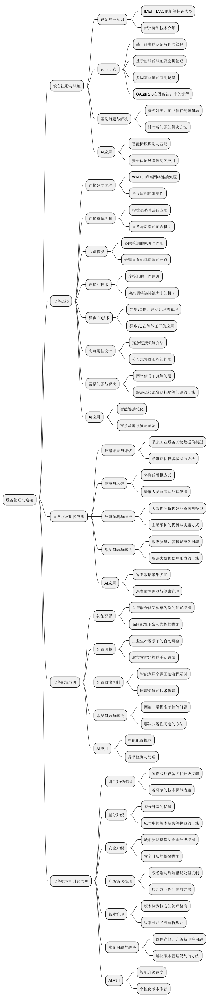

# 第三章：设备管理与连接

在物联网后端系统架构中，设备管理与连接是确保系统稳定运行、实现设备高效管控的核心要素。从设备接入网络时的身份认证，到运行期间的连接维护、状态监控，再到配置调整与版本升级，各环节紧密相连、缺一不可。本章将深入剖析设备管理与连接的各个层面，详细解读相关技术的应用原理、面临的挑战及应对策略，如多种设备唯一标识技术，基于证书、密钥、多因素等认证方式，连接建立、重试、心跳检测等机制，连接池、异步 I/O 技术，设备状态监控管理中的实时数据采集与大数据分析，设备配置管理的各个环节，设备版本和升级管理的全流程及差分升级、安全升级等手段。此外，随着技术的发展，AI 技术正逐渐融入设备管理与连接的各个环节，为其带来更多创新和优化的机遇。通过对上述内容的阐述，本章旨在为读者构建一个全面且深入的物联网后端设备管理与连接技术体系，帮助读者理解其在物联网系统中的关键地位与作用机制。

## 3\.1 设备注册与认证

### （1）设备唯一标识

在物联网的广阔世界里，每一个设备都需要一个独一无二的标识，这对于后端系统精准识别和有效管理设备至关重要。不同类型的设备唯一标识各具特点，在物联网生态中发挥着关键作用。

IMEI（International Mobile Equipment Identity）作为移动设备的国际身份码，常用于具备蜂窝网络连接功能的物联网设备，像智能车载终端以及远程监控的移动传感器等。它由 15 位数字组成，前 8 位为设备型号核准号码，用于区分不同的设备型号；中间 6 位是生产厂商的设备序列号，能够标识同一型号下的不同个体；最后 1 位是校验码，保障整个 IMEI 码的准确性。在设备生产阶段，厂商依据国际标准分配规则，为每台设备赋予唯一的 IMEI，该码会被烧录进设备硬件，如同设备与生俱来的 “基因标识”。当后端系统进行设备接入时，首先会读取 IMEI，并与数据库中已注册的设备信息进行比对，以此核实设备的合法性，防止非法设备混入网络。为进一步保障 IMEI 的安全性，可采用加密存储和传输的方式。在设备端，将 IMEI 存储于安全芯片中，防止被非法读取；在数据传输过程中，使用 SSL/TLS 等加密协议对携带 IMEI 的数据包进行加密，避免在网络传输中被窃取或篡改。

MAC 地址（Media Access Control Address）广泛应用于各类具备以太网或 Wi\-Fi 连接能力的物联网设备，例如智能家居中的智能音箱、智能灯泡等。MAC 地址是一个 48 位或 64 位的标识符，通常以十六进制表示。IEEE（电气与电子工程师协会）统一将其分配给设备制造商，制造商再为每台设备分配唯一的 MAC 地址。以智能家居场景为例，当智能灯泡接入家庭 Wi\-Fi 网络并尝试连接后端系统时，后端系统会获取灯泡的 MAC 地址，并在本地设备管理表中查询匹配记录，以此确认是否为已授权设备。MAC 地址的优势在于其全球唯一性与稳定性，在局域网环境下，是设备识别的重要依据。不过，由于其基于硬件，在一些特殊情况下，如设备网卡更换，可能需要额外的重新注册或身份验证步骤。

随着物联网技术的不断发展，一些新兴的标识技术也应运而生。基于区块链的设备标识，利用区块链的分布式账本特性，为设备生成不可篡改、全球唯一的数字身份。这种标识不仅具备唯一性，还增强了安全性与可信度，尤其适用于对数据安全要求极高、设备来源追溯严格的物联网应用，比如医疗物联网中的植入式医疗设备、金融物联网中的自助交易终端等。

设备序列号（Serial Number）是由设备制造商为每一台设备分配的唯一标识符，一般由数字、字母或它们的组合构成。其编码规则往往包含设备型号、生产日期、生产批次等信息。在工业物联网领域，工厂中的自动化设备，如工业机器人、PLC（可编程逻辑控制器）等，都凭借设备序列号进行资产管理。企业通过序列号记录设备的采购日期、安装位置、维修历史等信息，便于设备的维护和管理。在设备接入后端系统时，后端系统依据序列号在设备管理数据库中查找对应的设备配置文件、权限设置等信息，实现对设备的识别与管理。

UDID（Unique Device Identifier）主要用于苹果生态系统中的设备，是苹果公司用于唯一标识 iOS 设备（如 iPhone、iPad 等）的字符串。它由 40 个字符组成，通过设备的硬件和软件信息生成，对每一台 iOS 设备而言都独一无二。在苹果相关的物联网应用场景中，例如使用苹果 HomeKit 框架控制智能家居设备，UDID 可用于识别和认证连接到 iOS 设备的物联网设备。开发者借助 UDID 确保只有授权的设备能够与 iOS 应用进行通信，保障用户数据安全和设备控制的准确性。

EUI \- 64（Extended Unique Identifier \- 64）是一种 64 位的唯一标识符，常用于基于 IPv6 协议的网络设备标识，可通过 MAC 地址等其他标识符转换而来。在 IPv6 环境下的物联网设备标识中，EUI \- 64 发挥着重要作用。随着物联网设备数量的迅猛增长，IPv6 协议为每个设备提供了充足的 IP 地址空间，EUI \- 64 作为物联网设备在 IPv6 网络中的唯一身份标识，实现了设备的全球唯一标识和互联互通。在大规模的智能城市物联网项目中，各种传感器、智能交通设备等通过 EUI \- 64 进行网络配置和管理，确保设备在不同网络区域或与多个网络服务交互时，身份的一致性和唯一性，方便设备进行数据传输和网络通信。

在一些多媒体物联网设备中，如智能摄像头、智能显示屏等，数字水印标识成为一种独特的设备标识方式。数字水印是将特定信息（如设备序列号、设备身份码等）嵌入到多媒体数据（如图像、视频）中的技术。这些水印信息可以是不可见的，也可以是可见的（如在图像角落添加微小的设备编号标记）。当多媒体数据从物联网设备传输到后端系统时，后端系统通过提取水印信息来识别设备。这种方式不仅用于设备识别，还可验证数据的来源和完整性。例如，在安防监控物联网系统中，智能摄像头拍摄的视频带有数字水印标识，后端监控系统在接收视频时，通过提取水印确认视频由合法的摄像头拍摄，且未被篡改，同时识别出具体的摄像头。

许多物联网设备的芯片都有自身唯一的芯片 ID。该芯片 ID 在芯片制造过程中生成，具有全球唯一性。对于一些对体积和功耗要求极高的物联网设备，如可穿戴设备中的智能健康监测芯片、环境监测的微型传感器芯片等，芯片 ID 可作为设备的主要标识或者辅助标识。后端系统通过读取芯片 ID 来识别设备，并根据芯片 ID 配置设备的工作参数、通信协议等。同时，芯片 ID 也可用于设备的溯源，在出现安全问题或者质量问题时，能够快速定位到芯片的生产批次和制造商，便于进行有效的管理和控制。

### （2）基于证书的认证

基于证书的认证方式宛如一座坚固的数字堡垒，为物联网设备接入筑牢安全防线。其核心依托于公钥基础设施（PKI，Public Key Infrastructure），首先是证书颁发机构（CA，Certificate Authority）登场，它如同网络世界的“公证人”，具有极高的公信力。CA 机构使用自己的私钥对设备的公钥及相关身份信息（如设备名称、型号、制造商等）进行数字签名，生成数字证书。在智能工厂场景中，工业机器人要接入工厂的生产管理后端系统，设备制造商在出厂前向权威 CA 机构申请数字证书，将机器人的公钥、身份信息提交审核，审核通过后获取包含数字签名的证书。

当设备接入后端系统时，后端系统利用 CA 机构预先内置的公钥，对设备提交的证书进行验证。它检查证书的签名是否有效，即确认证书是否由信任的 CA 机构颁发，以及证书中的信息是否与设备实际情况相符，如设备标识、型号等。若验证通过，后端系统获取证书中的公钥，用于后续与设备的加密通信。例如，在智能电网中，电表通过基于证书的认证接入后端电费计量与管理系统，确保只有合法认证的电表数据才能被系统接收与处理，有效防止了数据篡改与非法电表接入，保障电力数据的真实性与可靠性。

证书的有效期管理是基于证书认证的关键环节。一般证书都设定有有效期，临近过期时，设备需提前向 CA 机构申请证书更新。后端系统在证书验证过程中，也会检查有效期，拒绝过期证书的接入请求。同时，一旦设备出现安全问题或需要撤销接入权限，CA 机构可依据相关流程吊销证书，后端系统实时同步吊销信息，将对应设备列入黑名单，杜绝风险设备再次接入，全方位维护物联网网络安全环境。

### （3）基于密钥的认证

基于密钥的认证仿若一把精巧的数字钥匙，为物联网设备开启通往后端系统的安全之门。这种方式预先在设备与后端系统之间共享一个密钥，通常在设备出厂前或首次配置时设定。以智能门锁为例，门锁与对应的智能家居后端控制系统共享一个对称密钥，门锁在向后端发送状态信息（如开关锁状态、电量信息等）或接收控制指令（如远程开锁指令）时，使用共享密钥对数据进行加密处理。后端系统收到数据后，利用相同密钥解密，获取原始信息，验证数据完整性与来源合法性。

对称密钥加密算法，如 AES（Advanced Encryption Standard），因其加密和解密速度快、计算资源消耗低，在资源受限的物联网设备中广泛应用。在智能物流的货物追踪标签中，标签内置小型加密芯片，存储与后端系统共享的对称密钥，定时将货物位置、温度、湿度等数据加密后传输，后端系统快速解密，实现对物流运输过程的实时监控，确保货物安全与运输质量。

然而，对称密钥管理存在挑战，一旦密钥泄露，整个通信安全将受到威胁。因此，密钥的更新机制至关重要。定期更新密钥是常见策略，后端系统与设备按照预定时间间隔或触发条件（如设备重启、检测到异常通信行为），同步更新密钥，新密钥通过安全的带外方式（如初始配置时的有线连接、设备专属的安全芯片通道）预先共享，确保密钥更换过程安全可靠，持续守护物联网设备与后端系统间的通信安全。

### （4）多因素认证

多因素认证为物联网设备接入打造了层层设防的安全护盾，在对安全性要求严苛的场景中发挥关键作用。它结合多种不同类型的认证要素，从多个维度核实设备身份。以金融物联网中的 ATM 自助存取款机为例，除了传统的设备密码验证（基于密钥的一种简单形式），还增加了地理位置验证与生物特征识别。地理位置验证借助 GPS 或基站定位技术，确保设备接入时处于合法的地理位置范围，如银行网点周边区域，防止设备被盗用后异地非法接入；生物特征识别则通过内置指纹识别或虹膜识别模块，采集操作人员的生物特征信息，与预先注册的合法用户特征比对，进一步确认操作人员身份合法性。

在医疗物联网领域，对于远程医疗设备（如可穿戴式心电监测仪）接入医院后端诊疗系统，同样采用多因素认证。设备本身具有唯一的设备 ID（类似 IMEI 或 MAC 地址）作为第一重身份标识，患者在使用设备时输入个人身份密码作为第二重验证，同时，设备通过内置的 SIM 卡获取基站定位信息，确保设备在患者授权使用区域内（如家庭住址附近）使用，三重保障确保医疗数据的采集、传输安全可靠，避免医疗信息泄露风险，为远程医疗服务保驾护航。

多因素认证的优势在于极大提高了非法入侵的难度，即便某个单一因素泄露或被破解，攻击者仍需突破其他因素才能成功接入。在不同物联网场景下，需在提升安全性和控制实施复杂度之间取得平衡。在低成本智能家居场景中，可采用设备 ID 与简单密码相结合的方式，既能满足基本安全需求，又不会增加过多成本和用户操作复杂度；而在金融、医疗等对安全要求极高的领域，则采用更复杂的多因素组合，如设备 ID、密码、生物特征识别、地理位置验证等。

### （5）OAuth 2\.0 在设备认证中的应用

OAuth 2\.0 作为一种广泛应用于互联网领域的开放授权协议，在物联网设备认证中架起了一座安全桥梁，实现了安全与便捷的巧妙融合。以智能家居生态系统为例，用户家中的智能家电品牌多样，可能来自不同制造商，当这些设备要接入统一的智能家居中控后端系统时，OAuth 2\.0 发挥关键作用。

首先是授权流程，设备制造商作为授权服务提供方，在用户购买设备并首次配置时，引导用户通过中控系统向制造商的授权服务器发起授权请求。用户在中控系统界面确认授权，中控系统获得一个临时的授权码。中控系统凭借授权码向制造商的授权服务器换取访问令牌（Access Token），此令牌包含了设备接入中控系统的权限范围、有效期等关键信息。例如，智能摄像头制造商授权中控系统获取摄像头的视频流数据权限、控制摄像头拍摄角度的权限等，都通过访问令牌精细界定。

设备接入中控系统时，携带访问令牌，中控系统依据令牌中的信息验证设备权限，决定是否允许设备接入及执行相应操作。在令牌有效期内，设备可顺畅与中控系统交互，一旦令牌过期，中控系统拒绝设备请求，设备需重新发起授权流程获取新令牌。这种基于令牌的授权机制，既保障了设备接入的安全性，防止未经授权的设备接入，又简化了用户操作，用户无需为每个设备单独管理复杂的认证信息，通过一次授权即可实现多设备便捷接入智能家居生态，提升用户体验，推动智能家居产业蓬勃发展。为保障 OAuth 2\.0 授权过程的安全，可对授权码和访问令牌采用加密存储和传输技术，如使用 HTTPS 协议进行传输，确保数据在网络传输过程中的安全性。在令牌验证环节，除了验证令牌的有效性和权限范围，还增加对令牌使用频率、使用 IP 地址等信息的监测，一旦发现异常使用行为，立即吊销令牌并通知用户，防止令牌被盗用带来的安全风险。

### （6）设备证书的管理流程

设备证书的管理贯穿物联网设备的全生命周期，是保障设备接入安全的持续护航舰。证书颁发机构（CA）作为源头，依据严格的审核流程为设备颁发证书，涵盖设备制造商信息核实、设备型号认证、公钥审核等多环节，确保每一张证书真实可靠。

在证书更新阶段，随着证书有效期临近（通常为 1 \- 3 年，依据不同行业与应用场景而定），设备提前启动更新程序。设备制造商向 CA 机构提交更新申请，附上设备最新状态信息（如软件版本升级、硬件变更情况），CA 机构审核通过后重新颁发新证书。后端系统同步更新证书信任列表，确保设备持续正常接入。以智能交通系统中的车载终端为例，车辆定期保养升级软件系统时，车载终端自动检测证书有效期，若需更新，通过车辆内置的通信模块向制造商及 CA 机构发起申请，在下次车辆启动接入交通管理后端系统时，使用新证书完成认证，保障车辆数据实时准确上传，维持交通系统稳定运行。

证书吊销环节同样关键，一旦设备出现安全漏洞、被盗用或因业务变更需终止接入权限，CA 机构依据设备所有者或监管部门通知，立即吊销证书。后端系统实时接收吊销信息，将对应设备列入黑名单，并通知网络边界防护设备（如防火墙）阻断该设备的接入尝试。在工业物联网场景中，若某台工业控制器被检测出感染恶意软件，制造商迅速通知 CA 机构吊销其证书，后端系统即刻隔离该设备，防止恶意软件扩散至整个工业网络，守护生产系统安全。同时，为便于追溯与审计，整个证书管理流程都有详细记录，包括证书颁发、更新、吊销的时间、原因、操作人员等信息，为物联网安全运维提供坚实依据。

### （7）常见问题和解决方法

**\- 标识冲突与误识别**：尽管各类设备唯一标识设计初衷是保证唯一性，但在实际应用中，仍可能因生产环节失误、数据录入错误等原因导致标识冲突。例如，在设备生产过程中，IMEI 码烧录环节出现故障，可能导致两台设备具有相同的 IMEI 码，这会使后端系统在识别设备时产生混淆。解决办法是在设备生产完成后，增加多轮严格的标识唯一性校验流程，利用数据库的唯一性约束机制，在设备注册到后端系统时进行二次验证，一旦发现冲突，立即追溯问题源头并重新分配标识。对于误识别问题，如 MAC 地址因网络环境干扰导致读取错误，可采用冗余读取技术，多次读取设备标识并进行比对，确保标识的准确性。

**\- 证书信任链断裂**：在基于证书的认证中，若证书颁发机构（CA）自身受到攻击或其私钥泄露，会导致整个证书信任链断裂。例如，黑客通过攻击 CA 机构，伪造了一批非法设备的证书，后端系统可能会误将这些非法设备认证为合法设备。为解决此问题，需建立定期的 CA 机构安全审计机制，对 CA 机构的私钥管理、证书颁发流程等进行严格审查。同时，采用证书撤销列表（CRL）和在线证书状态协议（OCSP），后端系统实时查询证书的有效性，一旦发现证书存在问题，立即阻止设备接入。

**\- 密钥管理难题**：基于密钥的认证中，密钥的存储、传输和更新都面临安全风险。例如，在物联网设备通过网络传输更新密钥时，可能被黑客截获，导致密钥泄露。解决措施包括采用加密存储技术，将密钥存储在设备的安全芯片中，防止密钥被非法读取。在密钥传输过程中，使用 SSL/TLS 等加密协议，确保密钥传输的安全性。对于密钥更新，除了采用安全的带外方式，还可以引入密钥加密密钥（KEK），对更新的密钥进行二次加密，提高密钥管理的安全性。

**\- 多因素认证的兼容性问题**：在实施多因素认证时，不同认证因素所依赖的技术和设备可能存在兼容性问题。例如，在医疗物联网中，远程医疗设备的生物特征识别模块与后端诊疗系统的兼容性不佳，可能导致认证失败。为解决这一问题，在物联网应用开发阶段，需要进行充分的兼容性测试，确保不同认证因素的设备和系统能够协同工作。同时，建立统一的认证接口标准，便于不同设备和系统之间的对接。

**\- OAuth 2\.0 授权风险**：在 OAuth 2\.0 授权过程中，可能存在授权码泄露、访问令牌被盗用等风险。例如，用户在智能家居中控系统上授权设备时，授权码被黑客通过网络嗅探获取，黑客可以利用授权码获取访问令牌，进而非法控制设备。解决办法是对授权码和访问令牌进行加密存储和传输，同时采用短有效期的令牌策略，减少令牌被盗用后的风险。另外，增加对令牌使用的监控机制，一旦发现异常的令牌使用行为，立即吊销令牌并通知用户。

**\- 证书管理的效率问题**：在大规模物联网设备环境中，证书的颁发、更新和吊销等管理操作的效率至关重要。例如，在智能交通系统中，大量车载终端需要同时进行证书更新，可能导致 CA 机构和后端系统的处理压力过大。为提高管理效率，可采用分布式的 CA 架构，将证书颁发和管理任务分散到多个节点进行处理。同时，优化证书管理的算法和流程，例如采用批量处理技术，对多个设备的证书更新请求进行集中处理，提高处理速度。

### （8）AI应用的可能性

**\- 智能标识识别与匹配**：AI 可以利用图像识别、语音识别等技术，对设备的标识进行智能识别。例如，对于带有数字水印标识的智能摄像头，AI 可以自动识别图像中的水印信息，快速准确地获取设备标识，提高设备识别的效率和准确性。在设备接入后端系统时，AI 可以通过机器学习算法，对设备的标识和历史接入数据进行分析，快速匹配设备的身份信息，简化认证流程。

**\- 安全认证风险预测**：借助机器学习算法，AI 可以对设备的认证过程进行实时监测和风险预测。例如，AI 可以分析设备的接入请求频率、接入地理位置、认证失败次数等数据，预测设备是否存在被攻击的风险。如果发现设备的认证行为异常，AI 可以及时发出预警，并采取相应的防护措施，如暂时阻断设备接入、要求重新认证等。

**\- 智能密钥管理**：AI 可以优化密钥的生成、存储和更新策略。例如，通过机器学习算法，根据设备的使用频率、所处环境的安全等级等因素，动态调整密钥的更新周期。在密钥生成方面，AI 可以生成更复杂、更安全的密钥，提高密钥的破解难度。同时，AI 可以对密钥的存储进行加密管理，确保密钥的安全性。

**\- 多因素认证优化**：AI 可以根据用户的使用习惯和设备的运行状态，智能调整多因素认证的组合和顺序。例如，对于经常在固定地点使用的物联网设备，AI 可以适当降低地理位置验证的频率，提高用户体验；而对于涉及敏感数据的设备操作，AI 可以增加生物特征识别等更严格的认证因素。此外，AI 可以对多因素认证的结果进行智能分析，快速判断认证是否通过，提高认证效率。

**\- OAuth 2\.0 授权优化**：在 OAuth 2\.0 授权过程中，AI 可以根据用户的历史授权行为和设备的权限需求，为用户提供智能授权建议。例如，当用户授权智能家电接入智能家居中控系统时，AI 可以根据用户的使用习惯和设备的功能，自动勾选合理的权限范围，减少用户的操作复杂度。同时，AI 可以对授权过程进行实时监控，防止授权码和访问令牌被盗用。

**\- 证书管理智能化**：AI 可以对证书的颁发、更新和吊销等管理流程进行智能化处理。例如，在证书颁发环节，AI 可以对设备制造商提交的信息进行自动审核，提高审核效率和准确性。在证书更新阶段，AI 可以根据设备的运行状态和证书有效期，提前提醒设备进行证书更新。在证书吊销环节，AI 可以根据安全监测数据，自动触发证书吊销流程，提高证书管理的响应速度。

## 3\.2 设备连接

### （1）连接建立过程

设备与后端系统间的连接建立，犹如一场精心编排的 “握手” 仪式，每一步都关乎通信的成败。当物联网设备初次上电或从休眠状态唤醒，试图接入后端系统时，首先要依据预先配置的网络参数进行网络初始化。以支持 Wi\-Fi 连接的智能家居设备为例，设备启动后，会在指定频段搜索可用的 Wi\-Fi 热点，找到用户家中路由器所广播的 SSID（Service Set Identifier），然后依据存储的密码信息，向路由器发送连接请求。这个过程涉及复杂的 Wi\-Fi 协议交互，包括 802\.11 标准中的认证、关联步骤，设备需与路由器交换一系列信息，证明自身合法性并协商通信参数，如数据传输速率、加密方式等，只有完成这些步骤，才能成功接入本地网络，为后续与后端系统通信奠定基础。

对于采用蜂窝网络（4G/5G）连接的物联网设备，如远程监控的工业传感器，其连接建立过程则依托运营商网络基础设施。设备内置的 SIM 卡提供身份识别与网络接入凭证，开机后，设备自动向附近基站发送附着请求，基站将请求转发至核心网，核心网通过鉴权中心验证设备 SIM 卡的合法性，包括检查 IMSI（International Mobile Subscriber Identity）是否有效、是否欠费停机等。一旦鉴权通过，核心网为设备分配临时的 IP 地址，设备便可正式接入蜂窝网络，开启数据传输之旅，实现与后端系统跨越广域的连接。

在连接建立过程中，协议适配至关重要。不同物联网设备可能支持各异的通信协议，后端系统需具备强大的协议转换能力，以兼容各类设备接入。例如，有些老旧设备仅支持简单的串口通信协议，后端系统需通过串口服务器将串口数据转换为 TCP/IP 协议数据，再进行后续处理；而对于新兴的低功耗物联网设备，可能采用 CoAP 或 MQTT 协议，后端系统要部署相应的代理服务器或网关，实现协议解析与转换，确保设备与后端系统顺畅 “对话”。

### （2）连接重试机制

在复杂多变的物联网环境中，连接中断时有发生，此时连接重试机制就如同一张坚韧的安全网，确保设备不轻易 “掉线”。当设备检测到与后端系统的连接丢失，如 Wi\-Fi 信号中断、蜂窝网络信号弱无法通信时，会立即启动重试逻辑。重试策略通常遵循指数退避算法，初次重试间隔较短，一般设为几秒，若连续失败，则后续重试间隔逐渐延长，避免因频繁重试加剧网络拥塞。

以智能穿戴设备为例，若用户进入电梯等信号屏蔽区域，设备与手机端后端系统的蓝牙连接中断，设备会在 5 秒后首次尝试重连，若失败，下一次重试间隔延长至 10 秒、20 秒，依此类推，直至重连成功或达到预设的最大重试次数（如 10 次）。同时，在重试过程中，设备会动态调整通信参数，如降低蓝牙传输功率以节省电量，或切换至备用频段（若支持多频段）尝试连接，提高重连成功率。

后端系统同样具备相应的配合机制，当接收到设备的重连请求时，快速验证设备身份，跳过不必要的重复鉴权步骤（前提是设备已在首次连接时完成完整认证），加速重连流程，减少设备等待时间，确保数据传输的连续性，为用户提供无缝的物联网体验。

### （3）心跳检测

心跳检测是确保设备与后端系统连接持续 “鲜活” 的关键技术，如同人体的脉搏监测。设备在连接建立后，按一定时间间隔（如 30 秒、60 秒，依设备类型与应用场景而定）向后端系统发送心跳包，心跳包通常是一个极小的数据包，仅包含设备标识等基本信息，用于告知后端系统自身仍处于正常运行且连接稳定状态。

在智能农业大棚监控系统中，众多温湿度传感器、光照传感器等设备持续向后端服务器发送心跳包。后端系统设置专门的心跳监测模块，若在预设超时时间内（如心跳间隔的 2 \- 3 倍）未收到某设备的心跳包，便判定该设备连接异常，可能出现故障或网络中断。此时，后端系统立即启动预警机制，一方面通知运维人员排查问题，可能是传感器电池耗尽、田间网络线路损坏等；另一方面，尝试主动与设备重新建立连接，如向设备发送复位指令，要求设备重启连接流程，争取快速恢复数据采集，保障农业生产监控不出现 “盲区”。

心跳检测间隔的设置需精妙权衡，间隔过短会增加设备功耗与网络带宽消耗，尤其对于电池供电的物联网设备不利；间隔过长则难以及时发现连接问题，可能导致数据丢失或故障发现延迟，影响业务正常运行，开发者需依据具体应用需求、设备性能与网络条件精准拿捏。

### （4）高并发设备连接下的连接池技术

随着物联网规模膨胀，后端系统面临海量设备同时连接的挑战，连接池技术应运而生，成为高效管理连接的 “调度中枢”。连接池本质是一个预先创建并维护的连接集合，位于后端系统内存中，犹如一个装满 “连接资源” 的工具箱。当设备请求接入时，后端系统并非每次都新建连接，而是从连接池中获取已有的空闲连接分配给设备，避免频繁创建与销毁连接带来的性能开销。

以大型智能物流仓储中心为例，场内成千上万个货物追踪标签、环境监测传感器、自动化搬运设备等需同时与后端管理系统交互。连接池初始配置时，依据系统预估的并发连接数，创建一定数量的数据库连接、网络连接等资源，如创建 500 个面向数据库查询的连接，300 个用于与前端应用交互的网络连接。设备接入时，连接池管理模块依据连接请求类型，快速分配合适空闲连接，设备完成数据交互后，连接并不立即关闭，而是归还连接池，清理连接状态，等待下次复用。

连接池还具备动态调整能力，能依据实时负载情况，如当前连接使用率、等待连接队列长度，自动扩容或缩容。在物流高峰时段，货物进出频繁，设备连接需求激增，连接池检测到连接紧张，自动触发扩容机制，新增一批连接资源，确保设备连接无阻塞；业务空闲期，则回收冗余连接，释放系统资源，维持高效运行，保障智能物流系统在高并发场景下稳健运行。

### （5）异步 I/O 提升设备状态监控并发处理能力

在物联网设备状态监控领域，异步 I/O 技术犹如为后端系统装上了 “高速并行的眼线”，大幅提升并发处理能力。传统同步 I/O 模式下，后端系统在处理设备状态更新请求时，需依次等待每个请求完成 I/O 操作（如读取设备数据、写入数据库）后，才能处理下一个请求，如同单车道行车，效率受限。

而异步 I/O 则允许后端系统在发起一个 I/O 操作后，无需等待其完成，即可继续处理其他任务，多个 I/O 操作并行推进。以智能工厂生产线监控为例，成百上千个传感器实时采集设备运行参数（如温度、压力、转速等）并上报后端系统，后端系统利用异步 I/O，同时接收多个传感器数据，将数据写入缓存或数据库的操作异步执行，主线程继续处理新到达的设备状态数据，避免阻塞。

例如，采用 Node\.js 构建的后端系统，借助其异步非阻塞 I/O 模型，搭配事件驱动编程范式，当设备状态数据到达时，触发相应事件处理函数，函数内快速将数据放入消息队列，由专门的工作线程负责后续持久化操作，主线程持续监听新事件，确保在高并发设备状态监控场景下，数据处理及时、高效，生产线故障能被迅速察觉与处理，保障生产连续性。

### （6）设备连接的高可用性

为确保物联网业务不受连接故障干扰，设备连接的高可用性设计至关重要，构建起永不中断的通信链路。冗余连接机制是核心手段之一，常见的有双网络接口冗余，如一些关键工业物联网设备配备有线以太网接口与 Wi\-Fi 接口，正常情况下优先使用有线连接，因其稳定性高、带宽足；一旦有线网络出现故障（如网线被切断、交换机故障），设备自动切换至 Wi\-Fi 连接，确保数据传输不中断，后端系统同样具备双网络接入适配能力，无缝接收来自不同网络接口的设备数据。

在智能交通系统中，路边的交通监控摄像头采用多路径传输冗余，除了主用的光纤网络连接后端指挥中心，还配备备用的 4G/5G 蜂窝网络链路。日常通过光纤高速传输高清视频流，当遭遇自然灾害（如地震导致光纤损坏）或人为破坏时，摄像头自动切换至蜂窝网络，虽然带宽可能受限，但仍能保障关键视频画面回传，为交通疏导、事故处理提供实时依据，避免因连接中断造成交通管控 “失明”。

此外，后端系统还通过分布式集群架构提升连接高可用性。将设备连接服务分散到多个节点处理，如采用负载均衡技术，将海量设备连接请求均衡分配至多个后端服务器实例，单个服务器故障时，负载均衡器自动将其流量转移至其他正常服务器，确保设备连接不受局部故障影响，全方位保障物联网设备与后端系统通信的可靠性与连续性。

### （7）常见问题和解决方法

**\- 网络信号干扰问题**：无论是 Wi\-Fi、蓝牙还是蜂窝网络，在实际使用中都可能受到各种信号干扰，导致连接不稳定或无法建立。例如，在智能家居环境中，多个无线设备同时工作，可能产生 Wi\-Fi 频段干扰，使得智能家居设备无法稳定连接路由器。解决办法是通过信道扫描工具，检测当前环境中各频段的信号强度和干扰情况，动态调整设备的 Wi\-Fi 信道，避开干扰频段。对于蓝牙设备，可采用跳频技术，在多个频段间快速切换，减少干扰影响。在蜂窝网络中，设备可根据基站信号质量反馈，动态调整发射功率和调制方式，提高抗干扰能力。

**\- 设备 IP 地址冲突**：在局域网环境中，当多个设备同时接入网络时，可能会出现 IP 地址冲突的情况，导致设备无法正常通信。例如，智能工厂中多台自动化设备同时启动，可能因 IP 地址分配问题发生冲突。解决此问题，可采用动态主机配置协议（DHCP）进行 IP 地址分配，确保每个设备都能获得唯一的、可用的 IP 地址。同时，定期对网络中的 IP 地址使用情况进行扫描和清理，及时发现并解决潜在的 IP 地址冲突问题。

**\- 连接池资源耗尽**：在高并发场景下，连接池的连接资源可能会被耗尽，导致新的设备连接请求无法得到及时处理。如智能物流仓储中心在物流高峰时段，连接池的连接资源被大量占用。为解决这一问题，一方面可进一步优化连接池的动态调整策略，根据历史数据和实时负载情况，更精准地预测连接需求，提前进行连接资源的扩容。另一方面，可采用连接复用和缓存技术，对一些短时间内频繁使用的连接进行复用，减少连接创建和销毁的开销，提高连接池的资源利用率。

**\- 异步 I/O 数据一致性问题**：在异步 I/O 操作中，由于多个 I/O 操作并行进行，可能会出现数据一致性问题。例如，在智能工厂中，多个传感器同时上报数据，后端系统在异步处理过程中，可能因为数据写入顺序不当导致数据库中数据不一致。解决措施是引入事务管理机制，对相关的异步 I/O 操作进行事务封装，确保在一个事务内的数据操作要么全部成功，要么全部失败。同时，采用数据锁机制，对关键数据的读写操作进行加锁，避免并发操作导致的数据不一致。

**\- 高可用性切换延迟**：在冗余连接机制和分布式集群架构中，当主连接或主服务器出现故障时，切换到备用连接或服务器的过程可能存在延迟，影响业务连续性。如智能交通系统中的交通监控摄像头在光纤网络故障切换到蜂窝网络时，可能出现短暂的数据传输中断。为降低切换延迟，可采用预连接技术，在主连接正常工作时，预先建立备用连接的部分链路，当主连接故障时，能快速完成切换。同时，优化后端系统的故障检测和切换算法，提高故障检测的灵敏度和切换的速度。

### （8）AI应用的可能性

**\- 智能连接优化**：AI 可以根据设备的位置、环境因素以及网络状态，智能选择最优的连接方式和参数。例如，对于智能穿戴设备，AI 可以实时监测用户所处的环境，如室内、室外、电梯等，结合不同环境下的网络信号强度和稳定性，自动切换 Wi\-Fi、蓝牙或蜂窝网络连接，并调整相应的连接参数，如 Wi\-Fi 的信道、蓝牙的传输功率等，以确保连接的稳定性和高效性。

**\- 智能心跳检测调整**：AI 能够根据设备的实时运行状态和网络情况，动态调整心跳检测间隔。对于处于繁忙业务时段或网络波动较大的设备，AI 可以适当缩短心跳检测间隔，以便及时发现连接问题；而对于处于稳定运行状态且网络良好的设备，AI 可以延长心跳检测间隔，降低设备功耗和网络带宽消耗。通过这种方式，实现心跳检测的智能化管理，提高设备的整体性能。

**\- 连接故障预测与预防**：利用机器学习算法，AI 可以对设备的连接历史数据、网络状态数据以及设备自身的运行数据进行分析，预测可能出现的连接故障。例如，通过分析蜂窝网络设备的信号强度变化趋势、基站负载情况以及设备的移动轨迹，AI 可以提前预测设备可能出现的信号中断情况，并及时采取措施，如提前切换到备用网络或调整设备位置，避免连接故障的发生。

**\- 智能连接池管理**：AI 可以优化连接池的资源分配和动态调整策略。通过对设备连接请求的实时监测和分析，AI 可以预测未来一段时间内的连接需求，提前调整连接池的大小，避免连接资源的浪费或不足。同时，AI 可以根据设备的类型、业务优先级等因素，智能分配连接池中的连接资源，提高连接池的使用效率。

**\- 高可用性智能决策**：在设备连接的高可用性设计中，AI 可以参与冗余连接的切换决策和分布式集群的负载均衡决策。当主连接或主服务器出现故障时，AI 可以综合考虑备用连接的带宽、延迟、稳定性以及分布式集群中各服务器的负载情况，快速做出最优的切换决策，确保设备连接的快速恢复和业务的连续性。

## 3\.3 设备状态监控管理

设备状态监控管理是物联网系统高效运转的核心保障，对提升系统稳定性、降低运维成本、保障业务连续性举足轻重。

### （1）实时数据采集与精准状态评估

设备状态监控依托实时、全面的数据采集。以工业制造场景中的智能机床为例，传感器实时捕捉机床的温度、振动、转速等关键数据。温度反映设备运行时的发热情况，过高温度可能预示着部件磨损加剧或冷却系统故障；振动数据能精准定位机械部件的松动或失衡；转速则体现机床是否按设定参数运行。通过对这些数据的综合分析，系统可精准判断设备工作状态，从正常运行、轻度异常到严重故障，划分细致状态层级，为后续运维决策提供坚实依据。

### （2）异常警报与高效运维响应

当设备状态偏离正常范围，异常警报机制迅速启动。在智能电网中，一旦电力变压器的油温过高、电流过载，系统立即向运维人员发送警报。警报方式多样，包括鸣笛、闪灯、短信、社交软件消息以及运维平台的弹窗提醒。运维人员收到警报后，借助设备管理系统的定位功能，快速锁定故障设备位置。同时，系统自动调取设备历史数据和维护记录，辅助运维人员快速诊断故障原因，制定维修方案，极大缩短故障处理时间，保障电网稳定供电。

### （3）大数据驱动的故障预测与主动维护

大数据分析在设备状态监控中发挥着关键的故障预测作用。在智能交通领域，通过收集大量车辆的行驶里程、零部件使用时长、故障发生频率等数据，运用机器学习算法构建故障预测模型。例如，根据车辆发动机的运行数据和历史故障记录，预测发动机何时可能出现故障。基于预测结果，运维团队提前储备零部件，规划维护时间，从被动维修转变为主动维护。这种方式不仅降低设备突发故障带来的运营风险，还能优化维护计划，减少不必要的维护工作，降低总体运维成本。

设备状态监控管理通过实时数据采集、精准状态评估、及时警报以及大数据驱动的故障预测，构建起一个完整、高效的闭环管理体系，全方位提升物联网系统的可靠性与稳定性，为各行业数字化转型筑牢基础。

### （4）常见问题和解决方法

**\- 数据质量问题**：在实时数据采集过程中，传感器可能出现故障、精度漂移等情况，导致采集的数据不准确或缺失。例如，智能机床的温度传感器故障，使得采集的温度数据异常，从而影响对设备状态的判断。解决方法是定期对传感器进行校准和检测，采用冗余传感器设计，当一个传感器出现问题时，可依靠其他传感器数据进行补充。同时，建立数据清洗和修复机制，对异常数据进行识别和处理。

**\- 警报误报与漏报**：由于数据波动、算法不完善等原因，可能导致异常警报的误报或漏报。在智能电网中，如果警报系统对变压器油温的正常波动过于敏感，就会频繁发出误报，干扰运维工作；而算法缺陷可能导致真正的故障未被及时检测到，出现漏报。为解决这一问题，需要优化警报触发算法，结合机器学习算法对历史数据进行分析，设定合理的警报阈值。同时，引入多维度数据关联分析，只有当多个相关指标同时出现异常时才触发警报，提高警报的准确性。

**\- 大数据处理与存储压力**：随着设备数量的增加和数据采集频率的提高，大数据分析面临数据处理和存储的巨大压力。在智能交通领域，大量车辆的行驶数据不断产生，传统的数据处理和存储架构可能无法满足需求。可采用分布式计算和存储技术，如 Hadoop 分布式文件系统（HDFS）和 Spark 计算框架，对数据进行分布式存储和并行计算，提升处理能力。同时，采用数据压缩和归档技术，对历史数据进行合理存储，减少存储压力。

**\- 跨系统数据融合难题**：在复杂的物联网系统中，设备状态数据可能来自多个不同的子系统，数据格式和标准不统一，导致数据融合困难。例如，一个大型工厂的设备状态监控系统，涉及生产设备、能源管理系统等多个子系统的数据，不同系统的数据难以整合分析。解决措施是建立统一的数据标准和接口规范，对不同系统的数据进行标准化处理。利用数据集成工具，如 ETL（Extract、Transform、Load）工具，将分散的数据抽取、转换并加载到统一的数据仓库中，便于进行综合分析。

### （5）AI应用的可能性

**\- 智能数据采集优化**：AI 可以根据设备的运行状态和环境因素，动态调整数据采集策略。例如，对于智能机床，AI 通过分析机床的加工任务、刀具磨损情况等，自动调整传感器的数据采集频率。在加工复杂零件或刀具接近磨损极限时，提高数据采集频率，以便更精确地监测设备状态；而在正常加工阶段，适当降低采集频率，减少数据传输和处理压力。

**\- 智能警报分类与优先级排序**：借助自然语言处理和机器学习技术，AI 能够对警报信息进行智能分类和优先级排序。在智能电网中，当同时收到多个设备的警报时，AI 可以根据警报的严重程度、对电网稳定性的影响程度等因素，对警报进行分类和排序，帮助运维人员优先处理最紧急、最重要的故障，提高运维效率。

**\- 深度故障预测与健康管理**：AI 可以运用深度学习算法，对设备的多源数据进行深度挖掘和分析，实现更精准的故障预测和设备健康管理。例如，在智能交通领域，AI 不仅考虑车辆的行驶里程、零部件使用时长等常规数据，还能结合车辆的实时驾驶行为、路况信息等，构建更全面的故障预测模型。通过分析车辆在不同路况下的加速度、制动频率等数据，提前预测发动机、刹车系统等部件的潜在故障，为主动维护提供更可靠的依据。

**\- 智能运维决策支持**：AI 可以为运维人员提供智能决策支持。当设备出现故障或异常时，AI 根据设备的历史数据、当前状态以及维修案例库，快速生成多种可能的维修方案，并评估每种方案的维修成本、维修时间和成功率等指标，为运维人员提供决策参考。例如，在工业制造场景中，当智能机床出现故障时，AI 推荐最优的维修方案，帮助运维人员快速恢复设备正常运行。

## 3\.4 设备配置管理

### （1）初始配置的下发与生效

在设备正式投入运行前，初始配置的准确下发与快速生效是确保其稳定运行的根基。后端架构综合运用一系列技术手段，全方位保障这一过程的高效性与可靠性。

以智能仓储领域的自动化穿梭车为例，生产制造阶段厂商依据设备基础功能与常见应用场景需求，预设初始配置参数，即初步的 “出厂设置”。当穿梭车首次接入仓储管理网络，后端系统内的配置管理模块开始发挥关键作用。

配置管理模块深入剖析仓储管理系统的多样化需求，对穿梭车初始配置参数进行全面标准化处理。通过企业级服务总线（ESB），采用适配工业环境的以太网协议，与穿梭车控制系统搭建通信链路。ESB 作为核心枢纽，依据设备唯一标识，将符合特定工业协议（如 PROFINET 协议）格式的配置指令，准确推送至穿梭车。

穿梭车端采用基于模型驱动的架构（MDA）设计配置解析模块，凭借预定义的专业配置模型，迅速将接收到的指令转化为可直接执行的代码形式，无论是闪存存储区的参数更新，还是内存中的动态配置变更，都能确保穿梭车快速应用新配置，投入仓储货物搬运工作。

为保证配置下发的可靠性，引入消息队列（如 RabbitMQ）作为缓冲机制。若后端系统因高负载等无法及时处理配置下发任务，配置指令将暂存于消息队列，待系统资源空闲时，按先进先出原则依次传递给穿梭车。

### （2）配置调整的场景与实现

在丰富多样的实际应用场景中，设备配置调整是保障设备契合多变环境与业务需求、维持最佳运行效能的关键环节，方式包括系统自动响应的动态变更与管理人员基于后台的手动操作。

在工业生产场景下，生产流程变化、原材料特性差异等因素触发智能设备的配置调整需求。后端构建实时数据处理与配置决策架构，数据采集层通过分布式传感器网络采集设备运行参数等信息并传输至数据处理层。数据处理层利用大数据处理框架（如 Apache Flink），依据预测模型对海量数据深度实时分析，精准判断设备应适配的配置，相关模块借助适配的通信协议，与设备管理部分协同完成配置更新消息传递。

在城市安防监控系统中，管理人员依据不同时期治安重点、监控区域调整等，手动在操作后台对监控设备进行配置调整，如重大活动期间提高特定区域摄像头分辨率、调整监控范围与帧率等参数。

设备多采用可重构硬件架构结合软件定义无线电（SDR）技术，实现配置参数快速切换且不干扰当前任务。软件层面，依靠动态加载技术将新配置加载至运行时内存，利用内存映射文件机制稳定更新配置参数，促使新配置即刻生效。同时，采用双缓冲机制，在新配置完成加载并通过验证前，旧配置持续运行，保障系统稳定运行。

### （3）配置回滚机制

在各类设备运行过程中，配置回滚机制是保障系统稳定与可靠运行的关键防线。当设备配置出现异常，导致无法正常工作时，配置回滚机制能迅速将设备配置恢复到先前正常状态，减少因配置问题带来的不良影响。

以智能家居场景下的智能空调为例，后端系统采用分布式事务与数据一致性保障技术，实现高效可靠的配置回滚机制。配置管理服务与设备端通过双向可靠通信链路（如基于 HTTP/2 的长连接），协同维护配置历史记录。每次配置更新操作，后端数据库利用分布式事务确保配置数据、操作日志以及版本信息的一致性存储。

当智能空调运行状态异常，配置回滚协调器启动，依据分布式缓存（如 Redis）中的配置快照索引，快速定位到上一次正常运行的配置版本。通过反向的 HTTP PUT 方法，结合幂等性设计原则，确保回滚指令在网络波动或重复发送情况下，仅被设备端正确执行一次。

智能空调设备端基于状态机设计配置回滚流程，从当前异常状态逐步回退至稳定状态，每一步骤都严格校验还原的配置参数，确保制冷控制算法参数、风扇转速调控设置等关键配置精准恢复。

### （4）常见问题和解决方法

**\- 网络相关问题**：无论是初始配置下发、配置调整消息传递还是回滚指令传输，都面临网络延迟、丢包、信号不稳定等问题。如在复杂工业网络环境或网络信号不稳定区域，可能导致配置指令传输受阻或不完整。解决办法是采用可靠传输协议（如 TCP），结合网络监控与优化技术，实时监测网络状态，合理分配网络带宽；引入消息队列（如 Kafka）保证消息顺序性和持久性，为每条指令添加唯一标识和校验码，设备端校验，发现问题及时请求重发；必要时自动切换至备用网络链路。

**\- 数据准确性与完整性问题**：配置管理模块生成和处理配置数据时，可能因数据来源有误、处理逻辑漏洞等，导致配置数据不准确或不完整。例如仓储管理系统提供错误生产流程数据，使配置管理模块生成错误初始配置参数。对此，需建立严格数据校验机制，在数据输入、处理和输出各环节多次校验，同时对配置数据进行备份，以便及时恢复正确数据。在分布式环境下配置回滚时，为防止数据一致性问题，引入分布式锁机制，防止并发操作破坏数据一致性，利用数据校验和恢复算法定期检查完整性。

**\- 兼容性问题**：不同设备硬件批次差异、软件版本微调，或采用不同通信协议和配置格式，会导致在初始配置接收解析、配置调整交互以及配置回滚状态机执行时出现兼容性问题。例如不同批次自动化穿梭车对配置指令解析方式不同，新接入设备通信协议与现有后端系统不匹配。解决措施是在设备端设置兼容性适配层，依据设备硬件和软件信息对配置指令预处理；建立统一的设备接入适配层，转换和解析不同协议；在后端系统建立设备兼容性数据库，记录配置特点和回滚适配策略，为操作提供准确指导。

**\- 人工操作失误问题**：在城市安防监控系统等需人工手动调整配置的场景中，管理人员可能因疏忽或对系统不熟悉，输入错误配置参数。为避免此类问题，可在操作后台增加智能校验功能，实时检查输入参数合理性；提供详细操作指南和定期培训教程，减少人为因素导致的配置错误。

### （5）AI应用的可能性

**\- 智能配置相关支持**：AI 能根据设备类型、应用场景及过往配置使用数据，为后端系统配置管理模块提供智能配置推荐。如针对新接入的智能仓储穿梭车，结合仓库布局、货物流量等信息，推荐适宜的初始速度、搬运路径规划等配置参数。在配置调整时，借助机器学习算法，深度挖掘设备历史运行数据、环境数据及业务需求变化趋势，预测设备在未来特定工况下的故障风险，提前自动调整设备配置，采取预防性措施。

**\- 异常监测与处理**：在初始配置下发、配置调整及回滚过程中，AI 实时监测配置指令传输状况、设备反馈信息以及运行状态。一旦发现传输延迟、丢包、配置错误或运行异常等情况，迅速定位问题根源。例如检测到网络波动致使配置指令部分丢失，自动触发重传机制并调整传输策略；判断智能空调运行异常是否由配置问题引起，若是则为配置回滚协调器推荐最有可能恢复正常运行的配置版本。

**\- 优化决策与流程**：面对复杂的多设备配置调整场景，AI 综合考虑设备性能、能耗、业务优先级等因素，为配置决策提供优化建议。如智能工厂调整多条生产线设备配置以满足新产品生产需求时，通过构建优化模型，快速计算最优配置组合方案。在配置回滚过程中，AI 实时监控回滚进度和设备状态反馈，若出现异常，自动调整回滚策略，如以更细粒度方式逐步回滚配置参数，或根据设备实时状态动态调整回滚速度和顺序，提升恢复效率。

**\- 智能辅助操作**：在城市安防监控系统中，AI 为管理人员提供智能辅助操作功能。当管理人员在操作后台对监控设备进行配置调整时，AI 根据当前监控场景、历史配置数据及实时安全风险评估，推荐配置参数，并实时监测操作行为，及时发现潜在错误操作并预警提示，降低人工操作失误概率。

## 3\.5 设备版本和升级管理

在投身物联网项目开发的这些年里，我深刻体会到设备版本和升级管理在整个系统中的关键意义。记得我有次参与车联网 OBD 项目，不同车型对应不同的版本分支，那时候，每一次版本更新都像是一场紧张的战役，稍有不慎就可能带来业务中断。当时，我们团队为了确保升级顺利，尽管做了大量的准备工作，过程中却还是遇到了各种意想不到的问题，从那以后，我对设备版本和升级管理格外重视。

如今，随着物联网技术的飞速发展，设备版本和升级管理的复杂性与日俱增。在这个章节中，我将结合自己的实践经验，以及行业内最新的研究成果和动态，深入探讨这一领域的相关知识。我们不仅会详细剖析固件升级的全流程、差分升级的优势与挑战应对，还会探讨安全升级的紧迫性与实战策略、升级错误处理的全方位保障以及版本管理的精细架构与应用。同时，也会思考 AI 在这一领域的应用可能性，希望能给大家带来一些新的启发和思考。

### （1）固件升级的全流程解析

在固件升级架构设计上，后端系统需构建涵盖设备管理、固件存储、推送通知以及升级监控的一体化平台。

以智能医疗设备领域的可穿戴式心电监测仪为例，设备管理微服务依据设备型号、硬件版本等标识，从海量在线设备中精准筛选出待升级目标，通过与内置的版本管理数据库交互，确保升级的针对性。

固件存储库采用高可靠的分布式文件系统（如 Ceph）存储各类固件升级包，利用其冗余备份与数据一致性保障机制，防止固件数据丢失或损坏。推送环节，结合 HTTPS 协议与 MQTT 协议优势，构建安全可靠的推送通道。当向目标心电监测仪发送升级指令与下载链接时，利用 MQTT 的消息持久化特性，确保设备离线后上线仍能及时收到通知；通过 HTTPS 保障下载链接的安全性，防止中间人攻击。

设备端基于安全启动架构设计升级流程，在启动升级前，先校验自身硬件完整性（如通过 TPM 芯片验证），防止恶意篡改设备启动流程。下载过程中，采用断点续传与多线程下载技术相结合，利用设备有限的硬件资源，加速升级包获取。写入闪存阶段，基于闪存磨损均衡算法，合理分配新固件写入位置，同时通过循环冗余校验（CRC）等技术持续校验数据完整性，确保升级成功，重启后以全新状态服务用户。

### （2）差分升级的优势与挑战应对

后端系统为实现差分升级的高效与稳定，搭建了精密的版本比对与差分包生成系统。在智能农业的远程温湿度传感器网络场景下，版本管理微服务利用基于 Merkle 树的数据结构，快速比对新旧固件版本之间的差异，生成极小且精准的差分升级包。

传感器节点采用轻量级的嵌入式实时操作系统（如 FreeRTOS），其内核具备动态加载模块功能，便于接收差分升级包后，通过内置的轻量级补丁应用程序，依据预设的差分规则进行高效融合。为应对中间版本缺失问题，后端版本链追踪系统利用区块链的不可篡改特性，记录每个设备型号完整的版本演进轨迹，确保生成差分升级包时能精准回溯基础版本。

同时，在设备端与后端系统之间建立版本兼容性校验反馈通道，一旦设备发现版本不匹配或差异应用异常，立即通过低功耗广域网（LPWAN）技术反馈给后端，触发人工干预或备用全量升级流程，保障升级成功率，在有限资源下实现设备功能优化。

### （3）安全升级的紧迫性与实战策略

针对城市安防监控网络中智能摄像头的安全升级需求，后端系统构建了应急响应与协同作战的技术架构。一旦安全研究团队发现高危漏洞，漏洞管理微服务立即启动，组织安全专家利用安全开发流程（SDL）迅速开发针对性补丁。

补丁开发完成后，在测试环境中利用模糊测试、渗透测试等多种手段进行严格测试，确保补丁有效性与安全性。封装后的安全升级包存储在专用的高安全性存储区域，通过基于 OTA 技术的独立安全通信链路（如采用国密算法加密的通道）向全网受影响的智能摄像头推送强制升级指令。

后端系统部署实时设备状态监控服务，利用心跳检测与深度包检测（DPI）技术相结合，对所有在线摄像头进行实时监测，未按时升级的设备将被防火墙策略限制联网，直至完成安全加固。同时，通过多渠道通知系统（如短信、邮件、安防运维 APP）向安防运维团队、用户及时推送安全预警通知，全方位提升安全防范意识，守护城市安防网络。

### （4）升级错误处理的全方位保障

在应对物联网设备固件/软件升级进程中的错误时，后端系统需与设备端共同构建韧性十足的错误处理架构。以偏远山区的环境监测物联网项目为例，设备端内置智能下载管理器，基于自适应调整策略应对网络传输中断。它利用本地缓存与预取技术，在网络状况良好时提前缓存部分升级包数据，每次网络传输中断后，精准记录已下载字节片段信息（通过数据块指纹技术），待网络恢复稳定后，从中断处快速续接。

后端系统作为云端支撑，利用智能网络调度器，实时监测设备的下载进度、网络信号强度等指标。通过与网络运营商的 API 对接，根据网络拥塞情况动态切换网络接入方式，如从信号不稳定的 2G 网络切换至覆盖范围更广、稳定性更高的 4G 网络，或在 4G 网络下根据基站负载情况调整传输速率，确保升级包顺利抵达设备端。

针对兼容性问题，后端系统搭建兼容性测试平台，模拟多种硬件、软件组合环境，提前排查潜在冲突。当新升级包引发问题时，如智能手表系统软件升级后与第三方运动健康 APP 不兼容，后端系统迅速通过热修复微服务推送临时修复补丁，同时指导用户进行版本回滚操作。利用设备的双分区备份机制（如在智能路由器中），在升级前强制备份关键配置与系统数据，一旦出现升级失败“变砖”情况，通过特定恢复模式引导指令，让设备进入紧急恢复流程，依据备份数据尝试修复启动关键组件，护航设备升级之路。

### （5）版本管理的精细架构与应用

后端系统为实现精细化的版本管理，构建了以版本树为核心，结合元数据管理与分支策略引擎的架构体系。以智能汽车的电子控制单元（ECU）为例，版本管理数据库利用图形数据库技术存储版本树，将每个版本节点的功能变更、修复问题、升级依赖等丰富信息作为节点属性关联存储。

版本号命名与解析服务遵循严谨规范，依据主版本号\.次版本号\.修订版本号格式，开发自动化的版本解析工具，通过语义分析快速理解版本内涵，为升级决策提供精准依据。分支版本管理模块基于策略引擎，根据不同市场区域、客户群体的需求特征（如欧美地区的隐私法规、亚太地区的性价比诉求），定制特殊版本的生成与演进规则。

在智能家居领域，面向不同地区的分支版本各自独立演进又共享基础核心升级。通过持续集成与交付（CI/CD）管道，确保每个分支版本在迭代过程中都经过严格测试与验证，保障全球用户体验最优，驱动物联网设备在全球市场蓬勃发展。

### （6）常见问题和解决方法

**\- 固件存储与带宽占用**：随着设备数量增加和固件升级包体积增大，后端的固件存储面临空间压力，且大量设备同时升级会占用过多网络带宽。例如，在大型医疗设备集群升级时，Ceph分布式文件系统可能面临存储容量不足，而医院网络因众多设备同时下载升级包导致网络拥堵。解决方法是采用分层存储策略，将不常用的旧版本固件存储在低成本的冷存储介质中，同时利用内容分发网络（CDN）技术，将升级包缓存到离设备较近的节点，分散网络流量，减少带宽压力。

**\- 升级过程中的设备断电**：在设备升级过程中，尤其是在写入闪存阶段，如果设备突然断电，可能导致固件损坏，设备无法正常启动。如智能农业传感器在野外升级时，因电池电量耗尽或供电故障断电。对此，可以在设备端增加备用电源模块，如超级电容或小型电池，确保在升级过程中即使主电源中断，也能维持设备短暂运行，完成升级操作。同时，在升级流程设计上，增加断电恢复机制，当设备检测到断电后重新启动时，能够自动检测升级状态，从断点处继续完成升级。

**\- 版本管理混乱**：在复杂的物联网环境中，不同设备型号、不同地区分支版本众多，可能导致版本管理混乱，出现错误升级或版本不匹配问题。例如，智能家居设备在全球不同地区销售，若版本管理不当，可能会给欧美地区用户推送了亚太地区特有的分支版本。为解决这一问题，需要建立统一的版本管理规范和中央版本控制系统，对所有设备版本进行集中管理和监控。同时，在设备端增加版本校验机制，在接收升级指令前，先与后端进行版本兼容性验证，确保升级的正确性。

### （7）AI应用的可能性

**\- 智能升级调度**：AI可以根据设备的使用状态、网络状况、电量情况等多维度数据，对固件升级进行智能调度。例如，对于智能医疗设备，AI可以分析设备的使用频率和患者的治疗周期，选择在设备闲置且电量充足时进行升级，避免影响患者的正常治疗。同时，AI可以实时监测网络带宽，合理安排设备的升级顺序，避免因大量设备同时升级导致网络拥塞。

**\- 预测性升级维护**：借助机器学习算法，AI可以对设备的运行数据进行分析，预测设备可能出现的故障，并提前推送针对性的固件升级。例如，对于城市安防监控摄像头，AI通过分析图像质量、帧率、设备温度等数据，预测到某个摄像头的图像传感器可能在近期出现故障，提前推送修复该问题的固件升级，降低设备故障率，提高安防监控的可靠性。

**\- 个性化版本推荐**：在版本管理方面，AI可以根据不同用户群体的使用习惯和需求，为其推荐合适的分支版本。例如，对于智能家居设备，AI可以分析用户的日常使用场景、能耗偏好等数据，为注重节能的用户推荐优化能耗的分支版本，为追求高性能的用户推荐增强功能的分支版本，提升用户体验。

**\- 自动修复升级漏洞**：当AI检测到升级过程中出现漏洞或错误时，它可以自动分析问题根源，并尝试进行修复。例如，如果在智能汽车ECU升级过程中出现兼容性问题，AI可以根据预先学习的修复策略，自动调整升级包的配置参数或提供补丁，确保升级顺利进行，减少人工干预成本。

综上所述，本章围绕物联网后端系统的设备管理与连接展开了全面而深入的探讨。在设备注册与认证方面，多种标识技术和认证方式为设备安全接入提供了保障；设备连接过程中，连接建立、重试、心跳检测等机制以及连接池、异步 I/O 技术确保了连接的稳定与高效；设备状态监控管理借助实时数据采集、精准评估、及时警报和大数据分析，实现了对设备的有效监控和主动维护；设备配置管理从初始配置到调整、回滚，保障了设备在不同场景下的正常运行；设备版本和升级管理则通过全流程解析、差分升级、安全升级等手段，推动设备功能不断优化和安全提升。同时，AI 技术在各个环节的应用为设备管理与连接带来了更多创新和优化的可能。这些内容共同构成了物联网后端系统中设备管理与连接的坚实架构，是推动物联网产业发展的重要技术支撑，为实现物联网系统的智能化、高效化和可靠化奠定了基础。
