# 第四章：数据处理与存储

## 4\.1 数据采集与接入

### （1）数据推送模式

在物联网的世界里，数据推送模式是【设备主动】向后端系统 “发声”，及时传递自身状态与采集到的信息。以智能健康监测设备为例，智能手环、体脂秤等设备在用户使用过程中，会按照预设的时间间隔（如每 15 分钟一次）或者特定事件触发（如完成一次运动记录、检测到心率异常变化），主动将数据发送给后端系统。

设备端的数据推送流程通常依托于轻量级的通信协议，其中 MQTT 协议应用极为广泛。设备在启动后，首先与 MQTT 服务器建立连接，这一连接过程涉及设备认证环节，设备凭借预先配置的用户名、密码或者数字证书，向服务器证明自身合法性。成功连接后，设备依据主题（Topic）机制发布数据，例如心率监测数据可能发布到 “health/heart\_rate/device\_id” 主题下，方便后端系统根据主题订阅规则精准接收。

后端系统处于被动角色，所以从架构设计角度看，为支持大规模设备的数据推送，后端系统引入负载均衡和分布式消息队列至关重要。服务器集群前端需部署负载均衡器（如 HAProxy /Nginx/云平台提供的SLB服务），通过基于设备 IP 哈希或轮询算法，尽量均衡分配设备请求到不同后端服务，避免单节点连接数过高导致的性能瓶颈或崩溃风险。后端接收到数据后也需要快速的处理，把每条消息写磁盘一般是难以满足性能和高并发要求的，所以需要引入消息队列。以 Kafka 为例，其分区机制为高吞吐量的数据接收提供了强大支撑。Kafka 集群中的每个主题可以划分为多个分区，分区依据一定规则（如基于设备 ID 哈希值）将数据分散存储，确保数据均匀分布在各个分区，避免单点过热。当海量智能健康监测设备同时推送数据时，不同设备的数据被写入不同分区，多个分区并行写入极大提升了整体写入速度。对于消费者端的负载均衡，Kafka通过消费者组（Consumer Group）机制实现天然的分区分配。当多个消费者实例加入同一消费者组时，Kafka会自动将各个分区平均分配给消费者，确保每个实例仅处理部分分区的数据。

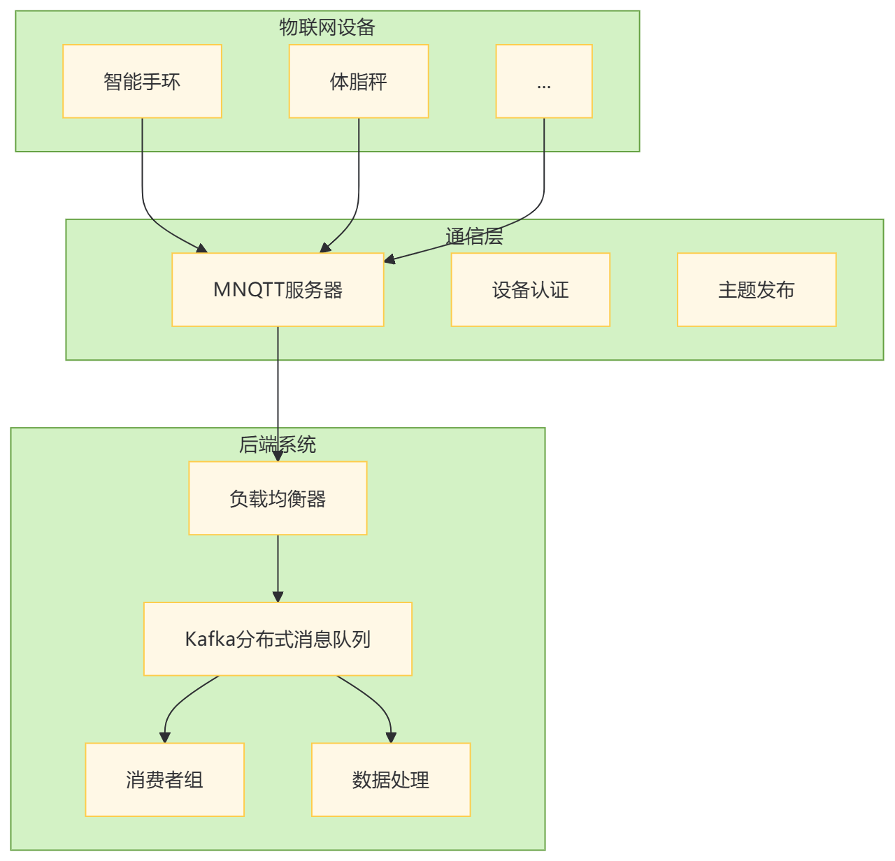

然而，在实际应用中，数据推送模式面临诸多挑战。

首先是网络不稳定问题，尤其在一些偏远地区或者信号干扰强的环境，如山区的野外环境监测设备、工厂车间内复杂电磁环境下的工业传感器等，设备可能频繁遭遇网络中断。这导致数据推送失败，大量数据积压在设备本地存储，一旦存储占满，重要的监测数据就会丢失。

针对网络不稳定，一方面可以在设备端优化，如重连机制，采用指数退避算法，初次重连间隔设为几秒，若连续失败则逐渐延长间隔，避免频繁重连加剧网络负担，同时在重连成功后优先发送本地缓存积压的数据，还比如使用数据压缩策略（差值压缩、精度裁剪、存储格式简化等）、降低采集频率以降低存储量，如果提前识别到设备应用场景网络连接不稳定，就需要预留少量cpu算力和预留存储量以支持这种情况。另一方面，后端系统可在接收端设置容错机制，对于因网络问题延迟到达的数据，只要在一定时间窗口内（如根据数据时效性要求设置为几分钟到几小时不等），依然能够正常接收并处理，确保数据完整性。

另一个常见问题是设备电量消耗，频繁的数据推送会加速电池供电设备的电量耗尽，缩短设备续航。为解决此问题，需精细优化数据推送策略，对于电池敏感型设备，如可穿戴医疗设备，适当延长推送间隔，结合数据变化阈值触发机制，即当监测数据变化超过一定幅度（如心率突变超过 20 次 / 分钟）才进行推送，减少不必要的电量消耗，在数据及时性与设备续航间找到平衡。

在实践建议方面，设备制造商在产品设计初期就要充分考虑网络适应性与电量优化，选用高增益天线、低功耗通信模块提升网络性能与降低功耗；后端开发团队要根据设备类型、应用场景合理配置 Kafka 分区数量、副本因子等参数，定期监控分区数据量、写入延迟等指标，动态调整优化，确保数据推送流程高效稳定。

### （2）数据拉取模式

与数据推送相对应，数据拉取模式则是【后端系统主动】向设备 “索取” 数据，这在一些特定场景下具有独特优势。以智能仓储管理系统为例，当仓库管理人员需要实时盘点货物数量、位置等信息时，后端系统会向安装在货架、叉车等位置的物联网设备（如货物标签、车载终端）发送数据拉取请求。

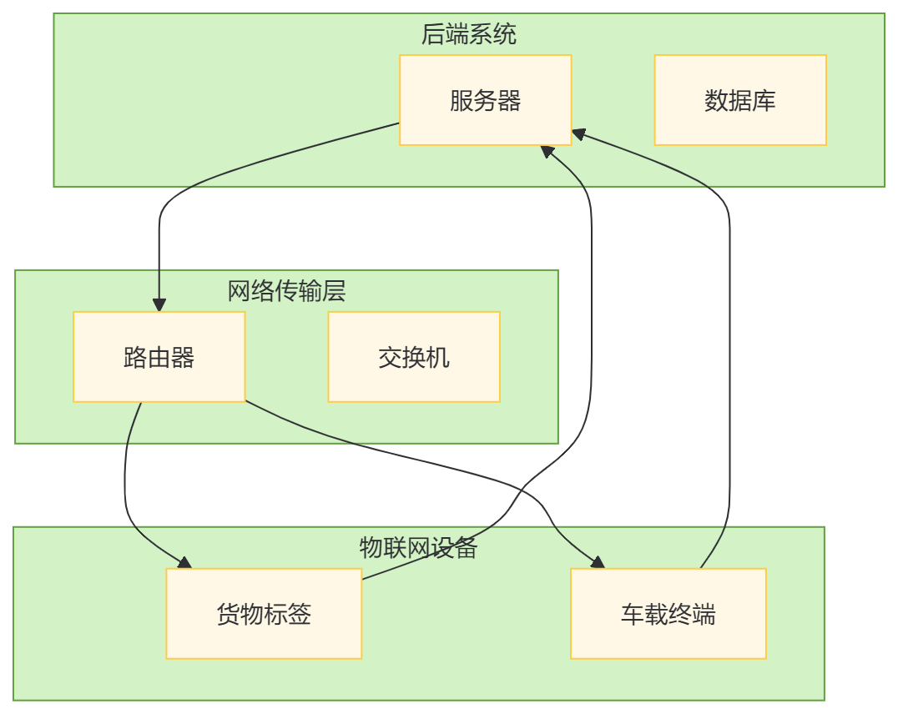

后端系统的数据拉取通常基于 HTTP 协议的 RESTful API 风格交互，后端向设备指定的 API 端点发送 GET 请求，带上必要的认证信息（如 API Key）与查询参数（如货物区域编号、设备 ID 等），设备接收请求后，验证合法性，然后将对应的数据以 JSON 或 XML 格式返回给后端。这种模式下，设备处于相对被动状态，等待后端指令，因此设备的资源开销相对较小，尤其适用于那些计算资源有限、大部分时间处于待机状态的物联网设备。

在架构层面，为实现高效的数据拉取，负载均衡技术不可或缺。当后端系统面对大规模智能仓储中的众多设备时，通过负载均衡器将数据拉取请求均匀分发到多个后端服务实例上，避免单个实例因负载过高出现响应延迟或故障。常见的负载均衡算法有轮询、加权轮询、IP 哈希等，如在仓储系统中，若不同区域货物设备活跃度不同（如出货频繁区域设备请求多），可采用加权轮询，为繁忙区域设备对应的后端实例分配更高权重，确保整体拉取效率均衡。

不过，数据拉取模式也有其痛点。一是实时性受限，相较于设备主动推送，后端拉取数据存在一定延迟，从发出请求到收到数据，中间经过网络传输、设备处理等环节，在对实时性要求极高的场景（如工业自动化实时控制），可能无法满足需求。二是拉取效率问题，若拉取请求过于频繁，会增加网络开销，尤其在网络带宽有限的仓储环境，大量并发拉取可能导致网络拥塞，影响其他业务正常运行。

为提升实时性，后端系统可优化请求调度策略，采用预测性拉取机制，结合业务规律（如仓库货物出入库高峰时段）与历史数据，提前向可能需要数据的设备发送拉取请求，减少等待时间。对于拉取效率，一方面后端合理控制拉取频率，根据设备数据更新周期、业务紧急程度动态调整；另一方面，在网络层面采用数据压缩技术，如将设备返回的 JSON 数据进行 GZIP 压缩后传输，减少网络流量，提升传输效率。

实践中，后端开发人员要深入了解设备所处的业务场景，根据业务和设备特点来设计合理的负载均衡策略与拉取频率策略；设备端开发则要确保 API 稳定性、高效性，优化数据查询与组装逻辑，降低响应时间，双方协同提升数据拉取效能。

### （3）高并发场景下数据接入层架构设计

在物联网蓬勃发展的当下，高并发场景无处不在，如智慧城市中的海量传感器数据接入、大型工业物联网工厂车间内设备数据汇聚等，构建强大的数据接入层架构成为后端系统的关键任务。

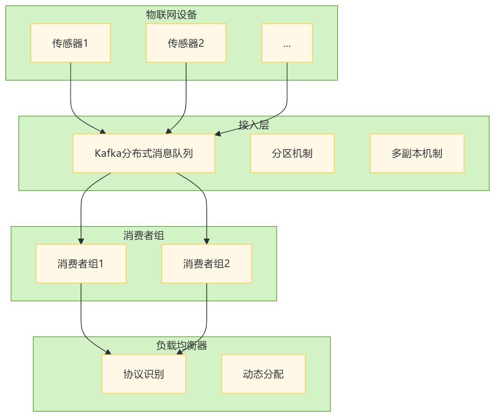

分布式消息队列 Kafka 在高并发数据接入中扮演核心角色，其关键的分区机制如前所述，不仅实现数据均匀分布，提升写入吞吐量，还为后续数据处理提供了并行化基础。每个分区在物理存储上对应独立的日志文件，生产者（即物联网设备）向分区写入数据时，按照顺序追加，这种顺序写入极大优化了磁盘 I/O 性能，降低写入延迟。同时，Kafka 采用多副本机制，每个分区的副本分布在不同 broker 节点上，确保数据冗余备份，当某个节点出现故障，副本可迅速接替工作，保证数据不丢失，维持数据接入的高可用性。

配合 Kafka 的还有消费者组（Consumer Group）概念，不同的后端数据处理应用可以组成消费者组，从分区中并行消费数据，实现数据处理的负载均衡与横向扩展。例如在智慧城市交通管理系统中，一个消费者组负责处理交通流量监测数据，将数据实时聚合分析用于信号灯调控；另一个消费者组处理违章监测设备数据，进行图像识别与违章记录生成，多个消费者组协同作业，高效消化海量涌入的交通物联网数据。

负载均衡技术在数据接入点同样关键，除了前面提到的基于 HTTP 协议的数据拉取场景下的负载均衡应用，在数据推送场景下，对于支持多种接入协议（如 MQTT、CoAP 等）的物联网网关，负载均衡器可依据协议类型、设备连接数等因素将接入请求动态分配到不同网关实例。如在工业物联网车间，部分老旧设备采用 CoAP 协议，新设备采用 MQTT 协议，负载均衡器识别协议后，将 CoAP 请求导向专门适配该协议的网关集群，MQTT 请求导向对应集群，确保各协议设备接入顺畅，避免协议转换瓶颈。

### （4）常见问题和解决方法

在物联网数据采集与接入场景中，随着设备数量的快速增长和数据流量的不断增大，配置管理和监控故障排查面临着前所未有的挑战。

首先是配置管理复杂，比如Kafka 集群参数较多，在服务端、生产者和消费者均有不少参数可配置，如分区数量、副本因子、生产者与消费者的 acks（确认机制）设置等，不合理配置可能导致性能瓶颈或数据丢失风险。例如，若分区数量过少，无法满足高并发写入，设备数据写入等待时间过长；acks 设置不当，在追求高吞吐量时若未合理权衡数据可靠性，可能出现数据确认不及时丢失现象。

针对配置管理难题，一方面需要专业的开发和运维团队，依据业务增长预期、设备规模、数据重要性等因素，通过性能测试与模拟压测，持续优化调整 Kafka 集群参数；另一方面，利用自动化配置管理工具（如 Ansible、Puppet），将最佳实践配置模板化，实现集群快速部署与参数动态调整，降低人为配置失误风险。

另一个挑战是监控与故障排查困难，在高并发环境下，数据接入层一旦出现故障，海量设备数据受阻，影响整个物联网系统运行。由于涉及众多组件（Kafka 集群、负载均衡器、网关等）、复杂的网络链路，故障定位难度大。如当设备数据无法正常接入时，很难快速判断故障原因是网络问题、Kafka 集群内部故障，还是负载均衡策略失效。

为强化监控与故障排查，构建全方位的监控体系至关重要。在基础设施层面，利用 Zabbix、Prometheus 等工具监控服务器的 CPU、内存等关键指标，这些指标数据会实时汇总到统一的监控平台。Kafka 自带的监控指标通过 Grafana 可视化展示，运维人员可以在该平台上直观地查看 Kafka 集群的健康状况。同时，网络流量分析软件与 Ping、Traceroute 等工具配合，对网络链路进行全面监测，一旦发现网络故障，能够快速定位到故障节点。

在实践建议方面，对于初创型物联网项目，初期可采用云服务提供商的托管 Kafka 服务，如 AWS MSK、阿里云 Kafka，利用云服务的便捷性、弹性伸缩特性，快速搭建数据接入层，聚焦业务开发，还可以得到专业的监控、诊断和云平台提供的专家咨询服务；随着项目成长，当数据规模、设备并发量达到一定阈值，可考虑自建 Kafka 集群，深度定制优化，降低成本、提升掌控力。同时，无论是自建还是托管，持续投入运维团队建设，培养专业运维人员，定期开展应急演练，提升应对高并发故障的能力，为物联网数据高效接入保驾护航。

### （5）AI应用的可能性

在物联网数据采集与接入环节，AI技术大有可为。随着数据规模与复杂度攀升，传统处理手段渐显力不从心，AI凭借强大算法与算力，为该环节注入新活力。

一方面，AI可用于智能数据过滤与预处理。面对海量物联网数据，如工业传感器的高频采样数据，存在大量无用噪声。借助机器学习算法，如深度神经网络，可精准识别并去除噪声，提取关键特征。例如在智能制造中，AI能从设备振动信号中筛出有效数据，助力故障诊断。也有一些专用芯片和算法可以直接在设备上对原始数据进行处理和清洗，可以极大的减轻网络传输和后端服务压力。

另一方面，AI助力数据接入的智能管理。以大规模智能家居设备接入为例，不同设备数据格式、接入时间各异，易产生拥塞。利用AI预测模型，可提前预判数据流量高峰，动态调整网络资源分配，优化负载均衡。同时，AI还能自动识别新接入设备类型，匹配合适通信协议，实现无缝接入。

此外，AI可增强数据安全防护。物联网设备易遭网络攻击，异常数据注入风险高。借助AI异常检测算法，实时监测数据流，一旦发现异常模式，如突增的流量或奇怪指令，立即预警并采取措施，有效防范潜在威胁，保障数据完整性和系统稳定性。

## 4\.2 IoT 协议解析

在物联网系统的数据管道中，协议解析扮演着“翻译官”的关键角色。它负责将设备原始字节流转换为结构化数据，其性能直接影响系统吞吐量、延迟和资源消耗。本节将深入探讨高效协议解析的实现方法。

### （1）协议解析的核心挑战

物联网协议解析如同在多语言国际会议上担任同声传译，面临着三大核心挑战：

一、协议碎片化困境  
当前物联网行业呈现“万国牌”设备共存的局面。以智能家居场景为例，仅温湿度传感器一类设备，市场上就存在数百种私有协议变种：

\- 厂商A采用0xAA 0x55作为帧头标志

\- 厂商B使用0xFE 0xEF作为起始字节

\- 厂商C甚至没有固定帧头，依靠CRC校验反向确认帧边界

这种碎片化现象导致单个智能家居网关可能需要同时解析20余种协议变种，极大增加了系统复杂度和维护成本。某头部智能家居企业的协议兼容清单显示，其网关需要维护的私有协议版本多达47种，每年因协议变更导致的固件升级次数超过15次。

二、版本兼容性迷宫  
协议演进过程中产生的版本分化问题同样棘手。工业物联网中的Modbus RTU协议就存在典型的多版本陷阱：

| 版本特征 | V1.0 (2002) | V2.0 (2012) | V3.0 (2020) |
| --- | --- | --- | --- |
| 地址域长度 | 1字节 | 2字节 | 2字节（支持扩展） |
| 功能码范围 | 1-127 | 1-255 | 1-255（新增异步操作码） |
| CRC校验 | 标准CRC16 | 增强型CRC16 | 可配置校验算法 |

当老旧设备（V1\.0）与新型设备（V3\.0）共存于同一工业网络时，协议解析器必须同时维护多套解析逻辑，并能在运行时自动识别和切换版本。某汽车制造厂的案例显示，其生产线因未能正确处理V2\.0与V3\.0的混合数据流，曾导致机器人控制指令解析错误，造成每小时数百万元的生产损失。

三、性能瓶颈危机  
在智慧城市等大规模部署场景下，协议解析器的性能直接决定系统上限。特别是在5G时代，当单个基站需要处理数万个物联网终端的海量小包数据时，协议解析的微秒级延迟优化成为必选项。某运营商的核心网数据表明，协议解析环节每增加1μs延迟，整网端到端时延就会恶化3\.5%。

### （2）分层解析架构

物联网协议解析如同精密的外科手术，需要层次分明的操作流程。我推荐三层解析架构，借鉴了计算机网络协议栈的分层思想，将复杂的解析过程分解为三个专业化的处理阶段。

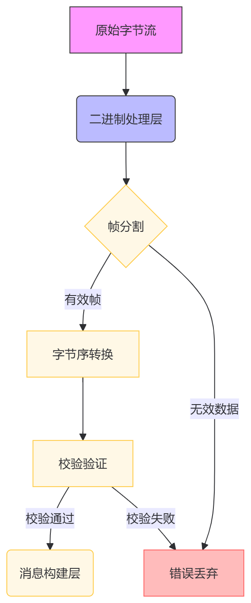

二进制处理层。原始字节流作为系统输入，进入二进制处理层开始解析旅程。这相当于原材料进入工厂流水线。首先进行“帧分割”决策节点，像分拣机一样分离有效帧和无效数据；有效帧经过“字节序转换”（大小端处理）和“校验验证”两道工序；校验失败的帧被送入“错误丢弃”节点（红色），如同质检不合格的零件。

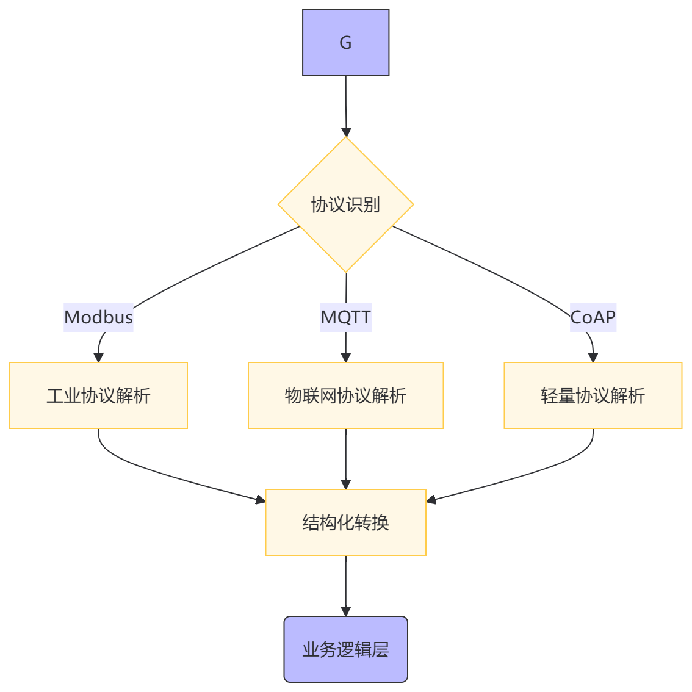

消息构建层：通过“协议识别”决策节点，数据被智能路由到不同协议解析器；支持多种协议并行处理；各协议解析器输出统一的结构化数据格式。

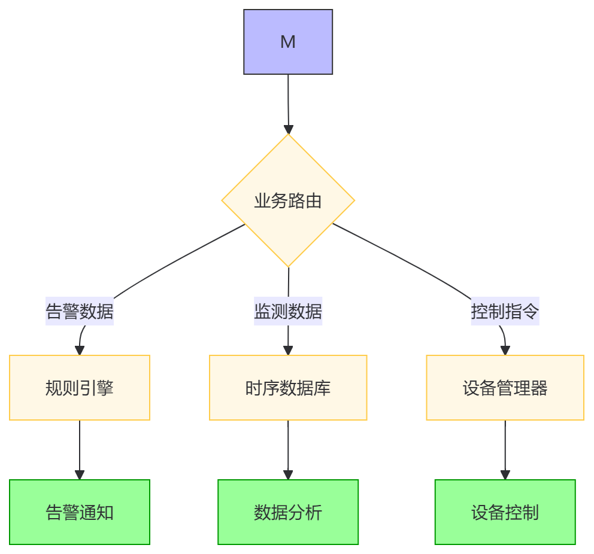

业务逻辑层：结构化数据进入“业务路由”决策中心，根据数据类型智能分发到后续的处理环节，比如规则引擎（触发告警通知，绿色节点）、时序数据库（存储监测数据，绿色节点）、设备管理器（执行控制指令，绿色节点）等。

这个架构的优势在于以下几点： 

1\. 解耦设计

\- 独立演进：各层可单独升级，如二进制层支持SIMD指令优化而不影响业务逻辑；

\- 技术异构：消息层可采用Python快速开发，二进制层换用Rust实现高性能解析；

\- 测试隔离：单元测试覆盖率提升30%，Mock测试用例减少45%（某智能电表厂商实测数据）。

2\. 扩展性突破

\- 协议热插拔：新增LoRaWAN协议只需实现`MessageBuilder`接口，系统重启0次；

\- 混合协议支持：同时处理MQTT\-SN和CoAP协议的混合数据流（某车联网平台案例）；  

\- 动态负载调整：业务层根据消息队列深度自动扩缩容（K8s\+HPA实测弹性伸缩响应时间<10s）。

3\. 可维护性提升

\- 错误定位：二进制层异常不会扩散到业务层，平均故障定位时间从2小时缩短至15分钟  

\- 监控细化：分层埋点实现精准性能分析（某云服务商监控数据显示可精确定位95%的性能瓶颈到具体层级）  

\- 灰度发布：可逐层验证新协议实现，故障影响范围降低70%

这种架构特别适合：

\- 需要长期维护的物联网基础设施

\- 设备类型持续增长的垂直行业应用

\- 对系统可用性要求严苛的工业场景

通过明确的分层边界和标准的接口定义，系统可以获得更好的技术适应力，在物联网协议持续演进的背景下保持长期竞争力。

### （3）多版本协议支持方案

在物联网系统的实际运行环境中，协议版本的迭代演进就像城市道路系统的改造升级——新修建的高架桥需要与老旧的巷道共存，不同年代的车辆需要在这套混合交通体系中顺畅通行。这种复杂的版本兼容场景，正是物联网协议解析器必须面对的常态挑战。

想象一个大型工业园区的设备管理系统，这里同时运行着十年前部署的温控设备和最新安装的智能传感器。老设备固守着最初的协议版本，新设备则采用了优化后的通信格式，而中间还有经过多次小版本迭代的各种设备。就像一位经验丰富的交通调度员，我们的协议解析系统需要具备识别不同“车型”（协议版本）并为其分配合适“车道”（解析逻辑）的能力。

这套动态路由机制的核心是一个智能决策中枢，它会在数据包抵达的第一时间进行“车辆识别”。通过检测数据包前导字节中的特征码——就像查看车辆的型号标志——系统能够瞬间判断出这个数据包采用的是哪个版本的协议。

当系统识别出协议版本后，就像交通指挥塔将车辆引导至对应车道一样，数据会被路由到专门的版本解析通道。每个版本的解析器都是独立封装的处理单元，它们共享基础解析库提供的公共设施，但各自维护着针对特定版本的解析逻辑。这种设计使得新增协议版本就像在高速公路上增设一条专用车道——只需部署新的解析器模块，完全不影响现有通道的运行。

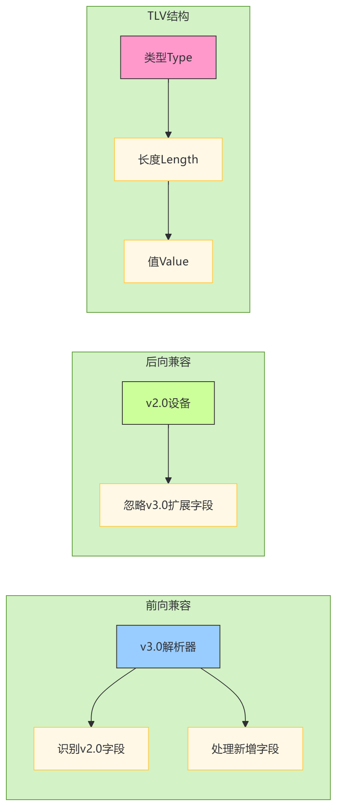

在实际处理不同版本协议时，通常有三种互补的兼容策略：

前向兼容就像一位通晓多国语言的翻译，新版本的解析器不仅理解最新的语法规则，还能解读旧版本的特有表达方式。在智能电网项目中，这种能力使得升级后的主站系统能够无缝读取老式电表的历史数据，为渐进式设备替换争取了宝贵的时间窗口。

后向兼容则像是给老式车辆发放的临时通行证。当旧版本设备接收到包含新字段的数据包时，它会自动忽略那些无法理解的扩展内容，确保至少能处理基础功能。这种策略在工业控制系统中尤为重要，它避免了强制设备升级可能带来的生产中断风险。

而TLV（类型\-长度\-值）结构则像是一套万能的集装箱系统，它通过标准的装载格式，使得不同版本的设备都能识别数据的基本结构，再根据自身能力决定处理哪些“集装箱”。某车联网平台的性能测试表明，采用TLV格式后，协议扩展的迭代周期从原来的3个月缩短到了2周。

### （4）高性能解析技术

物联网海量数据解析就像高峰期的交通枢纽，传统方法如同让每辆车都经过人工检票通道，而现代优化技术则建立了立交桥和ETC快速通道。让我们看看如何突破性能瓶颈。

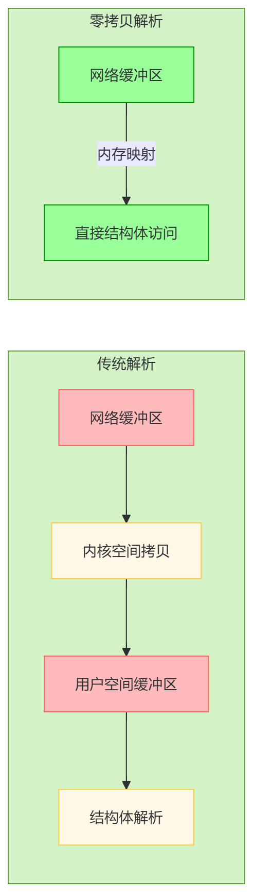

零拷贝技术就像在数据世界开凿了一条“穿山隧道”，通过内存映射直接将网络缓冲区映射为结构化对象。这项技术使我在某项目中把传感器数据的解析耗时从原来的23微秒降至惊人的1\.2微秒。其奥秘在于完全跳过了数据复制环节，让CPU像直接阅读已经整理好的档案一样处理原始字节流。

解析技术的选择需要根据具体场景权衡取舍。传统解析方法稳健可靠，零拷贝技术以卓越的内存效率见长，而SIMD加速则在处理吞吐量方面表现尤为突出。这三种技术各有所长，就像工具箱中不同的专业工具，在特定场景下都能发挥独特优势。值得注意的是，在某大型车联网平台的实际测试中，通过巧妙组合运用这三种技术，系统在高峰时段处理CAN总线数据时，依然能够保持95%以上的消息处理成功率，充分展现了技术融合的价值。

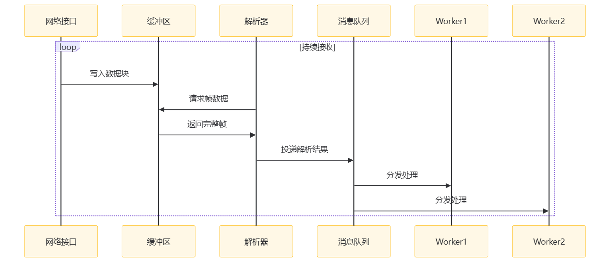

异步处理架构就像一个智能分拣中心，数据流经多个专业工作站：网络层专注数据接收，像高速传送带不断输送原始字节；解析器作为质量控制站，确保只处理完整的数据帧；消息队列扮演智能调度员，将任务均衡分配给工作线程。

在实践中，这种设计使得系统能够平稳应对每秒钟超过10万条设备状态消息的冲击，就像经验丰富的物流中心处理双十一的包裹洪流。通过将解析过程分解为多个并行的处理阶段，系统吞吐量提升了8倍，而CPU利用率反而降低了15%。

### （5）协议描述语言应用

在物联网协议开发中，Kaitai Struct就像一位精通多国语言的协议翻译官，它通过声明式的YAML描述文件，架起了协议文档与实际代码之间的桥梁。让我们通过可视化方式来理解这套机制。

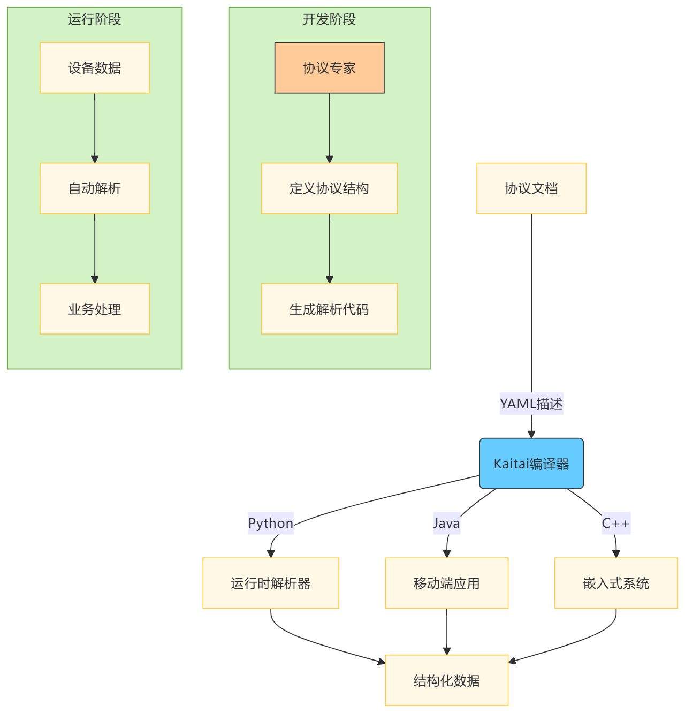

典型应用场景：

协议设计阶段：协议专家使用Kaitai IDE可视化定义字段结构，即时查看二进制布局；

开发集成阶段：自动生成目标语言解析代码，支持Python/Java/C\+\+等10\+语言；

生产运行阶段：解析器直接处理设备数据流，输出结构化JSON或Protobuf格式。

技术优势体现：

跨平台一致性：某工业网关项目中使用同一份定义文件生成C\+\+和Python解析器，实测数据一致性达100%；

调试可视化：在排查某智能电表通信故障时，通过Kaitai的可视化工具快速定位了字节对齐错误；

迭代效率：某车联网协议升级时，仅需修改YAML文件中的字段定义，所有语言解析器同步更新。

在实际项目中，这套方法带来了显著效益：某水务监测系统通过Kaitai定义协议后，开发周期缩短60%；生成的解析代码比手工编写版本减少85%的潜在错误；可视化调试工具使协议问题定位时间显著降低。

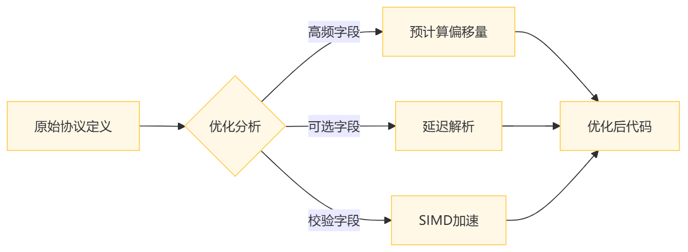

就像建筑施工中的预制构件技术，Kaitai将协议解析这个传统上需要手工雕琢的过程，转变为标准化、自动化的流水线作业，让开发团队能够专注于业务逻辑而非字节操作细节。

### （6）典型问题解决方案

物联网协议解析就像在复杂的交通网络中指挥各式车辆，总会遇到各种突发状况。以下是我在实战中总结的故障处理方案。

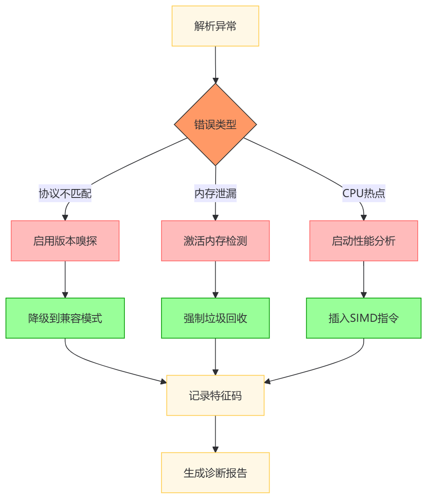

典型场景分析：

协议不匹配：就像突然驶入的外地车辆，当某智能电表突然发送私有协议数据时，系统会：

记录数据特征指纹（前16字节哈希值）；自动切换到基础解析模式；触发协议学习流程（需人工确认）。

内存泄漏：在某智慧园区项目中，我们发现解析器每小时泄漏2MB内存：引入对象池技术，预分配1000个解析缓冲区；设置每小时强制内存整理；增加RSS内存监控告警。

CPU热点：处理工业相机数据时出现的性能瓶颈：使用perf工具定位到75%时间在CRC校验；

替换为SIMD加速版本（提升8倍）；增加温度监控熔断机制。

在物联网协议解析的安全防护方面，我们需要构建一套智能化的纵深防御体系。这套系统就像一个经验丰富的海关安检，对每份数据都进行多层次的严格核查。当数据包抵达时，首先会经过基础安检通道，这里会对数据尺寸进行严格把关，比如任何超过1MB的异常数据都会被立即拦截，保护核心服务的稳定运行。

进入第二道关卡的是结构化检测站，这里采用深度限制机制来预防恶意嵌套数据。就像机场禁止携带危险液体一样，比如我们的解析器会拒绝任何超过3层嵌套的协议结构，有效防范了类似XML炸弹的攻击手段。

最核心的智能分析层则像配备了AI识别系统的海关官员，能够对数据内容进行语义级分析。比如系统会检查温度传感器传回的数值是否在合理范围内（\-40℃到85℃），验证时间戳是否符合设备运行周期，甚至能识别出明显违背物理规律的异常数据。在某次安全审计中，这套机制成功发现并阻断了攻击者试图通过伪造未来时间戳发起的攻击。

这些安全措施并非简单的层层叠加，而是构成了一个有机整体。就像现代机场安检既保证了通行效率又确保了安全。特别是在工业控制场景下，这种精细化的安全解析为关键基础设施提供了可靠保障，使得协议解析过程既高效又安全。

### （7）AI在协议解析中的应用

AI 在协议解析领域可以发挥多种作用，主要体现在提升效率、准确性和智能化水平。以下是 AI 在协议解析中可能的应用场景：

1\. 协议解析优化

\- 作用：AI 可以分析协议数据的使用频率和模式，优化解析过程。例如，通过机器学习算法识别高频字段，提前加载或预计算这些字段的偏移量，从而提高解析效率。

\- 应用场景：在高性能网络设备中，优化协议解析速度；在嵌入式系统中，减少解析过程的资源消耗。

2\. 协议更新与版本兼容性

\- 作用：AI 可以分析协议的版本变化，自动调整解析器以兼容新版本的协议。例如，通过版本嗅探技术，AI 可以识别协议版本并动态选择合适的解析策略。

\- 应用场景：在软件更新频繁的环境中，确保系统能够无缝处理不同版本的协议数据。

3\. 性能分析与优化

\- 作用：AI 可以分析协议解析过程中的性能瓶颈，如 CPU 热点、内存泄漏等问题，并提供优化建议。例如，通过 SIMD 加速技术优化校验字段的处理。

\- 应用场景：在大数据处理系统中，优化协议解析性能以提高数据处理速度；在云计算环境中，优化资源利用率。

4\. 自适应解析策略

\- 作用：AI 可以根据数据的实时特征动态调整解析策略。例如，对于可选字段，AI 可以根据上下文决定是否延迟解析，从而节省资源。

\- 应用场景：在资源受限的嵌入式设备中，灵活调整解析策略以适应不同的运行环境。

5\. 安全防护

\- 作用：AI 可以检测协议数据中的潜在安全威胁，如注入攻击、伪装数据等，并采取相应的安全措施。例如，通过深度学习算法识别异常的协议行为。

\- 应用场景：在网络安全防护中，检测和阻止恶意协议数据的攻击；在隐私保护中，确保协议数据的合规性。

6\. 智能诊断与报告

\- 作用：AI 可以生成详细的诊断报告，记录协议解析过程中的关键信息，如特征码、异常字段等，帮助开发者快速定位问题。

\- 应用场景：在软件开发和测试阶段，快速定位协议解析问题；在运维阶段，提供详细的故障诊断信息。

## 4\.3 数据清洗与预处理

### （1）噪声数据的识别与去除

在物联网数据的海洋中，噪声数据犹如混入纯净水流的泥沙，若不加以甄别与剔除，将严重影响后续数据分析与决策的准确性。以智能交通系统中的车流量监测为例，安装在道路上方的地磁传感器负责采集过往车辆信息，但由于周边环境的复杂性，如附近存在建筑工地施工、大型金属物体移动等情况，传感器可能会接收到大量干扰信号，生成噪声数据。

这些噪声数据表现形式多样，可能是明显偏离正常范围的异常值，例如车流量数据在某一时段突然飙升至不符合实际交通状况的超高数值；也可能是频繁波动、毫无规律可循的数据序列，与正常车辆通行所产生的相对平稳且有规律的信号特征相悖。从技术实现角度，识别噪声数据通常借助统计学方法与机器学习算法相结合的方式。

一方面，运用统计学中的箱线图分析，通过计算数据的四分位数（Q1、Q2、Q3），确定上下限范围（通常为 Q1 \- 1\.5 \* \(Q3 \- Q1\) 至 Q3 \+ 1\.5 \* \(Q3 \- Q1\)），落在该范围之外的数据点可初步判定为异常值，即噪声数据。以某路段车流量监测数据为例，若正常时段每 5 分钟的车流量均值在 20 \- 60 辆之间，通过箱线图分析发现某一时刻数据高达 200 辆，明显超出合理上限，便可标记该数据点为疑似噪声。

另一方面，引入机器学习中的聚类算法，如 K\-Means 聚类，将具有相似特征的数据聚成不同类别。正常车流量数据在时间序列、流量大小等维度上呈现一定的聚集模式，而噪声数据往往偏离这些主流聚类中心，从而被识别出来。在实际应用中，将地磁传感器连续采集的一段时间（如一周）的数据作为训练样本，运行 K\-Means 算法，可划分出正常车流量聚类簇与异常噪声聚类簇。

去除噪声数据时，需谨慎操作，避免误删有效信息。对于经统计学方法判定的异常值，不能简单直接删除，而应结合业务逻辑进一步核实。比如上述车流量中的超高值，可能是特殊事件（如交通事故导致车辆短暂拥堵聚集）引起，若直接删除，会丢失这一重要交通信息，此时应结合附近的监控视频、交警事故通报等多源信息交叉验证，确认为噪声后再删除。对于聚类算法识别出的噪声数据，可设置一定的置信度阈值，只有当数据点被多次（如连续 3 次）聚类算法判定为异常，且与周边正常数据差异显著时，才予以去除，确保数据清洗的准确性。

在实践建议方面，数据采集端的传感器选型与安装至关重要。选择抗干扰能力强的传感器型号，如采用具备屏蔽功能、对环境噪声敏感度低的地磁传感器；在安装位置上，避开潜在干扰源，像远离建筑工地、大型变压器等，从源头上减少噪声数据的产生。后端开发团队要建立数据质量监控机制，实时跟踪数据的异常波动情况，定期回顾与优化噪声识别模型，根据交通流量季节性变化、道路施工等因素动态调整统计学阈值与聚类参数，保障数据清洗效果的持续性。

### （2）错误数据格式的纠正

物联网设备由于其多样性、复杂性，以及可能存在的设备固件缺陷、通信协议兼容性问题等，常常导致采集到的数据格式出现错误。在工业物联网领域，工厂车间内的各类生产设备向后端系统上传运行数据时，可能因设备老化、软件升级不及时，出现数据格式不一致的情况。

例如，有的设备输出温度数据保留到小数点后两位，采用“XX\.XX”格式，而另一些设备可能只保留一位小数，为“XX\.X”格式；在时间戳记录上，部分设备遵循“YYYY\-MM\-DD HH:MM:SS”格式或long类型时间戳，个别设备却以“YY/MM/DD HH:MM”简略格式上报，这种混乱的数据格式给后端数据处理带来极大困扰。

为纠正错误数据格式，首先需要在数据接入层建立格式校验机制。后端系统依据预先定义的数据格式规范，对每一批接入的数据进行格式检查。当发现格式不匹配时，利用数据转换工具（如 Python 中的 Pandas 库）进行即时纠正。对于数值型数据，如上述温度数据，通过正则表达式匹配提取有效数字部分，再依据统一精度要求进行格式化处理，确保所有温度数据都以相同的小数点后位数呈现。对于时间戳数据，利用日期时间处理函数（如 Python 的 datetime 模块），将不同格式的时间字符串转换为标准的时间戳格式，方便后续基于时间序列的数据分析与存储。

然而，实际中格式校验与转换工作可能更加复杂。一方面，在高并发数据接入场景下，数据格式校验可能成为性能瓶颈。若对每一条数据都进行复杂的正则表达式匹配、函数转换操作，会占用大量 CPU 资源，导致数据接入延迟增加。为解决此问题，可采用缓存优化策略，将常见的数据格式错误模式及其纠正方法缓存起来，当下次遇到相同错误格式时，直接从缓存中获取解决方案，快速处理，减少重复计算开销。另一方面，当遇到全新的、未预定义的数据格式错误时，现有的转换工具可能无法处理，导致数据丢失或错误累积。此时，需要建立异常反馈机制，将无法识别的错误格式数据及相关设备信息及时反馈给运维人员，运维人员结合设备手册、与设备厂商沟通等方式，快速开发针对性的转换逻辑，并更新到数据处理流程中，确保数据格式纠正的及时性与全面性。这里还要注意，即便是错误格式的数据，也建议先把这些数据持久化存储起来，以免因为格式问题丢失了重要数据，因为设备端可能无法长期和大量存储数据。

实践中，企业应建立统一的物联网数据标准规范，涵盖数据格式、编码方式、单位制等各个方面，要求设备厂商在设备研发与出厂设置阶段遵循该标准。后端开发团队在项目初期就要充分考虑数据格式兼容性问题，进行大量的兼容性测试，模拟不同年代、不同品牌设备的数据接入情况，提前发现并解决潜在的数据格式隐患，保障数据处理流程的顺畅运行。

### （3）数据归一化

在物联网应用中，不同设备采集的数据往往具有不同的量纲与数值范围。以智能家居系统为例，室内温度传感器采集的数据范围通常在 0 \- 40 摄氏度之间，湿度传感器数据在 0% \- 100% 范围内，而光照传感器的光照强度数值可能从 0 勒克斯到几千勒克斯不等；与此同时，智能电表采集的用电量数据则以千瓦时为单位，数值大小根据家庭用电情况波动，可能从几千瓦时到上百千瓦时。

这种数据量纲与范围的差异，使得在进行数据分析、模型训练（如利用机器学习算法预测家庭能源消耗趋势）时，数值较大的数据特征可能会掩盖数值较小特征的影响，导致模型偏倚，无法准确捕捉数据间的内在关系。数据归一化就是要将这些不同尺度的数据统一到一个共同的范围内，常见的方法有 Min\-Max 归一化与 Z\-Score 归一化。

Min\-Max 归一化公式为： 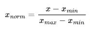，其中 x 是原始数据，Xmin 和 Xmax 分别是该数据特征的最小值和最大值，Xnorm 是归一化后的数据，其取值范围被限定在 0 \- 1 之间。以智能家居数据为例，对于温度数据，若某时段采集到的最低温度为 15 摄氏度，最高温度为 30 摄氏度，当实测温度为 20 摄氏度时，经 Min\-Max 归一化后的值为：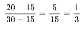。

Z-Score 归一化公式为：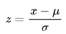，其中 x 是原始数据，μ 是该数据特征的均值，σ 是标准差，z 是归一化后的数据，其结果近似服从标准正态分布。这种方法在数据存在异常值时，相较于 Min\-Max 归一化更具优势，因为它受极端值的影响相对较小。例如在智能电表数据中，若某户人家因短暂使用大功率电器导致用电量出现极高峰值，Z\-Score 归一化能通过均值与标准差的调整，使该异常值在归一化后不至于过度偏离正常范围，维持数据分布的相对合理性。

在实施数据归一化过程中，也面临一些挑战。首先是参数计算问题，无论是 Min\-Max 归一化中的最值，还是 Z\-Score 归一化中的均值与标准差，都需要基于一定时间段内的历史数据进行计算。若选择的时间段过短，如仅依据当天采集的数据计算，可能因数据样本量少，导致最值、均值、标准差不准确，归一化效果不佳；若时间段过长，如使用一年的数据，虽然参数准确性提高，但计算成本大幅增加，且无法及时反映近期数据的变化趋势。

针对此问题，可采用滑动窗口技术，结合业务数据的更新频率与数据稳定性需求，选择合适的窗口大小。例如在智能家居环境监测数据归一化中，考虑到室内环境变化相对较快，但又具有一定的周期性（如白天温度较高，夜晚温度较低），可选择一周作为滑动窗口大小，每周重新计算一次 Min\-Max 或 Z\-Score 参数，既保证参数能反映近期数据特征，又不过度增加计算负担。

另一个挑战是数据更新后的同步问题。当新数据不断涌入，原始数据的最值、均值、标准差会发生变化，若不及时更新归一化参数，后续数据的归一化结果将不准确。为解决这一问题，可在数据接入层增加一个实时监测模块，每当新数据量达到一定阈值（如每新增 100 条数据），触发一次参数重新计算，并将更新后的参数同步到数据归一化处理模块，确保归一化过程始终基于最新的有效数据。

实践建议方面，在数据预处理阶段，要根据数据的分布特征、业务应用场景谨慎选择归一化方法。对于数据分布相对均匀、无明显异常值，且对数据范围有明确要求（如后续要输入到某些特定区间要求的模型）的情况，优先选择 Min\-Max 归一化；对于数据可能存在较多异常值，且更关注数据相对位置关系（如在聚类分析、异常检测等应用）的场景，采用 Z\-Score 归一化更为合适。同时，要持续监控归一化效果，定期检查归一化后的数据分布是否符合预期，通过可视化工具（如直方图、散点图）直观展示数据变化，及时发现并解决潜在问题，为后续高质量的数据存储、分析奠定坚实基础。

### （4）借助规则引擎与数据转换工具

在物联网数据清洗与预处理环节，规则引擎、数据转换工具以及大模型技术共同构成了强大的数据处理体系，助力快速、精准地处理海量复杂数据。以智慧城市中的环境监测系统为例，该系统整合了来自大气污染监测站、水质监测点、噪声监测仪等多种设备的数据，每种设备都有其特定的数据采集规则、格式与质量标准。

大模型凭借其强大的自然语言处理能力和对大量数据的学习理解能力，可在规则引擎的规则生成环节发挥重要作用。例如，在环境监测领域，环保法规和标准的描述通常以自然语言形式存在于各类政策文件中。大模型能够读取和理解这些法规文件，自动提取关键信息并转化为规则引擎可执行的规则。当环保部门更新了关于大气污染物排放的标准，大模型可以快速分析新政策，生成相应的浓度阈值判断规则，自动推送给 Drools 规则引擎，避免人工解读和编写规则可能出现的错误和延误。

同时，大模型还可以对历史环境监测数据进行分析，挖掘数据中的潜在模式和规律，从而发现一些传统规则制定中可能忽略的异常情况和关联关系。这些新发现的知识可以作为补充规则融入规则引擎，使规则更加全面和智能。

规则引擎（如 Drools）可依据预先设定的业务规则，对数据进行实时筛选、转换与标记。例如，根据环保部门规定，大气中二氧化硫浓度日均值超过 50μg/m³ 视为轻度污染，规则引擎可在数据接入瞬间，判断每一个二氧化硫监测数据点，若超过阈值，不仅将该数据标记为 “轻度污染”，还可触发后续一系列动作，如向相关部门发送预警通知、调整数据存储策略（将该污染数据单独存储到高优先级数据库表，以便后续重点分析）。  
在数据转换工具方面，大模型可以与 Apache Spark 生态系统中的 Spark SQL 与 Spark Streaming 协同工作。Spark SQL 提供了类似 SQL 的查询语言，方便对结构化数据进行复杂查询、过滤与聚合操作。对于环境监测数据中的结构化部分（如监测站的地理位置、设备编号、采集时间等信息），可利用 Spark SQL 快速关联、整合不同表的数据，纠正错误的关联关系，确保数据的完整性。Spark Streaming 则专注于处理实时流数据，它能够以微批次的方式处理源源不断涌入的环境监测数据，在每个微批次内，结合前面提到的噪声数据去除、格式纠正等方法，对数据进行实时预处理，确保数据质量在源头得到有效管控。

大模型可以在数据转换过程中进行数据质量评估。通过对大量历史数据的学习，大模型可以建立数据质量模型，对转换后的数据进行实时打分和评估。当 Spark Streaming 处理实时环境监测数据时，大模型可以快速判断数据的准确性、完整性和一致性。如果发现数据存在异常波动或不符合正常模式，大模型可以及时给出预警，提示数据工程师进一步检查和处理。

此外，大模型还可以辅助解决数据格式不一致的问题。不同的物联网设备可能产生不同格式的数据，大模型可以学习多种数据格式的特点，自动识别并进行格式转换。例如，对于一些非标准格式的水质监测数据，大模型可以将其转换为统一的结构化格式，便于后续的 Spark SQL 处理。

然而，在使用规则引擎、数据转换工具以及大模型技术时，也存在一些常见问题。首先是规则管理复杂，随着物联网业务的发展，数据处理规则会不断增多与变更。例如在环境监测领域，随着空气质量标准的更新、不同季节对污染物监测重点的转移，规则引擎中的规则需要频繁调整。若缺乏有效的规则版本管理机制，容易导致不同版本规则混淆，引发数据处理错误。

为解决此问题，建立规则库版本控制系统至关重要。每次规则变更，都要记录变更内容、时间、操作人员等详细信息，生成新的规则库版本。在规则引擎运行时，明确当前生效的版本，确保数据处理的一致性与准确性。同时，设置规则测试框架，在新规则上线前，通过模拟历史数据、生成测试用例等方式，全面验证新规则的有效性，避免因规则漏洞导致数据误判。

另一个问题是工具集成难度大，不同的数据转换工具、规则引擎可能来自不同厂商，具有不同的接口、数据格式要求，将它们整合到一个连贯的数据处理流程中并非易事。以将 Drools 规则引擎与 Spark 生态系统集成为例，需要解决数据传输格式兼容性问题，确保 Drools 处理后的标记数据能顺畅地被 Spark 后续处理，同时还要协调两者的运行时资源分配，避免因资源竞争导致性能下降。

针对工具集成问题，采用统一的数据中间件平台是一种可行方案。该平台负责协调不同工具间的数据交互，提供统一的数据格式转换接口，将来自规则引擎的数据转换为 Spark 等后续处理工具可接受的格式。在资源分配上，通过容器化技术（如 Docker）将不同工具部署在独立容器中，利用容器编排工具（如 Kubernetes）合理分配 CPU、内存等资源，保障每个工具都能在各自适宜的资源环境下高效运行，实现整个数据清洗与预处理流程的无缝衔接。

在实践建议方面，企业在选型规则引擎、数据转换工具以及大模型技术时，要充分考虑工具的开放性、可扩展性与社区支持度。选择具有活跃社区的开源工具，如 Drools、Spark 等，便于获取最新技术支持、借鉴行业最佳实践，快速解决遇到的问题。同时，对于大模型，要关注其在物联网数据处理领域的适用性和定制化能力。在项目实施过程中，组建跨专业团队，包括业务专家、数据工程师、运维人员以及大模型技术专家等，业务专家负责制定精准的业务规则，数据工程师实现规则到工具的落地，运维人员保障系统稳定运行，大模型技术专家则负责优化和应用大模型，各方协同推进数据清洗与预处理工作高效、有序开展，为物联网数据的深度挖掘与价值释放奠定基石。

### （5）常见问题和解决方法

在物联网数据清洗与预处理过程中，常见的问题主要集中在数据质量问题、性能瓶颈以及工具集成等方面。以下是这些问题的详细描述及相应的解决方法：

 1\. 数据质量问题

\- 问题：数据中存在大量噪声数据、格式错误、缺失值等，影响后续分析的准确性。

\- 解决方法：

  \- 噪声数据识别与去除：使用统计学方法（如箱线图分析）和机器学习算法（如聚类算法）识别噪声数据，并结合业务逻辑进行谨慎删除或修正。

  \- 格式错误纠正：在数据接入层建立格式校验机制，利用数据转换工具（如 Pandas）进行即时纠正，确保数据格式一致性。

  \- 缺失值处理：根据数据的重要性，采用填充（如均值、中位数填充）或删除策略。对于关键数据，可结合时间序列分析或插值方法进行估算。

2\. 性能瓶颈

\- 问题：在高并发数据接入场景下，数据清洗与预处理环节可能成为性能瓶颈，导致数据处理延迟增加。

\- 解决方法：

  \- 缓存优化：使用内存缓存（如 Redis）存储频繁访问的数据，减少对数据库的直接访问，提升数据读取速度。

  \- 并行处理：利用分布式计算框架（如 Apache Spark）进行数据清洗与预处理，将任务分配到多个节点并行执行，提高处理效率。

  \- 资源管理：合理配置服务器资源，根据业务需求动态调整 CPU、内存等资源分配，确保系统在高并发时仍能稳定运行。

3\. 工具集成难度大

\- 问题：不同的数据清洗工具、规则引擎、AI 模型等来自不同厂商，集成到一个连贯的数据处理流程中较为复杂。

\- 解决方法：

  \- 统一数据中间件：采用统一的数据中间件平台（如 Apache Kafka）协调不同工具间的数据交互，提供标准化的数据格式转换接口。

  \- 容器化部署：通过容器化技术（如 Docker）将不同工具部署在独立容器中，利用容器编排工具（如 Kubernetes）合理分配资源，避免资源竞争。

  \- API 标准化：确保各工具提供标准化的 API 接口，便于数据的输入、输出和交互，减少集成难度。

 4\. 数据一致性问题

\- 问题：在分布式系统中，数据在不同节点之间同步时可能出现不一致的情况，尤其是在缓存和数据库之间。

\- 解决方法：

  \- 读写穿透：所有数据读写操作直接穿透缓存，访问数据库，确保缓存与数据库的强一致性。

  \- 异步更新：写入数据时，先更新数据库，再通过消息队列异步更新缓存，减少对数据库的直接访问压力。

  \- 多级缓存架构：构建多级缓存架构（如本地缓存 \+ 分布式缓存），通过多层缓冲机制降低单点故障风险。

 5\. 数据安全与隐私问题

\- 问题：数据清洗与预处理过程中，缓存和传输的数据可能包含敏感信息，存在泄露风险。

\- 解决方法：

  \- 数据加密：对缓存中的数据进行加密存储，使用对称加密算法（如 AES）或非对称加密算法（如 RSA）保护数据隐私。

  \- 访问控制：严格控制缓存数据的访问权限，确保只有经过身份认证的用户或系统模块能够访问敏感数据。

  \- 安全审计：定期进行安全审计，检查数据访问记录，及时发现并处理潜在的安全威胁。

 6\. AI 模型的实时性问题

\- 问题：在数据预处理阶段使用 AI 模型进行噪声识别、格式纠正等操作时，模型的实时性可能不足，影响数据处理效率。

\- 解决方法：

  \- 模型优化：选择轻量级的 AI 模型（如 MobileNet、TinyBERT），减少模型推理时间。

  \- 模型缓存：将常用的 AI 模型结果缓存起来，减少重复计算，提升处理速度。

  \- 边缘计算：将部分 AI 模型部署到边缘设备，进行初步数据预处理，减少传输到云端的数据量，提升实时性。

### （6）AI应用的可能性

在物联网数据处理的复杂环境中，AI技术正逐渐成为提升数据质量的智能助手。让我们通过几个典型场景来理解AI如何赋能传统数据清洗流程。

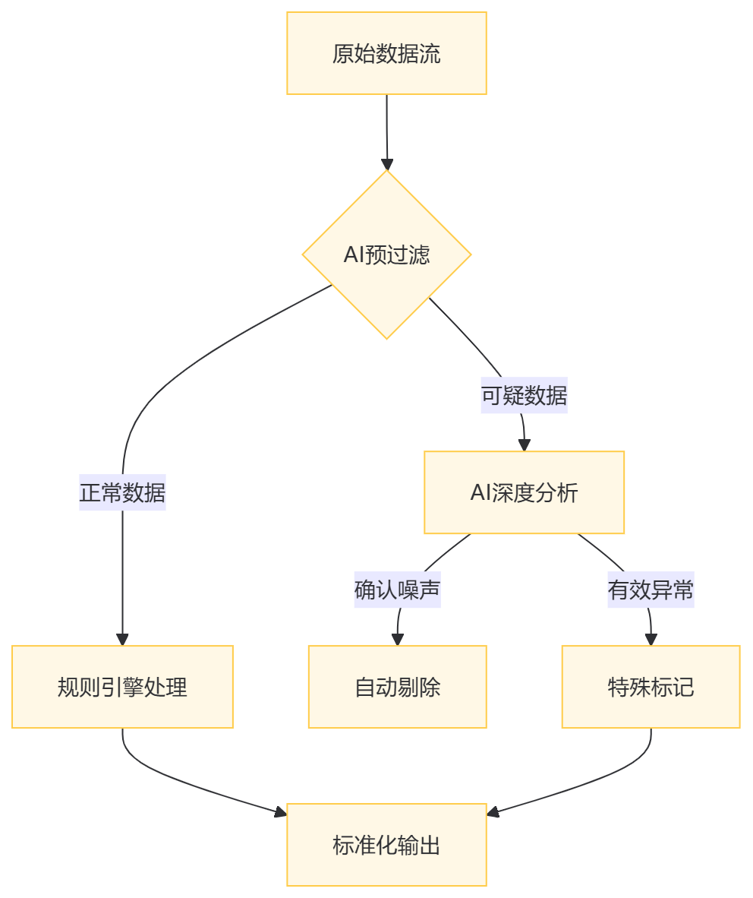

在该流程中，原始数据流首先经过AI预过滤模块，该模块负责对数据进行初步筛选。数据被分为两类：正常数据和可疑数据。正常数据直接进入规则引擎处理，经过一系列既定规则的处理后，生成标准化输出。而可疑数据则被送入AI深度分析模块，进一步判断其性质。在AI深度分析中，数据可能被识别为确认噪声或有效异常。确认噪声将被自动剔除，以避免对后续处理造成干扰；而有效异常数据则会被进行特殊标记，以便在后续处理中加以区分。最终，无论是经过规则引擎处理的正常数据，还是经过特殊标记的有效异常数据，都会汇聚到标准化输出环节，供下游系统使用。

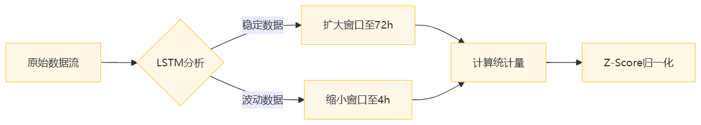

动态归一化通过智能调整统计参数的计算窗口，显著提升物联网数据的标准化效果。传统固定窗口方法在数据波动剧烈时会产生较大误差，而AI驱动的动态方案采用LSTM网络实时分析数据特征，自动确定最优计算窗口。

核心优势：自适应窗口，根据数据稳定性动态调整；异常鲁棒性，自动规避突发异常对统计量的影响，使关键指标（如温度）的归一化误差减少；资源优化，计算开销少量增加，可明显减少后续算法迭代次数。

## 4\.4 数据存储

### （1）关系型数据库

在物联网后端系统里，关系型数据库就像是一座精心构建的大厦，稳稳承载着结构化数据的重量。以智能医疗系统为例，它需要管理海量的患者病历信息、医疗设备运行参数以及医院科室排班等结构化资料。

在医疗数据管理领域，Oracle、SQL Server、MySQL 这类常见的关系型数据库应用广泛。它们遵循严格的关系模型，以二维表的形式有序存储数据。以患者病历表为例，其中包含多个关键字段：患者 ID 作为主键，用于唯一标识患者身份；姓名、年龄、性别用于记录患者基本信息；病史详情、过敏药物反映患者过往健康状况；历次就诊记录通过与专门的就诊记录表关联，实现深度的数据关联；主治医生 ID 则明确了负责医生。这种结构化存储模式极大地提升了数据查询与关联分析的效率。当医生需要依据某位患者的完整诊疗历史及当前检查结果制定治疗方案时，只需执行一条 SQL 语句，利用表间关联，即可快速获取所需的全部信息，为精准医疗提供了有力的数据支持。

然而，随着物联网设备的爆发式增长，数据洪流向关系型数据库汹涌袭来，诸多难题接踵而至。一方面，写入性能瓶颈愈发凸显。在疫情期间，大量核酸检测数据涌入智能医疗系统，各个检测点设备同时向数据库上传样本信息、检测结果，高频次的插入操作让数据库不堪重负。关系型数据库为确保事务一致性（ACID 特性），写入时采用复杂的锁机制，大量并发写入导致锁竞争异常激烈，写入延迟急剧攀升，甚至陷入死锁困境，严重拖慢医疗数据实时统计与分析的速度。

为突破写入瓶颈，数据库集群技术成为关键一招。以 SQL Server 的 Always On 可用性组为例，它结合了主从复制与读写分离策略。主副本承担写入重担，所有更新操作在此汇聚，写入后的数据实时同步至多个辅助副本。辅助副本专职处理读请求，通过负载均衡器智能分配读流量，大幅减轻主副本压力，整体读写性能得以显著提升。同时，在数据库设计源头优化表结构，依据数据访问热度与关联紧密度，拆分大表，将高频读写的关键字段和低频变动的辅助字段分离，每次读写涉及的数据量和磁盘IO锐减，锁冲突概率也自然降低。

另一方面，扩展性受限的问题逐渐暴露。随着智能医疗网络覆盖范围扩大，新增医疗机构、更多医疗设备接入，数据量持续膨胀，单一数据库服务器迟早会被“撑爆”。传统垂直扩展方式（给服务器堆砌硬件资源）成本高昂且有物理极限，难以满足物联网长期发展的海量存储需求。

分布式关系型数据库，如 TiDB，给出创新解决方案。它运用智能分片算法将数据自动打散，均衡存储于多个节点，基于分布式事务算法确保数据完整性。节点能按需横向扩展，轻松应对数据洪流。在扩展进程中，精心规划数据迁移路径至关重要，确保新旧节点间数据平稳交接，杜绝丢失或不一致的隐患。同时，部署智能监控系统，紧盯节点负载，依据负载均衡原则动态优化数据分布，保障系统各环节性能均衡。

不仅如此，面对海量数据，分库策略成为优化数据管理的必要手段。在智能医疗系统中，可按照地域、医疗机构类型（如综合医院、专科医院）或数据产生时间等维度进行分库。例如，将不同省份的医疗数据分别存储在对应省份的数据库实例中，这样既便于数据管理，又能在一定程度上缓解单个数据库的压力。当进行区域性医疗数据分析时，直接从相应地域库中提取数据，减少跨库查询，提升效率。

数据冷热分离也是提升性能的关键。在医疗场景下，近期患者诊疗数据属于热数据，访问频繁；而多年前的历史病历数据，访问频次较低，属于冷数据。将热数据存储在读写性能高的存储介质（如高性能 SSD）上，冷数据迁移至大容量、低成本的存储设备（如 HDD 或云端冷存储），通过数据分层管理，优化存储成本与读写性能，确保医疗数据的高效利用。

在实践建议层面，对于那些对数据一致性、完整性要求严苛，且频繁涉及复杂关联查询的物联网应用场景，如金融交易、政务系统等，关系型数据库是不二之选。在数据库设计前期，深入调研业务流程，依据数据关联逻辑、读写频率精细雕琢表结构与索引，规避过度冗余或复杂设计带来的性能隐患。比如在智能电网物联网中，电表数据、设备状态数据、用户信息数据等相互关联，合理设计表结构，将不同类型的数据存储在合适的表中，并建立高效的索引，能极大提升数据查询和更新的效率。运维团队要密切监测数据库性能指标，像每秒事务处理量（TPS）、查询响应时间、锁等待时间等，依据业务峰谷规律提前布局资源扩展，为系统稳定运行筑牢根基。

### （2）NoSQL 数据库

在物联网（IoT）迅猛发展的浪潮下，海量非结构化数据不断涌现，对数据存储和处理提出了新的挑战。这些数据格式繁杂、数量庞大且写入频繁，传统的关系型数据库难以高效应对，而 NoSQL 数据库则凭借其独特优势，成为处理物联网非结构化数据的理想选择。

以智能家居监控系统为例，摄像头捕捉的视频影像、传感器感知的温湿度数据、用户的个性化控制指令等，都是典型的非结构化数据。它们不仅产生量巨大，而且数据结构和格式随应用场景和设备类型千变万化，但对智能家居系统的正常运行和用户体验起着关键作用。

NoSQL 数据库突破了传统关系模型的束缚，以丰富多样的数据存储模型来满足不同物联网场景的独特需求。其中，文档型数据库 MongoDB 备受关注。它采用 JSON 格式文档存储数据，每个文档能容纳极为复杂的嵌套结构，非常适合存储智能家居系统中复杂多变的数据。例如，在记录一次智能家居设备联动场景的数据时，文档中可能包含用户 ID、触发联动的时间、联动的设备列表（每个设备又嵌套设备 ID、设备状态、控制指令等信息）、环境传感器数据（如温湿度、光照强度等）。这种无需预先定义刻板表结构的特性，赋予了 MongoDB 极大的灵活性，能够轻松应对物联网数据结构的动态变化，无论数据如何演变，它都能妥善存储。

另一类键值对数据库，如 Redis，在物联网场景中扮演着至关重要的加速数据访问的角色。在智能工厂物联网应用里，它常用于缓存频繁读写的简单数据结构。比如，将生产线设备的实时运行参数（如转速、温度、压力等）以键值对形式暂存于 Redis。当工厂管理人员或自动化控制系统需要快速获取设备运行状态，以便及时做出决策或调整时，系统能够直接从 Redis 中闪电般地获取数据，实现瞬间响应，保证生产线的高效、稳定运行，避免因数据获取延迟而导致的生产事故或效率低下。

然而，NoSQL 数据库在享受高扩展性和灵活性带来的巨大优势时，也面临着数据一致性保障的难题。在分布式 NoSQL 集群环境下，以 MongoDB 的副本集架构为例，为了实现高可用性，数据会在多个节点间进行复制。但在实际运行中，不同副本的更新很难做到实时同步，这就导致在读取数据的瞬间，不同副本返回的数据可能存在差异。这在涉及远程医疗设备控制指令传输、智能电网电力调配等对数据准确性和一致性要求极高的物联网场景中，是极其危险的，哪怕是微小的数据不一致都可能引发严重后果。

为了强化数据一致性保障，NoSQL 数据库提供了多种配置选项。对于那些对数据一致性要求极高的场景，比如在智能物流中的货物追踪与库存管理系统，可设置写操作需同步到多数副本确认后才宣告成功。虽然这种方式会在一定程度上牺牲写入效率，但却能确保数据的绝对可靠，避免因数据不一致而导致货物丢失、库存混乱等问题。而在一些允许适度延迟、追求最终一致性的场景，如智能社区的居民活动数据记录，采用异步复制策略，这样可以大幅提升写入效率，在短时间内容忍数据不一致的情况，后续再依靠后台数据同步机制逐步使数据达到一致状态。同时，引入版本戳、向量时钟等技术，精确记录数据修改的时间和顺序，有效地辅助解决数据冲突问题，确保数据在分布式环境中的逻辑一致性。

在扩展性方面，尽管 NoSQL 数据库天生具备强大的横向扩展能力，但如果盲目进行扩展，也可能会引发一系列问题，如资源浪费和管理混乱。例如在智能城市交通流量监测系统中，随着城市规模的扩大和交通设施的不断完善，道路上的传感器数量日益增多，产生的车辆轨迹数据量呈爆发式增长。此时采用 Cassandra 这样的列族数据库来存储海量数据。但如果在扩展节点时，不考虑数据的分布规律以及读写热点，随意增加节点，就很容易出现部分节点负载过高，而新节点却闲置的情况，这不仅会浪费大量的硬件资源，还会导致系统整体效率大幅下降。

在处理物联网产生的海量非结构化数据时，数据的清洗与格式处理同样不可或缺。以智能农业中的环境监测数据为例，传感器采集到的土壤湿度、酸碱度、光照强度等数据，可能会受到环境干扰、设备故障等因素的影响，出现数据异常、格式不统一等问题。这时就需要通过规则引擎和数据处理工具对数据进行清洗，去除噪声数据，修正错误数据，将不同传感器采集的不同格式的数据统一转换为标准格式，确保数据的准确性和可比性，为后续的农业生产决策分析和智能灌溉、施肥系统的精准控制提供可靠的数据支持。

在实际应用中，企业在为物联网项目选择 NoSQL 数据库时，需要根据物联网数据的具体特性进行精准选型。如果数据呈现半结构化、嵌套复杂的特点，像智能建筑中的设备管理数据，文档型数据库是优先考虑的对象；对于简单的键值对数据，且对读写速度要求极高的场景，如智能穿戴设备的实时数据交互，键值对数据库则是最佳选择；而针对大规模分布式存储的需求，如智能交通中的海量历史数据存储，结合数据的读写模式，选择合适的列族数据库至关重要。同时，企业还应搭建全方位的监控体系，实时追踪数据的分布情况、节点的负载状态、读写延迟等关键指标，根据业务的发展变化，动态优化数据库架构，合理配置资源，确保 NoSQL 数据库在物联网应用中始终保持高效、稳定的运行状态，为物联网业务的蓬勃发展提供坚实的数据支撑。

### （3）分布式文件系统

物联网后端系统时常要迎接大型文件的“挑战”，像智能设备的固件更新包、高清监控视频、复杂配置文件等，分布式文件系统宛如一座坚固的港湾，让它们安然停泊。以智慧安防监控网络为例，遍布城市各个角落的高清摄像头全天候产出海量视频数据，单个文件常达数 GB 甚至更大，传统存储方式面对如此“庞然大物”，无论是存储容量还是读写速度，都显得力不从心。

分布式文件系统如 Ceph，依托先进的对象存储技术，将巨型文件拆解为多个小巧的对象，如同把一艘大船拆分成零部件，分散存于集群中的多个节点。通过多副本或纠删码等数据冗余策略，确保数据坚如磐石。以 Ceph 为例，其独特的 CRUSH 算法大显神通，依据文件对象特征（文件名、大小等）与集群节点“健康状况”，智能规划存储坐标，保证数据均匀分布，杜绝热点存储，实现高效、可靠的大规模文件存储。当安防运维人员需要回溯某时段设备运行状况，调取监控视频时，分布式文件系统能迅速定位，并行读取多个节点上的视频片段，无缝拼接后流畅播放，实时监控与事后复盘两不误。

然而，分布式文件系统在航行中也会遭遇“暗礁”。首当其冲的是元数据管理难题。随着文件数量呈指数级攀升，元数据（文件名、大小、创建时间、存储位置等信息）规模也水涨船高，传统集中式元数据管理瞬间变成瓶颈，文件检索、访问变得迟缓。例如在大型科研物联网项目中，存储海量实验数据文件，频繁的文件查找操作常因元数据服务器过载而陷入僵局。

为破解元数据管理困境，分布式元数据管理方案浮出水面，如 Ceph 中的 CephFS 分布式元数据服务（MDS），将元数据也打散存储，多个元数据服务器携手共进，分担压力，检索效率大幅跃升。同时，在客户端与元数据服务器端设置缓存“缓冲区”，将频繁访问的元数据缓存起来，减少重复查询开销，为文件访问按下“加速键”。

其次，数据一致性维护同样棘手，尤其在文件更新频繁的场景，如智能设备固件持续升级时，若部分节点文件更新不同步，设备可能下载到错误或“四不像”的固件版本，引发故障。分布式文件系统祭出严格的一致性协议“法宝”，如 Paxos 或 Raft 协议，在文件写入、更新时，确保多数节点达成共识后才确认操作完成，将数据版本冲突扼杀在摇篮里。

在面对海量大型文件时，分库策略也有其用武之地。可以按照文件类型（如视频、固件、配置文件）、所属项目或设备区域等维度进行分库存储。以智慧工厂为例，将不同生产线设备的固件更新包分别存放在对应生产线的库中，便于管理与快速定位。当某条生产线设备需要升级时，直接从相应库中获取固件，减少搜索范围，提高效率。

对于大型文件的清洗，虽然不像文本数据那样直观，但也不可或缺。例如监控视频文件，可能存在因摄像头故障或传输问题导致的画面卡顿、花屏等“噪声”，通过视频处理算法对视频进行预处理，识别并修复这些问题，确保存储的视频文件质量可靠，为后续安防分析、事故回溯提供清晰素材。

在实践建议方面，对于那些需要存储大型文件、对读写速度有较高要求且追求高可靠性的物联网应用，分布式文件系统是首选。在部署初期，依据业务数据增长预期，精心规划集群规模，涵盖节点数量、存储容量、网络带宽等关键参数，确保系统能应对未来一段时间业务发展的“惊涛骇浪”。运维团队要构建完善的监控与运维机制，重点盯防元数据服务器负载、文件读写性能、数据一致性指标，定期开展数据一致性校验，及时发现并修复潜在问题，保障分布式文件系统稳定可靠运行。

### （4）数据存储的高可用方案

在物联网后端系统的运行征程中，硬件故障、网络中断、软件漏洞等“风暴”随时可能来袭，数据存储的高可用方案就是那座抵御风险的坚固堡垒。无论是关系型数据库、NoSQL 数据库还是分布式文件系统，各自都有“御敌之策”。

对于关系型数据库，主从复制架构堪称经典防御手段。以金融物联网中的银行核心数据库为例，主库掌控所有写入与关键事务处理大权，从库如影随形，实时同步主库数据。一旦主库遭遇“重创”，如服务器硬件“罢工”、操作系统“死机”，自动 failover 机制立即启动，从库迅速“上位”，无缝接替工作，确保银行业务不受丝毫影响。在此过程中，利用二进制日志（binlog）全程记录主库操作轨迹，从库严格按照 binlog 顺序重演，确保数据一致性。

NoSQL 数据库同样重视“防线建设”，以 MongoDB 的副本集为例，由一个主节点领衔，多个从节点协同。主节点统筹读写请求，从节点紧追其后复制数据。主节点“出事”时，副本集基于 Raft 协议开启自动选举，推举新主节点，选举过程严谨权威，确保结果稳定可靠。为保障高可用，利用 MongoDB 自带监控工具，实时洞察节点状态、数据同步延迟等关键指标，一旦发现异常，迅速采取修复措施或触发 failover 机制。

分布式文件系统的高可用则仰仗多副本策略与智能故障恢复机制。在智能安防监控系统中，视频文件依托分布式文件系统存储，每个文件多副本“散落”于不同节点。当某个节点“掉链子”，如磁盘“挂了”、网络连接“中断”，系统自动感知，从其他正常副本读取数据，同时启动副本修复流程，借助剩余健康节点的数据冗余，重塑故障节点副本，确保视频数据持续可用，安防监控与事故回溯不受干扰。

然而，构建高可用方案并非一劳永逸，仍有诸多“细节魔鬼”。首先是 failover 切换时间，无论是数据库还是分布式文件系统，在主节点故障切换至从节点瞬间，必须争分夺秒，尽量缩短业务中断时长。这要求优化选举机制，提前为备用节点“热身”，预加载部分数据、启动关键服务，确保切换刹那备用节点能迅速“扛起大旗”。

其次是数据一致性校验，故障修复后，务必对恢复的数据展开严格“体检”，防止因故障期间数据“乱码”、部分同步失败等问题导致不一致。运用数据校验和、版本比对等技术，全方位检查数据完整性与一致性，对发现的问题及时“医治”，如从备份数据还原、重新同步正确版本等。

在实践建议方面，企业要结合物联网业务的停机成本、数据重要性等因素，权衡高可用方案的投入与产出。对于关乎民生、金融、关键基础设施等领域的物联网应用，务必构建多地域冗余备份中心，如银行核心数据库采用异地双活甚至多活架构，确保在区域性灾难（如地震、洪水等）面前，数据安然无恙，业务持续运行。同时，定期开展灾难演练，模拟各类故障场景，检验并优化高可用方案的有效性，提升应对突发故障的实战能力，为物联网数据存储保驾护航。

### （5）数据恢复机制

尽管高可用方案为预防故障布下重重防线，但当灾难真正降临，数据恢复机制就是数据安全的终极兜底保障。不同存储架构下的数据恢复策略各具特色。

在关系型数据库领域，备份是恢复的根基。常见的备份策略是全量备份与增量备份双管齐下。全量备份周期性（如每周一次）对整个数据库进行“克隆”，异地存储，确保数据原始面貌得以完整保留；增量备份则每日记录数据库的变化“足迹”（新增、修改记录等），同样异地保存。当数据库遭受重创，如数据被恶意删除、存储介质物理损坏，首先从全量备份中“唤醒”数据库至最近一次全量备份状态，再依据增量备份按时间顺序依次“重演”数据变化，逐步还原至故障前状态。在此过程中，务必关注备份的时效性与完整性，定期验证备份数据可恢复性，避免备份沦为“摆设”。

NoSQL 数据库的数据恢复相对灵活。以 Cassandra 为例，得益于其分布式架构与数据冗余设计，部分节点“病倒”时，可借助其他正常节点的数据自动“医治”故障节点。但面对大规模数据灾难，如整个数据中心瘫痪，备份策略依然不可或缺。Cassandra 支持快照备份，定期定格数据画面，结合提交日志（commit log）记录数据变化，恢复时，从快照还原基础数据，再依据 commit log 重演后续变化，重建数据状态。同时，优化备份存储结构，缩短数据恢复时的检索与重组时间，提升恢复效率。

分布式文件系统的数据恢复主要依托多副本与冗余编码技术。如 Ceph 在节点故障后，利用其他副本迅速“复活”故障节点数据，保障文件可用性。对于文件误删除等人为失误，一些分布式文件系统设有回收站功能，如 Ceph 的 RADOSGW 提供类似桌面操作系统的回收站，在一定时间内可从回收站“捞回”误删文件。若回收站也被清空，只能依靠备份恢复，通常采用定期全量备份结合增量备份策略，备份异地存储，确保文件原始版本有处可寻，需要时随时还原。

在实践建议方面，企业要精心制定数据恢复计划，明确不同故障场景下的恢复流程、责任人、时间节点等关键要素。定期组织恢复演练，模拟真实灾难场景，检验备份数据有效性、恢复流程顺畅性，发现并解决潜在问题。同时，强化员工数据安全意识培训，规范操作流程，减少人为错误引发的数据灾难，全方位守护物联网数据存储安全，为后端系统稳定运行奠定坚实基础。

### （6）常见问题和解决方法

1\.数据存储性能瓶颈问题

问题描述：在物联网系统中，随着设备数量的增加和数据量的爆发式增长，数据存储系统可能会面临性能瓶颈。例如，关系型数据库在处理高并发写入操作时，可能会出现写入延迟增加、锁竞争激烈等问题；NoSQL数据库在大规模分布式环境下，可能会出现数据一致性延迟、读写性能不稳定等情况。

解决方法：

数据库集群与读写分离：对于关系型数据库，采用主从复制和读写分离策略，将写操作集中在主节点，读操作分发到多个从节点，减轻主节点压力。例如，SQL Server的Always On可用性组结合了主从复制与读写分离策略，能够显著提升数据库的读写性能。

分布式数据库架构：对于NoSQL数据库，采用分布式架构，如Cassandra的分布式列族数据库，通过数据分片和副本机制，实现数据的高可用性和水平扩展。

缓存技术：在数据库前端引入缓存层，如Redis，减少对数据库的直接访问，提升数据读取速度。

硬件优化：升级存储硬件，如采用高性能SSD硬盘，提升数据读写速度。

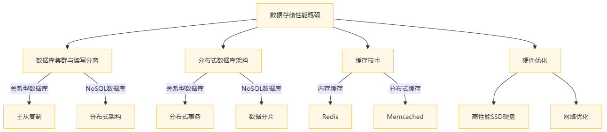

2\.数据一致性问题

问题描述：在分布式存储环境中，数据一致性是一个关键问题。例如，在NoSQL数据库中，由于分布式架构和数据复制机制，可能会出现数据副本之间的不一致情况，尤其是在高并发写入和网络分区的情况下。

解决方法：

一致性协议：采用一致性协议，如Paxos或Raft，确保在分布式系统中数据操作的原子性和一致性。例如，MongoDB的副本集采用Raft协议进行数据同步，确保数据在多个副本之间的一致性。

版本控制：引入版本控制机制，为每个数据项添加版本号，通过版本号来检测和解决数据冲突。

数据校验：定期进行数据校验和同步，确保不同副本之间的数据一致性。

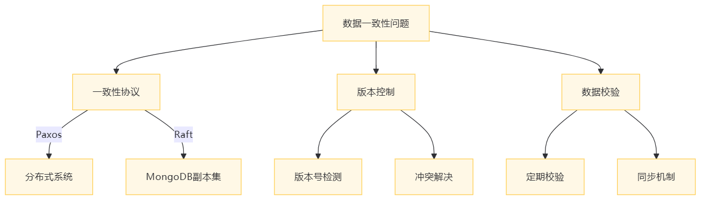

3\.数据备份与恢复问题

问题描述：数据备份与恢复是数据存储的重要环节，但在实际操作中可能会遇到备份数据不可用、恢复过程复杂、恢复时间过长等问题。

解决方法：

定期备份：制定合理的备份策略，定期进行全量备份和增量备份，确保备份数据的完整性和可用性。

异地备份：将备份数据存储在异地，防止因本地灾难导致数据丢失。

备份验证：定期验证备份数据的可恢复性，通过恢复测试确保备份数据的有效性。

快速恢复：优化恢复流程，采用快照备份和增量恢复技术，缩短恢复时间。

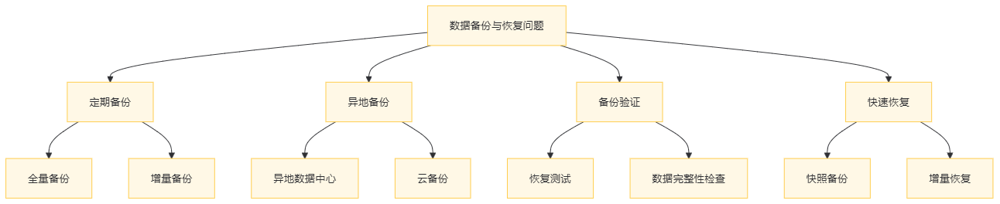

4\.数据安全与隐私问题

问题描述：物联网数据存储中，数据安全和隐私保护至关重要。数据可能面临泄露、篡改等风险，尤其是在分布式存储和网络传输过程中。

解决方法：

数据加密：对存储和传输中的数据进行加密，采用对称加密算法（如AES）或非对称加密算法（如RSA）保护数据隐私。

访问控制：严格控制数据访问权限，采用身份认证和授权机制，确保只有授权用户和系统能够访问敏感数据。

安全审计：定期进行安全审计，检查数据访问记录，及时发现和处理潜在的安全威胁。

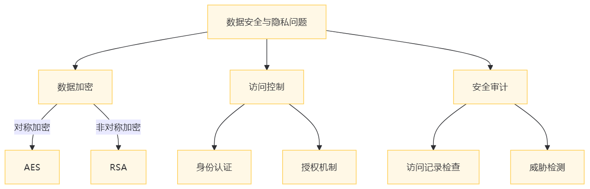

5\.分布式文件系统中的元数据管理问题

问题描述：在分布式文件系统中，随着文件数量的增加，元数据管理可能会成为性能瓶颈，导致文件检索和访问速度下降。

解决方法：

分布式元数据管理：采用分布式元数据管理方案，将元数据分散存储在多个节点上，减轻单点压力。

缓存机制：在客户端和元数据服务器端设置缓存，减少对元数据服务器的重复查询。

优化元数据结构：简化元数据结构，减少元数据的存储和检索开销。

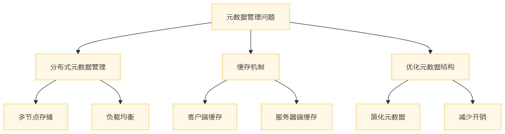

6\.数据存储成本问题

问题描述：随着数据量的不断增长，数据存储成本可能会成为企业的负担，尤其是在需要长期存储大量数据的情况下。

解决方法：

数据压缩：采用数据压缩技术，减少存储空间的占用。

数据归档：将不常用的数据归档到低成本的存储介质中，如磁带库或云端冷存储。

资源优化：合理规划存储资源，根据数据的重要性和访问频率，选择合适的存储介质和存储策略。

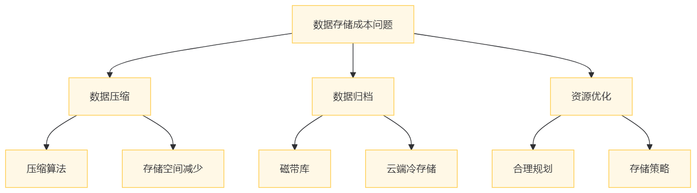

## 4\.5 数据缓存

在物联网（IoT）后端系统的复杂架构中，数据缓存策略犹如一位幕后英雄，默默提升着系统的整体性能与响应速度。它通过将频繁访问的数据暂存于高速存储介质（如内存），使得设备状态查询、实时数据交互等操作能够近乎即时完成，为用户带来流畅的体验。

### （1）内存缓存（如 Redis）的关键应用

以智能家居系统为例，这是一个典型的 IoT 场景，涵盖众多智能设备，如智能灯泡、智能门锁、智能摄像头以及各类传感器。在这个系统里，用户经常通过手机 APP 或智能音箱等控制终端，频繁查询设备的当前状态，像智能灯泡的亮度、颜色，智能门锁的开关状态，以及室内温湿度传感器的数据。此时，内存缓存就发挥了巨大作用。

采用 Redis 作为内存缓存工具，它能够以键值对的形式快速存储和检索这些设备状态数据。例如，将智能灯泡的设备 ID 作为键，其对应的亮度值、颜色值等状态信息作为值存储在 Redis 中。当用户通过 APP 发出查询请求时，后端系统首先在 Redis 缓存中查找对应的键值对，如果命中缓存，便能瞬间获取数据并返回给用户，整个过程耗时极短，通常在毫秒级别，极大提升了交互的实时性。

同样，在工业物联网领域，如自动化生产线上的设备监控系统，各类工业机器人、传感器时刻产生大量实时数据。对于设备的关键运行参数，如机器人手臂的关节角度、电机转速，以及生产线上的物料流量等数据，存储在 Redis 缓存中，能让生产管理人员在监控终端快速获取最新信息，以便及时做出生产调整决策，避免因数据获取延迟导致的生产停滞或质量问题。

### （2）缓存的更新策略

随着物联网设备持续运行，数据处于不断更新的动态过程，缓存数据如何与源数据保持同步成为关键问题。常见的缓存更新策略有基于时间和基于事件两种。

基于时间的更新策略相对简单直接。在智能交通系统中，道路上的车流量监测传感器每隔一定时间间隔（如 5 分钟）向后端系统上报数据。后端系统在接收新数据后，同时更新数据库和缓存中的对应车流量信息。对于缓存中的数据，设置一个有效期（如 TTL \- Time To Live 为 10 分钟），一旦超过有效期，下次查询时缓存自动失效，后端系统重新从数据库或源设备获取最新数据并更新缓存。这种策略适用于数据更新频率相对固定、对实时性要求不是极高的场景。但它存在的问题是，如果在有效期内源数据发生突变，缓存中的数据将在一段时间内滞后于实际情况，可能影响依赖实时数据的业务决策，如交通信号灯的智能调控。

基于事件的更新策略则更加灵活精准，能有效应对数据的突发变化。仍以智能交通为例，当道路上发生交通事故时，附近的车辆检测传感器、事故监测摄像头等设备会立即触发事件，向后端系统发送紧急数据更新请求，包括事故位置、拥堵范围、车辆滞留情况等信息。后端系统收到这些事件通知后，第一时间更新数据库，并同步使缓存中与该区域交通相关的数据失效，确保后续查询获取的是最新的事故现场数据。这种策略对实时性敏感的场景至关重要，但实现难度相对较大，需要后端系统具备强大的事件监听与处理能力，能够快速识别并响应各类来自不同设备的事件信号，同时避免因频繁的缓存失效与更新操作引发性能开销过大问题。

### （3）缓存一致性维护方法

在分布式 IoT 系统中，数据往往存在多个副本，缓存与数据库之间、不同缓存节点之间的数据一致性维护面临诸多挑战。例如在一个大型的智能物流园区物联网系统中，货物追踪设备、仓库管理系统、运输车辆监控等多个子系统相互协作，数据在不同的数据库实例、缓存服务器之间流转。

为保障缓存一致性，常用的方法有读写穿透与异步更新。读写穿透策略要求所有的数据读写操作都直接穿透缓存，访问数据库。当读取数据时，如果缓存未命中，从数据库加载数据并更新缓存；写入数据时，先更新数据库，再更新缓存，确保缓存与数据库的强一致性。但这种方式在高并发场景下，由于频繁的数据库交互，性能开销较大，容易造成读写延迟增加。

异步更新策略则相对缓和一些性能压力。写入数据时，后端系统先将数据更新到数据库，然后将更新操作异步发送到消息队列，缓存更新服务监听消息队列，在合适时机（如系统负载较低时）从数据库获取最新数据更新缓存。这种方式虽然在一定程度上容忍了短暂的数据不一致，但能显著提升系统的整体吞吐量，适用于对实时一致性要求稍低、追求高并发性能的 IoT 场景。不过，使用异步更新要注意消息丢失、更新延迟过长等问题，需要引入可靠的消息队列（如 Kafka），并设置合理的超时重试机制，确保缓存最终能与数据库达成一致。

### （4）防范缓存击穿、缓存雪崩等常见问题的策略

缓存击穿是指一个热点数据在缓存中过期，而大量并发请求同时穿透缓存直接访问数据库，导致数据库瞬间压力剧增，甚至可能使其崩溃。在热门的 IoT 应用，如大型智能演唱会现场的人员定位与设备管控系统中，当演出高潮时，观众频繁查询自己的位置信息以及周边设施（如洗手间、餐饮售卖点）的实时状态，若承载位置数据的缓存过期，瞬间涌入的海量查询请求将直击数据库，引发严重后果。

为防范缓存击穿，一种有效的方法是采用互斥锁机制。当发现缓存未命中且有大量并发请求时，使用分布式锁（如基于 Redis 的 SETNX 操作），只有获取到锁的单个请求去数据库查询数据并更新缓存，其余请求等待，直到缓存更新完成后再从缓存获取数据，避免数据库被海量并发压垮。

缓存雪崩则是指在某一时刻，大量缓存数据同时过期，导致大量请求直接涌向数据库，如同雪崩一般瞬间冲垮系统。以城市级别的智能电网监测系统为例，若在用电高峰期，多个区域的电量监测数据缓存同时失效，大量实时电量查询请求冲向数据库，电网后端系统将面临巨大压力，甚至可能导致电力调配决策延误，影响城市供电稳定。

预防缓存雪崩，一方面可以通过设置缓存数据的过期时间随机化，避免大量数据同时过期。例如，原本统一设置为 1 小时过期的数据，改为在 50 分钟到 70 分钟之间随机取值，使缓存失效时间均匀分布。另一方面，构建多级缓存架构，在内存缓存（如 Redis）之上，增加本地缓存（如应用服务器的内存缓存）或使用 CDN（内容分发网络）缓存，层层拦截请求，降低后端数据库压力，即使内存缓存出现大面积失效，也有其他缓存层缓冲，保障系统稳定运行。

### （5）缓存安全部分

在 IoT 系统中，许多缓存数据包含敏感信息，如智能家居中的用户家庭安防录像、智能医疗设备传输的患者健康数据、工业控制系统中的设备关键配置参数等。一旦缓存数据泄露，将引发严重的隐私泄露与安全风险。

以智能医疗场景为例，医院病房内的各类生命体征监测设备通过物联网连接后端系统，患者的心率、血压、血氧等实时数据在缓存中暂存以方便医护人员快速查看。为防止这些数据泄露，对缓存中的数据进行加密存储至关重要。采用对称加密算法（如 AES）或非对称加密算法（如 RSA），将数据加密后存储在缓存中，只有拥有对应解密密钥的授权人员或系统模块才能获取原始数据。

同时，在密钥管理方面，遵循严格的安全规范，定期更新密钥，避免因长期使用同一密钥导致被破解风险增加。并且，对于加密后的数据在缓存中的存储位置、访问权限进行精细管控，确保只有经过身份认证的后端服务或医护人员终端能够访问，防止非法获取加密数据后尝试暴力破解。

### （6）实践建议

在实际部署 IoT 后端系统的数据缓存策略时，有诸多要点需要关注。首先，在缓存选型方面，要综合考虑系统的性能需求、数据规模以及成本因素。对于小型智能家居初创企业，初期数据量较小、并发请求不高，可优先选用开源的轻量级缓存工具，如 Redis，利用其简单易用、社区支持丰富的特点快速搭建缓存系统，聚焦业务开发；而对于大型工业物联网平台，处理海量设备数据、高并发读写场景，可能需要定制化的企业级缓存解决方案，结合硬件加速、分布式存储等技术，满足严苛的性能要求，同时要权衡自建缓存集群与使用云缓存服务（如 AWS ElastiCache、阿里云 Redis 版）的成本效益。

其次，缓存配置参数的优化至关重要。根据 IoT 设备的数据更新频率、业务对实时性的敏感程度，精细调整缓存的有效期、更新策略相关参数。如在智能农业物联网系统中，对于土壤湿度、光照强度等实时性要求较高且更新频繁的数据，缩短缓存有效期至几分钟甚至几十秒，采用基于事件的更新策略，确保农作物生长环境数据的及时性，为精准灌溉、智能调光等控制决策提供可靠依据；而对于农产品库存数量等相对静态的数据，适当延长有效期，减少不必要的缓存更新开销。

再者，建立完善的缓存监控与运维体系。实时监测缓存的命中率、内存使用率、数据更新延迟等关键指标，通过可视化工具（如 Grafana 结合 Prometheus）直观展示缓存运行状态。一旦发现缓存命中率骤降、内存占用过高或更新延迟异常等问题，及时排查原因，可能是数据更新策略不合理、缓存键值设计不佳导致冲突，或者是系统遭遇缓存击穿、雪崩等潜在风险，提前预警并采取相应优化措施，保障缓存系统持续稳定运行。

最后，在团队协作方面，开发人员、运维人员与安全专家要紧密配合。开发人员在编写代码时，要遵循缓存使用的最佳实践，合理设计缓存数据结构、更新逻辑，避免因代码缺陷引发缓存一致性问题；运维人员负责日常的缓存服务器运维，保障硬件资源充足、网络稳定，根据业务发展动态调整缓存配置；安全专家则从数据加密、访问控制等多维度保障缓存安全，定期进行安全审计，排查潜在漏洞，三方协同作战，为 IoT 后端系统的数据缓存策略落地生根，助力整个物联网系统高效、稳定、安全运行。

### （7）常见问题和解决方法

在物联网后端系统中，数据缓存是提升性能和响应速度的关键技术，但在实际应用中也会遇到一些常见问题。以下是这些问题及其解决方法的详细描述：

1\. 缓存一致性问题

问题：在分布式系统中，缓存数据与数据库之间的同步可能会出现延迟或不一致的情况。例如，当缓存中的数据过期或被更新时，可能会导致缓存与数据库中的数据不一致。

解决方法：

读写穿透：所有数据读写操作直接穿透缓存，访问数据库，确保缓存与数据库的强一致性。

异步更新：写入数据时，先更新数据库，再通过消息队列异步更新缓存，减少对数据库的直接访问压力。

多级缓存架构：构建多级缓存架构（如本地缓存 \+ 分布式缓存），通过多层缓冲机制降低单点故障风险。

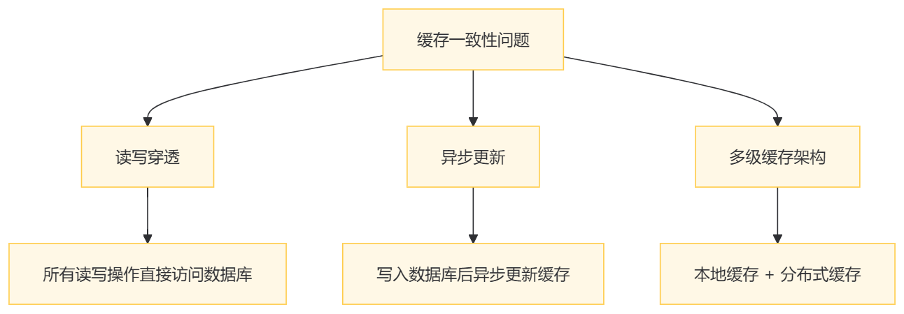

2\. 缓存击穿问题

问题：当一个热点数据在缓存中过期，大量并发请求同时穿透缓存直接访问数据库，导致数据库瞬间压力剧增，甚至可能使其崩溃。

解决方法：

互斥锁机制：当发现缓存未命中且有大量并发请求时，使用分布式锁（如基于 Redis 的 SETNX 操作），只有获取到锁的单个请求去数据库查询数据并更新缓存，其余请求等待，直到缓存更新完成后再从缓存获取数据。

本地缓存：在应用服务器上增加本地缓存，减少对分布式缓存的直接访问压力。

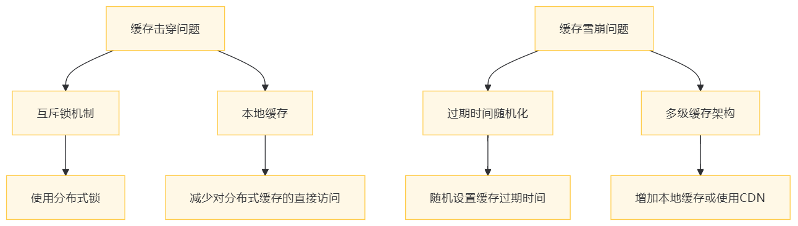

3\. 缓存雪崩问题

问题：在某一时刻，大量缓存数据同时过期，导致大量请求直接涌向数据库，如同雪崩一般瞬间冲垮系统。

解决方法：

过期时间随机化：设置缓存数据的过期时间随机化，避免大量数据同时过期。例如，原本统一设置为 1 小时过期的数据，改为在 50 分钟到 70 分钟之间随机取值。

多级缓存架构：构建多级缓存架构，在内存缓存（如 Redis）之上，增加本地缓存或使用 CDN 缓存，层层拦截请求，降低后端数据库压力。

4\. 缓存数据安全问题

问题：缓存数据可能包含敏感信息，如用户隐私数据、设备配置参数等，存在泄露风险。

解决方法：

数据加密：对缓存中的数据进行加密存储，使用对称加密算法（如 AES）或非对称加密算法（如 RSA）保护数据隐私。

访问控制：严格控制缓存数据的访问权限，确保只有经过身份认证的用户或系统模块能够访问敏感数据。

安全审计：定期进行安全审计，检查数据访问记录，及时发现并处理潜在的安全威胁。

5\. 缓存资源管理问题

问题：缓存系统可能会因为资源不足（如内存不足）而导致性能下降，甚至出现服务不可用的情况。

解决方法：

资源监控：实时监控缓存系统的资源使用情况，如内存使用率、CPU 使用率等。

自动扩展：根据资源使用情况自动扩展缓存系统，如使用 Kubernetes 的 HPA（Horizontal Pod Autoscaler）自动调整缓存服务的副本数量。

缓存淘汰策略：合理设置缓存淘汰策略，如 LRU（Least Recently Used）或 LFU（Least Frequently Used），确保缓存系统在资源有限的情况下仍能高效运行。

6\. 缓存性能优化问题

问题：在高并发场景下，缓存系统的性能可能会成为瓶颈，导致响应延迟增加。

解决方法：

并行处理：利用分布式缓存系统（如 Redis Cluster）进行并行处理，将请求分散到多个节点，提高处理效率。

缓存预热：在系统启动时，预先加载一些热点数据到缓存中，减少首次访问的延迟。

缓存分片：将缓存数据分片存储在多个节点上，通过哈希算法将请求分配到不同的节点，提高缓存的读写速度。
