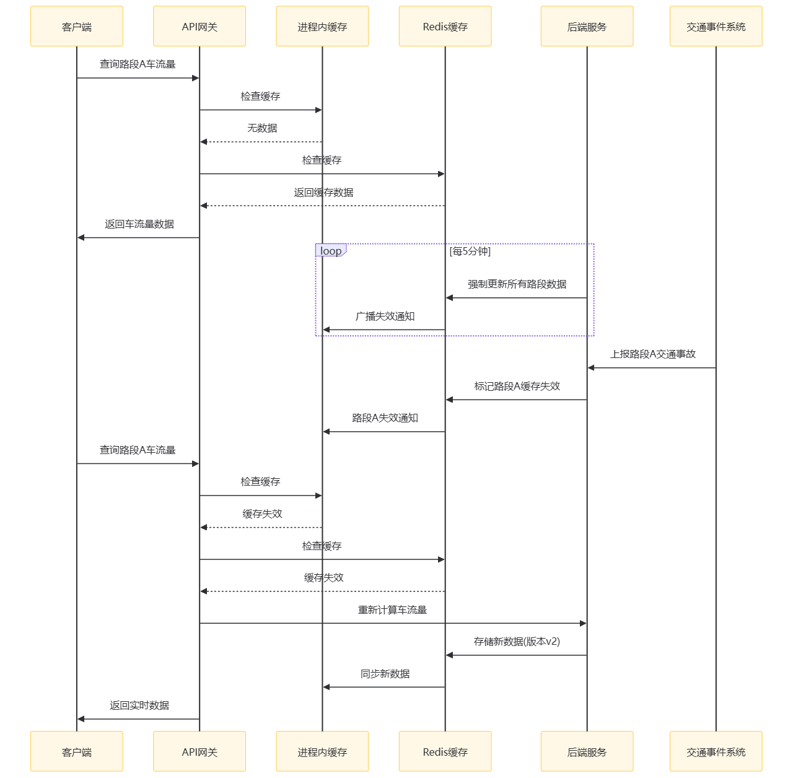
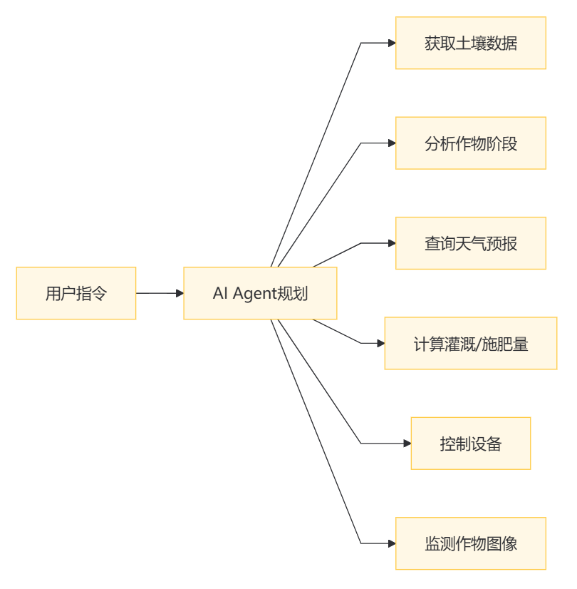
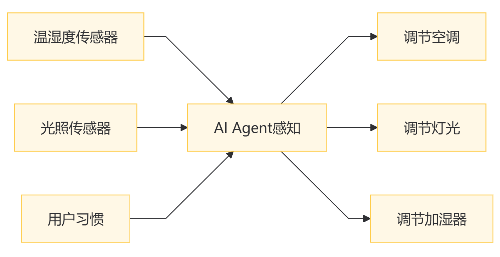
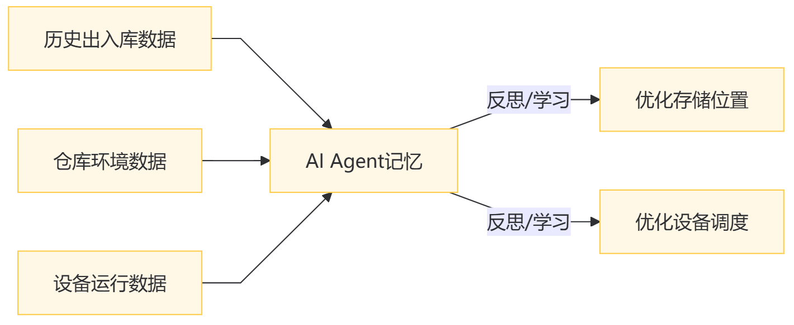
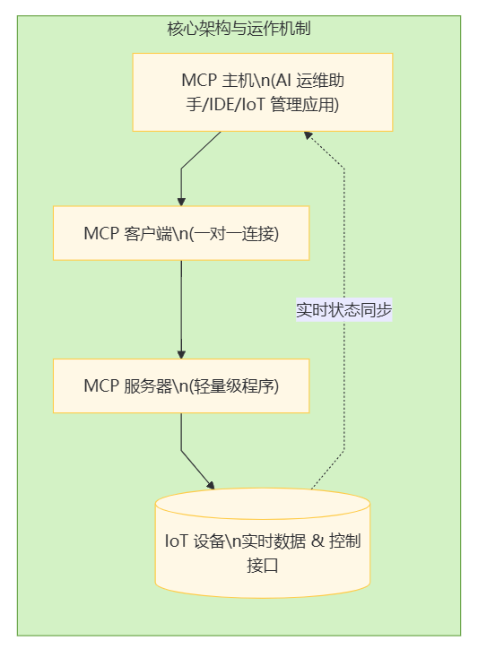
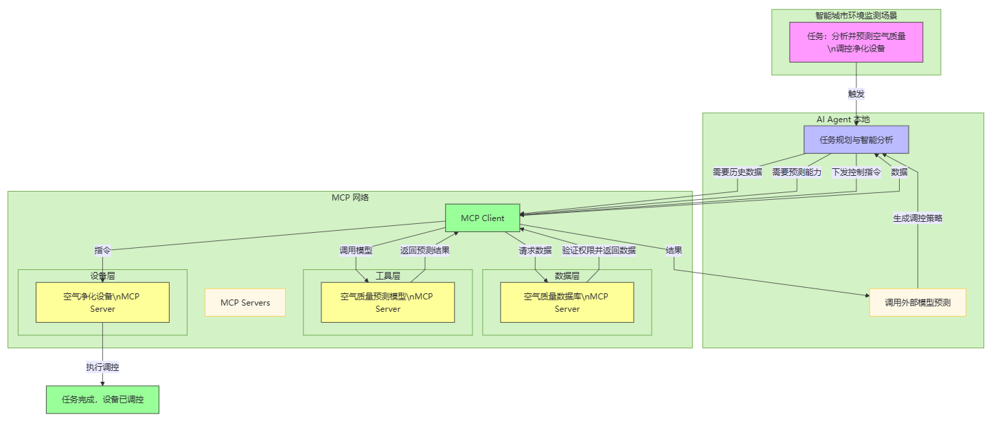
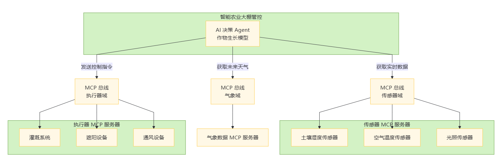
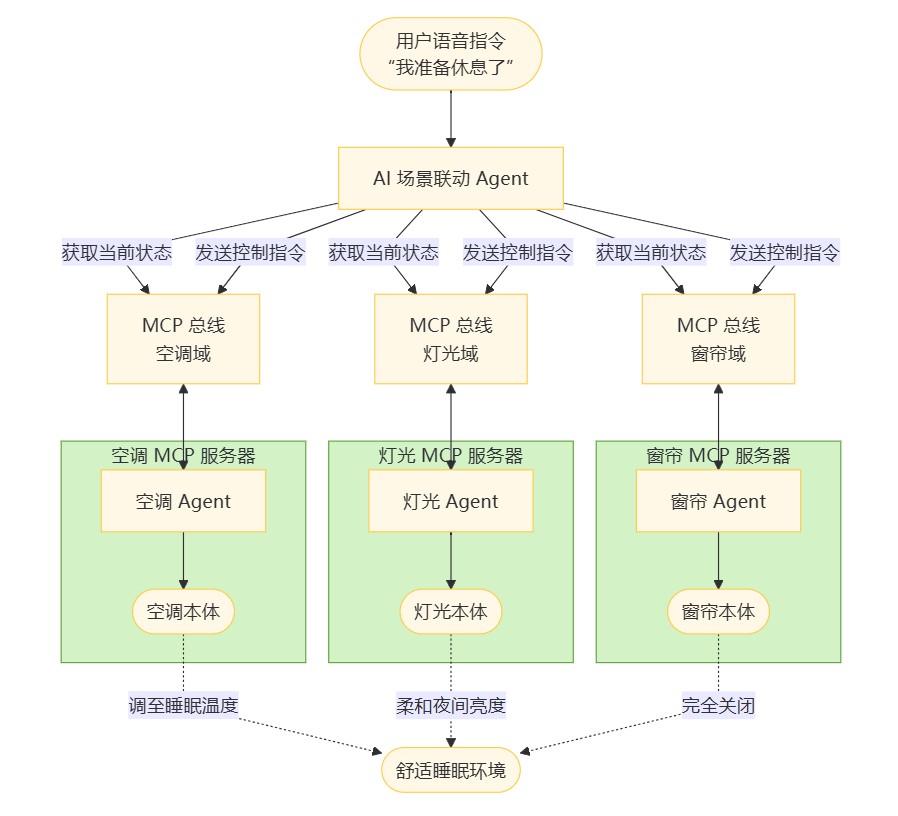

# 第五章：应用对接及AI大模型集成

## 5\.1 RESTful API 设计

在物联网（IoT）后端系统蓬勃发展的当下，设计契合 RESTful 风格的 API 至关重要，它犹如一座桥梁，连通着前端设备与后端服务，保障数据的顺畅交互。

### （1）资源的定义与命名

以智能城市中的交通管理系统为例，众多的交通信号灯、道路传感器、公交车辆等物联网设备源源不断地产生数据。在设计 API 时，首先要精准定义资源，将每个可操作的实体视为资源，如交通信号灯可定义为 “/trafficLights” 资源，道路传感器的数据则对应 “/roadSensors” 资源。

命名时需遵循清晰、简洁且具有描述性的原则。避免使用模糊或过于技术化的词汇，确保开发人员、运维人员以及可能接入的第三方合作伙伴都能迅速理解。比如，若针对某条特定道路的车流量传感器，命名为 “/roadSensor\_001” 就不如 “/mainStreetTrafficFlowSensor” 表意明确，后者直接点明资源所处位置与监测内容，降低沟通成本，提升开发效率。

然而，实际操作中常出现资源定义模糊的问题。在一个大型智能工厂物联网项目里，不同部门对生产设备的资源定义不一致，有的按照设备类型，有的依据设备所处车间区域，导致后续 API 整合困难，数据交互混乱。

为解决此问题，组建跨部门团队至关重要。团队成员涵盖设备工程师、软件开发者、业务专家等，共同依据业务流程与数据流向，制定统一的资源定义规范。在项目前期充分调研，梳理所有涉及的物联网设备与数据类型，建立详细的资源目录，为后续 API 设计奠定坚实基础。

### （2）HTTP 方法的合理运用

继续以智能交通系统为例，对于 “/trafficLights” 资源，当需要查询某个信号灯的当前状态（如红灯持续时间、绿灯切换频率等）时，合理运用 HTTP GET 方法，向 “/trafficLights/\{id\}” 发送请求，后端返回对应信号灯的状态信息，简洁高效。若要远程控制信号灯切换，比如在紧急救援车辆通行时，使用 HTTP PUT 或 PATCH 方法，向 “/trafficLights/\{id\}” 提交新的状态指令，精准改变信号灯运行模式。

但在高并发场景下，不合理的 HTTP 方法使用易引发问题。例如，频繁使用复杂的 POST 请求去查询数据，而不是用 GET，会导致请求处理逻辑复杂，占用过多服务器资源。同时，若对一些非幂等操作（如 POST 创建新资源）在高并发时重复调用，可能会产生重复数据，扰乱系统正常运行。

应对之策是加强开发规范培训，让团队成员深刻理解 HTTP 方法的语义与适用场景。在代码审查阶段，重点关注 HTTP 方法的使用是否合规，对于高并发频繁访问的 API，进行性能测试，依据测试结果优化方法调用逻辑，确保高效稳定。

### （3）请求和响应格式的设计

在智能农业物联网系统中，农场的土壤湿度传感器、气象站等设备与后端交互数据。请求格式方面，通常采用 JSON 格式，因其简洁易读、通用性强。例如，土壤湿度传感器向 “/soilMoisture” 资源发送数据时，以 JSON 包裹测量值、时间戳、传感器位置等信息：

```json
{
  "value": 60,
  "timestamp": "2024-09-15T10:30:00Z",
  "location": "Field_001"
}
```

响应格式同样以 JSON 为主，后端给前端返回查询结果或操作反馈时，结构清晰，便于解析。如查询某区域气象数据，返回：

```json
{
  "temperature": 25,
  "humidity": 70,
  "windSpeed": 3,
  "lastUpdated": "2024-09-15T11:00:00Z"
}
```

不过，随着物联网设备增多，数据量膨胀，若响应数据未经优化，可能导致传输延迟。比如，在智能电网监测系统中，一次性返回大量电表的详细用电数据，可能使网络带宽吃紧，响应变慢。

此时，采用数据分页、按需加载技术成为关键。对于查询大量电表数据的请求，后端允许前端传入分页参数（如 pageSize、pageNumber），仅返回指定页的数据，减轻单次传输负担。同时，根据前端需求，筛选关键数据返回，避免冗余信息传输，提升响应速度。

### （4）API 网关的应用

在大型智能物流园区物联网系统里，海量的货物追踪设备、仓库门禁设备等频繁与后端交互，高并发访问如汹涌潮水。API 网关在此扮演关键角色，它如同一位智能卫士，位于前端设备与后端服务之间。

一方面，通过限流机制，防止过多请求瞬间涌入后端。例如，设定每秒允许 1000 个请求通过，当并发量超过阈值，网关直接拒绝多余请求，返回友好提示信息，避免后端服务因过载崩溃。另一方面，采用熔断机制，当后端某个服务出现故障或响应延迟过高，如仓库管理服务暂时不可用，网关迅速切断对该服务的请求，将错误信息快速反馈给前端，同时启动降级策略，返回缓存的旧数据或默认数据，保障整体系统基本运行。

但 API 网关自身也可能成为性能瓶颈。若配置不当，如限流阈值设置过低，会误拒大量正常请求；过高则无法有效保护后端。另外，网关的路由规则复杂时，可能出现请求转发错误。解决办法是依据业务峰谷时段、历史并发数据，科学设置限流、熔断参数。利用性能测试工具模拟高并发场景，反复调优。同时，建立完善的网关监控体系，实时关注请求流量、错误率、转发成功率等指标，一旦发现异常，及时调整配置。

### （5）缓存机制优化响应时间

以智能交通系统为例，车流量数据查询 API 具有特殊性，由于道路车流量在短时间内相对稳定，引入缓存机制能够显著提升响应速度。具体做法是，在 API 网关或后端服务前设置一层缓存（如 Redis）。当首次查询某个路段的车流量时，后端将计算结果存入缓存，后续相同的请求便可直接从缓存中读取数据。

然而，缓存机制也面临着失效与一致性方面的难题。例如，若发生交通突发状况（如交通事故、临时交通管制），车流量会突然变化，此时缓存中的数据可能就过时了。同时，当后端更新车流量数据后，如果缓存未能及时同步，就会出现数据不一致的情况。



为解决这些问题，可以结合基于时间与基于事件的缓存更新策略。在常规时段，按照固定的时间间隔（如 5 分钟）对缓存进行更新；一旦遇到交通事件，后端主动推送更新通知，使缓存失效，进而重新计算并加载最新数据。此外，还可以通过缓存版本控制、校验和等手段，确保数据的一致性，从而保障 API 的高效运行。

### （6）实践建议

在着手设计 IoT 后端系统的 RESTful API 时，前期规划要充分调研业务需求，梳理设备类型、数据流向与操作场景，绘制详细的 API 蓝图，明确资源、方法、格式规范。开发过程中，遵循模块化设计理念，将不同功能的 API 封装成独立模块，便于维护与扩展。团队要建立严格的代码审查制度，重点审查 API 设计规范的遵循情况，及时纠正问题。

部署上线前，利用性能测试工具（如 JMeter、LoadRunner）模拟高并发、大数据量场景，测试 API 的响应时间、吞吐量、错误率等指标，依据测试结果优化 API 设计与配置。上线后，持续监控 API 的运行状态，借助日志分析、APM（应用性能管理）工具洞察用户请求行为、性能瓶颈，定期回顾优化，确保 API 在物联网复杂环境下长期稳定高效运行，为整个后端系统的价值释放提供坚实支撑。

## 5\.2 消息队列与事件驱动架构

在物联网（IoT）蓬勃发展的浪潮中，消息队列与事件驱动架构如同坚实的桥梁，连通着系统各个组件，保障数据流畅传递，实现高效异步协作。

### （1）异步消息处理

以智能家居系统为例，家中智能灯泡、智能窗帘、智能门锁等设备各自运行又需协同。当用户通过手机 APP 下达“回家模式”指令，若采用同步调用，后端依次向各设备发指令并等待响应，一旦某设备延迟，整个流程卡顿，用户体验不佳。

引入消息队列后情况大不同。如 RabbitMQ，后端将“回家模式”指令作为消息发往“home\_mode”主题，各设备对应的消费者服务订阅该主题，异步获取指令执行。智能灯泡亮起、窗帘拉开、门锁解锁同步进行，互不干扰，大幅提升响应速度，让用户踏入家门即刻享受便捷。

不过，异步消息处理有难题。一方面，消息易堆积。在大型智能办公场所，数百智能传感器频繁向后台传环境数据，若后端消费能力不足，消息队列长度疯涨，占用大量内存，甚至致系统崩溃。另一方面，异步执行使消息处理顺序难保证。像智能工厂生产线，产品组装工序指令乱序执行，次品率会飙升。

针对消息堆积，需合理配置消费者数量与处理能力。依消息产生速率，动态调整消费者实例数量，经性能测试找平衡点；同时优化消费者代码逻辑，采用多线程、异步 I/O 技术加速。对于消息顺序，为关键消息设优先级，确保紧急设备故障通知等优先处理；或在消息体嵌序列号，消费者依序执行，保障业务逻辑正确。

### （2）解耦系统组件

在智能交通系统里，交通信号灯、车辆违章监测、道路路况监测系统原本紧密耦合，信号灯控制系统升级，按传统紧耦合架构，违章与路况监测系统接口需同步调整，开发成本高、周期长。

借助消息队列构建事件驱动架构可实现解耦。如 Kafka，信号灯状态变化、违章事件、路况数据更新等作为独立事件发往各自主题，其他系统按需订阅。信号灯系统升级时，只要事件发布格式不变，订阅方就能正常工作，系统灵活性大增。

但解耦并不容易。首先，组件依赖关系梳理复杂。物联网项目初期，团队专注功能实现，忽视潜在依赖，后期解耦才发现联系繁杂，难以彻底分离。其次，事件定义与版本管理困难。业务发展使事件含义、数据结构变化，缺乏统一管理，新旧版本不兼容，订阅方无法正确解析消息。

解决依赖，要在前期开展全面架构设计，绘制详细组件依赖图，明确数据流向与交互逻辑；建立跨团队沟通机制，定期评审架构，清理不合理依赖。对于事件版本管理，采用语义化版本命名，制定兼容性策略，主版本变更不兼容，次版本新增功能向后兼容，同时提供版本转换工具确保通信正常。

### （3）基于消息队列的事件发布\-订阅机制设计

在智能物流园区，货物入库、出库、运输途中状态更新等事件频发。设计高效的事件发布-订阅机制是关键。以 Kafka 为例，物流管理系统作为生产者，将不同事件发往特定主题，如“warehouse\_inbound”“warehouse\_outbound”“transport\_status”等。

下游系统如库存管理、运输调度系统按需订阅。订阅时可灵活设分区策略，依货物区域、运输线路划分，确保消息精准推送，减少网络与处理负担。如负责某区域库存系统只订该区域货物出入库主题对应分区，聚焦关键信息。

常见问题是主题与分区设置不合理。大型物联网项目初期随意定义主题，未考虑扩展性，业务增长后新需求难适配，频繁重构代价高；分区不均会使部分负载过重，消息处理延迟，影响效率。

优化策略是项目启动前结合业务流程、数据规模与增长预期规划主题架构，按业务领域、操作类型分层分组，预留扩展空间；定期用 Kafka 自带工具分析分区负载、重新平衡分区，保障消息均匀分发。

### （4）处理消息的可靠性、顺序性和重复消费问题

在工业物联网自动化生产线中，各类消息的准确传输至关重要。例如生产设备控制指令、质量检测数据传输等，对消息可靠性要求极高。若消息丢失，可能导致生产中断，甚至出现次品流出的严重后果。

在消息可靠性保障方面，RabbitMQ 和 Kafka 各有其法。在 RabbitMQ 中，通过开启消息持久化功能，可确保在服务器重启或发生故障时，消息不会丢失。同时，生产者采用确认机制，只有收到队列存储确认后，才认定消息发送完成。而 Kafka 同样具备高度可靠性，它通过多副本机制，将分区消息复制到多个 broker 节点，当主节点出现故障时，从节点能够迅速接替工作，保证数据的正常读写。

消息传递存在 “最少消费一次” 和 “最多消费一次” 的模式。“最少消费一次” 意味着消息至少会被消费一次，这种模式注重消息的可靠性，即使在网络波动、节点故障等异常情况下，消息也不会丢失，必然会被传递给消费者。但这可能会导致消息重复消费的问题。例如在工业物联网中，设备状态更新消息必须确保传递到后端系统，采用 “最少消费一次” 模式，即使出现短暂网络故障，系统恢复后消息依然会被投递，若要求不能重复消费，那么消费端要支持幂等处理，让重复消费也不会带来负面影响。而 “最多消费一次” 则强调消息只会被消费一次，不会出现重复消费的情况，但这种模式可能会因为网络问题等原因，导致部分消息丢失。例如在一些对数据准确性要求不那么高，偶尔丢失也不会有较大负面影响，更注重处理效率的场景中，可能会采用 “最多消费一次” 模式。

在顺序性方面，对于化工生产化学反应流程控制指令这类必须严格按顺序执行的消息，不同消息队列有不同的保障方式。RabbitMQ 可以将关联消息发送到同一个队列，利用队列先进先出的特性，保证消息的顺序性。Kafka 则可为关联消息设置相同的消息 Key，使其进入同一分区，消费者消费该分区时即按生产顺序处理。

重复消费是不容忽视的隐患，网络波动、消费者重启等情况都可能导致消息被多次处理。例如在智能电表数据采集过程中，重复上报的数据会干扰用电量统计的准确性。为解决这一问题，消费者端可引入幂等性设计，为每条消息生成唯一 ID，并记录已处理的 ID 列表，在消费消息前进行校验。

然而，保障这些特性时需要权衡性能。过度追求可靠性，频繁的确认操作和消息持久化会增加系统开销；而严格保证消息的顺序性，可能会限制系统的并发处理能力。因此，需要依据业务对数据质量与性能的侧重，精细配置相关参数。

### （5）消息队列在高可用架构中的作用

在城市级智能电网系统，电网状态监测、电力调配指令下发不能中断。消息队列的高可用特性至关重要。

Kafka 凭借多副本机制，分区消息复制到多 broker 节点，主故障从接替，保障读写。客户端引入自动重连、故障转移，生产者连主 broker 中断自动连备用；消费者同理，节点切换无缝换数据源。

RabbitMQ 高可用通过镜像队列实现，将队列复制到多节点，主节点不可用，镜像节点顶上。同时支持集群部署，节点间协同，提升整体可用性。

不过，高可用配置有挑战。Kafka 副本同步延迟可能致数据不一致，跨地域多中心部署时网络延迟加剧问题；RabbitMQ 集群节点过多也会有同步开销与管理复杂性。运维上，都需监控多节点、处理同步故障。

应对之策是合理选副本或镜像数量、放置策略，依数据重要性、网络权衡。用监控工具实时跟踪同步状态、节点健康，建自动化运维流程，异常及时修复或切换。

### （6）Kafka 与 RabbitMQ 对比及适用场景

- **性能特点**：
	- Kafka 具有高吞吐量，每秒可处理几十万甚至上百万条消息，这得益于其分区并行处理与顺序磁盘写入机制，适合大规模数据高速传输场景，如海量物联网设备数据实时汇聚分析。RabbitMQ 吞吐量相对较低，处理高频小消息时性能瓶颈更明显，但在低并发、对实时性要求极高且消息处理逻辑复杂场景下，能凭借灵活的路由与精细的消息优先级控制，保障关键消息即时处理。
- **可靠性**：
	- Kafka 多副本机制结合分区 leader\-follower 模型，数据可靠性强，只要多数副本存活，数据就不丢失，适用于不容许数据缺失的关键业务，如智能电网控制指令下发。RabbitMQ 的消息持久化与确认机制同样保障可靠性，且在应对网络抖动等不稳定因素时，对未确认消息的重传策略更灵活，适合对事务完整性要求高、消息可能因环境因素需多次确认的场景，如金融支付类物联网应用中的交易信息传递。
- **功能特性**：
	- Kafka 作为分布式流处理平台核心组件，内置强大的流处理能力，方便对物联网数据实时转换、聚合，从原始设备数据直接生成洞察，在智能城市实时交通流量分析等场景大放异彩。RabbitMQ 插件生态丰富，像支持多种消息协议，方便与不同老旧系统集成，在企业既有物联网设施与传统 IT 系统融合时优势突出，可快速打通数据孤岛。
- **使用复杂度**：
	- Kafka 集群配置、管理相对复杂，涉及多组件协调、分区与副本精细调控，需专业运维团队，适合大型成熟物联网项目，有资源投入长期优化架构。RabbitMQ 入门简单，单节点部署便捷，运维成本低，对初创型或中小规模物联网企业快速验证业务想法、搭建基础消息传递功能极为友好。

### （7）实践建议

前期选型需全面综合评估多个关键因素，包括产品特性、社区活跃度、与现有技术栈兼容性、技术团队的熟悉程度、IT 资产复用情况以及成本等。

对于初创型 IoT 项目，如果业务场景相对简单，设备连接数和数据量预计在短期内不会急剧增长，且团队对消息队列技术的经验相对较少，那么 RabbitMQ 是一个不错的选择。它上手快、运维简便，有助于团队快速搭建消息传递机制，将更多精力聚焦于业务的快速迭代。然而，如果初创项目从一开始就预期会面临高并发的设备连接，或对数据处理的吞吐量和实时性有较高要求，即使团队规模较小，Kafka 凭借其在高并发场景下的卓越性能，也可能是更合适的开端，尽管其学习成本相对较高，但能避免后期因业务增长带来的技术栈切换成本。

对于成熟项目，若业务场景涉及大规模数据的高并发处理，如海量设备的数据采集与分析、实时流处理等，且拥有专业的运维团队来管理复杂系统，企业级 Kafka 无疑能满足高并发、高可用的严格需求。但如果成熟项目的业务对消息队列的性能要求并非极端高并发，且现有技术栈与 RabbitMQ 已深度集成，为避免大规模技术改造带来的风险和成本，继续使用 RabbitMQ 并对其进行优化，同样可以满足业务需求。

架构设计阶段：深入剖析业务流程，梳理事件源、消费者与依赖关系，绘制清晰的架构图。同时，制定详细的消息规范，涵盖主题命名、消息格式、版本策略等，为团队协作与系统扩展奠定坚实基础。

开发过程：封装通用代码，例如生产者、消费者模板，以降低上手难度并提高代码质量。建立全面的测试体系，包含单元、集成、压力测试等，重点验证消息传递的可靠性、顺序性以及处理性能，确保系统稳定运行。

上线后：持续监控队列运行指标，如长度、处理速率、延迟、节点状态等，借助可视化工具洞察系统健康度。定期回顾架构，依据业务和技术的演进进行优化，挖掘系统潜力，助力系统升级。

### （8）Kafka的部分关键设计

一、Key的设计

在 Kafka 中，消息 key 是一个重要的设计元素，它对数据的分布、处理和查询都有着深远影响。在高并发的物联网场景下，合理设计消息 key 尤为关键。

- **数据分区与有序性**：消息 key 可用于决定消息发送到哪个分区。如果希望特定设备或特定类型的数据始终发送到同一个分区，以便后续进行有序处理，可将设备 ID 或数据类型作为消息 key。例如，在工业物联网中，对于同一台设备产生的所有数据，以设备 ID 作为消息 key，这些数据就会被发送到同一个分区，后续消费者在处理该分区数据时，能保证按照生产顺序消费，这对于需要按顺序处理的设备状态数据、故障告警数据等非常重要，确保数据处理的一致性和准确性。
- **负载均衡与并行处理**：若要实现数据在各个分区上的均匀分布，以充分利用 Kafka 的并行处理能力，可采用哈希算法对消息 key 进行处理。例如，将设备产生的时间戳与设备 ID 拼接后进行哈希运算，得到的哈希值作为消息 key，这样能使不同设备在不同时间产生的数据较为均匀地分布在各个分区，避免某些分区数据量过大，而某些分区闲置的情况，提升整体的写入和处理性能。
- **数据查询与关联**：消息 key 还可用于数据的快速查询和关联。在物联网数据处理中，常常需要将不同来源但相关的数据进行关联分析。例如，在智能物流场景中，将货物 ID 作为消息 key，这样与同一货物相关的运输位置数据、温度湿度监测数据等都可以通过相同的 key 进行关联，方便后续在数据分析阶段进行多维度的数据整合和挖掘。

二、分区数的选择

分区数是 Kafka 集群配置中的一个关键参数，对高并发数据接入的性能有着决定性影响。

- **基于数据量与吞吐量预估**：在规划分区数时，首先要对物联网设备产生的数据量和期望的吞吐量进行预估。如果预计有大量设备在短时间内产生海量数据，且希望达到较高的写入和读取吞吐量，就需要设置较多的分区数。例如，在智慧城市项目中，若有数十万个传感器同时上报数据，每个传感器每秒产生多条数据，为了避免写入瓶颈，可根据数据量和预期吞吐量，通过性能测试确定每个分区每秒能够处理的数据量，进而计算出所需的分区数。一般来说，在硬件资源允许的情况下，适当增加分区数可以提升吞吐量，但也要注意避免分区数过多导致的管理成本增加和性能下降。
- **考虑消费者并行度**：分区数还应与消费者的并行度相匹配。因为每个消费者组中的消费者实例会并行消费不同的分区。如果分区数过少，消费者的并行度就会受限，无法充分利用系统资源来处理数据；反之，如果分区数过多，而消费者实例较少，就会导致部分分区长时间处于闲置状态，浪费资源。例如，在一个处理视频监控数据的物联网应用中，若有 10 个消费者实例，为了让每个消费者都能充分工作，可将分区数设置为 10 的倍数，如 20 或 30 个分区，以实现消费者与分区的高效匹配，提升整体的数据处理效率。
- **硬件资源与成本限制**：硬件资源也是影响分区数选择的重要因素。每个分区在 Kafka 中都对应着一定的磁盘空间和内存资源占用。过多的分区会增加磁盘 I/O 负担和内存消耗，可能导致系统性能下降。同时，增加分区数可能需要更多的服务器资源来支撑，这会带来成本的上升。因此，在选择分区数时，需要在性能需求和硬件成本之间进行权衡。例如，对于一些资源有限的小型物联网项目，虽然数据量较大，但考虑到成本因素，可能需要适当减少分区数，并通过优化其他参数（如批量发送消息、调整副本因子等）来提升性能。

三、发送消息生产者的 acks 设置

acks 是 Kafka 生产者发送消息时的确认机制，它决定了生产者在收到服务器响应之前需要等待的副本确认数，对于保证数据可靠性和吞吐量有着重要作用。

- **acks = 0**：当 acks 设置为 0 时，生产者在发送消息后不会等待任何来自服务器的确认，直接继续发送下一条消息。这种设置可以获得非常高的吞吐量，因为它几乎没有等待时间。然而，这是以牺牲数据可靠性为代价的，因为如果服务器在接收到消息之前发生故障，消息就会丢失。在一些对数据可靠性要求不高，且追求极致吞吐量的物联网场景中，如某些环境监测数据的采集，即使少量数据丢失也不影响整体趋势分析，可采用此设置。
- **acks = 1**：当 acks 设置为 1 时，生产者在发送消息后，会等待 leader 副本确认已成功接收消息。这意味着只要 leader 副本所在的 broker 节点不发生故障，消息就不会丢失。这种设置在吞吐量和数据可靠性之间取得了一定的平衡，适用于大多数对数据可靠性有一定要求，但又希望保持较高写入性能的物联网场景。例如，在智能电网的数据采集系统中，大部分数据的准确记录对于电网的稳定运行至关重要，但对实时性要求也较高，采用 acks = 1 可以在保证数据基本可靠的同时，满足系统对数据快速写入的需求。
- **acks = all（或 \-1）**：当 acks 设置为 all 或 \-1 时，生产者在发送消息后，会等待所有同步副本（ISR）中的副本都确认已成功接收消息。这种设置提供了最高的数据可靠性，因为只有当所有的同步副本都成功接收消息后，生产者才会认为消息发送成功。然而，这也会导致较低的吞吐量，因为需要等待所有副本的确认，增加了消息发送的延迟。在对数据可靠性要求极高的物联网场景中，如金融物联网中的交易数据记录、医疗物联网中的患者关键生理数据采集等，必须采用 acks = all 的设置，以确保数据的绝对准确和不丢失。

## 5\.3 与第三方系统集成

在物联网（IoT）生态系统日益复杂的当下，物联网后端系统与第三方系统的集成已成为实现全方位智能化运营的关键环节。无论是提升企业内部管理效率，还是拓展对外服务能力，与第三方系统的协同都蕴含着巨大潜力，但这一过程也充满挑战。

### （1）集成的途径

在众多集成途径中，API 调用是最为常见且直接的方式之一。以智能工厂为例，为实现精细化生产管理，工厂的 IoT 后端系统需要与企业资源规划（ERP）系统紧密结合。通过 ERP 系统提供的开放 API，IoT 后端可以获取原材料库存信息、生产订单详情等关键数据，从而依据实时的设备运行状况、物料消耗速率，智能调整生产计划。例如，当某条生产线的关键设备出现故障预警，IoT 后端系统利用 API 向 ERP 系统查询该生产线上半成品及原材料的库存情况，结合订单交付期限，决定是否需要紧急调配资源、调整后续生产线的排期，或是通知采购部门提前补货。

然而，API 调用并非一帆风顺。不同系统的 API 设计风格、接口规范往往大相径庭，这就导致在对接时需要耗费大量精力进行适配。有些 API 可能采用 RESTful 风格，而另一些则是基于 SOAP 协议，数据格式、请求方法、响应结构都存在差异。在一个智能家居与第三方电商平台集成的项目中，智能家居后端系统期望通过电商平台的 API 获取用户购买的智能设备配件信息，以便为用户提供更便捷的安装指导与售后增值服务。但电商平台的 API 数据返回格式复杂，嵌套层级较多，智能家居后端开发人员不得不花费大量时间编写解析代码，增加了开发成本与出错风险。

数据共享协议则为一些特定场景下的集成提供了另一种思路。在医疗物联网领域，医院的 IoT 设备管理系统与医疗影像信息系统（PACS）之间，由于涉及大量敏感的患者医疗数据，采用符合医疗行业规范的数据共享协议，如 DICOM（医学数字成像和通信）标准，来确保数据在不同系统间安全、准确地传输。通过遵循这些专用协议，影像数据、设备监测数据、患者病历信息等可以在保护隐私的前提下实现互联互通，医生能够在统一的工作平台上全面了解患者病情，做出更精准的诊断决策。

但这类专用协议也存在局限性，其学习成本高，部署难度大，需要相关人员具备深厚的专业知识背景。而且，一旦协议更新或出现兼容性问题，排查与修复问题的难度也相应增加。例如，当医院引入新的影像设备，若该设备对 DICOM 协议的某些扩展功能支持不完整，可能导致影像无法正常上传至 PACS 系统，影响整个诊疗流程的连贯性。

### （2）数据交换格式

JSON（JavaScript Object Notation）作为一种轻量级的数据交换格式，在 IoT 与第三方系统集成中广泛应用。以智能交通系统为例，当与第三方的地图导航应用集成时，IoT 后端系统将实时交通路况信息（如路段拥堵程度、交通事故位置、道路施工情况等）以 JSON 格式推送出去，地图应用便能迅速解析并直观地展示给用户，帮助其规划最优出行路线。JSON 的简洁性、可读性强以及易于解析的特点，使得不同系统间的数据交互变得高效流畅，尤其适用于实时性要求较高、数据结构相对灵活的场景。

不过，JSON 也并非万能。在一些对数据精度、格式要求严苛的领域，如金融物联网，涉及资金交易、账务清算等关键业务环节，XML（eXtensible Markup Language）凭借其严格的语法规则、丰富的标签定义，能够确保数据的完整性与准确性。例如，银行的 IoT 支付系统与第三方支付网关集成时，采用 XML 格式来传递交易指令、对账信息等，各个字段都有明确的定义与约束，有效避免了因数据歧义导致的交易风险。

但 XML 的缺点也很明显，相较于 JSON，它的数据冗余度较高，解析过程更为复杂，占用更多的网络带宽与系统资源。在大规模 IoT 数据交互场景下，如果不合理优化，容易引发性能瓶颈。比如在智能电网的电费结算系统与第三方财务软件集成时，若大量用电数据以 XML 格式频繁传输，不仅会加重网络负担，还可能使财务软件在解析数据时出现卡顿，影响结算效率。

### （3）安全机制

在与第三方系统集成过程中，数据传输过程中的加密至关重要。TLS/SSL 协议如同坚固的盾牌，保障数据在网络中传输的安全性。以智能物流系统为例，物流企业的 IoT 后端与第三方的供应链金融服务平台集成时，涉及货物运输信息、企业信用数据、资金流水等敏感信息的交互。通过启用 TLS/SSL 加密连接，确保这些数据在公网传输过程中不被窃取或篡改，防止物流企业商业机密泄露以及客户信息安全受到威胁。

即便有加密协议保驾护航，密钥管理仍是一大挑战。若密钥生成过于简单，容易被暴力破解；若长期使用同一密钥，随着数据交互量增加，被破解的风险也会逐步累积。在一个工业物联网项目中，制造企业的设备监控系统与第三方的远程维护服务平台集成，由于密钥管理不善，黑客通过长时间收集加密数据，利用密钥更新不及时的漏洞，成功破解加密信道，获取了设备的控制权限，给企业生产带来严重损失。

第三方系统接入的安全审计同样不可或缺。这包括对第三方系统身份的认证、访问权限的精细控制以及操作行为的全程记录与回溯。在智慧城市的 IoT 管理平台与多个第三方数据分析公司集成时，只有通过严格的身份认证（如基于数字证书、多因素认证等方式）的第三方系统才能接入。并且，根据不同公司的业务需求，为其分配最小化的访问权限，例如只允许读取特定区域、特定类型的 IoT 数据。同时，详细记录每个接入系统的操作日志，一旦出现异常数据访问或可疑行为，能够迅速追溯源头，及时采取措施止损。

### （4）处理系统间差异与兼容性问题

系统间的差异与兼容性问题是集成过程中的 “硬骨头”，通常是需要投入较多时间和精力的部分。不同第三方系统可能基于不同的操作系统、编程语言、数据库架构构建，这就导致在数据交互、功能调用时容易出现不兼容现象。以智能农业 IoT 系统为例，农场的设备监测与控制系统若要与第三方的农产品电商销售平台集成，前者可能基于 Linux 系统，使用 Python 开发，数据库采用 MySQL；而电商平台或许运行在 Windows 服务器上，用 Java 编写，后端是 Oracle 数据库。数据类型的不匹配、函数调用方式的差异等问题随之而来，如日期格式的不同，在数据同步时可能造成误解；某些特定的数据库函数在跨平台调用时无法正常执行，影响业务流程的连贯性。

为解决这些问题，中间件技术应运而生。中间件作为位于不同系统之间的 “翻译官”，屏蔽了底层系统的差异，提供统一的接口供双方系统调用。例如，在上述智能农业集成场景中，采用企业服务总线（ESB）中间件，它能够自动适配不同的数据格式、协议以及函数调用规范，将来自 IoT 系统的设备数据按照电商平台可接受的方式进行转换与传输，反之亦然，确保双方系统无缝对接。

然而，中间件的引入也增加了系统架构的复杂性与运维成本。一方面，中间件自身需要专业的运维团队进行管理与优化，确保其稳定运行；另一方面，一旦中间件出现故障，可能导致整个集成链路中断，影响业务正常开展。在一个大型智能建筑 IoT 系统与多个第三方能源管理、安防监控系统集成时，由于 ESB 中间件配置错误，引发大面积的数据传输故障，多个子系统之间无法正常通信，使得建筑内的能源调控失调、安防预警失效，给用户带来极大不便。

### （5）实践建议

在着手与第三方系统集成之前，深入的需求调研必不可少。全面了解自身 IoT 系统的业务目标、数据特点以及功能需求，同时对第三方系统进行详细的技术评估，包括其 API 文档、数据格式、安全机制、系统架构等。绘制清晰的集成架构图，明确各个系统之间的交互流程、数据流向以及关键节点，为后续的集成工作制定详细的路线图。

选型合适的集成工具与技术同样关键。根据前期调研结果，结合项目预算、团队技术能力、业务对性能与安全性的要求，选择最适配的 API 网关、中间件产品或数据共享协议。对于初创型 IoT 企业，在资源有限的情况下，可以优先选择开源的、轻量级的集成工具，快速搭建起基本的集成框架，聚焦业务验证与拓展；而对于大型企业级 IoT 项目，面对复杂的业务场景与严苛的安全合规需求，则应考虑采购商业级、成熟可靠的集成解决方案，确保系统集成的稳定性与可持续性。

团队协作在集成过程中起着决定性作用。组建包含 IoT 开发人员、第三方系统专家、安全工程师、运维人员在内的跨专业团队，明确分工，协同作战。开发人员负责编写接口对接代码、实现数据交互逻辑；第三方系统专家提供专业技术支持，协助解决系统差异带来的问题；安全工程师专注于加密、认证、审计等安全环节的设计与实施；运维人员保障集成环境的稳定运行，实时监控系统性能，及时处理故障隐患。

持续的测试与优化是确保集成成功的保障。在集成过程中，建立全方位的测试体系，涵盖功能测试、性能测试、安全测试、兼容性测试等各个维度。利用模拟数据、测试工具，模拟各种业务场景与异常情况，提前发现并解决潜在问题。例如，通过压力测试工具模拟高并发的数据交互场景，检验 API 调用的响应时间、吞吐量，以及中间件的负载能力；利用漏洞扫描工具检测系统的安全漏洞，及时加固防护。上线后，持续关注系统运行状态，收集用户反馈，定期回顾与优化集成方案，不断提升系统集成的效率与质量，为物联网业务的蓬勃发展注入强大动力。

## 5\.4 AI Agent 与 MCP 在 IoT 应用层对接中的创新融合

在物联网（IoT）领域不断拓展与智能化升级的当下，AI Agent（人工智能体）与 Model Context Protocol（MCP，模型上下文协议）在应用层对接中发挥着极为关键的作用，二者相互协作，为 IoT 系统注入强大的智能交互与数据协同能力，推动 IoT 应用从基础的数据采集与传输，迈向智能化、自动化的全新发展阶段。

### （1）AI Agent：IoT 智能交互与自主决策核心

AI Agent 通常被视作具备主动思考、决策并执行任务能力的智能实体，依托大语言模型（LLM）的强大驱动力，额外集成规划、记忆以及工具使用等关键组件，以此实现复杂任务的自动化处理，在 IoT 场景中展现出独特价值。

**一、核心功能深度剖析**

**自主规划与任务精细分解**：面对 IoT 环境下的复杂任务，AI Agent 能够依据自身内建的规划策略，将任务有条不紊地拆解为一系列易于执行的子任务。以智能农业场景为例，当用户下达 “根据当前土壤墒情、作物生长阶段以及未来一周天气预报，进行精准灌溉与施肥，并监测作物生长状况” 的指令时，AI Agent 可自主规划出：实时获取土壤墒情传感器数据、分析作物当前生长阶段特征、查询未来一周天气预报数据、依据上述信息计算出精准的灌溉量与施肥方案、控制灌溉与施肥设备执行操作、通过摄像头等监测设备实时采集作物生长图像并分析生长状况等一系列子任务，并按照合理的时间顺序依次执行。



**动态环境感知与灵活交互**：借助先进的感知模块，AI Agent 能够实时捕捉 IoT 设备产生的各类数据（如传感器数据、设备状态信息等）以及周边环境信息，并基于这些动态信息做出即时且精准的决策。在智能家居场景中，AI Agent 通过持续感知室内温湿度传感器数据、光照强度传感器数据以及用户日常行为习惯数据，自动调节空调温度、加湿器湿度、灯光亮度等设备状态，为用户营造最为舒适的居住环境。



**持续学习与自我优化升级**：AI Agent 具备强大的记忆存储功能，能够详细记录过往任务的执行过程与最终结果，并通过深度反思与总结，从这些经验中不断学习，进而持续优化自身的决策策略与执行效果。在智能物流仓储场景中，AI Agent 可通过分析历史货物出入库数据、仓库环境数据以及设备运行数据，学习不同季节、不同订单量下的最优仓储管理策略，如货物存储位置的合理规划、设备调度方案的优化等，提升后续仓储管理工作的效率与质量。



**二、在 IoT 应用层的关键价值体现**  
在 IoT 应用层，AI Agent 宛如一座智能桥梁，紧密连接用户意图与 IoT 系统功能。它能够精准理解用户以自然语言表述的复杂需求，并将其顺畅转化为 IoT 系统能够识别与执行的操作指令，同时高效协调多个后端服务完成任务，极大地提升了 IoT 应用的交互便捷性与智能化程度。这使得用户无需深入了解复杂的 IoT 系统内部架构与繁琐的操作流程，即可通过简洁的自然语言指令，轻松达成各类复杂的 IoT 设备控制与管理目标。

### （2）MCP：LLM 与 IoT 设备及系统的标准化连接纽带

MCP 作为一种创新性的开放协议，致力于标准化应用程序向大语言模型（LLMs）提供上下文的方式，犹如为 IoT 领域中的 AI 应用专门打造的 “USB \- C 端口”，成功为 LLMs 与 IoT 设备、数据源及各类工具建立起标准化连接。

1. **核心架构与运作机制解析**  
MCP 遵循经典的客户端 \- 服务器架构模式。其中，MCP 主机（如某些智能 IoT 管理应用、集成开发环境 IDE 或其他 AI 驱动的 IoT 工具）充当客户端角色，期望借助 MCP 访问所需的 IoT 数据与服务；MCP 客户端与服务器之间维持一对一的稳定连接；MCP 服务器则是一种轻量级程序，通过标准化的模型上下文协议，将特定的 IoT 功能与数据以统一接口形式暴露出来。例如，在智能工厂环境中，工厂内部的设备管理系统可部署 MCP 服务器，将设备运行数据、设备控制接口等以标准化接口形式开放。当工厂的智能运维 AI 助手（MCP 主机）需要获取某生产设备的实时运行数据以进行故障预测时，可通过 MCP 客户端连接到设备管理系统的 MCP 服务器，快速检索并获取所需的设备运行数据。  
在运行过程中，MCP 能够高效维持 LLMs 与 IoT 数据源、设备之间的实时状态同步，有效规避高吞吐量场景下可能出现的上下文丢失问题，确保模型在处理 IoT 相关任务时，始终能够获取到准确、完整且最新的上下文信息，为精准决策提供坚实保障。



**三、在 IoT 应用层对接中的重要价值**  
在 IoT 应用层对接场景中，MCP 成功攻克了 LLMs 与多样化 IoT 设备、数据源及工具集成的难题。在传统模式下，每接入一种新的 IoT 设备或数据源，都需要进行定制化的开发接口工作，这不仅导致系统集成过程极为复杂，且后期难以扩展。而 MCP 通过提供统一的标准协议，开发者只需严格遵循该协议构建 MCP 服务器或客户端，即可实现 LLMs 与各类 IoT 设备（如智能传感器、智能执行器）、数据源（如设备历史运行数据库、实时传感器数据流）及工具（如设备故障诊断工具、设备控制脚本）的快速、安全连接，大大降低了集成成本，显著提升了 IoT 系统的可扩展性与互操作性，为 IoT 智能化升级奠定了坚实基础。

### （3）AI Agent 与 MCP 的协同工作模式

在 IoT 应用层，AI Agent 与 MCP 通过紧密协同，共同构建起高效智能的运作体系，推动 IoT 应用的智能化发展。

1. **基于 MCP 的 AI Agent 数据获取与任务执行流程**  
当 AI Agent 在 IoT 场景中接到任务时，若所需数据或工具超出其本地资源范畴，它可借助 MCP 协议实现数据与服务的获取。例如，在智能城市的环境监测场景中，AI Agent 接到 “分析过去一周城市特定区域的空气质量数据，并预测未来三天空气质量变化趋势，根据预测结果对相关空气净化设备进行智能调控” 的任务。AI Agent 首先通过 MCP 客户端向城市环境监测数据库的 MCP 服务器发送数据请求，MCP 服务器在验证权限无误后，迅速检索并返回过去一周特定区域的空气质量数据。AI Agent 基于获取的数据，利用自身强大的分析规划能力，对空气质量变化趋势进行预测。在预测过程中，若需要调用外部的专业空气质量预测模型工具，AI Agent 同样通过 MCP 与对应工具的服务器交互，获取预测结果。最后，AI Agent 根据预测结果生成针对空气净化设备的调控策略，并通过 MCP 将控制指令发送至相关设备的 MCP 服务器，完成设备调控任务。

  
在这一复杂过程中，MCP 保障了数据传输的安全性与标准化，AI Agent 则负责对数据的智能分析与任务执行决策，二者相互配合、相辅相成，共同确保任务的高效完成。

**四、协同优势全面彰显**  
AI Agent 与 MCP 的协同合作带来了诸多显著优势。一方面，MCP 极大地丰富了 AI Agent 在 IoT 场景中可利用的资源池，使其能够获取更全面、更准确的 IoT 设备数据与强大工具，从而显著提升任务处理能力与决策质量。另一方面，AI Agent 基于 MCP 获取的丰富上下文信息，能够更加智能地规划任务执行路径，有效避免盲目操作，大幅提高执行效率。同时，这种协同模式使得 IoT 应用层能够快速整合新的 IoT 设备、数据源与工具，有力加速 IoT 业务创新与智能化升级进程，为 IoT 产业发展注入新的活力。

### （4）IoT 应用场景实例

**智能农业精准生产管控**：在智能农业大棚中，各类传感器（如土壤湿度传感器、空气温度传感器、光照传感器等）以 Agent 形式运行，实时采集环境数据。AI Agent 通过 MCP 连接到这些传感器的 MCP 服务器，获取实时数据。例如，当检测到土壤湿度低于作物生长适宜范围时，AI Agent 利用 MCP 向灌溉设备的 MCP 服务器发送指令，启动灌溉系统，并根据作物当前生长阶段与土壤特性，精准控制灌溉量与灌溉时长。同时，AI Agent 还可通过 MCP 连接气象数据服务的 MCP 服务器，获取未来天气信息，提前调整大棚的遮阳、通风等设备状态，为作物生长创造最佳环境，实现农业生产的精准化、智能化管控。



**智能家居个性化场景联动**：在智能家居环境中，用户家中的智能家电（如空调、灯光、窗帘等）均配备各自的 Agent。AI Agent 通过 MCP 与这些设备的 MCP 服务器建立连接。当用户发出 “我准备休息了” 的语音指令时，AI Agent 借助 MCP 从各设备 Agent 处获取设备当前状态信息，分析后通过 MCP 向空调 Agent 的 MCP 服务器发送指令，将空调温度调至适宜睡眠温度；向灯光 Agent 的 MCP 服务器发送指令，将灯光调至柔和的夜间模式亮度；向窗帘 Agent 的 MCP 服务器发送指令，关闭窗帘，实现智能家居的个性化场景联动，为用户提供舒适便捷的居住体验。



### （5）实践建议与展望

**实践建议**：在实际的 IoT 项目应用中，企业应优先对自身业务流程中的关键 IoT 设备、数据资源与工具进行梳理，明确哪些适合通过 MCP 开放给 AI Agent 使用。同时，务必高度重视 MCP 服务器与客户端的安全配置工作，严格设置权限管理，防止 IoT 设备数据泄露与非法操作。对于 AI Agent 的开发与部署，需紧密结合具体的 IoT 业务场景进行针对性训练，不断优化其规划与决策能力，确保在与 MCP 协同工作时，能够准确、高效地完成各类复杂的 IoT 任务。

**展望未来**：随着 AI Agent 与 MCP 技术在 IoT 领域的持续深入发展，未来它们将在更多复杂的 IoT 场景中实现深度融合。例如，在工业互联网中，AI Agent 借助 MCP 与工业设备管理系统、生产流程控制系统连接，实现生产过程的智能化优化，提高生产效率与产品质量；在智能城市建设中，通过两者协同实现城市交通、能源、环境等多领域的智能调度与管理，提升城市运行的整体智能化水平。它们的广泛应用将全面推动 IoT 行业智能化水平跃升至新高度，重塑 IoT 业务模式与工作流程，为社会创造更为巨大的价值。

通过 AI Agent 与 MCP 在 IoT 应用层的创新融合，IoT 系统得以构建起更强大、灵活且智能的交互与协作体系，成为推动 IoT 产业数字化转型与智能化发展的核心动力。
