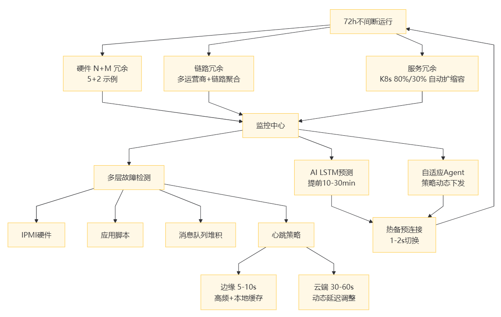
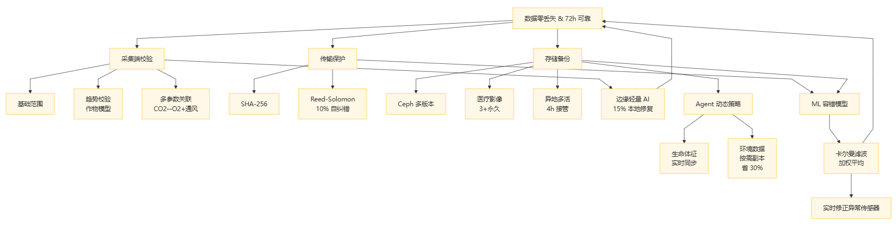
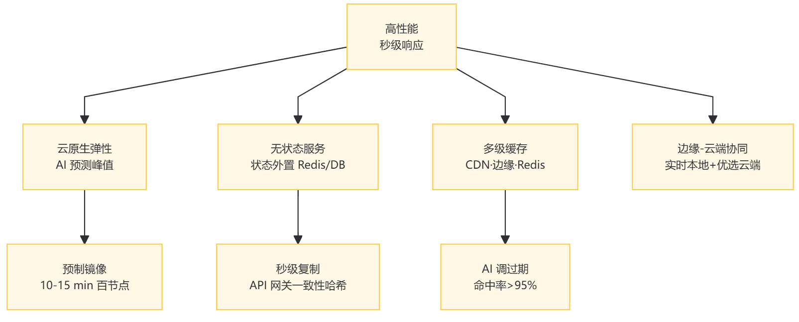
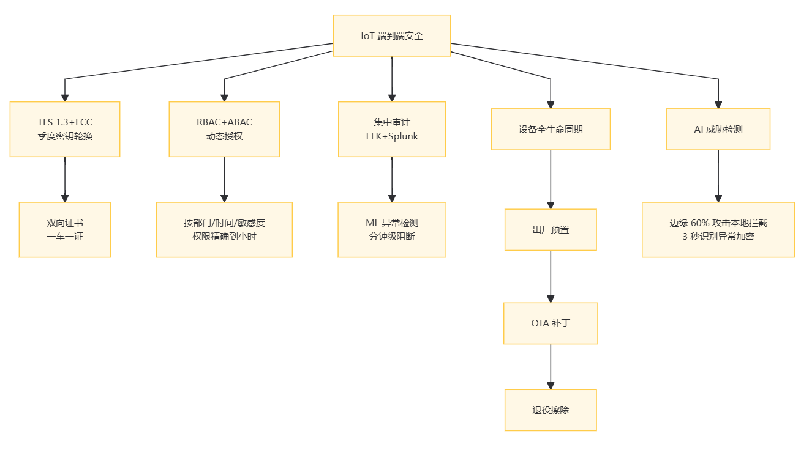
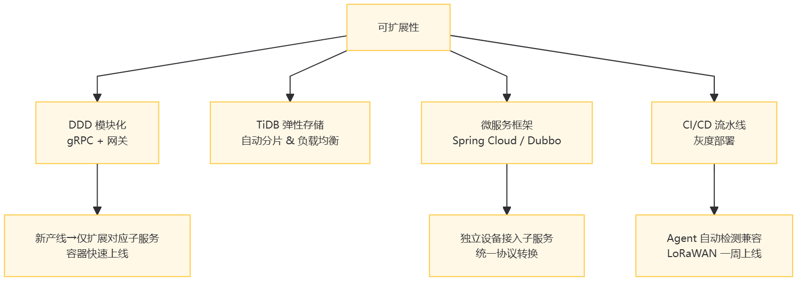

# 第六章：IOT 后端系统架构设计原则与模式

## 6\.1 架构设计原则

在物联网（IoT）和AI蓬勃发展的浪潮下，后端系统架构设计犹如搭建高楼大厦的基石，直接关乎整个 IoT 生态系统的稳定性、功能性与可持续发展能力。高可用性、高可靠性、高性能、安全性以及可扩展性等关键设计原则，是打造卓越 IoT 后端架构的核心准则，它们相互交织、彼此影响，共同支撑起复杂多变的 IoT 应用\+AI落地应用场景。以下是落实这些原则的具体建议、做法与解决方案。

### （1）高可用性

__冗余架构__：

在硬件层面，除了常见的服务器双机热备，还可考虑采用 N \+ M 冗余模式（N 为正常工作节点数，M 为冗余备份节点数），根据业务关键程度与预算灵活调整。例如，对于智能电网的核心电力调配服务器集群，可设置为 5 \+ 2 模式，确保在同时出现 2 台服务器故障时，依然有足够算力维持关键业务 72 小时不间断运行。网络链路方面，除了多运营商接入实现外网冗余，园区网、数据中心内部网络也应采用冗余交换机、冗余链路设计，利用链路聚合技术将多条物理链路捆绑，提升带宽的同时增强容错能力。

软件服务冗余方面，基于容器编排工具（如 Kubernetes）实现服务的快速复制与动态调度。为服务设定自动扩缩容策略，依据 CPU、内存利用率或每秒请求数等关键指标，当负载超过阈值 80%，自动扩容 20% 的服务实例；低于 30% 则缩容回收资源，确保资源高效利用，维持服务稳定。

__故障检测与转移优化__：

搭建多层级故障检测体系，除基础的硬件健康监测工具（如 IPMI 检测服务器硬件状态），还应在应用层、中间件层植入自定义检测脚本。例如，在工业物联网后端，每隔 3 秒通过应用层脚本向关键设备控制服务发送模拟指令，检测服务响应及时性；中间件层（如消息队列）监测消息堆积量、消费速率，一旦发现异常立即报警，达到设定的阈值就自动触发故障转移。故障转移时，优先采用预连接的热备切换方式，提前与备份系统建立心跳连接，主系统故障瞬间，备份系统无缝接管，将切换时间控制在 1 \- 2 秒内，最大程度减少业务中断影响。

__心跳检测精细调优__：

根据组件重要性与性能开销，差异化设置心跳检测频率。对于如智能医疗设备数据采集终端这类对实时性要求极高且资源受限的组件，心跳间隔设为 5 \- 10 秒；而像后台数据存储服务这种相对稳定组件，心跳间隔拉长至 30 \- 60 秒。同时，结合动态超时阈值调整，依据网络波动情况，当连续 3 次检测到网络延迟高于均值 50%，自动将心跳超时阈值延长 20%，避免误判，保障系统精准感知组件健康状态。

__智能增强层：__

AI 预测性故障检测：通过训练设备历史故障数据（如服务器 CPU 温度、网络丢包率、传感器响应延迟），构建时序预测模型（如基于 LSTM 的异常检测模型）。在智能电网后端系统中，模型可提前 10\-30 分钟预测某区域服务器的潜在过载风险，比传统阈值触发机制提前发现 80% 的隐性故障。

自适应 Agent 调度：将原有的静态心跳检测升级为动态心跳 Agent，Agent 根据设备类型（如边缘 MCP 节点、云端服务器）自动调整检测策略：对边缘 MCP 节点（资源受限且实时性要求高），Agent 采用 “高频探测 \+ 本地缓存心跳结果” 模式，每 2 秒探测一次但仅在状态异常时上传；对云端服务器，Agent 结合网络延迟动态调整间隔（30\-60 秒），减少无效通信开销。

### （2）高可靠性

__数据校验强化__：

在数据采集源头，为各类 IoT 设备定制专业校验算法库，除基本的数值范围校验，引入趋势校验与多参数关联校验。例如，在智能农业大棚环境监测中，不仅校验温度、湿度单个数值范围，还依据作物生长模型，判断温度湿度变化趋势是否符合当日光照、通风条件；当二氧化碳浓度骤升，关联校验氧气含量、通风设备运行状态，确保数据逻辑自洽。传输过程中，采用更高级的哈希校验算法（如 SHA \- 256），配合纠错码技术（如 Reed \- Solomon 码），能在发现 10% 以内数据错误时自动纠错，保障后端接收数据完整精准。

__存储备份进阶策略__：

基于分布式存储系统（如 Ceph）实现多版本数据的高效存储与快速检索。为医疗影像等关键数据设定版本保留策略，除近 3 次完整版本，对重大诊断节点影像永久保留，方便回溯对比。结合异地多活数据中心，利用异步复制技术，将数据实时备份到百公里外的异地中心，同时在异地中心定期进行数据恢复演练，确保在本地灾难发生4小时内，异地中心可全面接管业务，数据零丢失。

__数据容错智能提升__：

构建机器学习驱动的容错模型，在智能交通流量监测系统中，收集大量历史传感器数据与对应路况信息，训练模型识别传感器异常数据模式。当模型判断某传感器上报数据异常，结合周边多个同类传感器数据，利用加权平均、卡尔曼滤波等算法进行实时修正，可以有效提升数据的准确性，避免错误数据干扰交通管控决策。

__AI 增强的数据校验体系  
	__在数据采集源头部署多维度校验算法：基础校验：验证温度、湿度等数值的合理范围；趋势校验：结合作物生长模型判断智能农业大棚的温湿度变化是否符合光照条件；多参数关联校验：当二氧化碳浓度骤升时，联动校验氧气含量与通风设备状态。边缘 节点的轻量 AI 模型可在本地识别 15% 以内的数据错误并自动修复，减少云端重传压力。

__智能存储备份策略  
	__基于分布式存储系统（如 Ceph）实现多版本管理，医疗影像等关键数据保留近 3 次完整版本及重大节点永久备份。通过 Agent 动态调整备份策略：高优先级数据（如患者生命体征）实时同步至异地中心，低优先级数据（如环境温湿度）由 AI 预测访问频率，按需生成 1\-2 个副本，降低 30% 存储成本。异地多活数据中心通过异步复制技术，确保本地灾难发生后 4 小时内异地中心可全面接管业务。

### （3）高性能

__水平扩展实战__：

采用云原生架构实现快速弹性扩展，利用云平台（如 AWS、阿里云）的自动伸缩组功能，结合业务流量预测模型。以智能工厂的 IoT 系统为例，工厂内大量设备通过传感器实时采集生产数据，如设备运行状态、产品质量参数、原材料消耗等。在生产任务大幅增加时期，依据过往类似生产场景下的设备数据、订单规模及生产周期等数据，借助机器学习算法预测数据采集与处理的流量峰值。提前准备好包含设备数据处理程序、通信协议解析模块等的服务器镜像。当生产高峰期来临，流量飙升，一键触发扩展指令，基于云平台的自动伸缩组，在 10 \- 15 分钟内迅速新增上百台实例。这些新增实例快速投入运行，高效处理海量设备数据，确保生产过程中的设备监控、故障预警、质量检测等关键环节不受影响，保障生产线的稳定、高效运行。

同时，为优化节点间数据同步机制，采用增量同步结合缓存预热策略。新节点上线时，优先从缓存加载设备运行状态、关键工艺参数等高频访问数据，满足实时性要求较高的生产监控需求。在后台，异步进行全量数据的增量同步，将新节点融入集群的时间缩短，可以极大提升了整个智能工厂 IoT 系统的扩展性和响应速度 。

__无状态服务落地__：

在服务设计初期，遵循十二要素应用原则，将业务逻辑与本地状态彻底分离。以智能建筑的环境监测 IoT 服务为例，每栋建筑内分布着大量温湿度传感器、空气质量传感器等设备。这些传感器产生的实时环境数据，以及设备运行状态、校准参数等信息都属于状态数据。将这些状态数据存储于分布式缓存（如 Redis）或数据库中，而负责数据采集与处理的服务实例仅专注于实时的数据收集、清洗、初步分析等逻辑。当有新的监测需求，或是建筑区域扩大需增加传感器设备时，由于服务实例无本地状态依赖，可在数秒内快速复制到新节点。利用 API 网关统一管理外部请求，比如来自建筑管理系统的查询请求、智能设备的控制指令请求等。依据负载均衡算法（如一致性哈希）将请求均匀路由到无状态服务实例，确保各实例负载均衡，有效提升整个智能建筑环境监测系统的处理能力，保障系统稳定、高效地运行，无论在数据处理量还是响应速度上都有显著提升 。

__缓存机制深耕__：

构建多层级缓存架构，在靠近用户端的 CDN 缓存静态资源，例如智能城市地图瓦片数据。CDN 节点广泛分布，能就近为用户提供数据，极大缩短数据传输路径，快速响应请求，有效减少用户等待时间。中间层利用 Redis 缓存高频动态数据，并结合布隆过滤器防止缓存穿透。布隆过滤器通过高效的二进制向量数据结构，快速判断数据是否存在于缓存中，避免大量无效请求穿透缓存直击后端数据库。以智能出行服务为例，借助缓存预热脚本，在出行高峰时段来临前，提前将热门路线、公交时刻表等数据加载至缓存。同时，设置灵活的动态更新策略，不仅依据时间周期定时更新，还能根据实时事件，比如公交到站信息更新，及时调整缓存数据，确保缓存数据始终与实际情况相符，极速响应用户查询需求。

__AI 预测式弹性扩展  
__采用云原生架构结合业务流量预测模型：

智能工厂系统中，AI 根据生产计划与设备启动时间，提前 1 小时预测数据采集峰值，触发服务器实例扩容；扩展过程中，新节点通过缓存预热加载高频访问数据（如设备运行状态参数），缩短融入集群的时间；流量低谷时自动缩容，资源利用率维持在 30%\-80% 的最优区间。

__多级智能缓存架构__

边缘层：缓存最近 10 分钟的设备数据，满足本地实时查询需求；

中间层：Redis 结合布隆过滤器防止缓存穿透，AI Agent 动态调整缓存过期时间（如实时位置数据 5 秒，设备状态数据 30 秒）；

应用层：通过 LLM 分析用户查询日志，在出行高峰前预热热门路线数据，缓存命中率提升至 95% 以上。

__边缘 \- 云端算力协同  
__	边缘节点承担高频本地计算（如设备状态实时分析），仅将异常数据与统计结果上传云端；云端聚焦复杂业务逻辑（如跨区域设备协同控制），通过负载均衡 Agent 将请求路由至最优节点，计算密集型任务优先分配至 CPU 空闲节点，网络密集型任务优先分配至带宽充足节点，资源利用率提升 15% 以上。

### （4）安全性

__加密传输加固__：

强制所有 IoT 后端对外接口采用 TLS 1\.3 及以上版本加密协议，结合椭圆曲线密码学（ECC）算法，提升加密强度同时降低计算开销。在智能物流系统中，为每个运输车辆与后端通信通道配置唯一的数字证书，双向认证身份，防止中间人攻击，确保货物数据传输安全。定期更新证书，每季度进行一次加密密钥轮换，降低密钥泄露风险。

__访问控制细化__：

基于 RBAC 模型进一步细化权限粒度，引入属性访问控制（ABAC）补充。例如，在智慧城市管理平台，除了按角色分配权限，还依据用户所在部门、操作时间、数据敏感度等属性动态授权。运维人员在工作日白天可对非关键设备进行只读访问，紧急情况下（如自然灾害预警）特定应急小组可临时获得关键设备控制权，权限有效期精确到小时，严格限制越权操作，降低安全风险。

__安全审计深化__：

部署集中式安全审计平台（如 ELK 日志分析系统结合 Splunk 安全智能平台），对 IoT 系统全链路操作进行实时监控与深度分析。利用机器学习算法识别异常行为模式，如同一设备短时间内频繁更换 IP 地址登录、大量异常数据上传等。一旦发现可疑行为，立即通过短信、邮件告警运维人员，同时自动阻断可疑连接，将安全事件响应时间从小时级缩短至分钟级，保障系统安全。

__设备安全强化__：

建立设备安全生命周期管理流程，从设备出厂前的安全预配置（如植入唯一设备 ID、加密密钥），到运行中的固件安全升级（通过 Over\-The\-Air 技术定期推送安全补丁），再到退役后的数据擦除。例如，智能金融终端设备，每季度推送一次固件更新，修复已知漏洞；退役时，远程触发安全擦除指令，确保设备数据不泄露，设备全生命周期安全可控。

__AI 驱动的威胁检测  
	__通过分析设备通信日志构建正常行为基线，当智能摄像头突然采用未授权加密算法传输数据时，AI 模型在 3 秒内识别异常，由安全 Agent 阻断连接并触发告警。边缘 MCP 节点的轻量检测模型可本地识别 60% 的常见攻击（如端口扫描），实现威胁就近拦截。

### （5）可扩展性

__模块化架构演进__：

在架构设计伊始，运用领域驱动设计（DDD）方法划分业务领域，构建独立的模块子服务。以智能工厂为例，将生产计划、设备监控、质量检测等领域抽象为独立子服务，通过 API 网关对外暴露统一接口，内部采用轻量级通信协议（如 gRPC）交互。当引入新生产线，只需扩展或改造对应的生产计划与设备监控子服务，利用容器化部署快速迭代上线，不影响其他模块正常运行，缩短新功能上线周期。

__数据存储扩展优化__：

选型具备弹性扩展能力的数据库，如 TiDB 的自动分片与自动负载均衡特性，可根据数据增长自动添加存储节点，调整数据分布。在智能电网场景，电表数据量快速递增，TiDB 能自动适应，确保读写性能稳定，无需人工干预。同时，定期进行数据存储架构评估，依据业务发展趋势（如是否新增数据类型、查询需求变化）提前规划存储扩容与架构优化，保障数据存储长期高效。

__业务逻辑扩展实践__：

借助微服务框架（如 Spring Cloud、Dubbo）实现业务逻辑的灵活扩展。在智能工厂 IoT 系统中，当需要接入新协议的 IoT 设备时，通过开发独立的设备接入子服务来应对。这个子服务专门负责解析新设备协议，将设备数据转化为系统能够理解的通用格式。在开发过程中，遵循统一的微服务规范，利用服务注册与发现机制，让新的设备接入服务快速融入现有架构。例如，基于 Spring Cloud 的 Eureka 或 Dubbo 的 Zookeeper 实现服务注册与发现，使新子服务能够被其他相关子服务（如数据处理服务、设备管理服务）快速识别和调用。通过持续集成与持续部署（CI/CD）流水线，实现各服务的快速迭代。开发团队可以频繁地进行代码提交、构建、测试和部署。在接入新协议设备的过程中，根据设备测试反馈和实际业务需求，不断优化设备接入微服务。凭借 CI/CD 流水线的高效运作，能够快速响应并调整，敏捷适应新设备接入带来的变化，有效提升整个智能工厂 IoT 系统对不同设备的兼容性和业务处理能力，进而增强系统在工业物联网领域的竞争力。

__自适应设备接入  
	__新增设备协议时，Agent 自动检测现有服务兼容性，生成数据格式转换模板。例如接入 LoRaWAN 设备时，通过 CI/CD 流水线实现新设备接入的灰度部署，上线周期缩短和业务响应速度加快。

### （6）平衡原则间关系

__成本 \- 可用性权衡__：

运用经济学模型进行冗余资源配置优化，如采用成本效益分析（CBA）方法。比如在城市智能路灯物联网后端架构中，需要保障路灯稳定运行，为市民提供照明服务，同时严格控制运维成本。	

路灯管理部门根据不同区域的人流、车流密度，以及历史路灯故障数据，建立起后端架构资源配置与路灯可用性的数学模型。例如，在城市核心商业区和交通枢纽，人流、车流量大，对路灯照明的稳定性要求极高，一旦路灯故障，可能引发交通拥堵甚至安全事故，造成较大的社会影响和经济损失；而在一些偏远的郊区道路，使用频率较低，对路灯可用性要求相对没那么严苛。

利用成本效益分析，在偏远郊区道路，减少服务器冗余配置，降低数据备份频率，把节省下来的资金用于提升核心区域路灯监控系统的稳定性，例如增加传感器以实时监测灯泡寿命和电力消耗。当节假日或特殊活动期间，预计核心区域人流、车流量大幅增加前，依据大数据预测，提前在后端架构中增加服务器资源，提高数据处理能力，确保路灯控制系统稳定运行，精准平衡成本与可用性，实现后端架构资源利用的最大化 ，保障整个城市智能路灯物联网系统高效、稳定运行 。

__性能 \- 可靠性折中__：

引入服务质量分级（QoS）策略，依据数据重要性与业务实时性需求分类。在智能医疗系统中，将诊断影像、生命体征数据列为高 QoS 级别，严格校验、多版本备份，保障可靠性；患者就医引导、候诊信息等低 QoS 数据简化处理，优先保障响应速度。通过动态资源分配，在高并发时为高 QoS 服务预留 70% 以上核心资源，确保关键业务不受性能冲击，实现整体性能与可靠性平衡。

__安全 \- 扩展协同__：

设计安全即代码（Security as Code）的架构理念，将安全策略、配置通过代码化方式融入 CI/CD 流程。在多租户 IoT 云平台，开发自动化安全配置脚本，新租户接入时，一键部署加密、权限管理等安全模块，同时利用基础设施即代码（IaC）工具（如 Terraform）快速搭建可扩展的安全架构基础，实现安全与扩展协同共进，既保障租户数据安全，又能随租户增长灵活扩容。

总之，IoT 后端系统架构设计是一场融合技术、业务、成本等多因素的精妙博弈，架构师需深谙各原则内涵，依据不同应用场景需求，动态调整策略，雕琢出稳固且高效的架构蓝图，为 IoT 产业蓬勃发展筑牢根基。

## 6\.2 常见架构模式

在物联网（IoT）后端系统的构建中，选择合适的架构模式至关重要。它不仅决定了系统的性能、可扩展性和维护性，还影响着开发成本与周期。以下深入探讨在 IoT 领域常用的分层架构、微服务架构、事件\-驱动架构。

### （1）分层架构

__架构特点__：分层架构将系统按功能划分为多个层次，每层专注于特定职责。一般分为表现层、业务逻辑层、数据访问层和数据持久层 。在智能建筑的 IoT 系统中，表现层负责与用户交互，如用户通过手机 APP 或智能控制面板操作灯光、空调等设备，接收设备状态反馈。业务逻辑层处理复杂的业务规则，例如根据室内人数、光照强度和时间，自动调节灯光亮度和空调温度。数据访问层负责与数据库或其他数据源交互，如从存储设备获取设备配置信息、历史运行数据等。数据持久层则实际存储数据，可能是关系型数据库（如 MySQL）或非关系型数据库（如 MongoDB）。各层之间通过接口进行通信，上层依赖下层提供的服务，下层对上层的实现细节一无所知。

__优缺点__：优点是结构清晰，各层功能明确，便于开发、测试与维护。开发团队可以按层分工，提高开发效率。同时，由于层与层之间的低耦合，当某一层技术更新或业务逻辑变化时，对其他层影响较小。例如，数据持久层从 MySQL 迁移到 PostgreSQL，只要数据访问层接口不变，业务逻辑层和表现层无需修改。缺点是系统整体性能可能受限于层间通信开销。在高并发场景下，过多的层间调用可能导致响应延迟。而且，这种架构在应对复杂业务场景时灵活性不足，例如需要快速添加新的业务功能，可能涉及多个层的调整，较为繁琐。

__适用场景__：适用于业务逻辑相对稳定、需求变化不大的 IoT 项目。比如传统制造业的工厂设备监控系统，设备类型和业务流程相对固定，分层架构能很好地组织代码结构，降低维护成本。

__AI增强实践__

业务逻辑层引入 AI 决策模块，如通过图像识别判断房间 occupancy ，动态调整空调运行策略；LLM 辅助生成层间接口文档，自动校验接口兼容性，减少 40% 的集成测试时间。

### （2）微服务架构

__架构特点__：微服务架构将系统拆分为多个小型、独立的服务，每个服务围绕特定业务能力构建，可独立开发、部署和扩展。以智能物流系统为例，可拆分为订单服务、库存服务、运输服务、车辆监控服务等。订单服务负责处理订单的创建、修改和查询；库存服务管理货物的入库、出库和盘点；运输服务规划运输路线、调度车辆；车辆监控服务实时获取运输车辆的位置、状态等信息。这些服务通过轻量级通信协议（如 RESTful API 或 gRPC）进行交互。每个服务都有自己独立的数据存储，可能是不同类型的数据库，以满足该服务的特定需求。

__优缺点__：优点是高度的灵活性和可扩展性。当业务需求变化时，只需对相关的微服务进行修改和部署，不会影响其他服务。例如，随着业务拓展，需要增加新的配送方式，只需在运输服务中添加相应逻辑，独立部署即可。同时，每个微服务可以根据自身负载情况进行水平扩展，提高系统整体性能。不同微服务还可以采用不同的技术栈开发，以适应各自业务特点。缺点是服务间的分布式特性增加了系统复杂性。服务间的通信、数据一致性和事务管理变得更具挑战。例如，在一次物流交易中，涉及订单创建、库存减少和车辆调度等多个服务，要确保这些操作的原子性和数据一致性并不容易。此外，微服务数量过多时，运维成本显著增加，需要管理多个服务的生命周期、监控和故障排查。

__适用场景__：适用于业务复杂、需求变化频繁且对扩展性要求高的 IoT 项目。如大型电商的智能供应链系统，业务不断创新，订单量、库存管理和物流配送需求多变，微服务架构能很好地支持快速迭代和扩展。

__AI 增强实践__

服务发现 Agent 实时监测各实例响应时间，动态调整负载均衡权重，将 80% 请求路由至空闲节点；AI 预测服务调用峰值，提前扩容依赖链中的瓶颈服务（如促销期间优先扩展库存服务）。

### （3）事件\-驱动架构

__架构特点__：事件 \- 驱动架构基于事件进行系统设计。在 IoT 系统中，设备状态变化、用户操作等都可以触发事件。以智能家居系统为例，当用户打开家门，智能门锁触发 “门打开” 事件；当室内温度达到设定阈值，温度传感器触发 “温度过高 / 过低” 事件。这些事件被发布到事件总线（如 Kafka 或 RabbitMQ）上，感兴趣的服务（称为事件消费者）订阅相应事件。例如，“门打开” 事件可能触发灯光自动亮起、安防系统撤防等操作；“温度过高” 事件可能触发空调启动制冷。服务之间通过事件进行解耦，无需直接调用。

__优缺点__：优点是系统具有高度的异步性和解耦性。当某个设备或服务出现故障时，不会影响其他部分的正常运行。例如，智能摄像头出现故障无法上传视频，但不影响其他设备基于事件的正常操作。同时，这种架构能够很好地应对高并发场景，因为事件可以异步处理，无需等待所有操作完成。缺点是事件的处理顺序和可靠性难以保证。如果事件处理逻辑复杂，可能导致调试困难。例如，多个事件之间存在依赖关系，若处理顺序不当，可能导致业务逻辑错误。而且，事件总线的性能和稳定性对整个系统影响较大。

__适用场景__：适用于对实时性、异步处理和系统解耦要求高的 IoT 项目。如智能电网的实时监测与控制，大量的电力设备状态变化事件需要及时处理，事件 \- 驱动架构能确保系统快速响应，且各部分之间互不干扰。

__AI增强实践__

AI 模型对事件优先级排序，医疗设备的 "心率异常" 事件（P0 级）优先处理，灯光故障（P2 级）延迟处理；LLM 分析事件日志，自动生成事件依赖图谱，辅助排查处理顺序错误。

### （4）架构模式实现示例

下面以一个简单的智能农业灌溉系统为例，展示如何实现上述架构模式。

__分层架构实现__：表现层使用 Web 界面和移动端 APP，通过 HTTP 协议与后端交互。业务逻辑层用 Python 的 Django 框架实现，根据土壤湿度、气象数据和作物生长阶段等计算灌溉时间和水量。数据访问层通过 SQLAlchemy 库连接 MySQL 数据库，获取和存储土壤湿度、气象数据等。数据持久层则是 MySQL 数据库，存储各类传感器数据和设备配置信息。

__微服务架构实现__：拆分为传感器数据采集服务、灌溉控制服务、数据分析服务等。传感器数据采集服务用 Node\.js 编写，负责从传感器获取数据并存储到 InfluxDB 时间序列数据库。灌溉控制服务用 Go 语言编写，根据传感器数据和预设规则控制灌溉设备。数据分析服务用 Python 的 Flask 框架编写，分析历史数据，为优化灌溉策略提供建议。各服务通过 RESTful API 进行通信。

__事件 \- 驱动架构实现__：传感器数据变化触发事件，发布到 Kafka 事件总线。例如，土壤湿度低于设定值触发 “土壤缺水” 事件。灌溉控制服务订阅该事件，接收到事件后启动灌溉设备。事件处理逻辑用 Java 编写，利用 Spring Cloud Stream 与 Kafka 集成。

总之，在设计 IoT 后端系统架构时，需根据项目特点、业务需求和技术团队能力，谨慎选择合适的架构模式，为系统的成功搭建奠定坚实基础。

## 6\.3 设计模式与最佳实践

在物联网（IoT）后端系统的构建中，软件设计模式与最佳实践是提升系统质量、可维护性和可扩展性的关键要素。它们为解决常见问题提供了通用的解决方案，同时结合行业经验，确保系统在各个环节都能高效稳定运行。

### （1）软件设计模式在 IoT 后端系统中的应用

__单例模式__：在 IoT 系统中，许多资源需要全局唯一实例，以避免资源浪费和不一致性。例如，日志记录器在整个进程中应只有一个实例，负责记录所有设备的操作、错误信息等。使用单例模式，可确保在进程中的任何地方调用日志记录器时，都是同一个实例在工作，保证日志记录的完整性和连贯性。在 Python 中，可通过如下方式实现单例模式：

import logging

import threading

class SingletonLogger:

    \_instance = None

    \_lock = threading\.Lock\(\)

    def \_\_new\_\_\(cls, filename='iot\_system\.log', level=logging\.INFO\):

        with cls\.\_lock:

            if cls\.\_instance is None:

                cls\.\_instance = super\(\)\.\_\_new\_\_\(cls\)

                cls\.\_instance\.init\_logger\(filename, level\)

            return cls\.\_instance

    def init\_logger\(self, filename, level\):

        \# 配置日志记录级别、输出文件等

        logging\.basicConfig\(filename=filename, level=level\)

        self\.logger = logging\.getLogger\(\_\_name\_\_\)

    def log\_message\(self, message\):

        self\.logger\.info\(message\)

\# 示例使用

if \_\_name\_\_ == "\_\_main\_\_":

    logger1 = SingletonLogger\(\)

    logger2 = SingletonLogger\(\)

    print\(logger1 is logger2\)  \# 输出 True，说明是同一个实例

    logger1\.log\_message\("This is a test log message\."\)

__工厂模式__：当 IoT 系统需要创建不同类型的设备连接实例时，工厂模式极为有用。例如，系统需要连接不同品牌的传感器，每个品牌的传感器连接方式和参数设置不同。通过工厂模式，可创建一个传感器工厂类，根据传入的传感器类型信息，创建相应的传感器连接实例。在 Java 中实现如下：

interface Sensor \{

    void connect\(\);

\}

class TemperatureSensor implements Sensor \{

    @Override

    public void connect\(\) \{

        System\.out\.println\("Connecting temperature sensor\.\.\."\);

    \}

\}

class HumiditySensor implements Sensor \{

    @Override

    public void connect\(\) \{

        System\.out\.println\("Connecting humidity sensor\.\.\."\);

    \}

\}

class SensorFactory \{

    public Sensor createSensor\(String type\) \{

        if \("temperature"\.equals\(type\)\) \{

            return new TemperatureSensor\(\);

        \} else if \("humidity"\.equals\(type\)\) \{

            return new HumiditySensor\(\);

        \}

        return null;

    \}

\}

__观察者模式__：在 IoT 系统中，当一个设备状态变化需要通知多个其他组件时，观察者模式发挥重要作用。例如，智能摄像头检测到异常情况时，需要通知安防系统、管理人员手机 APP 以及存储模块记录相关视频。摄像头作为被观察对象，而安防系统、APP 和存储模块作为观察者。在 python中实现如下：

\# 定义观察者基类

class Observer:

    def update\(self, is\_alert\):

        """

        当被观察对象状态改变时，此方法会被调用

        :param is\_alert: 摄像头是否检测到异常的标志

        """

        raise NotImplementedError\("Subclasses should implement this method\."\)

\# 定义安防系统观察者类

class SecuritySystem\(Observer\):

    def update\(self, is\_alert\):

        if is\_alert:

            print\("Security system activated due to camera alert\."\)

\# 定义手机 APP 观察者类

class MobileApp\(Observer\):

    def update\(self, is\_alert\):

        if is\_alert:

            print\("Mobile app notified of camera alert\."\)

\# 定义存储模块观察者类

class StorageModule\(Observer\):

    def update\(self, is\_alert\):

        if is\_alert:

            print\("Storage module starts recording due to camera alert\."\)

\# 定义摄像头类（被观察对象）

class Camera:

    def \_\_init\_\_\(self\):

        \# 用于存储所有注册的观察者

        self\.observers = \[\]

        \# 摄像头是否检测到异常的标志

        self\.is\_alert = False

    def attach\(self, observer\):

        """

        注册观察者

        :param observer: 要注册的观察者对象

        """

        self\.observers\.append\(observer\)

    def detach\(self, observer\):

        """

        移除观察者

        :param observer: 要移除的观察者对象

        """

        if observer in self\.observers:

            self\.observers\.remove\(observer\)

    def set\_alert\(self, alert\):

        """

        设置摄像头的异常状态，并通知所有观察者

        :param alert: 摄像头是否检测到异常的标志

        """

        self\.is\_alert = alert

        self\.notify\(\)

    def notify\(self\):

        """

        通知所有注册的观察者摄像头状态的改变

        """

        for observer in self\.observers:

            observer\.update\(self\.is\_alert\)

\# 示例使用

if \_\_name\_\_ == "\_\_main\_\_":

    \# 创建摄像头对象

    camera = Camera\(\)

    \# 创建安防系统、手机 APP 和存储模块观察者对象

    security\_system = SecuritySystem\(\)

    mobile\_app = MobileApp\(\)

    storage\_module = StorageModule\(\)

    \# 注册观察者到摄像头

    camera\.attach\(security\_system\)

    camera\.attach\(mobile\_app\)

    camera\.attach\(storage\_module\)

    \# 模拟摄像头检测到异常

    camera\.set\_alert\(True\)

    \# 移除一个观察者

    camera\.detach\(mobile\_app\)

    \# 模拟摄像头再次检测到异常

    camera\.set\_alert\(True\)

### （2）依据实际需求选取合适设计模式

__分析系统变化点__：在项目初期，对 IoT 系统进行全面分析，找出可能发生变化的部分。例如，在智能交通系统中，车辆检测算法可能会随着技术发展而更新，这就是一个变化点。针对此，可采用策略模式，将不同的车辆检测算法封装成独立的类，通过一个上下文类来调用。这样，当需要更换算法时，只需修改上下文类的配置，而无需大规模修改系统代码。

__考虑系统的复用性__：如果 IoT 系统中有多个部分需要使用相同的功能，如数据加密功能，可使用单例模式创建一个加密工具类。这样，不仅避免了重复代码，还能保证加密操作的一致性。同时，对于可复用的组件，如设备连接组件，可通过工厂模式进行创建，方便在不同的业务场景中复用。

__评估系统的事件驱动性__：若系统中存在大量设备状态变化、用户操作等事件，且这些事件需要触发多个不同的操作，观察者模式是很好的选择。如在智能家居系统中，智能门锁的状态变化需要通知多个设备和服务，使用观察者模式可实现解耦，提高系统的可维护性和扩展性。

### （3）安全设计模式

__安全代理模式__：在 IoT 后端系统中，安全代理模式常用于访问控制。例如，在连接第三方数据服务时，设置一个安全代理服务器。该代理服务器负责验证请求的合法性，检查请求方的身份和权限。只有通过验证的请求才会被转发到第三方数据服务，从而保护系统免受非法访问。在实际实现中，可使用 Nginx 作为反向代理服务器，并配置身份验证模块（如 OAuth2 认证模块）。通过配置 Nginx 的规则，对不同的请求路径和用户角色进行权限控制。

__数据加密与解密模式__：在数据传输和存储过程中，采用加密与解密模式确保数据安全。例如，在 IoT 设备与后端服务器之间的数据传输，使用 SSL/TLS 加密协议进行加密。在数据存储方面，对于敏感数据，如用户的个人信息、设备的配置密钥等，使用 AES 等对称加密算法进行加密存储。在数据读取时，通过相应的解密算法进行解密。以 Python 为例，使用 cryptography 库进行 AES 加密和解密：

from cryptography\.fernet import Fernet

\# 生成密钥

key = Fernet\.generate\_key\(\)

cipher\_suite = Fernet\(key\)

\# 加密数据

data = b"Sensitive data"

encrypted\_data = cipher\_suite\.encrypt\(data\)

\# 解密数据

decrypted\_data = cipher\_suite\.decrypt\(encrypted\_data\)

### （4）最佳实践案例

__系统部署__：在 IoT 系统部署时，采用容器化技术（如 Docker）可大大提高部署效率和一致性。将每个服务或组件打包成独立的 Docker 容器，通过容器编排工具（如 Kubernetes）进行管理。例如，在智能工厂的 IoT 系统中，将设备监控服务、数据分析服务等分别打包成容器，Kubernetes 可根据资源需求和负载情况自动分配容器到不同的服务器节点上，实现快速部署和弹性扩展。同时，采用蓝绿部署策略，在新版本上线时，先将新版本的容器部署到一部分服务器节点上，进行小范围测试。如果测试通过，再逐步将流量切换到新版本的容器上；如果出现问题，可迅速将流量切回旧版本，确保系统的稳定性。

__监控与运维__：建立全面的监控体系是保障 IoT 系统稳定运行的关键。使用 Prometheus 和 Grafana 搭建监控平台，对系统的各项指标进行实时监控，如服务器的 CPU 使用率、内存使用率、网络流量，以及各个服务的响应时间、吞吐量等。对于 IoT 设备，通过设备管理系统实时监控设备的在线状态、电量、信号强度等。当某个指标超出阈值时，通过邮件、短信或即时通讯工具（如 企业微信、钉钉）发送警报通知运维人员。在运维方面，制定详细的运维手册，包括日常巡检、故障排查流程、紧急情况处理预案等。例如，当智能电网的某个区域出现电力数据异常时，运维人员可根据预案，快速定位问题所在，是传感器故障、网络传输问题还是后端数据处理问题，并采取相应的解决措施。同时，定期对系统进行性能优化和安全漏洞扫描，确保系统长期稳定运行。

在构建 IoT 后端系统时，充分运用软件设计模式，遵循安全设计模式和最佳实践，能够有效提升系统的质量和竞争力，满足不断变化的业务需求。

## 6\.4 架构选型的因地制宜策略

物联网后端系统架构的选型，不存在放之四海而皆准的方案，“架构选型的因地制宜策略” 扮演着举足轻重的核心角色，它是确保物联网后端系统高效稳定运行的关键要素。在实际的架构选型中，需要从多个维度进行深入剖析和全面考量，如应用场景、项目阶段、团队能力与周期约束，AI 工具可辅助分析需求，提供数据驱动的决策支持。

### （1）应用场景差异

不同的物联网应用场景犹如形态各异的容器，对后端架构有着截然不同的需求。

以智能家居和工业物联网为例，二者在诸多关键方面展现出显著差异。在智能家居场景中，设备数量通常较为分散，涵盖智能家电、智能安防设备、智能照明等，这些设备的数据产生频率相对较低，数据量也不大，且数据类型多为简单的状态信息，如开关状态、温度值等 。同时，对于实时性要求，除了安防类设备在触发报警等紧急情况时较高外，大多数智能家居设备对实时性要求并不苛刻。在可靠性方面，虽然希望系统稳定运行，但个别设备短暂的掉线或故障对整体生活影响相对有限。

反观工业物联网，其设备数量庞大且密集，一个大型工厂可能有成千上万个传感器、执行器等设备。这些设备产生的数据具有高频、高并发的特点，数据类型复杂多样，包含设备运行状态参数、生产工艺数据、质量检测数据等。工业物联网对实时性要求极高，如在自动化生产线上，设备的控制指令必须在极短时间内响应，否则可能导致生产停滞、产品质量缺陷等严重后果。在可靠性方面，工业生产的连续性和稳定性决定了工业物联网系统必须具备极高的可靠性，任何设备故障或数据传输中断都可能引发巨大的经济损失。

### （2）项目阶段考量

项目所处的不同阶段，犹如人在不同成长时期，对架构有着不同的诉求。

在项目初期，快速验证产品概念和可行性是首要任务。此时，架构应侧重于快速搭建和迭代，能够迅速实现基本功能，验证业务逻辑是否可行。简单的单体架构可能是一个不错的选择，它易于开发和部署，能够在短时间内让产品原型上线，收集用户反馈。例如，一些初创的物联网创业公司，在开发智能健康监测设备的后端系统时，初期采用单体架构，将所有功能模块集成在一个应用中，快速完成开发并推向市场进行初步验证。

随着项目进入发展期，用户量和业务量逐渐增长，系统面临的压力不断增大。此时，对架构的扩展性需求凸显出来，需要架构能够方便地添加新功能、新模块，以满足不断变化的业务需求。微服务架构开始崭露头角，它将系统拆分为多个独立的服务，每个服务可以独立开发、部署和扩展，有效提高了系统的灵活性和可扩展性。

当项目进入成熟期，业务相对稳定，但对系统的稳定性和性能要求达到了极致。此时，架构需要更加注重高可用性、容错性和性能优化。可能会引入分布式缓存、负载均衡、分布式事务等技术，以确保系统在高并发、大数据量的情况下依然能够稳定运行。

### （3）团队状况分析

团队的技术能力和经验是架构实施的基石。

如果团队成员在某种技术栈上有深厚的积累，如对 Java 开发框架、Spring Cloud 微服务体系非常熟悉，那么在架构选型时，基于 Java 和 Spring Cloud 的架构方案会更具可行性和实施效率。团队成员能够快速上手开发，减少因技术陌生带来的学习成本和开发风险。

反之，如果团队缺乏某些关键技术的经验，贸然选择依赖这些技术的架构，可能会导致开发周期延长、项目风险增加。例如，一个长期从事传统 Web 开发的团队，没有分布式系统开发经验，若在物联网后端架构选型时选择复杂的分布式架构，可能在开发过程中遇到诸多难题，如分布式一致性问题、网络通信问题等。

此外，团队的规模和组织架构也会影响架构选型。小型团队可能更适合简单、易于管理的架构，以便于成员之间的沟通和协作；而大型团队则有能力驾驭复杂的分布式架构，通过合理的分工和协作，充分发挥分布式架构的优势。

### （4）周期计划约束

项目的周期计划为架构选型划定了时间边界。

如果项目时间紧迫，需要在短时间内完成架构搭建并上线系统，那么应选择成熟、易于实施的架构方案。例如，采用开源的物联网平台框架进行二次开发，利用其已有的功能模块和架构基础，快速搭建起满足基本需求的后端系统。

相反，如果项目周期较为充裕，可以在架构选型上进行更深入的研究和探索，选择更具前瞻性和扩展性的架构方案。在前期投入更多时间进行架构设计和技术选型，虽然会延长项目初期的开发时间，但从长远来看，能够为系统的长期发展奠定坚实的基础，减少后期因架构缺陷导致的大规模重构。

综上所述，在物联网后端系统架构选型时，只有全面、深入地综合考虑应用场景、项目阶段、团队状况和周期计划等多个方面，全面权衡利弊，才能精准选出契合项目实际的架构，有力推动物联网后端系统从构建到高效运行的全流程发展，使其在复杂多变的物联网应用环境中稳健前行，发挥出最大的价值。
