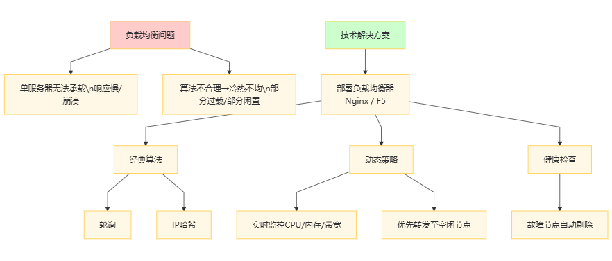
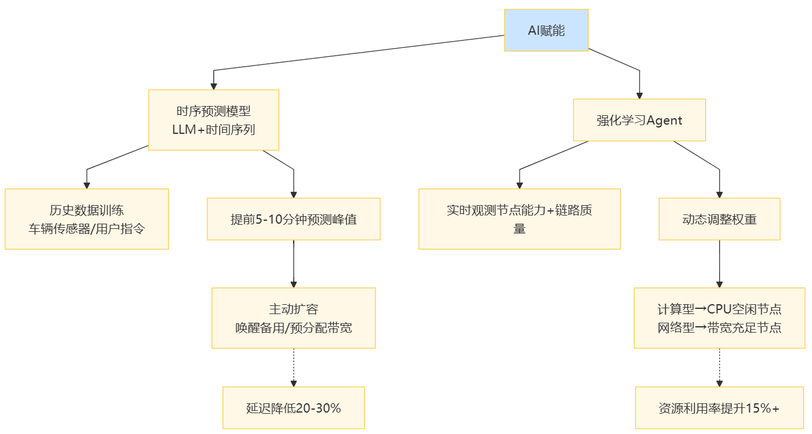
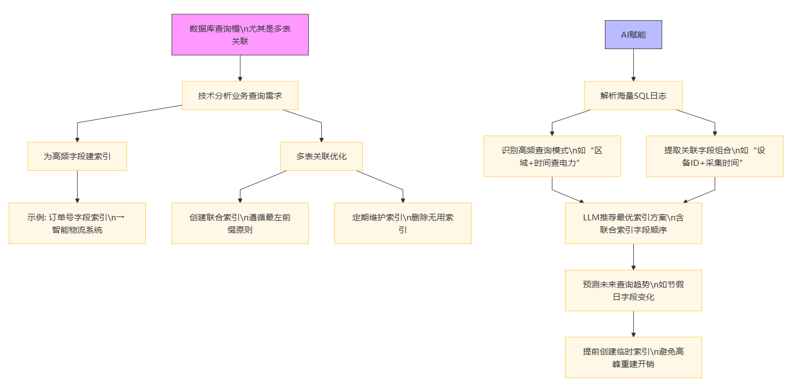
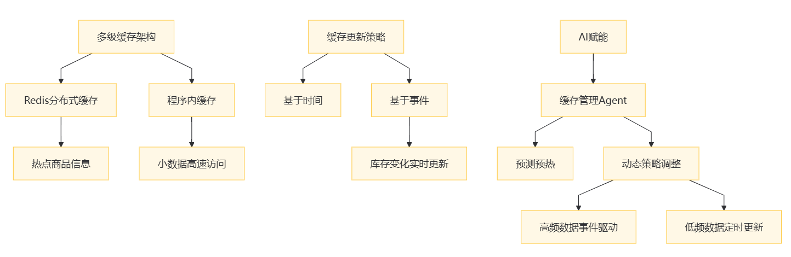
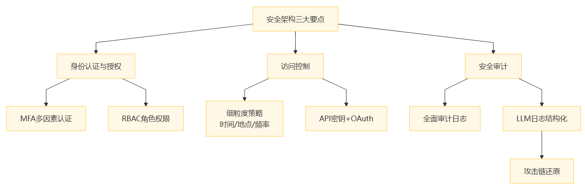

# 第七章：性能优化与安全保障

## 7\.1 性能优化策略

在物联网（IoT）后端系统的构建中，性能表现直接关乎用户体验、系统可靠性以及业务的高效运转。面对日益增长的设备连接数、海量数据处理需求和高并发访问，深入剖析性能瓶颈并采取针对性优化策略至关重要。本节也会讨论 AI 和 LLM 对这些环节赋能的可能性。

### （1）影响性能的关键因素

**网络延迟**：在IoT系统中，设备分布广泛，数据传输需经过复杂网络链路。例如，智能交通系统中分布在城市各个角落的车辆传感器与后端数据中心通信，网络信号的强弱、传输距离以及网络拥塞都会导致数据传输延迟。尤其在信号较差的偏远地区，或者网络高峰时段，延迟可能从几十毫秒增加到数百毫秒甚至秒级，严重影响实时数据分析和决策。

**数据库查询效率**：IoT系统产生的数据量巨大且种类繁多，若数据库设计不合理，查询效率会大打折扣。比如在智能电网系统中，频繁查询海量的电力消耗历史数据，如果表结构设计不当，缺少必要索引，一次简单的查询可能需要扫描整个数据表，导致查询响应时间长达数秒甚至数十秒，无法满足实时监控和分析需求。

**服务响应时间**：服务端的业务逻辑处理能力和资源分配情况决定了服务响应时间。以智能家居系统为例，当用户通过手机APP控制多个设备时，若后端服务无法高效处理并发请求，服务响应时间延长，用户可能会在等待设备响应过程中失去耐心，降低用户体验。

### （2）针对性优化策略

**\- 负载均衡**：

**常见问题**：随着业务发展，单个服务器难以承受所有请求，导致响应缓慢甚至服务崩溃。若负载均衡算法不合理，可能出现部分服务器过载，而部分服务器资源闲置的情况。

**技术解决方案**：采用负载均衡器（如Nginx、F5）将请求均匀分配到多个服务器节点。Nginx可基于轮询、IP哈希等算法实现负载均衡。例如，基于轮询算法，Nginx依次将请求分配到后端服务器，确保每个服务器都有机会处理请求。在高并发场景下，动态调整负载均衡策略，实时监测服务器的CPU、内存、网络带宽等资源使用情况，将请求优先分配到资源空闲的服务器，提升整体性能。同时，负载均衡器还具备健康检查功能，当某个服务节点出现故障时，自动将请求转发到其他正常节点，保证系统的可用性。

**AI赋能**：在高并发场景下（如智能交通系统的早晚高峰、智能家居的集中控制时段），传统负载均衡依赖实时监控数据进行响应式调整，而结合“时序预测模型（如基于LLM的时间序列分析模型）”可实现前瞻性优化。例如，通过LLM分析历史设备连接数据、网络负载波动规律（如过去3个月的车辆传感器数据传输高峰时段、用户控制指令的集中分布），提前5\-10分钟预测即将到来的流量峰值，负载均衡器可基于预测结果主动扩容资源（如唤醒备用服务器、预分配网络带宽），比传统策略减少20%\-30%的响应延迟。同时，“强化学习Agent”可实时优化负载均衡算法：Agent通过与系统交互，持续学习不同服务器节点的处理能力、网络链路质量与请求类型的匹配关系，动态调整轮询/IP哈希算法的权重（如对计算密集型请求优先分配至CPU空闲节点，对网络密集型请求优先分配至带宽充足节点），提升资源利用率15%以上。

**\- 数据库索引优化**

**常见问题**：数据库查询慢，尤其是涉及多表关联查询时，全表扫描会消耗大量资源和时间。

**技术解决方案**：分析业务查询需求，为频繁查询的字段建立索引。例如在智能物流系统中，经常根据订单号查询订单状态和物流轨迹，为订单号字段建立索引，可大幅提升查询速度。对于多表关联查询，合理创建联合索引，注意索引的顺序，遵循最左前缀原则。同时，定期对数据库进行索引维护，删除无用索引，避免索引膨胀导致的性能下降。

**AI赋能**：比如智能电网等系统的数据库查询日志包含海量 SQL 语句，LLM可自动解析日志，识别高频查询模式（如 “按区域 \+ 时间段查询电力消耗”）、关联字段组合（如设备 ID \+ 采集时间），并结合表结构特征推荐最优索引方案（如联合索引的字段顺序）。甚至可预测未来查询趋势（如节假日期间的查询字段变化），提前创建临时索引，避免高峰时段的索引重建开销。

**\- 缓存优化**：

**常见问题**：缓存命中率低，缓存数据更新不及时，导致大量请求穿透到数据库，增加数据库压力。

**技术解决方案**：采用多级缓存架构，比如结合 Redis 和程序内缓存。Redis 作为分布式缓存，用于存储系统中高频访问的热点数据，比如智能零售系统中热门商品的基本信息、促销活动详情等。程序内缓存则利用应用程序自身的内存空间，存储相对占用内存小但仍需快速访问的数据，同时借助程序内缓存与应用程序处于同一进程空间，无网络开销的特性，能够快速响应访问请求，满足系统对这类数据快速访问的需求。设置合理的缓存过期时间，结合业务场景采用基于时间和基于事件的缓存更新策略。在智能零售系统中，商品库存数据在销售高峰时段变化频繁，采用基于事件的更新策略，当库存发生变化时，立即更新缓存，确保数据一致性。同时，利用缓存预热机制，在系统启动或业务高峰前，将热门数据提前加载到缓存中，提高缓存命中率。比如在电商大促活动开始前，将参与活动的商品数据提前加载到 Redis 和程序内缓存中，保障大促期间系统能快速响应大量用户请求。多级缓存要特别小心地维护更新机制，比如定时更新结合消息触发。

**AI赋能**：例如在智能零售系统中，AI 预测模型可基于用户历史购买数据、促销活动周期等，预测未来 1 小时内可能被高频访问的商品（如折扣商品、新品），由缓存管理 Agent 自动执行预热操作（将数据加载至 Redis 与程序内缓存）。同时，LLM 可分析商品库存的更新规律（如秒杀活动中库存变化的频率），动态调整缓存更新策略 —— 对高频变化数据（如库存）触发 “事件驱动 \+ 实时校验” 机制（Agent 监测库存变更事件，调用 LLM 验证数据一致性后更新缓存），对低频变化数据（如商品描述）采用 “预测过期 \+ 定时更新”，兼顾效率与一致性。

**\- 代码优化**：

**常见问题**：代码逻辑复杂、算法效率低、资源未及时释放等导致程序运行缓慢。随着业务的不断发展，代码库日益庞大，复杂的业务逻辑层层嵌套，使得代码的可读性和可维护性大幅降低，同时也增加了运行时的计算开销。

**技术解决方案**：

开发阶段：LLM可基于业务需求自动生成高效代码片段（如物联网设备数据解析的轻量化算法），并标注潜在性能瓶颈（如循环嵌套过深、冗余数据结构）。例如，在智能家居设备控制逻辑开发中，LLM 可识别 “多设备并发控制” 场景下的线程阻塞风险，推荐基于协程的异步处理方案。

运行阶段：性能分析 Agent 实时采集代码运行指标（如函数执行时间、内存占用），结合 LLM 分析调用链路，定位隐蔽问题（如未释放的数据库连接、全局变量的线程安全隐患），并自动生成优化建议（如替换为连接池管理、添加锁机制）。

迭代阶段：LLM 可对比不同版本代码的性能差异，解释优化效果（如 “因替换哈希表为跳表，设备状态查询速度提升 40%”），辅助开发团队持续迭代。

### （3）高并发性能优化策略

**\- 数据库连接池优化**：

**常见问题**：在高并发场景下，频繁创建和销毁数据库连接会消耗大量资源，导致系统响应变慢。

**技术解决方案**：使用数据库连接池（如HikariCP、C3P0）管理数据库连接。HikariCP以其高性能和低延迟著称，通过配置合适的连接池参数，如最大连接数、最小连接数、连接超时时间等，确保在高并发情况下，系统能够快速获取可用连接，避免连接创建的开销。同时，定期检测连接池中的连接状态，及时清理无效连接，保证连接池的健康运行。

**\- 线程池优化**：

**常见问题**：线程创建和销毁的开销大，线程资源分配不合理，可能导致线程饥饿或死锁。

**技术解决方案**：合理配置线程池参数，如线程池大小、队列容量等。根据业务特点，使用不同类型的线程池，如FixedThreadPool适用于任务数量相对固定的场景，CachedThreadPool适用于任务数量波动较大的场景。在智能医疗系统中，处理患者数据的分析任务时，根据患者数量和数据量动态调整线程池大小，确保系统能够高效处理并发任务。同时，采用线程安全的数据结构和同步机制，避免线程冲突和死锁。

**\- 分布式缓存（如Redis集群）**：

**常见问题**：单个Redis实例在高并发读写时性能受限，无法满足海量数据的缓存需求。

**技术解决方案**：搭建Redis集群，通过分片技术将数据分散存储在多个Redis节点上。Redis Cluster 采用哈希槽（Hash Slot）机制，基于 CRC16 算法将键哈希到 16384 个槽位并均匀分布到各个节点，提高读写性能和可扩展性。在高并发场景下，不同节点可并行处理读写请求，大幅提升缓存的读写速度。例如在电商IoT系统中，商品详情、用户购物车等数据的缓存可通过Redis集群实现，有效应对高并发访问。

### （4）性能测试工具与评估

**常见问题**：难以准确模拟高并发场景，测试结果无法真实反映系统性能瓶颈。

**技术解决方案**：使用JMeter创建高并发测试场景，设置线程组参数，如线程数、Ramp \- Up时间、循环次数等。例如，在测试智能安防系统的视频流处理能力时，通过设置多个线程模拟大量用户同时访问视频监控画面，逐渐增加线程数，观察系统的响应时间、吞吐量等指标。利用JMeter的断言功能，验证系统返回的结果是否正确。同时，结合JMeter的监听器，如聚合报告、图形结果等，直观展示测试结果，快速定位性能瓶颈所在，如网络延迟过高、服务器响应缓慢等，为进一步优化提供依据。

**可结合 AI 提升测试深度**：

测试用例生成：LLM 基于 IoT 系统的业务场景（如智能安防的 “多用户同时查看视频流”）自动生成多样化测试用例（如不同分辨率视频、不同网络环境的并发请求），覆盖边缘场景（如弱网下的断连重连测试）。

瓶颈定位：JMeter 采集的响应时间、吞吐量等数据，经 AI 诊断模型分析后，可输出根因解释（如 “90% 的延迟来自数据库，因某索引失效，建议执行 VACUUM 操作”），而非仅展示指标。对于复杂问题（如 “网络延迟 \+ 服务响应慢的耦合影响”），LLM 可结合系统架构知识，生成关联分析报告，缩短定位时间 50% 以上。

## 7\.2 安全架构与机制

在物联网（IoT）后端系统中，安全可谓是重中之重，它关乎着用户隐私、业务连续性以及整个系统的可信度。随着IoT设备的广泛应用，涵盖设备安全、数据安全、网络安全等多个维度的安全威胁也日益严峻，本节我们会讨论问题、解决方案，并探讨AI如何赋能。

### （1）设备安全

**\- 常见问题**：

**固件漏洞**：IoT设备的固件可能存在未被发现或未修复的漏洞，容易被黑客利用。例如，某些智能摄像头的固件漏洞可使攻击者远程控制摄像头，侵犯用户隐私。

**设备身份伪造**：恶意攻击者可能伪造设备身份，接入后端系统，发送虚假数据或获取敏感信息。比如在智能电网中，伪造的电力设备上传错误数据，干扰电力调度。

**物理安全风险**：设备在物理层面易遭受攻击，如设备被盗取后，攻击者可直接获取存储的数据或对设备进行篡改。

**\- 技术解决方案**：

**定期固件更新**：建立完善的固件更新机制，定期推送安全补丁，修复已知漏洞。例如，智能设备制造商可通过OTA（Over \- The \- Air）技术，远程为设备推送固件更新，确保设备安全。

**设备身份认证**：采用数字证书、唯一设备ID等方式，对设备进行身份认证。后端系统在接收设备数据前，先验证设备身份。如在工业物联网中，每个设备拥有唯一的数字证书，在连接时通过证书验证其合法性。

**物理安全防护**：对设备进行物理加固，如设置防拆卸装置，一旦设备被非法拆卸，自动触发数据擦除或警报机制。同时，在设备部署环境中增加物理安全防护措施，如安装监控摄像头、门禁系统等。

**\- AI 驱动的 “主动防御”**

**固件漏洞检测**：在定期固件更新的基础上，可引入 LLM 的代码分析能力。借助LLM扫描物联网设备的固件代码（如智能摄像头的嵌入式程序），识别潜在漏洞（如缓冲区溢出、硬编码密钥），甚至预测漏洞可能被利用的攻击路径（如 “通过特定指令触发固件解析错误，获取 root 权限”）。结合漏洞修复 Agent，可自动生成补丁代码（如添加输入校验逻辑），并通过 OTA 技术推送更新。

**设备身份认证**：在传统数字证书认证基础上，叠加 AI 行为认证。可学习设备的正常行为特征（如智能电网设备的通信频率、数据上报格式、能耗曲线），异常检测 Agent 实时监测设备行为 —— 当某设备的通信间隔突然缩短、数据格式偏离基线时，触发二次认证（如要求设备用私钥签名随机挑战值），有效识别伪造设备（如模仿合法设备 ID 但行为异常的恶意节点）。

### （2）数据安全

**\- 常见问题**：

**数据泄露**：在数据传输和存储过程中，数据可能被窃取。例如，在智能医疗系统中，患者的敏感医疗数据在传输过程中若未加密，可能被黑客截获。

**数据篡改**：恶意攻击者可能篡改传输或存储的数据，影响系统决策。如在智能交通系统中，篡改交通流量数据，误导交通调度。

**数据滥用**：数据可能被非法使用或共享，侵犯用户权益。例如，某些不良企业将用户的智能家居使用数据用于商业广告投放，而未获得用户明确授权。

**\- 技术解决方案**：

**数据加密**：在数据传输阶段，使用SSL/TLS等加密协议，确保数据在网络传输过程中的保密性。在数据存储阶段，对于敏感数据，采用加密算法进行加密存储。例如，在金融IoT系统中，用户的交易数据在数据库中采用AES加密算法进行存储。

**数据完整性校验**：使用哈希算法（如SHA \- 256）对数据进行完整性校验，确保数据在传输和存储过程中未被篡改。在接收数据时，计算数据的哈希值并与发送方提供的哈希值进行比对。

**数据访问控制**：建立严格的数据访问控制机制，基于用户角色、设备权限等因素，限制对数据的访问。例如，在企业IoT系统中，普通员工只能访问与自己工作相关的数据，管理员则拥有更高权限。

**\- LLM 辅助的 “动态防护”**

LLM 可基于数据敏感性（如智能医疗的患者病历、智能家居的设备控制指令）、传输频率、存储周期等，推荐加密方案，比如对高频传输的设备状态数据（如温度传感器读数），推荐轻量对称加密（AES\-128）以减少开销；对低频但高敏感的用户隐私数据（如生物识别信息），推荐 “非对称加密（RSA）\+ 哈希签名（SHA\-256）” 组合，并生成密钥轮换策略（如每 7 天自动更新对称密钥）。

异常访问检测：在传统访问控制基础上，引入 AI 行为分析。LLM 分析用户 / 设备的历史访问日志（如访问时间、数据范围、操作类型），建立正常行为模式。当检测到异常模式（如某员工突然在非工作时间批量下载智能工厂的生产数据），访问控制 Agent 自动触发干预（如临时冻结权限、要求管理员审批），比传统基于规则的检测更加智能灵活且减少误报率。

### （3）网络安全

**\- 常见问题**：

**DDoS攻击**：分布式拒绝服务攻击可使后端系统瘫痪，无法正常提供服务。例如，大量恶意设备向智能城市的IoT后端系统发送海量请求，导致系统无法响应正常用户请求。

**网络入侵**：黑客可能通过网络漏洞入侵后端系统，获取敏感信息或破坏系统。如利用系统的端口漏洞，植入恶意程序。

**中间人攻击**：攻击者在通信链路中拦截和篡改数据，破坏通信的保密性和完整性。例如，在智能家居设备与后端系统通信时，攻击者通过中间人攻击获取设备控制权限。

**\- 技术解决方案**：

**DDoS防护**：采用专业的DDoS防护服务或设备，实时监测网络流量，识别并拦截异常流量。例如，使用流量清洗设备，将恶意流量引流到清洗中心进行处理，确保正常流量能够到达后端系统。

**防火墙与入侵检测/预防系统**：在网络边界部署防火墙，阻止未经授权的网络访问。同时，安装入侵检测系统（IDS）和入侵预防系统（IPS），实时监测网络活动，发现并阻止入侵行为。例如，在IoT后端网络中，防火墙可根据预设规则，禁止外部未经授权的IP地址访问特定端口，IDS/IPS则可实时分析网络流量，识别并阻断入侵行为。

**加密通信与认证**：通过加密通信协议（如SSL/TLS）和身份认证机制，防止中间人攻击。在通信双方建立连接时，进行身份认证，并对传输的数据进行加密，确保数据不被窃取或篡改。

**\- AI\+LLM 的 “智能防御闭环”**

深度学习模型（如基于 Transformer 的流量分类模型）实时分析网络数据包特征（如请求频率、源 IP 分布、 payload 内容），识别新型 DDoS 攻击（如伪装成正常设备的低速率攻击）。防御 Agent 结合 LLM 对攻击特征的解读（如 “攻击源集中在某 IP 段，请求格式模仿智能门锁的注册报文”），自动调整防火墙规则（如临时封禁该 IP 段、限制同类请求频率），并生成溯源报告。

入侵检测与响应：IDS/IPS 系统可结合 LLM 的攻击意图理解，当 IDS 检测到可疑操作（如尝试访问未授权端口、执行异常命令），LLM 可分析攻击行为的上下文（如 “先扫描端口，再发送含 SQL 注入的请求”），判断攻击阶段（如侦察、利用、横向移动），并指导防御 Agent 执行针对性响应（如在侦察阶段阻断扫描，在利用阶段隔离受影响节点），缩短攻击响应时间至秒级。

### （4）安全架构的设计要点

**\- 身份认证与授权**：

**常见问题**：认证机制脆弱，易被破解；授权管理混乱，存在越权访问风险。例如，简单的用户名/密码认证方式容易被暴力破解，用户权限分配不合理，导致部分用户拥有过高权限。

**技术解决方案**：采用多因素认证（MFA），如结合短信验证码、指纹识别、面部识别等方式，增强认证的安全性。同时，基于角色的访问控制（RBAC）模型，根据用户角色和职责分配权限，定期审查和更新用户权限，确保权限管理的合理性。

**\- 访问控制**：

**常见问题**：访问控制策略不完善，无法有效阻止非法访问；对API的访问控制不足，易导致API滥用。例如，某些IoT系统的API未对访问频率进行限制，攻击者可通过大量调用API获取敏感信息。

**技术解决方案**：建立细粒度的访问控制策略，不仅基于用户角色，还考虑时间、地点等因素。对于API访问，采用API密钥、OAuth等认证方式，并设置访问频率限制和流量限制，防止API滥用。

**\- 安全审计**：

**常见问题**：审计日志不完整，无法有效追踪安全事件；审计数据存储不安全，易被篡改或删除。例如，部分系统的审计日志只记录了部分操作，当发生安全事件时，无法还原事件全貌。

**技术解决方案**：建立全面的审计日志系统，记录所有重要的系统操作、用户行为和安全事件。对审计日志进行加密存储，并定期备份，确保审计数据的完整性和安全性。同时，利用安全信息和事件管理（SIEM）工具，实时分析审计日志，及时发现潜在的安全威胁。

全面记录审计日志，可引入 LLM 的自然语言处理能力：物联网系统的审计日志包含设备日志、网络日志、应用日志等多源数据，LLM 可将非结构化日志（如设备告警信息、网络数据包摘要）转化为结构化报告，提取关键事件（如 “设备 A 在 10:05 尝试连接未授权服务器”），并关联相关事件形成攻击链（如 “设备 A 被入侵→尝试横向渗透至服务器 B→失败后退出”），大幅降低人工分析成本。

### （5）安全机制的技术细节

**\- 加密算法的选择**：

**对称加密**：常见的对称加密算法有AES等。对称加密算法加密和解密速度快，适用于大量数据的加密。例如，在物联网设备与后端系统之间的大量数据传输中，可采用AES加密算法。但对称加密的密钥管理较为复杂，需要确保发送方和接收方安全共享密钥。

**非对称加密**：如RSA、ECC等非对称加密算法，加密和解密使用不同的密钥，适用于密钥交换、数字签名等场景。在IoT系统中，可用于设备身份认证和数据完整性验证。例如，设备使用私钥对数据进行签名，后端系统使用设备的公钥验证签名，确保数据的完整性和来源的可靠性。

**\- 密钥管理系统**：

**常见问题**：密钥生成不随机，易被破解；密钥存储不安全，可能被窃取；密钥分发过程存在风险，易被中间人拦截。

**技术解决方案**：使用安全的密钥生成算法，确保密钥的随机性和复杂性。采用硬件安全模块（HSM）存储密钥，提供物理和逻辑层面的安全防护。在密钥分发方面，采用安全的密钥交换协议，如Diffie \- Hellman密钥交换协议，确保密钥在传输过程中的安全性。

### （6）安全漏洞扫描和修复

**\- 工具介绍**：

**Nessus**：是一款功能强大的漏洞扫描工具，可对IoT后端系统进行全面的漏洞扫描，包括操作系统漏洞、应用程序漏洞等。它能够检测出常见的安全漏洞，如SQL注入、跨站脚本攻击等，并提供详细的修复建议。

**OpenVAS**：开源的漏洞扫描工具，可扫描网络设备、服务器等，发现潜在的安全漏洞。它具有丰富的漏洞库，定期更新，能够及时发现新出现的安全威胁。

**\- 扫描和修复方法**：

**定期扫描**：制定定期的安全漏洞扫描计划，例如每周或每月进行一次全面扫描。在系统上线前、进行重大变更后，也应进行额外的漏洞扫描。

**漏洞修复**：根据漏洞扫描工具提供的修复建议，及时修复发现的漏洞。对于紧急漏洞，应立即采取措施进行修复，如更新软件版本、修改配置等。同时，在修复漏洞后，进行再次扫描，确保漏洞已被成功修复。

定期扫描漏洞，可结合 AI 风险评估：漏洞扫描工具发现漏洞后，LLM 结合漏洞的 CVSS 评分、物联网系统的业务场景（如 “该漏洞存在于智能医疗设备的固件中，可能导致患者数据泄露”）、被利用的可能性（如是否有公开 Exploit），自动排序修复优先级，并生成修复步骤（如 “1\. 升级固件至 v2\.3\.5；2\. 验证修复效果：用 OpenVAS 重新扫描”），辅助安全团队高效处理。

通过构建完善的安全架构和机制，采用先进的技术手段，结合定期的安全漏洞扫描和修复，能够有效保障物联网后端系统的安全，抵御各种安全威胁。
