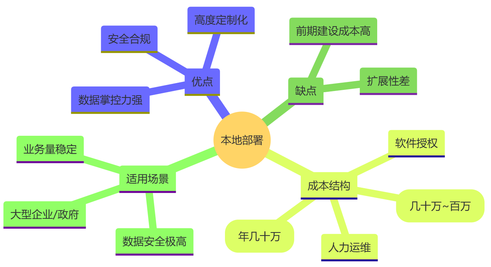
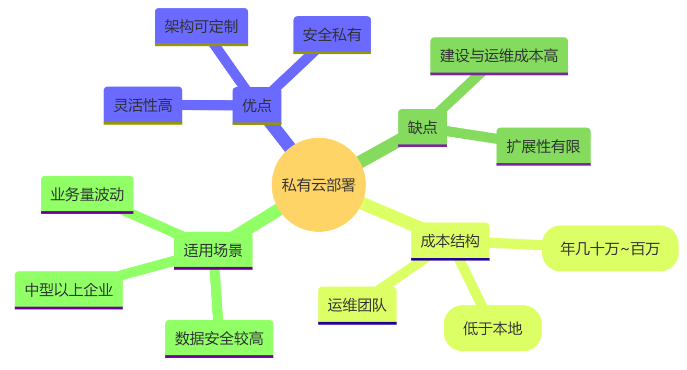
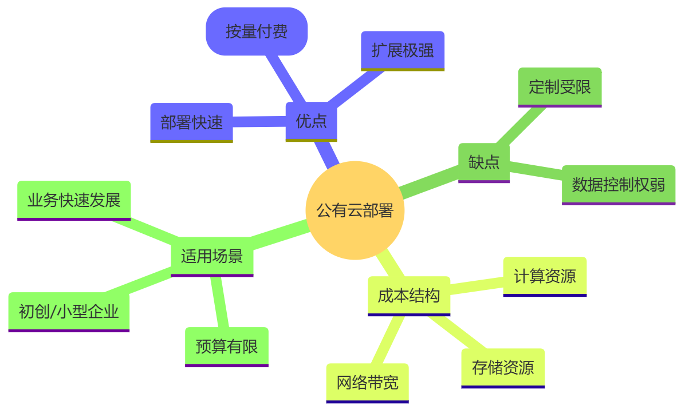
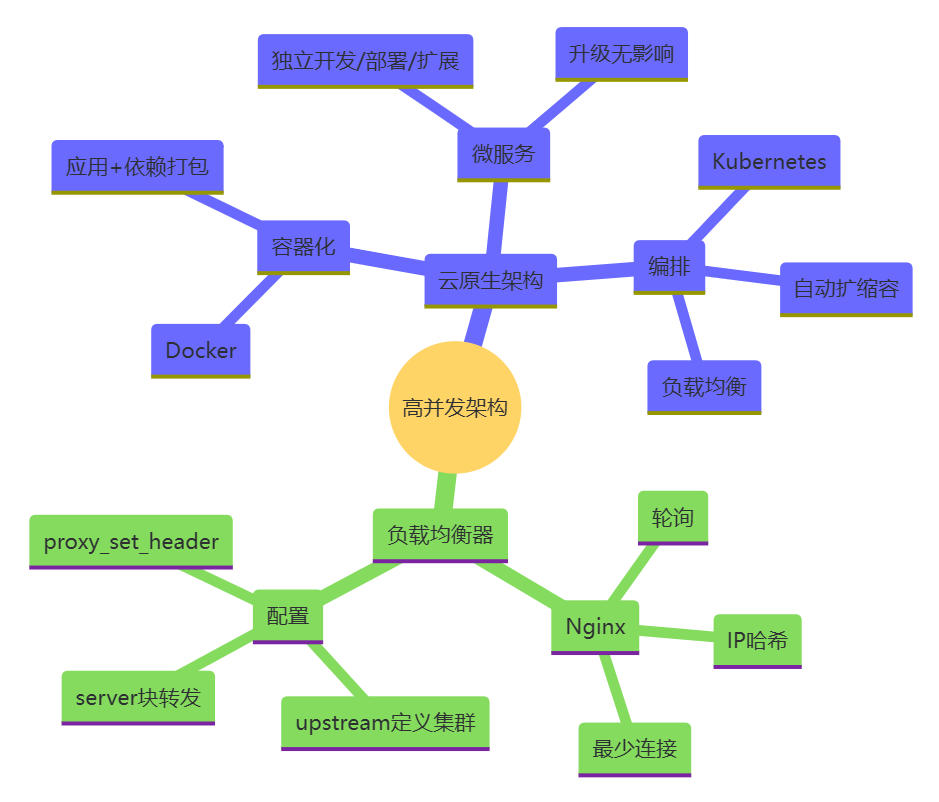
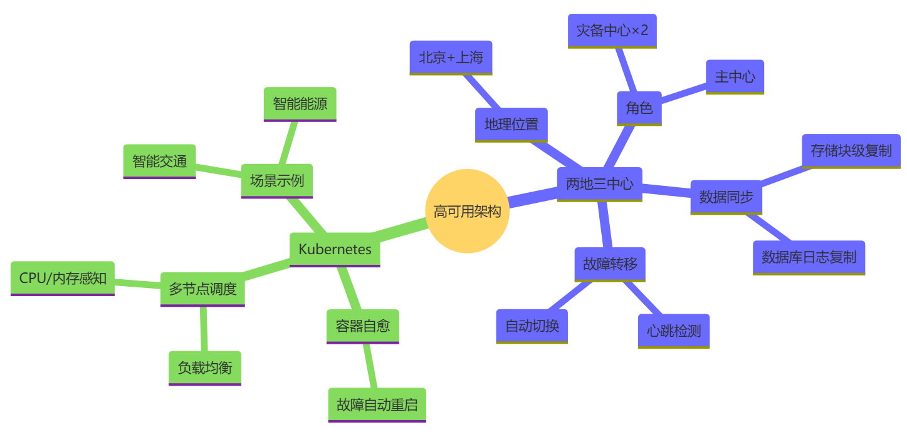
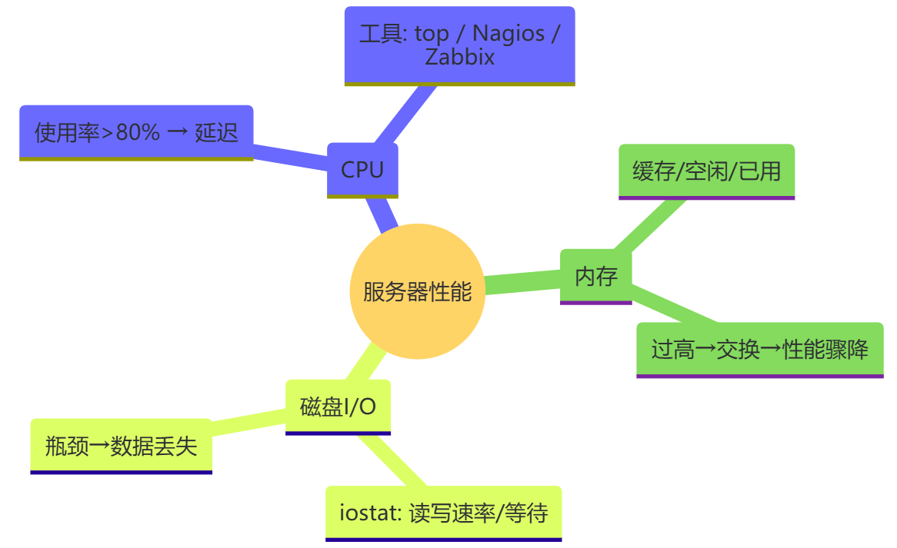
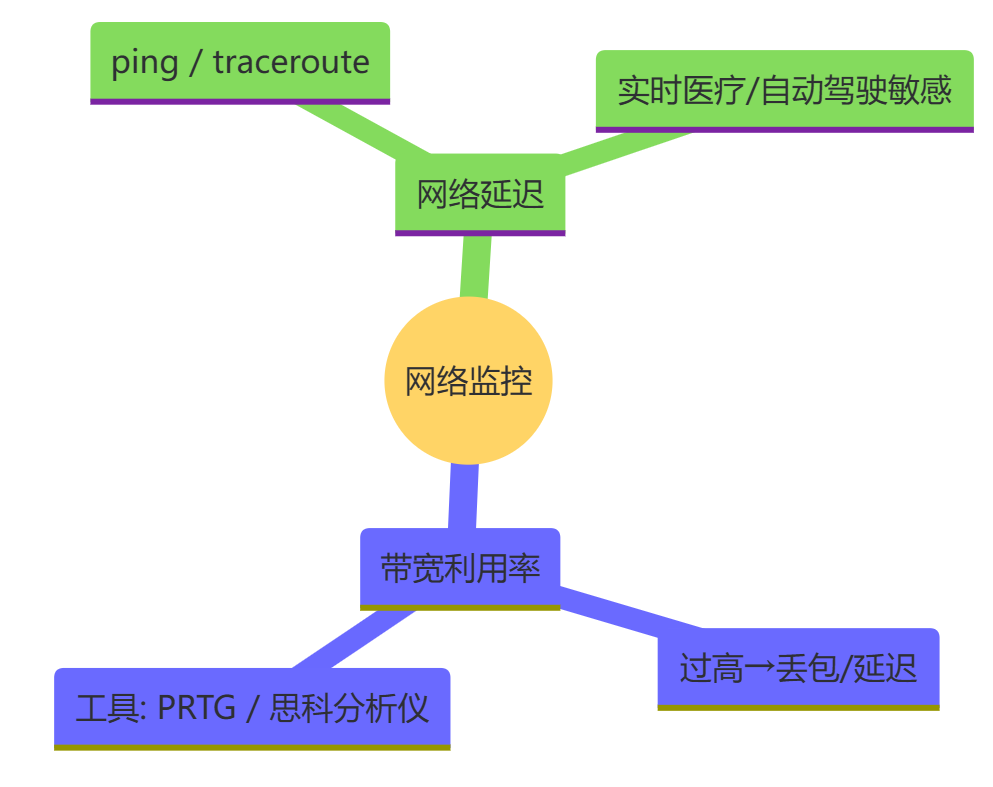
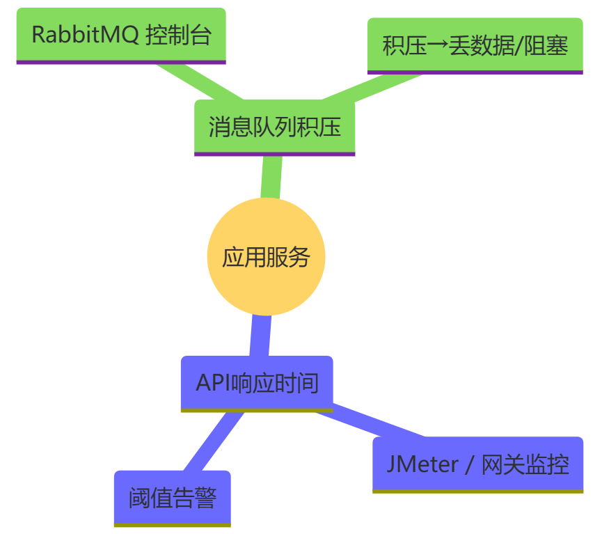
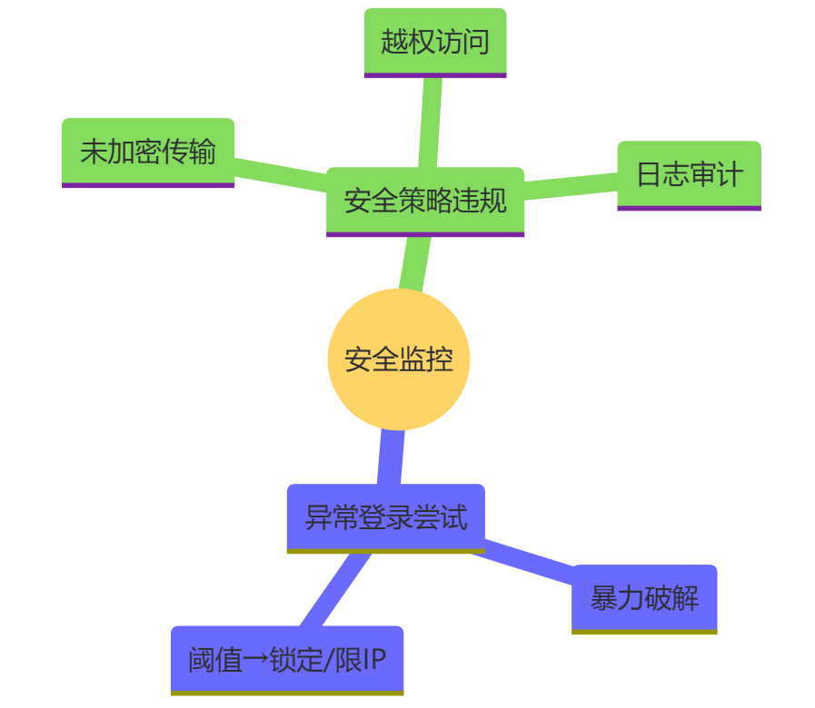

# 第八章：AI赋能的部署与运维

## 8\.1 系统部署架构

在物联网（IoT）后端系统的构建中，合理的部署架构是保障系统稳定运行、高效处理业务的关键。不同的部署方式适用于不同的场景，而在高并发、高可用需求下，更需精心选择和设计部署架构。

### （1）不同部署方式剖析

#### 本地部署

**优点**：对数据的掌控力强，数据存储在本地服务器，企业可完全自主管理，无需担心数据隐私泄露给第三方云服务提供商。在一些对数据安全极为敏感的行业，如国防军工、金融核心业务系统等，本地部署能满足严格的安全合规要求。同时，系统的定制化程度高，可以根据企业自身的特殊需求对硬件、软件环境进行深度定制。例如，企业可以根据自身的业务量和数据处理需求，定制服务器的硬件配置，选择最适合的操作系统和数据库管理系统版本。

**缺点**：前期建设成本高昂，需要企业自行采购服务器、网络设备，并承担机房建设等，还需配备专业的运维团队进行日常维护。而且扩展性较差，当业务量增长需要扩展服务器资源时，采购、安装和配置新设备的过程耗时较长，可能会影响业务的正常发展。例如，在电商促销活动期间，如果本地部署的IoT后端系统无法及时扩展资源，可能导致系统崩溃，影响用户购物体验。

**成本结构**：包括硬件采购成本、机房建设和维护成本、软件授权费用、人力运维成本等。硬件采购成本根据服务器的配置和数量而定，一般来说，构建一个小型的本地数据中心，硬件采购成本可能在几十万元到上百万元不等。机房建设和维护成本包括场地租赁、电力消耗、空调制冷等费用，每年可能需要几十万元。软件授权费用则根据所使用的操作系统、数据库管理系统等软件的许可证数量和类型而定。人力运维成本包括招聘和培训专业运维人员的费用，以及人员的薪资福利等。

**适用场景**：适用于对数据安全和隐私要求极高、业务量相对稳定且有足够资金和技术实力进行自主运维的大型企业或特定行业机构。例如，大型银行的核心交易系统、政府的关键数据处理部门等。



#### 私有云部署

**优点**：具备高度的灵活性和安全性，企业可以根据自身需求定制云平台的架构和功能。同时，私有云通常部署在企业内部或企业专属的数据中心，数据的安全性和隐私性得到较好保障。与本地部署相比，私有云在资源调配方面更加灵活，能够通过虚拟化技术实现资源的动态分配。例如，当企业的某个业务部门在特定时间段内业务量增加时，可以快速从私有云平台中调配更多的计算资源给该部门，提高业务处理效率。

**缺点**：建设和运维成本仍然较高，虽然相比本地部署减少了部分硬件采购的一次性投入，但需要购买专业的云平台软件和服务，并且同样需要专业的运维团队。此外，私有云的扩展性虽然优于本地部署，但在应对突发的大规模业务增长时，可能仍不及公有云灵活。例如，在突发的全球性公共事件导致企业业务量呈爆发式增长时，私有云可能无法像公有云那样迅速扩展资源。

**成本结构**：主要包括云平台软件采购和授权费用、服务器及网络设备采购费用（相对本地部署可能减少）、运维团队成本等。云平台软件采购和授权费用根据所选择的云平台提供商和版本而定，一般每年可能需要几十万元到上百万元不等。服务器及网络设备采购费用相对本地部署会有所降低，但仍需要一定的资金投入。运维团队成本与本地部署类似，需要专业的运维人员进行日常维护和管理。

**适用场景**：适用于对数据安全有较高要求、业务量有一定波动且具备一定技术实力和资金的中型及以上企业。例如，大型制造企业的供应链管理系统、金融机构的非核心业务系统等。



#### 公有云部署

**优点**：部署速度快，企业只需根据自身需求在云服务提供商的平台上选择合适的服务套餐，即可快速搭建起IoT后端系统。扩展性极强，能够根据业务量的变化实时调整资源，在高并发场景下优势明显。例如，在电商的“双11”购物节期间，公有云可以轻松地为电商企业的IoT后端系统分配大量的计算资源，以应对海量的订单处理和设备连接请求。同时，成本相对较低，企业无需承担大量的硬件采购和运维成本，只需按照使用的资源量付费。

**缺点**：数据控制权相对较弱，企业的数据存储在云服务提供商的服务器上，存在一定的数据隐私风险。虽然大多数云服务提供商都采取了严格的安全措施来保护用户数据，但仍无法完全消除企业的担忧。此外，企业对云平台的定制化程度相对有限，可能无法满足一些特殊的业务需求。例如，某些企业可能需要特定的硬件配置或软件环境来运行其业务系统，而公有云平台可能无法提供完全匹配的解决方案。

**成本结构**：主要根据使用的资源量进行计费，包括计算资源（CPU、内存等）、存储资源、网络带宽等。企业可以根据业务的实际需求灵活调整资源使用量，从而控制成本。例如，对于一些业务量较小的初创企业，每月的公有云使用费用可能仅需几百元到数千元不等；而对于业务量较大的大型企业，在业务高峰期可能需要支付数万元甚至更高的费用。

**适用场景**：适用于业务发展迅速、对扩展性要求高、预算有限且对数据隐私风险有一定承受能力的企业，尤其是初创企业和小型企业。例如，共享经济模式下的各类物联网应用，如共享单车、共享充电宝等，这些企业需要快速部署系统并能够根据用户数量的变化灵活调整资源。



### （2）高并发场景下的部署架构选择

**云原生架构**：在高并发场景下，云原生架构展现出卓越的优势。以容器化和微服务架构为核心，容器化技术（如Docker）能够将应用及其依赖项打包成一个独立的、可移植的容器，实现快速部署和扩展。每个微服务都可以独立运行在一个或多个容器中，通过容器编排工具（如Kubernetes）进行管理。例如，在一个智能交通系统中，涉及车辆监控、路况分析、信号控制等多个微服务。当某个区域的交通流量突然增加，导致车辆监控微服务的负载升高时，Kubernetes可以根据预设的规则，自动在集群中启动更多的车辆监控微服务容器，以分担负载。同时，微服务架构使得每个服务可以独立开发、部署和扩展，提高了系统的灵活性和可维护性。例如，当需要对路况分析微服务进行升级时，可以在不影响其他微服务的情况下进行单独升级。

**负载均衡器（以Nginx为例）**：负载均衡器在高并发系统部署中起着关键作用。Nginx作为常用的负载均衡器，能够将客户端的请求均匀地分发到多个后端服务器上。在配置Nginx时，首先需要定义后端服务器集群，例如：

```nginx
upstream backend_servers {
    server server1.example.com weight=3;
    server server2.example.com;
    server server3.example.com down;
}
```

上述配置中，upstream定义了一个名为backend\_servers的后端服务器集群，其中server1\.example\.com的权重为3，表示它将比其他服务器接收更多的请求；server2\.example\.com使用默认权重1；server3\.example\.com被标记为down，表示当前该服务器不可用，Nginx将不会向其发送请求。

然后，在server块中配置Nginx如何将请求转发到后端服务器集群：

```nginx
server {
    listen 80;
    server_name example.com;
    location / {
        proxy_pass http://backend_servers;
        proxy_set_header Host $host;
        proxy_set_header X-Real-IP $remote_addr;
        proxy_set_header X-Forwarded-For $proxy_add_x_forwarded_for;
        proxy_set_header X-Forwarded-Proto $scheme;
    }
}
```

在这个配置中，listen指定了Nginx监听的端口为80，server\_name指定了域名。location / 表示以 / 为前缀的路径匹配，proxy\_pass将请求转发到名为backend\_servers的后端服务器集群。同时，通过设置一系列的proxy\_set\_header指令，将客户端的请求头信息传递给后端服务器，以便后端服务器能够正确处理请求。

通过合理配置Nginx的负载均衡策略（如轮询、IP哈希、最少连接数等），可以有效地提高系统的并发处理能力和稳定性。例如，在一个高并发的电商IoT系统中，使用Nginx的轮询策略将用户对商品详情页的请求均匀地分发到多个后端服务器上，避免单个服务器因负载过高而出现性能瓶颈。



### （3）高可用部署架构

**两地三中心架构**：在IoT后端系统中，两地三中心架构是一种常见的高可用部署方案。以一个大型智能物流企业为例，该企业在两个不同的地理位置（如北京和上海）建立了三个数据中心，其中一个为主数据中心，另外两个为灾备数据中心。数据中心之间通过高速网络连接，采用数据同步技术确保数据的一致性。常用的数据同步方式包括基于数据库的日志复制、存储层面的块级复制等。例如，通过数据库的日志复制技术，主数据中心的数据库在执行数据更新操作时，会将更新日志同步至灾备数据中心的数据库，后者根据日志完成对应的数据更新，以此保证数据一致性。

当主数据中心出现故障时，系统能够自动切换到灾备数据中心。切换机制通常基于心跳检测和故障转移技术。例如，灾备数据中心会定期向主数据中心发送心跳检测信号，如果在一定时间内没有收到主数据中心的响应，灾备数据中心将启动故障转移流程，自动接管主数据中心的业务。在切换过程中，需要确保业务的连续性，尽量减少对用户的影响。例如，在智能物流系统中，当主数据中心出现故障时，灾备数据中心能够迅速接管订单处理、库存管理等业务，确保物流运输的正常进行。

**容器编排工具（以Kubernetes为例）**：Kubernetes在高可用部署中发挥着重要作用。它可以自动监测容器的运行状态，当某个容器出现故障时，Kubernetes会自动重启该容器，确保服务的连续性。例如，在一个智能能源管理系统中，负责能源数据采集和分析的容器如果因为内存泄漏等原因出现故障，Kubernetes会在短时间内自动重启该容器，保证能源数据的实时采集和分析不受影响。

同时，Kubernetes能够在不同的节点间调度容器，实现资源的合理分配和负载均衡。例如，当某个节点的负载过高时，Kubernetes会将部分容器迁移到其他负载较低的节点上，以保证整个集群的性能稳定。在一个高并发的智能城市交通管理系统中，Kubernetes可以根据各个节点的CPU、内存等资源使用情况，动态地将交通流量监测、交通信号控制等微服务容器调度到最合适的节点上，确保系统在高并发场景下的高效运行。



### （4）AI 驱动的智能调度

**预测性资源扩容**：AI 大模型可对业务负载进行预测。基于历史数据训练的大模型能提前 24 小时预测电商促销期间的设备连接峰值，自动触发 Kubernetes 的扩容策略，避免传统 “被动扩容” 的滞后性。例如，某共享单车平台通过AI预测早晚高峰用车需求，提前 30 分钟调度边缘节点资源，使系统响应速度提升 40%。

**混合云智能决策**：AI 可对部署方式进行动态选择。大模型能够根据实时数据敏感性（如医疗设备数据需本地处理）、业务负载（突发流量切换至公有云）、成本波动（云厂商折扣时段自动迁移资源），自动调整各业务资源占用以及本地 / 私有云 / 公有云的资源配比。

综上所述，在物联网后端系统的部署中，需要根据企业的实际需求、业务特点和预算等因素，综合考虑选择合适的部署方式和架构，以满足系统在高并发、高可用等方面的要求。

## 8\.2 监控与告警系统

在物联网（IoT）后端系统的复杂生态中，构建一个全方位、多层次的监控与告警系统，犹如为系统配备了敏锐的感知神经与及时的警报器，对于保障系统的稳定运行、提升性能以及确保安全至关重要。

### （1）全方位监控指标体系

#### 服务器性能指标

**CPU 使用率**：CPU 作为服务器的运算核心，其使用率直接反映了系统的计算负载。在 IoT 后端系统中，大量的设备数据处理、业务逻辑计算都依赖 CPU 资源。例如，在智能电网的数据分析模块，实时处理海量的电力消耗数据，若 CPU 使用率长时间超过 80%，可能导致数据处理延迟，影响电力调度决策的及时性。通过操作系统自带的工具（如 Linux 系统的 top 命令或 Windows 系统的任务管理器），以及专业的监控软件（如 Nagios、Zabbix），可以实时获取 CPU 使用率数据，并进行持续监测。

**内存使用率**：内存用于存储正在运行的程序和数据，合理的内存使用对于系统性能至关重要。在 IoT 应用中，如在智能安防系统中，大量视频流数据需在内存中缓存和处理。若内存使用率过高（接近或达到100%），系统可能频繁进行磁盘交换，导致整体性能急剧下降。通过监控工具可以精确监测内存的使用情况，包括已使用内存、空闲内存以及缓存内存等，以便及时发现内存资源紧张的问题。

**磁盘 I/O**：磁盘 I/O 性能影响着数据的读写速度。在 IoT 后端系统存储大量设备日志、历史数据时，频繁的磁盘读写操作较为常见。例如，在智能交通系统中，车辆行驶轨迹数据、违章记录等都需要频繁写入磁盘。若磁盘 I/O 出现瓶颈，如读写速度过慢，可能导致数据存储延迟，甚至导致数据丢失。使用 iostat 等工具可以监控磁盘的读写速率、I/O 等待时间等关键指标，帮助运维人员及时发现磁盘 I/O 性能问题。



#### 网络指标

**带宽利用率**：在 IoT 系统中，大量设备与后端服务器之间的数据传输需要消耗网络带宽。例如，在智能工厂中，生产设备实时上传生产数据，同时接收控制指令，若网络带宽利用率长期过高，接近带宽上限，可能导致数据传输延迟、丢包等问题，影响生产的正常进行。通过网络监控设备（如思科的网络分析仪）或软件（如 PRTG Network Monitor），可以实时监测网络带宽的使用情况，确保带宽资源的合理分配。

**网络延迟**：网络延迟是指数据从发送端到接收端所需要的时间。在 IoT 应用中，尤其是对实时性要求较高的场景，如远程医疗监控、智能自动驾驶等，网络延迟的大小直接影响系统的可靠性和用户体验。例如，在远程医疗中，医生通过 IoT 设备实时查看患者的生命体征数据，若网络延迟过高，可能导致医生获取的数据不及时，影响诊断和治疗决策。通过 ping 命令、traceroute 工具以及专业的网络性能监测软件，可以测量网络延迟，并对网络路径进行追踪，以便定位延迟产生的原因。



#### 应用服务指标

**API 响应时间**：IoT 后端系统通常通过 API 与前端设备、其他应用系统进行交互。API 响应时间的长短直接影响整个系统的交互效率。例如，在智能家居系统中，用户通过手机 APP 控制家中设备，APP 向 IoT 后端系统发送 API 请求，若 API 响应时间过长，用户可能需要等待数秒甚至更长时间才能看到设备状态的变化，这将极大地降低用户体验。使用性能测试工具（如 JMeter）和 API 网关自带的监控功能，可以实时监测 API 的响应时间，并设置合理的阈值，当响应时间超过阈值时及时发出警报。

**消息队列积压情况**：在 IoT 系统中，消息队列常用于异步处理大量的设备数据和业务消息。例如，在智能物流系统中，订单创建、货物运输状态更新等消息都通过消息队列进行传递和处理。若消息队列出现积压，意味着消息处理速度跟不上消息产生的速度，可能导致数据丢失或业务流程受阻。通过消息队列管理工具（如 RabbitMQ 的管理控制台），可以实时查看消息队列的堆积数量、消息处理速度等指标，及时发现并解决消息队列积压问题。



#### 业务数据指标

**设备在线数**：设备在线数直观反映了当前与后端系统保持连接的 IoT 设备数量。这一指标对于评估系统的覆盖范围和设备运行状况至关重要。例如在共享单车项目中，实时掌握设备在线数，运营团队能及时知晓有多少车辆处于可租用状态，若设备在线数在短时间内大幅下降，可能预示着网络故障、大面积设备损坏或遭到恶意破坏。设备接入时完成注册，结合心跳检测机制实时更新状态，后端系统可轻松统计设备在线数。监控工具可定期抓取这一数据，绘制趋势图，以便运维人员能清晰观察设备在线数的动态变化。

**每秒消息数**：每秒消息数体现了系统的数据处理流量。在诸如智能城市的环境监测系统中，大量传感器每秒都会产生海量的环境数据消息，如空气质量、噪音水平等。若每秒消息数突然大幅波动，过高可能导致系统处理能力饱和，而过低则可能意味着部分传感器出现故障。通过在消息收发关键节点添加计数器，记录单位时间内的消息数量，即可获取每秒消息数。该数据需实时反馈至监控平台，一旦超出正常波动范围，立即触发告警。

**设备状态变化频率**：设备状态变化频率反映了设备状态更新的活跃度。在智能工业设备管理场景中，设备的运行、暂停、故障等状态频繁变化。如果某类设备的状态变化频率突然大幅增加，可能暗示设备出现异常或生产流程出现问题。通过在设备状态变更的逻辑中增加计数统计，按一定时间周期（如每分钟、每小时）计算状态变化次数，将其纳入监控范畴。当该频率超出正常业务场景下的波动范围时，及时告警，以便运维人员排查设备及业务流程的潜在问题。

**设备故障数**：设备故障数直接反映了系统中出现故障的设备数量。在智能农业灌溉系统中，多个灌溉设备协同工作，若设备故障数突然增多，可能导致部分农田无法得到及时灌溉，影响农作物生长。通过设备自带的故障检测模块与后端系统的故障上报机制，实时统计设备故障数。设置不同层级的告警阈值，当故障数达到一定程度，如比正常运行时的平均故障数增加50%，发出相应级别的告警，引导运维人员迅速定位故障设备，进行维修或更换。

**特定业务事件触发频率**：特定业务事件触发频率依据不同的 IoT 业务场景而定。例如在智能零售系统中，促销活动期间“商品抢购成功”事件的触发频率是关键指标。若该频率远超预期，可能是促销活动过于火爆，系统面临高并发压力；若频率过低，则可能表明促销活动效果不佳或系统存在故障。通过在业务逻辑中埋点，统计特定业务事件在单位时间内的触发次数。根据活动策划与系统承载能力，设定合理的频率阈值，一旦触发频率偏离阈值范围，立即告警，方便运营与技术团队及时调整策略或排查系统故障。

**设备版本监控**：不同的设备版本可能存在功能差异、安全漏洞或者性能表现不同。在智能制造业中，设备的控制系统版本更新可能带来新的生产工艺支持，但如果部分设备未及时更新，可能导致生产的产品质量参差不齐。通过设备主动上报或者后端定期查询的方式获取设备版本信息，并与最新的稳定版本进行比对。对于存在版本差异的设备，记录差异情况，当未及时更新的设备数量达到一定比例，如超过10%，发出告警提醒运维人员及时安排设备升级，以保障系统整体的一致性和稳定性。

**设备参数监控**：设备参数决定了设备的运行状态和性能。以智能空调为例，温度设定值、风速、制冷制热模式等参数直接影响其对环境的调节效果。后端系统需要实时获取这些参数，若发现某个区域内多台智能空调的温度设定值与预设的节能模式参数偏差过大，可能是用户误操作，也可能是系统出现故障。通过设置合理的参数阈值范围，比如温度设定值在24 \- 26摄氏度为节能区间，当大量设备参数超出此范围时，触发告警，以便运维人员进一步核实情况，确保设备按照预期的模式运行，提高能源利用效率和用户舒适度。

#### 安全监控指标

**异常登录尝试次数**：在 IoT 后端系统中，用户和设备的登录操作频繁。若短时间内出现大量异常的登录尝试，可能是遭受了暴力破解攻击。例如，黑客通过自动化工具不断尝试不同的用户名和密码组合，试图登录系统获取敏感信息。通过监控系统记录每个用户和设备的登录行为，统计异常登录尝试次数，当超过一定阈值时，立即触发警报，同时采取临时锁定账号、限制登录IP等措施，保障系统安全。

**安全策略违规行为**：IoT 系统通常制定了一系列安全策略，如数据访问权限控制、加密传输要求等。监控系统需要实时监测是否存在违反安全策略的行为。例如，某个用户试图访问其无权查看的敏感数据，或者设备在传输数据时未使用加密协议。通过对系统操作日志和网络流量的分析，及时发现安全策略违规行为，并进行告警和记录，以便后续进行安全审计和处理。



### （2）AI 增强的异常检测

#### 非结构化数据监控

通过大模型解析设备运行日志中的自然语言描述（如 “传感器温度骤升”），结合时序数据识别潜在故障，补充传统依赖结构化指标的监控模式。例如，采用开源模型\+微调处理工业设备的运维日志，故障识别准确率远超传统规则引擎。

#### 动态阈值的 AI 优化

机器学习的自适应能力可进一步强化动态阈值的调节。基于强化学习的大模型能根据设备老化曲线（如智能电表的精度衰减）动态调整 “设备故障数” 阈值，避免对老旧设备的误告警。

#### 根因分析自动化

告警机制中可运用大模型的关联分析能力。当同时收到 “网络延迟升高”“API 响应超时”“设备离线数激增” 时，AI 可将 “边缘节点交换机故障” 列为候选原因，结合网络拓扑与设备状态等信息进一步验证后，再给出处置建议（如切换备用交换机）。

### （3）告警机制与阈值设置

#### 告警机制

**实时通知**：当监控指标达到预设的告警阈值时，告警系统应能够立即向相关人员发送通知。常见的通知方式包括电子邮件、短信、即时通讯工具（如钉钉、微信工作群）等。例如，当服务器的 CPU 使用率超过 90%时，系统自动向运维团队的负责人发送短信通知，同时在钉钉工作群中推送告警消息，确保运维人员能够第一时间得知系统异常情况。

**多级告警**：为了区分不同严重程度的告警信息，可以设置多级告警机制。例如，将告警分为紧急、重要、一般三个级别。紧急告警用于表示可能导致系统瘫痪或严重数据丢失的问题，如服务器硬件故障、数据库崩溃等；重要告警用于提示可能影响系统性能或业务正常运行的问题，如 CPU 使用率过高、网络带宽不足等；一般告警则用于告知一些潜在的问题，如磁盘空间接近满额、部分设备连接异常等。不同级别的告警采用不同的通知方式和处理优先级，确保运维人员能够快速响应和处理最紧急的问题。

**告警关联与聚合**：在复杂的 IoT 系统中，一个故障可能引发多个相关指标的异常。例如，网络设备故障可能导致网络延迟增加、带宽利用率下降，同时相关的应用服务 API 响应时间也会变长。告警系统应具备关联和聚合告警信息的能力，将相关的告警信息进行整合，避免运维人员收到大量重复、分散的告警通知，从而能够更清晰地了解故障的全貌和影响范围。

#### 阈值设置

**基于历史数据和业务需求**：合理的告警阈值设置需要参考系统的历史数据和业务需求。通过对服务器性能、网络流量、应用服务等指标的历史数据进行分析，了解系统在正常运行状态下的指标波动范围。例如，根据过去一个月的服务器 CPU 使用率数据，发现其在正常业务负载下的平均值为 40%，峰值为 60%，那么可以将 CPU 使用率的告警阈值设置为 80%。同时，结合业务需求，对于一些对实时性要求极高的业务场景，如智能金融交易系统，可能需要将 API 响应时间的告警阈值设置得更为严格，以确保交易的快速处理。对于设备在线率，若历史数据显示正常运营时段设备在线率稳定在 90% \- 95%区间，可将低于 80%设为告警阈值；每秒消息数则依据系统处理能力与历史流量数据，比如系统正常每秒可稳定处理1000 \- 1200条消息，可将高于1500条或低于800条设为告警阈值。对于设备状态变化频率，通过分析历史数据，了解正常业务流程下设备状态变更的平均频率，如某种工业设备正常每小时状态变化在10 \- 20次，可将高于30次或低于5次设为告警阈值；设备故障数则根据设备的可靠性数据与历史故障情况，如智能农业灌溉系统中正常每天设备故障数不超过5台，将超过10台设为告警阈值；特定业务事件触发频率依据活动策划与系统性能评估设定，如智能零售系统促销活动预期“商品抢购成功”事件每分钟触发50 \- 80次，将超出这个范围设为告警阈值。对于设备版本，若新发布的关键版本更新后，在一定时间周期（如一周）内，未升级设备比例超过10%设为告警阈值；设备参数方面，根据设备类型和业务场景，如智能空调温度设定值超出节能区间上下限10%设为告警阈值。

**动态调整**：随着 IoT 系统的业务发展和运行环境的变化，告警阈值也需要进行动态调整。例如，在电商促销活动期间，IoT 后端系统的业务量会大幅增加，此时服务器的 CPU 使用率、网络带宽利用率等指标的正常范围也会相应变化。因此，需要根据业务量的预测和实时监测数据，动态调整告警阈值，避免出现误告警或漏告警的情况。可以通过机器学习算法对历史数据和实时数据进行分析，自动调整告警阈值，以适应系统的动态变化。比如在某特定时间段内，设备在线数因业务拓展新区域而有明显上升趋势，通过机器学习模型分析，可相应提高设备在线数的告警阈值下限，确保告警的准确性。如果智能零售系统在某次促销活动中，因营销策略调整使得“商品抢购成功”事件触发频率整体提升，通过机器学习算法对实时数据的学习，可动态调高该事件触发频率的告警阈值上限，避免因正常业务增长导致的误告警。同样，若某类设备在一段时间内频繁更新版本，可根据更新节奏和设备升级成功率动态调整设备版本未升级比例的告警阈值；若某区域因季节变化等因素，设备参数的正常范围发生改变，机器学习算法可根据实时数据自动调整设备参数告警阈值。

### （4）AI 驱动的威胁识别

大模型不仅统计登录次数，还能分析登录行为的语义特征（如同一IP在不同设备上使用相似密码、操作路径与正常用户存在偏差），从而识别新型社工攻击。技术上可采用联邦学习训练跨企业的登录行为模型，在保护数据隐私的同时，提升未知威胁的识别率。

构建一个完善的 IoT 后端系统监控与告警系统，能够帮助运维团队及时发现系统中的潜在问题，快速响应和解决故障，确保系统的高可用性、高性能和安全性，为 IoT 业务的稳定发展提供坚实保障，借助 AI 和大模型的能力，可以让运维监控系统更加智能、效果更好。
