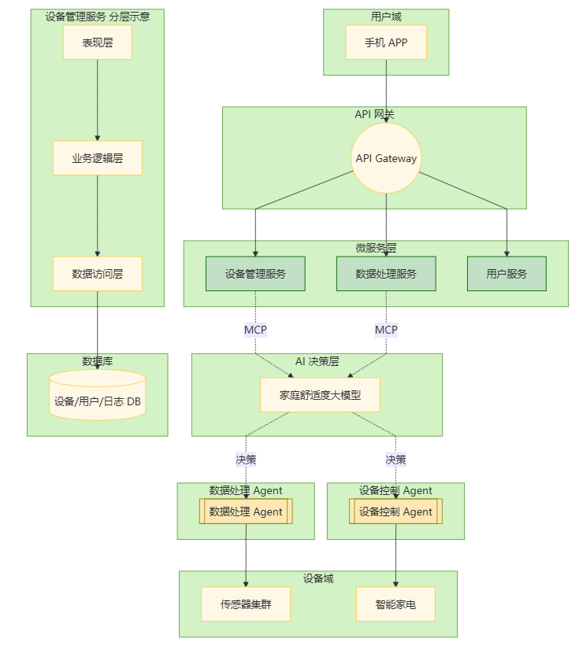
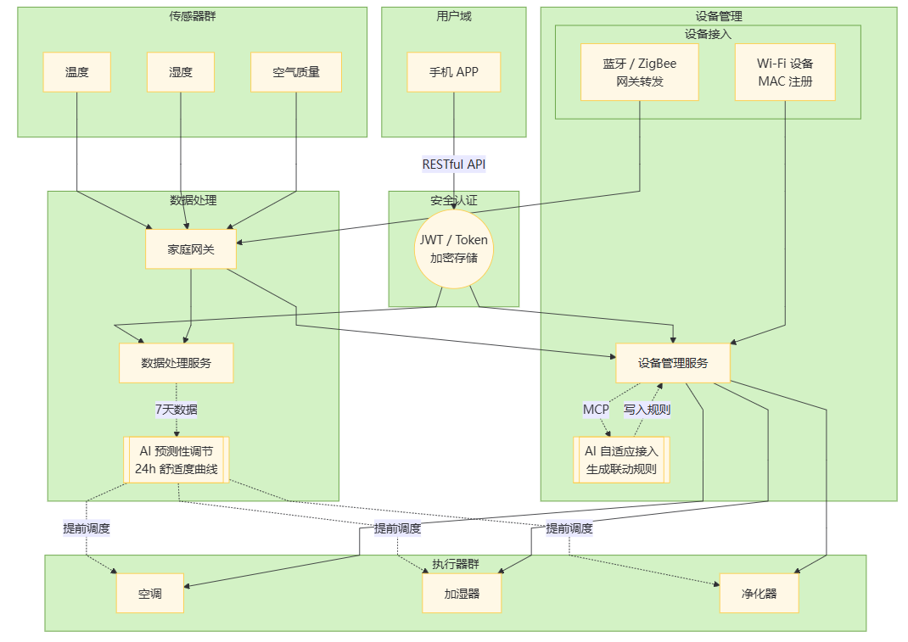
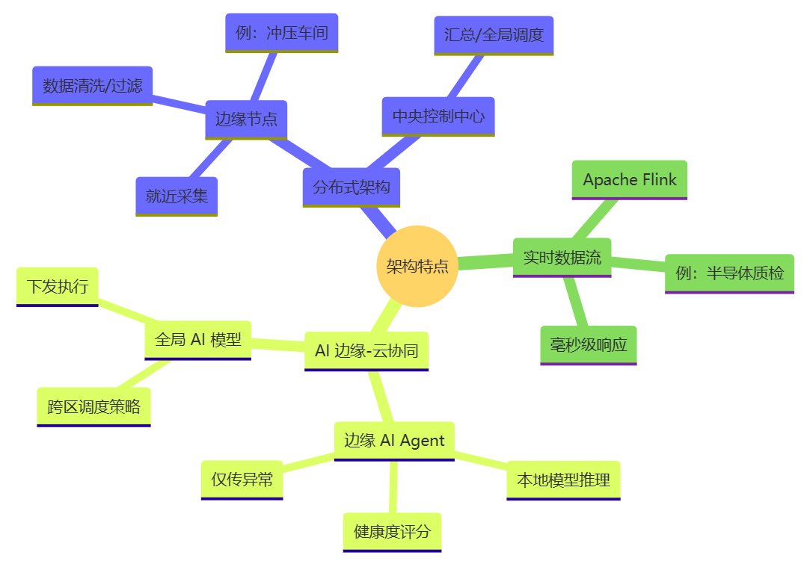
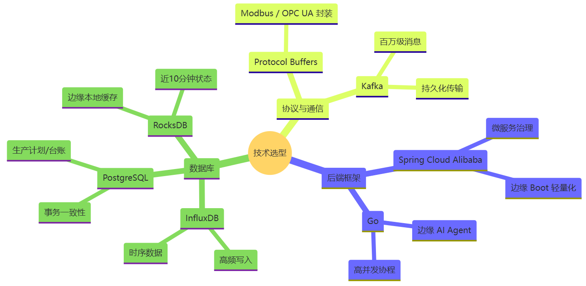
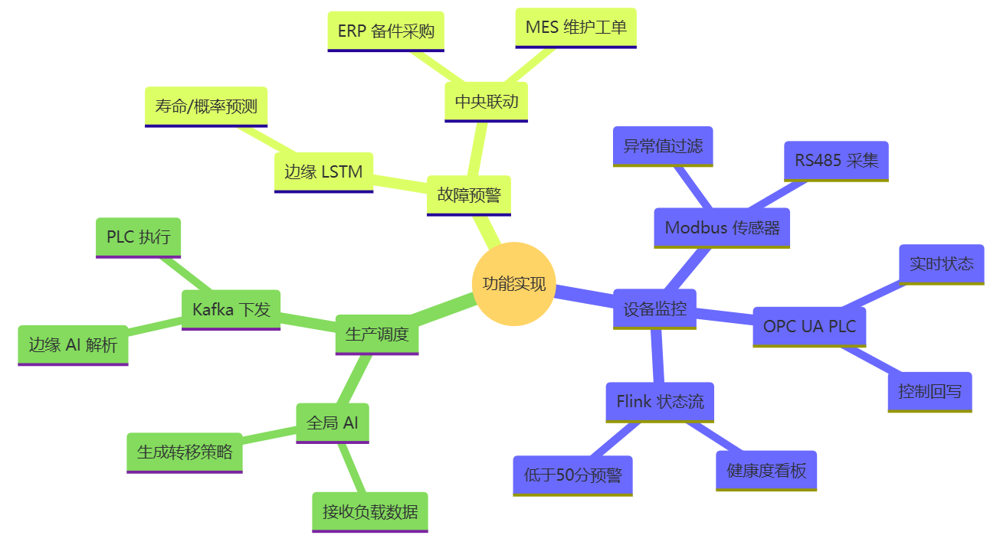

# 第九章：实际案例分析

## 9\.1 智能家居后端系统案例

在智能家居领域，构建一个高效、稳定且功能强大的后端系统是实现智能化家居体验的核心。以下以一个实际的智能家居项目为例，详细阐述其后端系统的各个关键方面。

### （1）架构设计

**\- 整体架构**：该智能家居后端系统采用了微服务架构，将系统拆分为多个独立的服务，每个服务专注于特定的功能模块，通过轻量级通信协议进行交互。这种架构设计使得系统具有高度的灵活性、可扩展性和维护性。例如，设备管理服务负责处理所有智能家电设备的接入、注册、状态管理等操作；数据处理服务专注于对家庭环境数据的采集、存储和分析；用户服务则管理用户信息、认证授权以及与用户手机 APP 的交互。通过将系统功能模块化，当需要对某个功能进行升级或扩展时，可以独立对相应的微服务进行操作，而不会影响到整个系统的其他部分。

**\- 分层架构**：在每个微服务内部，采用了分层架构模式。以设备管理服务为例，分为表现层、业务逻辑层和数据访问层。表现层负责与其他微服务或前端 APP 进行通信，接收和处理请求；业务逻辑层包含了设备管理的核心业务逻辑，如设备的添加、删除、控制指令的生成等；数据访问层则负责与数据库进行交互，存储和获取设备相关信息。这种分层架构使得代码结构清晰，各层之间职责明确，便于开发和维护。

**\- AI应用**

AI决策层部署家庭场景理解大模型（如基于用户行为、环境数据训练的舒适度模型），负责生成设备控制策略（如空调温度调节、加湿器启停时机）。

Agent 执行层包含多个专项 Agent：

设备控制 Agent：部署于设备管理服务中，通过 MCP 与 AI 决策层同步上下文（如当前环境温湿度、用户历史设置偏好），将模型生成的控制策略转化为具体设备指令（如 “空调设为 26℃”），并实时反馈设备执行结果。

数据处理 Agent：在传感器数据采集后，通过 MCP 向 AI 模型传递预处理数据（如清洗后的温湿度时序数据 \+ 异常值标签），接收模型输出的分析结论（如 “未来 1 小时湿度将低于 40%”），再触发加湿器联动指令。

### （2）技术选型

**后端语言与框架**：选择 Python 的 Django 框架作为后端开发语言和框架。Django 具有强大的内置功能，如内置的数据库管理、用户认证系统、表单处理等，能够大大提高开发效率。同时，Python 丰富的第三方库生态系统，为实现各种功能提供了便利。例如，使用 Django REST framework 来构建 RESTful API，方便前端 APP 与后端系统进行数据交互；利用 Django Channels 实现 WebSocket 通信，以支持实时的设备状态更新和控制指令传输。

**数据库**：选用 MySQL 作为关系型数据库，用于存储用户信息、设备配置信息、设备状态历史记录等结构化数据。MySQL 具有成熟稳定、性能可靠、易于管理等优点。对于一些需要快速读写的场景，如设备实时状态数据，引入 Redis 作为缓存数据库。Redis 的高性能读写能力和丰富的数据结构，能够有效提升系统的响应速度。例如，将设备的最新状态数据存储在 Redis 中，当前端 APP 请求设备状态时，可以直接从 Redis 中获取，减少对 MySQL 的查询压力。

**消息队列**：采用 RabbitMQ 作为消息队列系统。在智能家居系统中，存在大量的异步任务，如设备状态更新通知、数据处理任务等。RabbitMQ 能够可靠地处理这些异步消息，确保消息的有序传递和不丢失。例如，当设备状态发生变化时，设备管理服务将状态更新消息发送到 RabbitMQ 队列，数据处理服务从队列中获取消息并进行相应的处理，同时用户服务也可以从队列中获取消息，向用户手机 APP 推送设备状态变化通知。设备控制 Agent 将 AI 模型生成的策略指令放入RabbitMQ队列，同时监听队列反馈的设备执行状态，通过 MCP 向模型回传 “指令执行效果”（如 “空调调节后室温下降 2℃”），用于模型动态优化。

### （3）功能实现

**\- 设备管理**：

**设备接入**：支持多种智能家电设备的接入，包括 Wi\-Fi 设备、蓝牙设备和 ZigBee 设备。对于 Wi\-Fi 设备，在设备上配置家庭网络信息后，设备启动时会自动连接家庭网络，并向后端系统发送注册请求。后端系统通过设备唯一标识符（如 MAC 地址）完成设备注册，并分配设备ID。对于蓝牙设备和 ZigBee 设备，通过在家庭网关中集成相应的蓝牙和 ZigBee 模块，实现设备与网关的连接，网关再将设备信息转发给后端系统进行注册。

**设备控制**：用户可以通过手机 APP 对智能家电设备进行远程控制。后端系统接收来自 APP 的控制指令，经过设备管理服务的业务逻辑处理后，将指令发送到相应的设备。例如，当用户在 APP 上点击 “打开空调” 按钮时，APP 向后端系统发送控制指令，后端系统通过设备管理服务找到对应的空调设备，并将打开空调的指令发送到空调设备所在的网络，实现远程控制。

**AI 自适应接入功能**：例如设备注册时，设备管理 Agent 通过 MCP 向 AI 模型传递设备属性（如 “空调 \- 制冷功率 1\.5 匹”“加湿器 \- 最大湿度 80%”），模型结合家庭户型、用户习惯生成设备联动规则（如 “卧室空调与客厅温湿度传感器联动”），由 Agent 写入设备配置表。

**\- 数据处理**：

**数据采集**：通过各类传感器采集家庭环境数据，如温度传感器、湿度传感器、空气质量传感器等。传感器将采集到的数据通过网关发送到后端系统的数据处理服务。数据处理服务对数据进行初步的清洗和验证，去除无效数据和异常数据。例如，当温度传感器采集到的数据超出合理范围时，数据处理服务将该数据标记为异常数据，并进行进一步的分析和处理。

**数据分析**：对采集到的家庭环境数据进行深度分析，为用户提供智能化的服务。例如，通过对一段时间内的温度、湿度数据进行分析，根据用户的习惯和环境舒适度模型，自动调整空调和加湿器的运行模式，以提供更加舒适的居住环境。同时，对空气质量数据进行分析，当空气质量较差时，自动启动空气净化器。

**AI 预测性调节**：数据处理 Agent 持续通过 MCP 向模型输入 7 天内的温湿度、用户活动时段数据，模型输出未来 24 小时的舒适度预测曲线，Agent 据此提前调度设备（如 “用户睡前 1 小时自动将卧室温度调至 26℃”），并通过 MCP 同步调节效果至模型，迭代优化预测精度。

**\- 应用服务接口**：

**APP 交互**：开发了功能丰富的手机 APP，用户可以通过 APP 实现设备的添加、控制、状态查看等功能。APP 与后端系统通过 RESTful API 进行通信。在 APP 端，采用简洁直观的用户界面设计，方便用户操作。例如，用户在 APP 上可以看到家庭中所有智能家电设备的列表，点击设备图标即可查看设备的详细状态信息，并进行相应的控制操作。

**安全认证**：为确保用户数据的安全，在 APP 与后端系统的交互过程中，采用了严格的安全认证机制。用户在注册登录时，后端系统通过密码加密存储、验证码验证等方式保障用户账号的安全。在每次 APP 与后端系统的通信中，都通过令牌（Token）验证用户身份，防止非法访问。例如，用户登录成功后，后端系统生成一个 Token 并返回给 APP，APP 在后续的请求中携带该 Token，后端系统通过验证 Token 的有效性来确认用户身份。

通过以上架构设计、技术选型和功能实现，该智能家居后端系统实现了高效的设备管理、精准的数据处理以及便捷的用户交互，为用户打造了一个智能化、舒适化的家居环境。在实际应用中，该系统表现出了良好的稳定性和扩展性，能够满足不同家庭的智能家居需求。同时，随着智能家居技术的不断发展，该系统也具备进一步升级和优化的潜力，以适应不断变化的市场需求和用户期望。

## 9\.2 工业物联网后端系统案例

在工业领域，工业物联网（IIoT）正深刻变革着传统生产模式。以工厂自动化生产线监控系统为例，其后端系统的构建面临诸多独特挑战，需结合前沿技术以满足严苛的工业场景需求。

### （1）架构特点

**\- 分布式架构**：鉴于工厂内设备分布广泛且数量众多，采用分布式架构成为必然。系统由多个分布在不同区域的边缘计算节点和一个中央控制中心组成。边缘计算节点负责就近采集工业传感器和控制器的数据，并进行初步处理，如数据清洗、过滤与简单分析。例如，在汽车制造工厂的冲压车间，边缘计算节点部署在冲压设备附近，实时采集压力、温度、位移等传感器数据，滤除噪声干扰后，将关键数据发送至中央控制中心。这种架构有效减少了数据传输量，降低网络延迟，提高系统响应速度。

**\- 实时数据处理架构**：为满足生产数据实时处理需求，引入流处理框架。如使用 Apache Flink 构建实时数据处理管道，能对源源不断的生产数据进行毫秒级响应处理。在半导体制造工厂，生产线上的质量检测传感器每秒产生大量检测数据，Flink可实时分析这些数据；一旦发现产品质量异常，立即触发警报并通知相关人员采取措施，确保产品质量达标。

**\- AI 驱动的边缘\-云端协同**

分布式架构中，边缘计算节点新增 “边缘 AI Agent”：负责本地实时数据处理（如冲压设备的压力、温度数据），通过轻量化 MCP 协议与边缘侧部署的小型 AI 模型（如故障预测模型）交互，模型输出 “设备健康度评分”“潜在故障概率” 等上下文，Agent 据此决定是否将数据上传至中央控制中心（仅上传异常或高价值数据，减少带宽占用）。

中央控制中心部署 “全局优化 AI 模型”：通过 MCP 接收各边缘 Agent 上传的聚合数据（如各车间设备健康度汇总），生成跨区域生产调度策略（如 “冲压车间设备负载过高时，调度备用车间设备”），再由中央 Agent 通过 MCP 将策略分发给对应边缘节点执行。

### （2）技术选型

**\- 后端语言与框架**

工业场景对系统稳定性、实时性要求高，因此用以下选型。

核心服务框架：采用 Java 的 Spring Cloud Alibaba，其微服务治理能力（如服务注册发现、熔断降级）适配工业环境下分布式系统的高可用需求；通过 Spring Boot 构建边缘计算节点的轻量化服务，满足边缘侧资源受限场景。

边缘节点开发：部分高实时性模块（如边缘 AI Agent 的本地数据处理）采用 Go 语言，利用其协程特性提升并发处理效率，降低边缘节点的资源占用。

**\- 数据库选型**

时序数据库：选用 InfluxDB 存储高频工业传感器数据（如冲压设备每秒产生的压力、温度时序数据），其时间戳索引和高写入性能适配工业数据 “高吞吐、高时序性” 特点。

关系型数据库：使用 PostgreSQL 存储生产计划、设备台账等结构化数据（如设备型号、维护记录），支持复杂查询和事务性操作，保障生产数据的一致性。

缓存与计算引擎：边缘节点部署 RocksDB 作为本地缓存，存储近期高频访问的设备状态数据（如近 10 分钟的设备健康度评分），减少对云端数据库的依赖。

**\- 工业协议与通信组件**

工业协议网关：集成 Protocol Buffers 封装 Modbus、OPC UA 等工业协议，实现传感器、控制器与边缘节点的通信（如通过 OPC UA 协议采集 PLC 的生产参数）。

消息队列：选用 Kafka 作为工业数据流转中枢，其高吞吐量（支持每秒百万级消息）和持久化能力适配工业场景下海量实时数据的异步传输（如各边缘节点向中央控制中心上传的聚合数据）。

### （3）功能实现

**\- 设备监控与控制**

基于 Modbus 协议的传感器接入，边缘节点通过 RS485 接口连接温度、压力传感器，解析 Modbus 报文获取原始数据（如 “压力 = 150MPa”），经边缘 AI Agent 预处理后（过滤电磁干扰导致的异常值），同步至本地故障预测模型。

边缘节点通过 OPC UA 客户端连接 PLC，实时读取生产节拍、设备运行状态（如 “运行 / 停机”），并接收中央控制中心下发的控制指令（如 “调整传送带速度至 1\.2m/s”）。

通过 Apache Flink 构建设备状态监控流，边缘 AI Agent 将预处理后的设备数据（如冲压设备的 “压力波动值 \+ 温度趋势”）输入 Flink，Flink 结合边缘侧故障预测模型的输出（如 “健康度评分 = 65 分”），实时更新设备状态看板，并在评分低于阈值（如 50 分）时触发预警。

**\- 生产调度与优化**

中央控制中心的全局优化 AI 模型通过 MCP 接收各边缘节点的聚合数据（如 “冲压车间设备负载率 = 90%”“备用车间负载率 = 30%”），生成调度策略（如 “将 20% 的冲压任务转移至备用车间”）；中央 Agent 通过 Kafka 将策略下发至对应边缘节点，边缘 AI Agent 解析后转化为 PLC 可执行的指令（如调整备用车间设备的启动时序），并通过 MCP 反馈执行结果（如 “任务转移完成，当前负载率 = 60%”）。

**\- 故障预警与维护**

边缘 AI Agent 持续采集设备振动、电流等数据，通过轻量化 MCP 协议输入边缘侧故障预测模型（基于 LSTM 训练的退化趋势模型），模型输出 “轴承剩余寿命 = 120 小时”“故障概率 = 85%”；Agent 将该结果上传至中央控制中心，中央系统联动 ERP 系统生成备件采购单（如 “提前采购轴承型号 XX”），并通过 MES 系统推送维护工单至维修团队。

### （4）技术挑战及应对方案

**\- 设备连接的稳定性**

**挑战**：工业环境复杂恶劣，电磁干扰、高温、高湿等因素易导致工业传感器和控制器连接不稳定。例如，在钢铁冶炼车间，高温和强电磁环境下，传感器与控制器之间的无线连接时常中断。

**应对**：采用多种连接方式结合，并进行冗余设计。一方面，使用有线连接作为主要方式，如工业以太网，其具备高可靠性和抗干扰能力；另一方面，配备无线连接作为备份，如采用工业级 Wi\-Fi 或 LoRa 技术。同时，在设备端和网络端设置多重校验机制，实时监测连接状态，一旦发现连接异常，立即切换至备用连接线路，确保数据传输的连续性。

**\- 数据的实时处理和分析**

**挑战**：工业生产数据具有高频率、高维度特点，如化工生产过程中，温度、压力、流量等参数需实时监测与分析，传统数据处理方式难以满足实时性要求。

**应对**：运用内存计算技术和机器学习算法。利用 Apache Spark 等内存计算框架，将数据加载至内存进行快速处理，大幅提升数据处理效率。同时，通过机器学习算法构建生产模型，对生产数据进行实时预测与分析。例如，在石油炼化过程中，使用机器学习算法根据当前的生产参数预测产品质量，提前发现潜在的生产故障，实现故障预警。当模型预测到某一生产环节可能出现故障时，系统自动发出警报，并提供相应的解决方案建议。

**\- 与企业内部其他系统的集成**

**挑战**：工厂内部通常存在多种不同类型的系统，如制造执行系统（MES）、企业资源计划系统（ERP）等，这些系统的数据格式、接口规范各不相同，集成难度大。

**应对**：采用企业服务总线（ESB）技术和数据标准化方案。ESB 作为系统间的通信桥梁，实现不同系统间的消息传递与数据交互。同时，制定统一的数据标准，对不同系统的数据进行标准化处理。例如，在电子制造企业中，通过 ESB 将自动化生产线监控系统与 MES 和 ERP 系统连接起来，当生产线上完成一批产品生产时，监控系统将生产数据通过 ESB 发送至 MES 系统进行生产进度更新，同时将物料消耗数据发送至 ERP 系统进行库存管理。通过数据标准化，确保不同系统能准确理解并处理接收到的数据。

**\- AI 增强可靠性与效率**

**设备连接稳定性**：连接诊断 AI Agent可实时监测传感器连接状态（如信号强度、数据包丢失率），通过 MCP 向故障预测模型传递连接质量数据，模型输出 “连接中断风险评分”，Agent 据此提前切换连接方式（如 “无线连接风险＞80% 时，自动切换至工业以太网”），并通过 MCP 同步切换结果至中央系统。

**实时数据处理**：在 Apache Flink 基础上集成 “AI 推理算子”，Flink 处理流数据时，调用边缘 AI 模型（通过 MCP 获取模型上下文，如历史质量检测数据分布），实时识别产品质量异常（如 “半导体晶圆划痕概率＞95%”），由 Flink 触发预警的同时，通过 Agent 将异常特征反馈至中央 AI 模型，用于更新质量检测算法。

**系统集成**：通过 MCP 标准化 AI 模型与 MES/ERP 系统的上下文交互格式（如将 “设备故障预测结果” 转化为 MES 可理解的 “生产暂停建议”），实现 AI 决策与企业业务系统的无缝衔接（如 “预测到冲压设备将故障，ERP 提前调度备用零件入库”）。

通过上述架构设计与技术方案的实施，该工厂自动化生产线监控系统实现了设备连接的稳定可靠、生产数据的实时处理与分析以及与企业内部其他系统的无缝集成，为工业生产的智能化、高效化提供了有力支持，提升了企业的生产效率、产品质量和市场竞争力。
